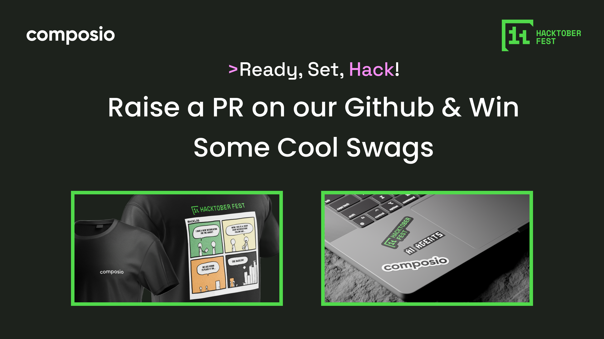

# 🎃 Composio Hacktoberfest 2024

  
  

  <strong>Contribute to Composio and earn ton of swag!</strong>

  <a href="https://docs.composio.dev/introduction/intro/quickstart">Quick Start</a> •
  <a href="https://app.composio.dev/">Dashboard</a> •
  <a href="https://dub.composio.dev/discord">Join Community</a>

  

## 🚀 About Composio

Composio is a cutting-edge toolset for AI Agents and LLMs, designed to streamline and optimize the connection and interaction between your AI Agents/LLMs and various APIs/services.

### Key Features

- 🛠 **100+ tools**: Ever-expanding tools catalog with support for custom additions
- 🔐 **Managed Auth**: Built-in auth management for less developer overhead
- 📈 **30% increase in reliability**: Simplified JSON structures, improved variable names, and enhanced error handling
- 🤖 **Powerful RPA tools**: Spin up MacOS/Ubuntu instances on-the-fly for agent control and remote code execution
- 🔒 **SOC Type 2**: 100% compliant with maximum data security
- 🏠 **Self Hosting**: One-click installation across all platforms

## 🎉 Hacktoberfest 2024 Participation

Join us in celebrating open source during Hacktoberfest 2024! Here's what you need to know:

1. **Register**: Sign up between **September 23** and **October 31** at [hacktoberfest.com](https://hacktoberfest.com/participation/)
2. **Contribute**: Make pull requests to our GitHub repos (look for the "hacktoberfest" topic)
3. **Get Recognized**: Participants with four accepted pull/merge requests between October 1 and October 31 will receive a swag pack from Hacktoberfest!

### How to Participate

1. Find issues tagged with "hacktoberfest" in the Composio GitHub repo
2. Submit your pull requests
3. Our maintainers will review and accept your contributions
4. Fill out [this Google Form](https://forms.gle/your-form-link-here) to verify your identity and contributions

For quicker assistance, join our [Discord community](https://dub.composio.dev/discord)!

## 🛠️ Resources to Kickstart Your Journey

- [Composio GitHub Repo](https://github.com/ComposioHQ/composio)
- [Composio Documentation](https://docs.composio.dev/introduction/intro/overview)
- [Composio SDK & APIs](https://docs.composio.dev/swekit-js/introduction)
- [Composio Blog](https://composio.dev/blog/)
- [Contribution Guide](https://github.com/ComposioHQ/composio/blob/master/CONTRIBUTING.md)

## 🌱 Contributing

We warmly welcome and value all kinds of contributions to Composio! Check out our [Contribution Guide](https://github.com/ComposioHQ/composio/blob/master/CONTRIBUTING.md) for more details.

A big thank you to all our ❤️ contributors for their support!

## 🔥 We're Hiring!

Join the Composio crew! We're looking for a passionate [DevRel](https://composio.notion.site/Dev-Rel-105c2287139c456a8e790e41ff13224e) to join our team.

Contact us: [tech@composio.dev](mailto:tech@composio.dev) or [abhay@composio.dev](mailto:abhay@composio.dev)

---

  Made with ❤️ by the Composio Team

