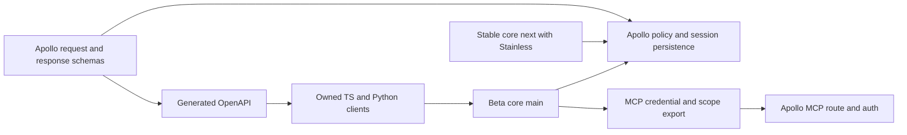
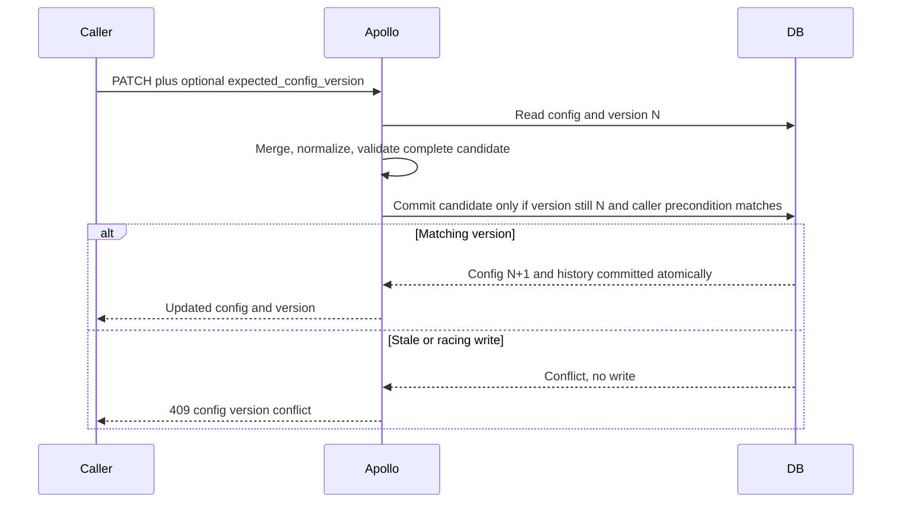
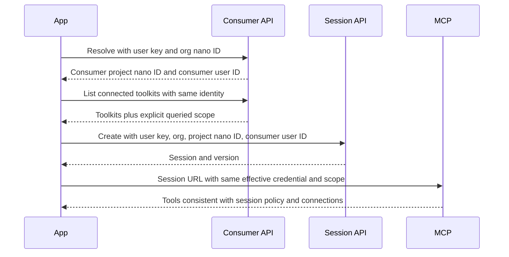

# Session configuration and authentication corrections - Plan

## Goal Capsule

**Objective:** Developers can create, inspect, update, and use a session without accidentally expanding its toolkit access, changing its credential or project scope, or losing another client's configuration changes without a detectable conflict. Credential-bearing responses and failure messages never expose secret values or misattribute the cause of a rejected call (R13-R15).

**Means:** Correct Apollo's request, persistence, authorization, and response contracts; regenerate the owned clients; repair credential resolution and MCP export in core; ship through the appropriate stable and beta channels.

**Deliverable of this planning task:** This file. Production code has not been changed, tests have not been run, and the colleague's production observations have not been independently replayed. Findings below distinguish source-confirmed causes from execution evidence still required.

**Execution profile:** Parallel v2 subagents with bounded file ownership, three workers plus one coordinator. Workers implement individual U-units; the coordinator integrates shared contracts, performs generation, and verifies the complete user flows. “v2” describes the requested execution setup, not a hardcoded model identifier.

**Authority:** User instructions and each repository's active guidance take precedence. Product behavior is defined by R-IDs; mechanisms by KTD-IDs. A worker may resolve local implementation details but must return a contradiction affecting those contracts to the coordinator.

**Completion owner:** The coordinator owns integration and the evidence ledger. Local fixes, hosted checks, merges, backend deployment, package publication, and dist-tags are separate milestones. This plan does not itself authorize pushes, publication, production mutation, or messages to colleagues.

**Stop conditions:** Stop only the dependent unit when the actual auth boundary contradicts the proposed flow, an upstream specification cannot represent the contract, a release target has changed, or verification lacks its required disposable environment. Continue independent work and record the exact recovery action. Do not paper over a backend defect with SDK-side filtering alone.

---

## Product Contract

### Summary

Most reported failures originate in `platform`'s Apollo API. `composio-client` follows incomplete OpenAPI authentication and response schemas, while `composio` independently mishandles credential defaults and session MCP headers. Fix shared core defects on `next` and adapt them to beta `main`; implement owned-client-specific support on `main` after correcting and regenerating the upstream client. Session MCP is also served by Apollo. No Mercury implementation change is indicated by these reports.

### Problem Frame

The hackathon exposed two ways to create a broader session than intended, inconsistent create/PATCH rules, misleading authentication failures, and configuration that discovery advertises but execution rejects. A user identity alone does not select a project. SDK credential fallback obscures that distinction, including when exporting MCP headers. Unique configuration versions do not protect a client that edits a stale version.

The supplied event brief, `ctx:content/jkomyno/events/new-sdk-hackathon-sf.md`, establishes the beta packages and endpoint coverage. Although the participant owned area 8, the feedback also concerns areas 1, 6, and 7; all 14 reports are in scope.

### Requirements

#### Session policy and mutation

- R1. An explicit empty toolkit allowlist means no allowed app toolkits, on create, PATCH, and persisted sessions. Omitted toolkit configuration retains the existing unrestricted default; an empty denylist remains unrestricted.
- R2. Both session-create API versions reject unknown root keys with 400 before creating a session. Deliberately extensible subobjects retain their documented behavior.
- R3. Every successful mutation stores a coherent multi-account configuration; the canonical disabled state is `{ enable: false, require_explicit_selection: false }` with no maximum. Reapplying that public configuration is accepted.
- R4. A PATCH cannot leave explicit preload tools outside the effective session policy. An incompatible mutation is rejected atomically, and previously inconsistent stored sessions must not expose forbidden app tools.
- R5. PATCH distinguishes omission, explicit null, and an empty collection using the field matrix below. Optional callback URLs can be removed without removing sibling connection settings.
- R6. Supplied `tools`, `auth_configs`, and `connected_accounts` maps replace their previous maps, with that behavior documented explicitly. Omitted top-level fields are preserved.
- R7. Callers can supply `expected_config_version`; a stale value yields 409 without a config, history, or cache mutation. Even without this public precondition, only the fully validated candidate may be committed. SDK session objects send their last observed config version as `expected_config_version` on update by default, surface the 409 as a typed conflict error whose documented recovery is re-fetch then retry, and expose an explicit per-call opt-out for callers that want last-writer-wins.

#### Credentials, scope, and public types

- R8. Core never sends a known CLI user key as `x-api-key`. Credential errors identify the kind or missing scope without exposing credential values.
- R9. Supported user-key session operations work through typed clients and core without requiring a project key, preserving organization and project scope through retrieval, attach, and MCP use.
- R10. TypeScript `apiKey: null` disables project-key fallback, including environment and disk. Python gains an explicit, documented disable mechanism while preserving the historical meaning of omitted or `None` credentials.
- R11. A session's exported MCP credential and scope match the effective authenticated context used for that session, with no unrelated ambient project credential or arbitrary copied HTTP headers.
- R12. Consumer toolkit results identify their project/user scope, and the documented resolve-to-session flow selects that same consumer project without minting or exposing its project key.
- R13. Resolve's known configuration fields are typed with their existing wire names, and approved extension data remains accessible through an explicit open-object contract.
- R14. Invalid credentials, invalid scope identifiers, inaccessible scope, and infrastructure failures have distinct error categories; inaccessible and nonexistent organizations remain indistinguishable to unauthorized callers.
- R15. Organization-project listing and auth-session info return no webhook secret value, including nested serialization, while authorized secret-management workflows remain intact.

#### Delivery

- R16. Server behavior, OpenAPI, generated TypeScript/Python clients, core wrappers, examples, and documentation agree for the supported release channel. Existing stable packages receive shared fixes without being migrated wholesale onto the prerelease client.

### Scope and compatibility choices

Literal empty allowlists are the planned resolution of feedback 1. Rejecting new `[]` requests was considered, but it would not repair stored empty lists or the existing disagreement between listing and execution. This is a behavior change for callers relying on accidental allow-all behavior and needs release notes and rollout observation. Before the backend deploy, count active stored sessions whose toolkit allowlist is an explicit empty list, record the count and owning projects in the evidence ledger, and let that number decide whether release notes suffice or affected projects are notified first.

The rule applies to **app toolkits**. Session meta tools, connection-management helpers, sandbox helpers, and custom tool registration retain their existing enablement contracts; tests must prevent those helpers from bypassing the app-toolkit policy. An empty toolkit allowlist is not a promise that every helper disappears from `tools()`.

For multi-account settings, explicit `enable: false` resets stored stale maximum/selection settings. A request combining that value with an explicit maximum or `require_explicit_selection: true` is rejected. The already-returned false selection value is accepted. Omitted enablement on PATCH preserves the stored setting; absent enablement after clearing resolves to disabled. Validate the merged state, applying the existing default maximum and project/org cap separately from enablement. Current create and runtime code require session opt-in; correct the stale schema description that suggests inherited enablement.

“History replay” means a public configuration can be converted to the supported update request and reapplied. It does not mean an entire history envelope is a PATCH body: metadata, versions, and normalized `enabled`/`disabled` response names require an explicit mapping. Do not mutate old history rows to make them look newly canonical.

Out of scope: unrelated MCP-server `allowed_tools` work; replacing the API router; changing all project-default behavior; minting consumer project keys; globally relaxing generated-client auth selection; renaming existing camelCase response properties; changing PATCH maps to recursive merges; broad provider or CLI storage migrations; executing real provider actions during verification.

### PATCH field contract

This table governs public mutable configuration fields. Internal required identity, session IDs, version metadata, and immutable fields are excluded. Enumerate every mutable field in both API versions during U1 and extend the table before introducing a new nullable field.

| Field/category | Omitted | `null` | Non-null value / empty object |
| --- | --- | --- | --- |
| `toolkits` | Preserve | Remove override; restore unrestricted default | Replace policy; `{ enable: [] }` denies all app toolkits; `{}` remains invalid |
| `tools`, `auth_configs`, `connected_accounts` | Preserve | Remove override | Replace entire map; `{}` is an explicit empty map, preserving existing map-empty behavior |
| `tags` | Preserve | Remove global tag override | Replace tag policy; `{}` keeps its current empty-filter behavior |
| `manage_connections` | Preserve | Remove override; use existing defaults | Merge supplied subfields; `{}` changes no explicit subfields |
| `manage_connections.callback_url` | Preserve | Remove stored callback only | Valid URL replaces callback; `""` remains invalid |
| `multi_account` | Preserve | Remove session override; mode resolves to disabled | Merge and canonicalize under R3; `{}` preserves stored enablement |
| `workbench` and supported SDK `sandbox` alias | Preserve | Remove override; use existing defaults | Merge supplied subfields using their established defaults |
| `preload` | Preserve, but revalidate effective result | Remove stored preload | Replace; empty tool list exposes no explicitly preloaded app tools |
| Mutable optional `search`, `execute`, `experimental` blocks | Preserve | Remove block; use existing defaults | Preserve each block's existing replacement/merge rules and document them |
| Optional nested leaves in these blocks | Preserve | Remove override, then apply existing default | Replace supplied leaf; required discriminators are not nullable |
| `expected_config_version` | No caller precondition | Invalid | Positive integer request precondition, never stored in configuration |

Clearing a policy can **increase** access: `toolkits: null` is intentionally different from `{ enable: [] }`. Clearing `multi_account` resolves to disabled, while omitting it preserves stored enablement. Examples and descriptions must say this directly. Null is not JSON Merge Patch support for arbitrary identity fields or per-map entries.

---

## Planning Contract

### Repository and release ownership

Paths use `repo:path` notation and are relative to the named repository. The four repositories are sibling checkouts; resolve their locations locally instead of embedding machine-specific paths in worker instructions.

Remote heads were refreshed on 2026-09-21. These are source snapshots, not claims about deployed backend builds or published package state.

| Repository / channel | Inspected remote head | Intended target and reason |
| --- | --- | --- |
| `platform` | `master` at `19e19df3383e66e107c0c0bba5659581dfb1f549` | Apollo request schemas, auth, scope, policy, persistence, and response projections; backend release path is `master` |
| `mercury` | `master` at `a552d19bbd0e8985010228f3cf94a8d84e589c08` | Investigated as a possible owner; session MCP URL and authentication resolve to Apollo, so no changes planned |
| `composio` stable | `next` at `62e51e838f49c27dd76750a831c306059a806537` | Shared core defects, stable compatibility, docs; core manifest `0.18.1`, TS client `0.1.0-alpha.76`, Python SDK `0.21.1` / client `1.43.0` |
| `composio` beta | `main` at `17a20be8920829f672de7667e138474f8b9e1c98` | Owned-client integration and adapted core fixes; core manifest `1.0.0-beta.1`, TS client `2.0.0-rc.7`, Python SDK `2.0.0b0` / client `2.0.0rc7` |
| `composio-client` | `main` at `80fb63a459157b01bcc6349843dc58a1872d0df9` | Owned spec refresh, generation, Python credential-disable support, packaging |
| `ctx` | Event brief read from local `master` | Historical context; update only current runnable guidance, not the historical event date or reported results |

The local platform checkout is on `fix/mcp-patch-validate-allowed-tools` and already contains an untracked `PLAN.md`. Its changes concern MCP servers, not Tool Router session preload. Preserve that file and branch. The local client checkout is on `feat/send-idempotency-key-header`; Mercury is also on unrelated work. Use isolated worktrees for implementation.

Beta `main` already accepts `userApiKey` / `orgApiKey` and Python equivalents. It still rejects initialization without a project key. Extend the existing implementation instead of adding duplicate options. Stable `next` uses Stainless clients and lacks these alternate options; an owned-client constructor change cannot be copied there without an adapter and tests.

### Evidence and ownership for every report

| Feedback | Finding and source | Root owner / units | Requirements |
| --- | --- | --- | --- |
| F1 Empty allowlist | `platform:apps/apollo/src/pages/api/v3/tool_router/session_schemas.ts` accepts it. `lib/toolRouterV2/utils/validation.ts`, `hasNoSessionRestrictions`, treats nonempty lists as restrictions; `validateIfToolkitIsAllowedInSession` already denies empty enabled lists. Toolkit query filtering also uses length checks. Source-confirmed inconsistency. | Platform U1, U3 | R1 |
| F2 Unknown create root | `platform:apps/apollo/src/pages/api/v3/tool_router/session.ts`, shared create schema, lacks `.strict()`; v3.1 extends it. PATCH is strict. | Platform U1 | R2 |
| F3 Consumer chain | `platform:apps/apollo/src/pages/api/v3/org/consumer/connected_toolkits.ts` explicitly selects CONSUMER; `lib/projects/dbUtils/findProject.ts` defaults unscoped user-key requests to DEVELOPER. Existing `x-project-id` can select the consumer project. Source-supported flow still needs route/MCP verification. | Platform U4; client/core U6, U8; U10 | R9, R12 |
| F4 Multi-account state | `session_schemas.ts` rejects false+false; `lib/toolRouterV2/features/session/create.ts` writes it; `features/session/patch.ts` retains maximum on disable. DB parser permits legacy combinations. | Platform U1, U2 | R3 |
| F5 Retained preload | `platform:apps/apollo/src/lib/toolRouterV2/features/session/patch.ts` validates only when preload itself or saved config is supplied. `utils/preload.ts` exposes explicit stored slugs without checking current policy. | Platform U2, U3 | R4 |
| F6 CLI key as project key | `composio:ts/packages/core/src/utils/sdk.ts`, `getSDKConfig`, uses `apiKey || env || user_data.api_key`; CLI `services/user-context.ts` treats that disk value as a user key. Python does not share this disk fallback. | SDK U7; platform diagnostic in U4 | R8 |
| F7 User-key session auth | Platform runtime accepts user keys; v3 create advertises both schemes, but v3.1 overrides it to project-only. Several session routes do likewise. Client descriptors faithfully implement the spec. | Platform U4; client U6; core U8 | R9 |
| F8 Clearing fields | API schemas only mark some fields nullable; `features/session/patch.ts` uses nullish coalescing for callback, which would preserve the old value even after accepting null. | Platform U1, U2; client U6; core U8 | R5 |
| F9 Null and MCP | TS client distinguishes null/undefined; core uses `||`. `composio:ts/packages/core/src/models/ToolRouter.ts` and Python `core/models/tool_router.py` export project-key headers independently of effective request auth. Owned Python client also treats `None` as environment fallback. | SDK U7/U8; client U6; MCP U10 | R10, R11 |
| F10 Map replacement | `platform:apps/apollo/src/lib/toolRouterV2/features/session/patch.ts`, `mergeConfig`, replaces tool/auth-config/account maps. SDK update prose says omitted fields survive but does not describe replacement depth. | Contract U1; docs U9 | R6 |
| F11 Concurrency | `platform:apps/apollo/src/lib/toolRouterV2/features/session/dbUtils/patchToolRouterSession.ts` has internal conditional version updates, but no caller expected version. Only saved-config application binds preflight validation to its original snapshot. | Platform U2; public schemas U1; wrappers U6/U8 | R7 |
| F12 Resolve config | `platform:apps/apollo/src/pages/api/v3/org/consumer/project/resolve.ts` declares three properties with passthrough; checked OpenAPI/client snapshot lacks explicit `additionalProperties`. Known extra properties keep camelCase names. | Platform U5; client U6 | R13 |
| F13 Org error | `platform:apps/apollo/src/lib/authMiddleware/resolveRequestAuthInfo.ts` validates the key, then collapses every member/project resolution error into invalid-user-key 401. | Platform U4 | R14 |
| F14 Webhook secret | `platform:apps/apollo/src/lib/projects/getProjects.ts` and `pages/api/v3/auth/session/info.ts` return the secret. Existing public fields are nullable/deprecated. Authenticated over-disclosure, not evidence of unauthenticated access. | Platform U5 | R15 |

For abbreviated platform paths in this table, `lib/...` is under `apps/apollo/src/`; `features/...` and `utils/...` are under `apps/apollo/src/lib/toolRouterV2/`.

### Key Technical Decisions

- KTD1. Keep validation and authorization in Apollo; generated clients describe and transmit the contract. SDK checks may improve errors but cannot replace server enforcement. Governs R1-R9 and R12-R15.
- KTD2. Build one effective candidate from stored config, patch, and the applicable field defaults; normalize, validate, and commit that exact candidate against its base version. Retain readable legacy storage and immutable history. Governs R3-R7.
- KTD3. Use existing internal compare-and-swap machinery for all session mutations. Add optional `expected_config_version`; also pass the validated base version for every path. Return the existing version-conflict 409 on a race rather than silently remerge or automatically retry the caller's stale patch. Governs R7.
- KTD4. Resolve credential intent once. Distinguish omission, explicit disable, and actual value; preserve that state in cloned SDK instances. Select exactly one allowed credential per operation and retain explicit scope separately. The Verification Contract carries a credential-source-by-operation matrix that makes this falsifiable. Governs R8-R11.
- KTD5. On owned Python clients, preserve omitted/`None` environment fallback and add a narrowly scoped `disable_api_key` boolean option to sync/async constructors and the beta SDK. Combining it with a nonempty explicit project key is an error. Do not redefine `None` in this fix. `from_env` on both sync and async clients accepts the same `disable_api_key` flag; its existing explicit-`None` suppression is preserved and documented as equivalent to the flag; `copy()` carries the resolved disable state forward so a clone never re-reads `COMPOSIO_API_KEY`. Governs R10.
- KTD6. Use `x-user-api-key`, organization nano ID, and resolved project nano ID for consumer sessions. Preserve the existing unscoped DEVELOPER default; never infer project from the user-ID string. Governs R9/R12/R14.
- KTD7. Describe project-key and user-key authentication as separate OpenAPI alternatives, retaining other supported operation-specific schemes. Multiple schemes in a single Security Requirement Object mean all are required; separate objects mean alternatives. Follow the [OpenAPI Security Requirement contract](https://spec.openapis.org/oas/v3.0.3.html#security-requirement-object). Governs R9/R16.
- KTD8. Preserve resolve's existing wire property names. Explicitly type known fields, carry intentionally public extension values as unknown rather than `any`, and fix the emitter or generator only where corrected source schemas fail. Governs R13.
- KTD9. Return `webhook_secret: null` from the two identified projections, using their existing nullable contract. Keep secret-retrieval APIs separate and audit internal consumers before changing shared helpers. Governs R15.
- KTD10. Export an allowlisted session-auth context to the trusted MCP endpoint, not arbitrary `defaultHeaders`. Core has no existing trusted-origin policy for MCP URLs today (the SSRF guard covers only SDK-initiated fetches), so define the rule rather than cite one: attach session-auth headers only when the MCP URL origin equals the origin of the effective API base URL resolved by the same credential-intent step (KTD4); otherwise return the MCP config without credential headers and raise a redacted typed error naming the mismatch. This preserves supported custom base URLs, since a custom base URL yields a matching MCP origin. Credential-bearing MCP destinations must use HTTPS, except explicitly scoped loopback fixtures; reject cross-origin redirects, and revalidate the destination before forwarding session-auth headers on any redirect. Governs R11.
- KTD11. Generate once after integration of API-contract units. Owned-client generation runs against the integrated platform worktree served locally (the refresh script's `COMPOSIO_SPEC_BASE_URL` pointed at that loopback origin); a refresh against staging after the authorized backend deployment is a verification step that must produce no diff. Shared fixes target stable `next`, with adapted beta `main` commits; owned-client-specific changes target `main` only until stable compatibility is demonstrated. Governs R16.

### High-Level Technical Design

### Assumptions and implementation evidence still required

- The original package versions, request captures, and deployed backend SHA are unavailable. Record them if supplied; do not claim the current source reproduces every exact historical response.
- Literal empty allowlists and the PATCH clear matrix are plan decisions based on the feedback, not prior product promises. Release notes must identify their behavior changes.
- The consumer project path is supported by source but not yet proven through all real auth/cache/MCP layers. U4 and U10 must establish this before documentation calls it working.
- Runtime auth modes must be verified operation by operation, including session files, proxy, link, delete, and execution. Do not infer support from create alone.
- The no-consumer-project toolkit-list response stays successful and empty; add nullable project scope fields and the queried user ID rather than provisioning a project from a read endpoint.
- Known resolve flags are public configuration, but an unrestricted spread must not make future secret-bearing internal fields public. U5 must audit the projection and approved extension namespace before promising passthrough.

---

## Implementation Units

| Unit | Owner lane | Dependencies | Deliverable |
| --- | --- | --- | --- |
| U1 | A: session contract | None | Strict create, null/merge schemas, public precondition contract |
| U2 | A: session mutation | U1 | Canonical candidate and version-bound atomic persistence |
| U3 | B: session policy | U1 contract frozen | Empty-list enforcement and legacy preload protection |
| U4 | C: auth and scope | None; route metadata integrates after U1 | Scope/error correctness and complete auth-mode inventory |
| U5 | B after U3: response projections | U4 handoff for shared consumer routes | Resolve types, scope metadata, secret-free projections |
| U6 | Coordinator/client worker | U1-U5 contract integration and staging spec | Generated clients and Python explicit disable |
| U7 | First free worker: shared core | None | Stable credential resolver repair and beta adaptation |
| U8 | SDK worker | U4, U6, U7 | User-only core, MCP auth context, PATCH wrapper parity |
| U9 | Docs worker | Frozen contracts from U1/U4/U5/U8 | API and SDK examples, migration notes |
| U10 | Coordinator | All implementation units | Cross-repository acceptance and release evidence |

### U1. Define consistent session request contracts

**Goal / requirements:** Enforce R1-R7 at the API input boundary without making legacy database records unreadable.

**Dependencies:** None. Freeze the field matrix and request/response distinction before handing types to U2/U3.

**Files:** `platform:apps/apollo/src/pages/api/v3/tool_router/session.ts`, `session_schemas.ts`, `session_patch_schemas.ts`, `session/[session_id]/index.ts`; corresponding v3.1 `session.ts`, `session_patch_schemas.ts`, and `session/[session_id]/index.ts`. Tests: existing `v3/tool_router/session_create.test.ts`, `session_config_request.unit.test.ts`, and `v3.1/tool_router/session_patch_schemas.unit.test.ts`.

**Approach:**

1. Make shared create root strict, including v3.1 extension. Preserve intentional experimental passthrough and request aliases.
2. Encode the PATCH matrix using presence-sensitive transforms that retain explicit null until the merger handles it. Inventory optional nested leaves; do not lose null through normalization.
3. Correct the multi-account input refinement per R3, while reserving effective-state validation for U2.
4. Add optional positive `expected_config_version` to PATCH request metadata and its 409 response documentation, outside the config payload stored in DB/history.
5. Put whole-map replacement and empty-allowlist behavior in the source field descriptions consumed by OpenAPI.

**Test scenarios:**

- Singular `toolkit`, unknown root property, and misspelled nested field each return 400 and create no session on v3/v3.1.
- Supported known fields and deliberate extensible subobjects still parse.
- Omission, null, empty maps, empty enabled list, and empty disabled list survive normalization with distinct meanings.
- Canonical disabled multi-account input parses; false plus explicit maximum or true selection fails.
- Expected version rejects null, zero, negative, fractional, and string values; valid integers do not enter stored config.

**Verification:** Focused schema and create-route regressions plus both generated API versions' schema inspection. No standalone tests for unchanged wiring.

### U2. Commit the exact validated session candidate

**Goal / requirements:** Enforce R3-R7 across normalization, validation, persistence, history, and cache updates.

**Dependencies:** U1. One writer owns the entire mutation path; do not split preload, null merging, and concurrency among simultaneous editors.

**Files:** `platform:apps/apollo/src/lib/toolRouterV2/features/session/create.ts`, `patch.ts`; `features/session/dbUtils/patchToolRouterSession.ts`; relevant internal config/response types under `schema/`; `packages/db/src/schema/toolRouterConfig.ts` only where compatible normalization requires it. Tests: `features/session/session_config_patch.test.ts`, `utils/preload.unit.test.ts`, API `v3/tool_router/session/[session_id]/index.test.ts`; proposed `features/session/dbUtils/patchToolRouterSession.unit.test.ts` only if a focused transaction test cannot be expressed in the existing integration suite.

**Approach:**

1. Reuse or extract the current merger so preflight validation and persistence consume the same candidate. Remove the second independent merge against a newly read state.
2. Apply presence/null rules to nested leaves, including callback removal. Preserve session opt-in for multi-account enablement, resolve its default maximum and project/org cap separately, and discard stale disabled-only configuration before semantic validation.
3. Validate retained explicit preload when any dependency changes, including toolkit/tool/tag restrictions, account mode, saved config application, and preload changes. Reject instead of silently deleting the user's configured tools.
4. Bind every validated candidate to its base version using existing transaction/OCC primitives. Evaluate the caller's expected version in the same protected write path.
5. Insert history and update the session atomically. Invalidate/update caches only after success. Conflicts or validation failures leave all three unchanged.
6. Normalize legacy values on new writes and public projection without rewriting immutable history or tightening read schemas so far that old sessions fail to load.

**Test scenarios:**

- Create defaults, replay their multi-account subobject, enable with maximum four, then disable: all reads are canonical with no retained maximum.
- A partial patch invalid under the effective stored account mode fails; clearing the block disables mode even if the org permits multi-account. An unrelated patch can canonicalize readable legacy state according to the documented normalization.
- Each of toolkit/tool/tag narrowing invalidates an explicit preload and returns 400 with no new version/history. Narrowing plus clearing/replacing preload succeeds atomically.
- Callback null removes callback and preserves sibling flags; block null resets defaults; empty object and omission preserve their documented distinction.
- A stale sequential writer receives 409; two synchronized writers using the same expected version yield one success and one conflict.
- Pause between preflight validation and commit, apply a competing policy change, then resume: the older candidate cannot commit a merged state it never validated.
- Inject a history-write failure: session state rolls back and no success cache entry is published.
- Config history remains readable and ordered; a documented config-to-request conversion can replay supported fields without including envelope metadata.

**Verification:** Real DB-backed mutation tests for concurrency and atomicity. Helper-only tests cannot prove the transaction guarantee. Synchronize competing writes with test barriers rather than sleeps.

### U3. Make policy consistent across discovery and execution

**Goal / requirements:** Enforce R1/R4 for new and persisted sessions at every app-tool access path.

**Dependencies:** U1's contract; coordinate shared preload utility edits with U2.

**Files:** `platform:apps/apollo/src/lib/toolRouterV2/utils/validation.ts`, `utils/preload.ts`, `features/tools/check_enabled_tools_for_session.ts`, `features/toolkits/getForSession.ts`, connection-policy helpers; `apps/apollo/src/lib/toolkits/get_toolkit_slugs.ts` only if a session-specific fix cannot preserve its other callers. Tests: `features/tools/check_enabled_tools_for_session.test.ts`, `features/execution/proxy_session_policy.unit.test.ts`, `features/connections/getAvailableToolkits.test.ts`, `features/toolkits/getEnabled.test.ts`, `utils/preload.unit.test.ts`, v3 session `toolkits.test.ts` and `tools.test.ts`, v3.1 session `tools.test.ts`.

**Approach:**

1. Treat presence of `enabled` as an allowlist, independently of length; remove broad-access fast paths for explicitly empty lists.
2. Short-circuit session-scoped empty toolkit queries before generic list helpers that interpret empty arrays as unrestricted. Avoid changing unrelated list API semantics.
3. Audit listing, search, connection filtering, direct execution, proxy execution, meta-tool delegation, and MCP tool exposure against one policy interpretation.
4. Defensively suppress forbidden explicit preload tools in old invalid sessions and expose a useful configuration diagnostic. Execution must reject forbidden preloaded slugs even when a caller or cache already holds the tool.
5. Preserve cache scope and version separation so a previously unrestricted result is not served after policy narrowing.

**Test scenarios:**

- Create, patch, retrieve, attach, and persisted legacy `enabled: []` expose zero app toolkits/tools and cannot execute or proxy an app action.
- Omitted toolkits and `disable: []` preserve unrestricted behavior; a nonempty allowlist exposes only its named toolkit.
- A cached broad list becomes restricted after patch; different sessions/projects do not reuse it.
- Legacy stale explicit preload is absent from model-facing tool lists; execution rejects the forbidden slug.
- Meta helpers cannot discover or invoke blocked app tools; custom toolkit behavior follows existing documented policy without accidental broadening.

**Verification:** Route-level tool list/search and intercepted execution/proxy requests agree. Provider calls use inert fixtures and never real external actions.

### U4. Repair authentication descriptions and project scope

**Goal / requirements:** Establish R8/R9/R12/R14 through the actual authentication router.

**Dependencies:** None for middleware and tests. The U1 owner integrates route auth-metadata edits to avoid competing writes.

**Files:** `platform:apps/apollo/src/lib/authMiddleware/resolveRequestAuthInfo.ts`, `authRouters.ts` only if metadata emission needs correction; `lib/org/member.ts`, `lib/projects/dbUtils/findProject.ts` only when the new tests show a scope defect; `pages/api/v3/org/consumer/connected_toolkits.ts`, `consumer/project/resolve.ts`; v3/v3.1 session route metadata including lifecycle, search, tools, execution, link, proxy, and files. Tests: `lib/org/get_member_info_for_api_auth.test.ts`, `lib/projects/dbUtils/find_project.unit.test.ts`, `lib/authMiddleware/api/apiAuthInfo.test.ts`, `apiAuthInfo.unit.test.ts`, `authRouters.unit.test.ts`, `pages/api/v3/tool_router/session_auth_resolvers.test.ts`, existing consumer tests; proposed `pages/api/v3/org/consumer/consumer_session_scope.test.ts`.

**Approach:**

1. Build an endpoint inventory recording runtime auth, generated security alternatives, required scope headers, and tests. Preserve WORKBENCH and proxy-specific behavior where applicable.
2. Prove the existing explicit-consumer-project flow with distinct developer/consumer fixtures; preserve membership authorization and project-type constraints.
3. Add user-key security alternatives to routes that actually support them. Do not make a global runtime auth relaxation or a client-side undocumented fallback.
4. Preserve actual invalid-key 401s; classify scope failures after successful key verification. Use 400 for an unsupported ID representation with a nano-ID hint; a uniform nonenumerating 404 for missing/inaccessible scope; preserve infrastructure 5xx.
5. Scope any identifier validation locally rather than tightening shared branded strings globally. Make UUID versus nano-ID guidance explicit; consider an additive named nano-ID response field where current naming is ambiguous.
6. When a known `uak_` is supplied as project auth, return a distinct redacted wrong-credential-kind diagnostic. Do not reject unknown future formats by inventing an exhaustive prefix allowlist.

**Test scenarios:**

- Same user ID has consumer and developer accounts with different toolkits/statuses: the scoped session agrees with consumer ACTIVE accounts; the unscoped path retains existing developer selection.
- User-key-only lifecycle including retrieve/patch/attach/history/toolkits/delete works with explicit scope; project-key access still works.
- Missing/wrong-org project, revoked membership, inaccessible org, UUID where nano ID is expected, and genuine invalid key produce their respective categories without credential leakage or tenant enumeration.
- DB failure after successful authentication stays a server error; both warm and cold cache paths enforce org/project isolation.
- Ordinary requests with multiple credential types fail according to existing auth policy; generated clients must select one.
- Generated security metadata and real route acceptance agree across the endpoint inventory, including file routes and MCP-dependent calls.

**Verification:** Real router integration, not only mocked auth context. Consumer resolve may provision a project; use disposable local/staging fixtures, not production.

### U5. Correct response contracts and remove secret over-disclosure

**Goal / requirements:** Implement R12/R13/R15 without breaking legitimate secret-management APIs.

**Dependencies:** U4's scope contract and exclusive handoff of `resolve.ts` / `connected_toolkits.ts`.

**Files:** `platform:apps/apollo/src/pages/api/v3/org/consumer/project/resolve.ts`, `consumer/connected_toolkits.ts`; `lib/consumer/dbUtils/consumer_project_config.ts`, `lib/projects/dbUtils/types.ts`, `packages/db/src/schema/projectConfigDB.ts` as reference sources; `lib/projects/getProjects.ts`, `lib/projects/common/schema.ts`, `pages/api/v3/org/project/list.ts`, `pages/api/v3/auth/session/info.ts`. Tests: existing resolve/connected-toolkit route tests; proposed `consumer/project/resolve_schema.unit.test.ts`, `org/project/list.test.ts`, `auth/session/info.test.ts` in their route directories.

**Approach:**

1. Add explicit toolkit-list scope metadata: project UUID, project nano ID, and queried user ID. For no consumer project, keep empty toolkits and nullable project fields; do not provision on GET.
2. Describe the six reported known extra config properties using canonical source types: `is2FAEnabled`, `requireMcpApiKey`, `logVisibilitySetting`, `tempSignedUrlFileExpiryInSeconds`, `maskSecretKeysInConnectedAccounts`, `isComposioLinkEnabledForManagedAuth`. Preserve the three already typed fields and actual optionality.
3. Make intended public extension properties explicit in emitted OpenAPI. Audit the passthrough projection so private future config fields are not exposed accidentally; preserve approved extension values with an unknown type.
4. Use endpoint-safe project projections with null webhook secrets. Audit consumers of shared `getProjects` before changing it globally; dedicated secret operations retain their existing authorization and behavior.

**Test scenarios:**

- Nine-key resolve fixture serializes with existing names and correct types; a public unknown extension survives; a deliberately private test field is not accidentally published.
- Emitted config schema has known properties and an explicit open-object declaration, rather than relying on prose or Zod passthrough alone.
- Consumer list identifies the same scope as resolve/session; absent project returns empty toolkits with null project identifiers.
- Seed a recognizable fake webhook secret: it appears nowhere in the full JSON responses from either affected endpoint, including nested projections. Existing API-key masking remains effective.
- Authorized secret-management behavior remains intact and unauthorized callers receive no project data.

**Verification:** Route serialization and emitted-schema assertions; no snapshots containing real credentials.

### U6. Regenerate clients and support explicit Python key suppression

**Goal / requirements:** Deliver R5/R7/R9/R10/R12/R13/R16 in both owned-client languages.

**Dependencies:** Integrated U1-U5 spec available through the documented staging refresh flow. Python disable support can be developed independently, but generation has one owner.

**Files:** `composio-client:packages/codegen/src/core/security.ts` only if verified emitter behavior is wrong; other generator sources only if corrected upstream schemas still fail. Credential sources: `src/compat/client.ts`, `src/compat/credentials.ts` as existing patterns; `python/src/composio_client/_client.py` and the corresponding async constructor/credential plumbing. Generated outputs and `spec/openapi.json` change only through the established pipeline. Tests: `test/unit/credential-scheme.test.ts`, `test/types/spec-surface-org.test-d.ts`, `python/tests/test_credential_scheme.py`, `python/tests/test_kernel.py`, `python/tests/typecheck/resource_calls.py`; generator tests only for a generator behavior actually changed.

**Approach:**

1. Refresh the source spec through the repository script. Before any staging deploy exists, the coordinator serves the platform worktree's `pnpm build:openapi:v31` output from a loopback origin at `/api/v3.1/openapi.json`, runs the refresh with `COMPOSIO_SPEC_BASE_URL` set to that origin, and records the platform commit SHA as spec provenance; capture the spec fingerprint. U10 re-runs the refresh against staging after the authorized merge and treats a fingerprint difference as a release blocker. Never hand-edit the snapshot to make a test pass.
2. Regenerate TypeScript and Python together and inspect operation identity, security alternatives, nullable request fields, version precondition, scope responses, and resolve config openness.
3. Preserve exact one-scheme selection. Do not add a blanket user-key fallback to project-only operations.
4. Implement KTD5 in sync/async Python configuration, copy/clone behavior, and public signatures; keep old `None` behavior. Update compatibility policy/fixtures narrowly for the intentional additive constructor option.
5. Add real HTTP capture tests and type tests at public APIs; avoid tests that only snapshot generated source text.

**Test scenarios:**

- User-only session lifecycle and scoped consumer operations send the permitted user header with no project header. An explicit disabled project key suppresses an ambient foreign key.
- A project-only operation does not receive a user credential through an undocumented fallback; errors remain useful.
- Python omitted/None continues env fallback; `disable_api_key=True` suppresses it; combining disable with a nonempty explicit project key fails without logging its value. Sync, async, and copies agree.
- Generated calls accept intended nulls and the version precondition; response config permits known property access plus safely typed unknown extension access.
- A generated 409 remains distinguishable by existing error/status handling; no transparent retry hides it.
- Packaged TS exports and built Python wheel expose the same corrected contracts as source.

**Verification:** Existing credential tests, type gates, generation determinism, required client compatibility checks, package/wheel surface checks. Any Stainless parity exception must be narrow, documented, and justified by the corrected API contract.

### U7. Repair shared core credential resolution

**Goal / requirements:** Fix R8/R10 and prepare a reliable credential intent for R11 on stable and beta.

**Dependencies:** None. Start on `composio:next`, then adapt onto `main` without overwriting its new alternate-credential support.

**Files:** `composio:ts/packages/core/src/utils/sdk.ts`, config types and error definitions, `src/composio.ts`; node/edge config-default modules as needed. Read `ts/packages/cli/src/services/user-context.ts` as persistence evidence, without changing CLI storage. Tests: proposed `ts/packages/core/test/utils/sdk.test.ts` or the existing nearest resolver suite, `test/core/session.test.ts`, and existing constructor tests. Add a core Changeset.

**Approach:**

1. Replace truthiness-based fallback with omission/disable/value handling. A null project key suppresses both env and disk sources.
2. Validate disk JSON shape defensively. A stored `uak_` is not a project key; return a redacted actionable credential-kind error when it is the only candidate. Preserve supported legacy project-key storage formats without assuming every unfamiliar prefix is invalid.
3. Keep explicit valid project credentials ahead of env/disk, and never auto-import a CLI user credential into a different authority without explicit user configuration.
4. Retain resolved intent for clones and downstream resources rather than consulting changed ambient environment later.
5. On stable, use the pinned Stainless TypeScript client's supported `apiKey: null` plus explicit alternate credential headers: its constructor accepts null and suppresses the project-auth header. Capture the actual request to prove this remains true after core integration. Do not pass unrecognized owned-client constructor options or insert a fake project key. On `next`, the config resolver returns a null project key without throwing only when the caller passed explicit `null` and `defaultHeaders` carries `x-user-api-key`; every other no-key outcome (omitted key with no env/disk value, or a disk value that is a `uak_` key) keeps throwing, with the redacted wrong-kind diagnostic in the `uak_` case. The stable MCP export (U8 step 5) reads the user credential only from that one allowlisted header name, never from the rest of `defaultHeaders`.

**Test scenarios:**

- Explicit project key wins; omitted key reads legitimate environment/legacy disk fallback; explicit null reads neither.
- CLI user-only disk state never becomes `x-api-key`; malformed JSON and unexpected shapes yield useful, non-secret diagnostics.
- An explicit project key still works when an irrelevant CLI user key exists on disk.
- Browser/edge paths do not touch filesystem APIs.
- Captured real client HTTP requests prove the header behavior on stable and beta; cloned SDK instances do not acquire a later environment value.

**Verification:** Focused resolver/constructor tests plus transport-boundary capture and core typecheck on each branch. Python is not included in the disk-specific bug; its disable behavior is covered in U6/U8.

### U8. Preserve user-only auth and session update contracts in core

**Goal / requirements:** Implement R5/R7/R9-R11/R16 through high-level TypeScript/Python APIs and MCP export.

**Dependencies:** U4, U6, U7. Use the existing alternate credential options on beta `main`.

**Files:** `composio:ts/packages/core/src/composio.ts`, `utils/sdk.ts`, `models/ToolRouter.ts`, session configuration/update types and schemas; `python/composio/sdk.py`, HTTP/config models, `core/models/tool_router.py`, `core/models/tool_router_session.py`. Tests: `ts/packages/core/test/core/session.test.ts`, `test/models/toolRouter.test.ts`, `type-tests/sessions-mcp.test-d.ts`, `python/tests/test_sdk.py`, `test_tool_router.py`; add scoped fixtures within these suites rather than a new harness.

**Approach:**

1. Allow valid user-only initialization on beta. Forward Python's new explicit disable flag and preserve the TS null intent. Project-only operations retain operation-appropriate errors.
2. Expose a typed way to supply required org/project scope using existing client options where available; otherwise add narrow `orgId`/`projectId` and Python equivalents with documented nano-ID semantics. Avoid a second competing header source.
3. Derive session MCP auth from the effective session request context per KTD10, including scope and credential kind. Retain context across create, retrieve/use, attach, clone, and updates.
4. Expose nullable update fields and optional expected version without sending response-only fields. Update in-memory config/version/preload only after a successful response.
5. Implement stable equivalents for shared credential/MCP defects through supported Stainless headers/options and public core types. Keep prerelease dependency migration out of `next`; any genuinely unavailable capability gets an explicit stable-release gate and a tracked compatibility unit, not a falsely closed report.

**Test scenarios:**

- User key with project fallback disabled and a foreign ambient project key creates/uses the intended scoped session; captured request and exported MCP headers contain the same selected credential and scope.
- Project-key sessions remain unchanged; unknown or untrusted MCP destinations never receive unrelated headers or credentials.
- Create/retrieve/attach/clone preserve auth context; changing env after construction cannot alter it.
- Null clears callback or optional fields through the wrapper; empty allowlist is preserved rather than omitted.
- Two session handles read version N: first expected-version update succeeds, second receives 409 and keeps its prior local state. A fresh read enables a deliberate retry.
- TypeScript and Python expose the same update behavior; Python sync/async underlying client auth agrees.

**Verification:** Capture actual HTTP transport through constructed core clients, plus a disposable real MCP handshake/tools listing in U10. Constructor-argument mocks alone are insufficient.

### U9. Publish accurate session and credential guidance

**Goal / requirements:** Make R1-R16 usable without knowledge of the internal investigation.

**Dependencies:** Frozen contracts from U1/U4/U5/U8; examples must match the selected package versions.

**Files:** `composio:docs/content/docs/configuring-sessions.mdx`, `sessions-via-mcp.mdx`, relevant authentication/consumer guidance; source docstrings for generated references under `ts/packages/core` and `python/composio`; `docs/content/reference/sdk-reference/typescript/session.mdx`, `sessions.mdx`, `python/session.mdx` through their generator if applicable; `ts/examples/tool-router/src/session-update.ts`, `python/examples/tool_router/session_update.py`. `composio-client` README and constructor/auth docs; platform OpenAPI field descriptions from U1/U4/U5. Update `ctx` runnable setup guidance only where still maintained.

**Approach:** Document empty versus omitted allowlists; map replacement depth with gmail/slack before/after; null reset effects; canonical account mode; retained-preload errors; expected-version conflicts; explicit credential suppression; CLI key kinds; consumer project nano-ID selection; MCP header scope; nullable secret projections. State minimum supported versions and distinguish stable from beta examples.

**Test expectation:** No tests for prose formatting. Compile/typecheck changed examples and use the existing docs/reference generation checks where required. Scan all scoped examples for older contradictory guidance, including raw-client versus core option names and history replay wording.

**Verification:** A developer can follow the zero-connected-user, consumer-project, and concurrent-update examples without a manual undocumented header workaround.

### U10. Verify across repositories and deliver through the right channels

**Goal / requirements:** Prove R16 and all changed external contracts at their actual boundaries.

**Dependencies:** U1-U9 and a disposable staging environment with the required fixture access.

**Files:** Extend existing platform route/integration suites and client/core transport suites named above; add a small existing-harness scenario for consumer session/MCP integration if needed. Release metadata follows each repository's existing workflows. Evidence belongs in a sanitized execution ledger, not in secret-bearing raw captures committed to git.

**Approach:**

1. Run the verification contract and record original failure versus corrected outcome for each F-ID. The baseline comes from the original report plus reproducible fixture tests, not assumed production behavior. All HTTP captures follow one shared policy: redact authentication headers, auth query parameters, webhook secrets, and private response bodies before persistence or telemetry; keep raw captures ephemeral and delete them after evidence extraction; add a negative test asserting the execution ledger contains no credential material.
2. Verify Apollo MCP authentication, initialize, tools/list, and invocation authorization using the exact exported session headers. The URL is constructed in `platform:apps/apollo/src/lib/toolRouterV2/utils/session.ts`; `apps/apollo/src/app/tool_router/[sessionId]/mcp/route.ts` uses `lib/authMiddleware/authResolvers/withToolRouterV2Auth.ts`, which validates user-key scope and session project ownership. No Mercury patch is needed for this path.
3. Merge/deploy backend fixes to staging and regenerate candidate clients. Before consumer-facing package/tag promotion, deploy the integrated backend to production when authorized and verify its deployed SHA plus changed public contract support. Then publish both client components, verify registry versions, and bump beta core pins using package managers. Do not manually edit lockfiles.
4. Release stable shared fixes through `next`, then adapted beta fixes through `main`. Preserve branch-specific client versions and Changesets prerelease state; do not blanket-merge beta into stable.
5. Verify publication and deployment separately. A manifest version or merged PR is not evidence that users receive the fix.

**Verification:** The acceptance matrix below passes for raw generated clients and core, plus the stable compatibility cases. Unavailable staging or MCP evidence stays explicitly incomplete.

---

## Parallel Execution Protocol

### Worktree and ownership rules

The coordinator creates separate feature worktrees from the refreshed target refs. Each worker gets one repository/worktree, its U-ID, cited requirements/KTDs, exact owned files, required test scenarios, dependency contract, and expected evidence. Workers must read local/nested guidance before edits and preserve dirty/untracked work. Do not have two workers run generation, package-manager lock updates, or edit the same session schema/mutation file concurrently.

Use at most three active workers alongside the coordinator in this harness. If another v2 harness provides more slots, the file-ownership dependencies still apply. A worker must not spawn additional workers beyond the shared cap.

### Scheduling

| Wave | Worker A | Worker B | Worker C | Coordinator |
| --- | --- | --- | --- | --- |
| 1 | U1 schemas/contracts | U7 stable core | U4 auth/scope | Baselines, release provenance, resolve shared policy questions |
| 2 | U2 mutation/OCC | U3 policy runtime after U7 handoff | Finish U4 then U5 projections | Integrate metadata into U1 routes; validate shared contracts |
| 3 | U8 core scaffolding against agreed types | U9 docs draft | U6 client generation after backend integration | Spec provenance, staged backend, package gates |
| 4 | Finalize U8 with released client | U9 final examples | Independent changed-contract review | U10 integration, channel-specific release handoff |

Wave 2's B lane starts when its worker is free; U3 can start earlier if U1's contract is frozen. U8 may prepare source changes against local generated packages but cannot declare verification complete before the actual generated/released dependency is available.

**File locks:** U1 owns session route schemas; U2 owns create/patch/DB mutation and config normalization; U3 owns runtime policy and preload rendering. U4 supplies auth-metadata deltas to U1 and owns middleware. U5 takes consumer response files only after U4 hands them over. U6 owns all spec/generated files and client release metadata. U7 hands core config ownership to U8. U9 coordinates source docstrings with U8 and never edits generated reference files by hand.

**Worker return contract:** Changed files; source/ref used; F/R/U coverage; tests actually run and their results; remaining dependency; compatibility/release impact; minimal patch or commit identifiers if commits were authorized. Do not report “done” based only on helper tests or typecheck when the unit requires a DB, HTTP, or MCP boundary.

**Integrator review:** Check behavior and ownership together. Reject patches that merely hide tools client-side, send both credential types, silently change default project, hand-edit generated output, overwrite history, or allow a remerged unvalidated candidate. Inspect combined null/preload/multi-account behavior after parallel integration.

---

## Verification Contract

### Proportional repository checks

The following check entry points were verified against current manifests/workflows; they are not recorded as executed. Resolve exact file selections in the implementation checkout.

| Repository | Required relevant checks |
| --- | --- |
| Platform, `apps/apollo` | Targeted `pnpm with-env vitest run` files; `pnpm check-types`; `pnpm lint`; changed-file `pnpm exec oxfmt --check`; `pnpm build:openapi` and `pnpm build:openapi:v31` |
| SDK, root | Focused `pnpm --filter @composio/core test` suites and core typecheck; branch-appropriate build closure; changed example checks; required `validate:agent-skills` and `validate:skill-routing` substrate checks |
| SDK, `python` | Relevant `nox -s tst --` tests including SDK/tool-router cases; required typing/format checks from current Python guidance |
| Owned client, root | `pnpm refresh-spec`, `pnpm generate`, `pnpm generate:python`, `pnpm codegen:check`; credential Vitest unit project; `pnpm typecheck`, `pnpm typecheck:tsc`; required compatibility gates; `pnpm build` and `pnpm test:pack` |
| Owned client, `python` | Credential/kernel pytest files, `uv run mypy src scripts`, wheel build, and `scripts/check_surface_conformance.py` against the exact built wheel |
| Apollo MCP | Use its actual MCP route and `withToolRouterV2Auth` integration to verify initialize, tools/list, and inert/denied tools/call with user-key scope and wrong-project rejection |

Platform route tests require the seeded DB/Redis/service setup described in its workflow and local guidance. A `.unit.test.ts` suffix does not guarantee infrastructure-free execution. Do not append filenames to `pnpm test:unit`: its existing positional filter expands the run unexpectedly. Use the explicit Vitest entry point above.

Client spec refresh sources local environment configuration and staging. Inspect that environment without printing secrets, use an isolated checkout, and record the source schema fingerprint. Never run the production parity harness as a substitute for these checks: it mutates real resources and stores raw credentials.

### Credential source by operation

Each row asserts the selected header, the explicit scope carried, and the fallback behavior for one operation under each credential state. Fill every cell before declaring KTD4 verified; a blank cell is an open dependency, not a pass.

| Operation | Explicit project key | Explicit disable (`apiKey: null` / `disable_api_key`) | Omitted, env present | Omitted, disk project key | Omitted, disk `uak_` only | Omitted, nothing |
| --- | --- | --- | --- | --- | --- | --- |
| Session create / retrieve / patch / delete | | | | | | |
| Attach / history / toolkits | | | | | | |
| Tools search / execute / proxy | | | | | | |
| Link / files | | | | | | |
| MCP export and handshake | | | | | | |

### Acceptance matrix

| Scenario | Required observable result | Primary units |
| --- | --- | --- |
| Zero connected user yields empty allowlist | No app toolkits/tools are exposed; invocation cannot bypass policy | U1/U3/U8/U10 |
| Singular toolkit property | 400 before session creation in both API versions | U1 |
| Consumer/developer duplicate user ID | Explicit consumer scope agrees across resolve, toolkit list, connected accounts, session, MCP | U4/U5/U6/U8/U10 |
| Default account config roundtrip | Accepted; canonical disabled state, no stale maximum | U1/U2 |
| Narrow policy with explicit preload | Rejected atomically unless same patch clears/replaces conflicting preload | U2/U3 |
| CLI login only | User key never sent as project key; actionable redacted error | U7 |
| User-only session | Real generated client/core lifecycle works with one credential and explicit scope | U4/U6/U8 |
| Null callback / null policy / empty map | Clear, reset, and replace effects match field matrix after reread | U1/U2/U6/U8 |
| Disabled project key with foreign env key | No foreign project header on API request or MCP export | U6/U7/U8/U10 |
| Replace tools map | Slack-only patch removes gmail entry; docs show this explicitly | U1/U2/U9 |
| Two readers at N | First conditional write succeeds; stale second receives 409; one new history entry | U2/U6/U8 |
| Concurrent preflight policy change | No unvalidated config reaches DB or cache | U2 |
| Nine-key resolve config | Known fields typecheck; approved extension access remains safely typed | U5/U6 |
| Wrong org/project with valid key | Scope-specific category and remediation; no existence leak or invalid-key misdiagnosis | U4 |
| Project list and auth info | Fake secret absent throughout serialized JSON; nullable deprecated field remains compatible | U5 |

Use local route fixtures first. Staging acceptance uses disposable organizations/projects/accounts and the real middleware, DB, cache, generated clients, and MCP transport. Exercise denied execution or inert test actions; do not send emails, mutate colleague accounts, or invoke live provider effects. Report fixture limitations precisely.

### Review and evidence

Maintain one F1-F14 ledger with baseline, root cause, unit, source commit, schema fingerprint, raw-client result, core result, docs link, and release state. Add cross-cutting candidate-version binding and Python disable coverage as explicit rows. Store sanitized evidence only; never attach captured credentials, webhook secrets, or raw private responses to the plan or public review.

---

## Release and Rollout

1. **Backend correctness first:** Land coherent schema/mutation/policy changes together where a partial rollout would accept contracts it cannot enforce. Auth diagnostics and secret projections can land independently. Warm-cache and persisted-session tests are release gates for policy changes.
2. **Staging contract:** Deploy the integrated backend, confirm generated v3/v3.1 specs represent actual runtime behavior, and run consumer/user-key flows. Record deployed SHA separately from `master`.
3. **Production readiness and owned client:** Generate and test candidate artifacts from the staging contract. Before promoting client/core artifacts to consumer-facing tags, deploy the integrated backend to production when authorized and verify the deployed SHA and support for user-key auth, nullable PATCH fields, and expected-version conflicts. Use authorized disposable fixtures for any state-changing smoke check; otherwise keep this gate incomplete. Publish each client component through its release workflow only after that gate passes. The current client workflow uses prerelease npm tag `next`; verify/update the intended `beta` tag explicitly for hackathon consumers. Never assume the workflow tag and event's install tag coincide.
4. **Core:** Ship stable shared fixes on `next` with a core Changeset. Adapt fixes to beta `main`, preserving its prerelease metadata, and update owned-client TS/Python pins only after both versions are published. Keep provider release trains on their existing channels. Python packaging follows its independent metadata/tag workflow.
5. **Compatibility:** New optional request fields and null support are additive, but strict create and empty-allowlist semantics can reveal previously accepted mistakes. Announce exact effects and monitor the affected error classes and empty-list sessions. Do not restore allow-all interpretation as a rollback shortcut.
6. **Operational observation:** Watch configuration-validation failures by field, version conflicts, scope errors, wrong-key-kind errors, and rejected preload policies without logging payload secrets. Regressions require targeted rollback or correction that preserves the tightened authorization boundary.
7. **User-visible verification:** Install the exact published artifacts in a disposable consumer app, repeat the acceptance flows, and record npm/PyPI versions and tags. A green local build or merged change is insufficient to close a release row.

If an old client cannot express a newly added optional field, its existing calls must still work. If strict create exposes a known SDK sending unsupported response fields, fix that request builder before promoting the backend change to affected users. Avoid changing public response shapes to accommodate an invalid request builder.

---

## Definition of Done

- All 14 feedback items have an evidence-backed disposition and correct repository owner; none is closed merely because another layer hides it.
- Every relevant create/PATCH path validates and commits one coherent candidate with atomic version/history behavior.
- Discovery, connection listing, execution, and MCP agree on app-tool policy for new, legacy, and cached sessions.
- Raw clients and core preserve one credential and explicit tenant scope; stable shared fixes and beta owned-client support are distinguished.
- TypeScript/Python generated types, wrapper types, request serialization, and examples agree on null, map replacement, expected version, and resolve fields.
- No webhook secret appears in the two affected response projections.
- Required focused tests and repository release gates pass; missing DB/staging/MCP infrastructure is recorded as incomplete evidence.
- Production backend readiness precedes consumer-facing promotion; backend deployment, both client publications, both applicable SDK channels, and install tags are verified separately when release is authorized.
- Unrelated work, generated-file boundaries, existing platform `PLAN.md`, and historical hackathon evidence remain intact.

---

## Deferred / Open Questions

### From 2026-09-21 review

- **Secret-exposure fix gated behind full multi-repo integration** — Goal Capsule - Completion owner and Stop conditions; Product Contract - Requirements, R15 (webhook secret leakage) (P1, product-lens, confidence 75)

  The live webhook-secret exposure waits on the whole session-contract integration, and when a stop condition halts a unit nothing says which requirements still form a shippable release. Rollout step 1 already lets secret projections land independently; the open decision is whether to name R15 (no webhook secret in listings) an independent first milestone and mark every remaining requirement must-ship or may-follow.

- **User-key authorization boundary inside shared consumer project undefined** — KTD6 (user-key consumer session scope) and U4 (authentication descriptions and project scope) (P1, security-lens, confidence 75)

  Once user keys are advertised on session, MCP, and consumer routes, any org member's user key scoped to the org's single consumer project can read, patch, and execute on sessions created for other members' consumer user IDs. The platform auth resolver filters sessions by project only and nothing compares the caller's identity to the session's user ID. The plan must state whether a user key is a project-wide credential or a per-member identity, and U4 needs a scenario where member A's key addresses member B's session.

- **Project-key fallback disable idiom diverges across SDKs** — Product Contract - Requirements, R10 (disable project-key credential fallback) (P2, product-lens, confidence 75)

  Developers moving between SDKs learn two idioms for "never use my ambient project key": a null sentinel in TypeScript and the `disable_api_key` boolean in Python chosen by KTD5, so the parity check in R16 has nothing shared to verify. The open decision is whether to name one shared option in both SDKs with `apiKey: null` kept as an alias, or accept the divergence.

---

## Sources and Research

- Event scope and package channels: `ctx:content/jkomyno/events/new-sdk-hackathon-sf.md`.
- Live source evidence: the ownership table, U-unit file lists, and refreshed remote snapshots above. These establish mechanisms; the acceptance matrix defines execution proof still required.
- Release evidence: `composio:.github/workflows/ts.release.yml`, `.github/workflows/py.release.yml`, `.changeset/config.json`, beta `.changeset/pre.json`; owned-client release workflow and package scripts inspected on `main`.
- Team history: Glen search returned prior empty-allowlist QA findings (`observation:cmu354px9000mgm0aci904cm0`, `observation:cmu354q0b000ygm0ayr3y1v5u`, 2026-09-16) and an existing SDK PATCH `status` failure (`observation:cmtjgqbbb000pjm04o2ave5gv`, 2026-09-02). They motivated explicit enforcement and request-shape checks; current source, rather than those historical observations, determines this plan's owner and branch decisions.
- Authentication schema encoding: [OpenAPI Security Requirement Object](https://spec.openapis.org/oas/v3.0.3.html#security-requirement-object), used by KTD7.
