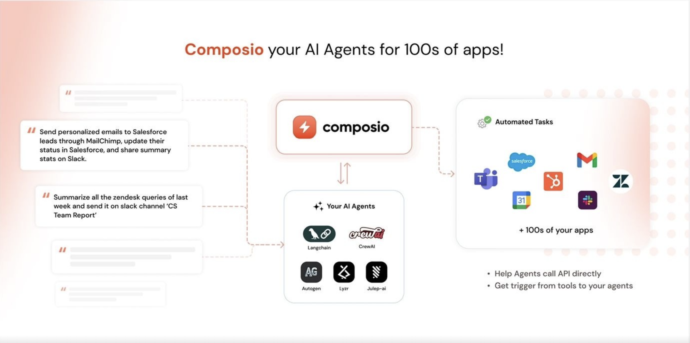

<p align="center">
  
  <h4 align="center">Composio SDK: Equip your agent with high-quality tools and <br/>build your real-world usecase</h4>
  <hr/>
  <p align="center">
    
  
    
    
    
    </p>
</p>




Composio provides a platform that seamlessly integrates over 200+ apps with your AI agents, enhancing their utility and interactivity. It supports all the features you'll ever need:

- **Compatibility with Major Agent Frameworks**: Autogen, Langchain, CrewAI, Julep, Lyzr, and OpenAI are all compatible with Composio, giving you a simple experience for your workflows.
- **Full Support for Actions & Triggers**: Composio provides full support for Actions & Triggers, to power your agents with a wide range of functionalities.
- **Authentication Management**: Composio provides comprehensive management of all authentication types, including `OAuth2`, `OAuth1`, `Basic`, `API_KEY`.
- **Extensibility**: Don't find a tool you need? Composio is highly extensible, allowing you to add your own set of custom tools.
- **Secure Environment**: Every user has a secure compute environment, ensuring data protection and privacy.

## Getting started
 To get started, select the framework you want to use and install the correseponding package:
- **Autogen**: `pip install composio_autogen`
- **CrewAI**: `pip install composio_crewai`
- **Langchain**: `pip install composio_langchain`
- **Lyzr**: `pip install composio_lyzr`
- **OpenAI**: `pip install composio_openai`

Login now into your composio account, using the  below CLI command below
```shell 
composi-cli login
```

<hr/>

### Run a sample use-cases repo for your framework
The below sample repos are provided to help you get started with Composio. Follow the README.md to start these agents.

| Framework | Use-Case | GitHub Repo | Features Used |
| --- | --- | --- | --- |
| Autogen | Sample Use-Case | [GitHub Repo](https://github.com/username/repo) | - |
| CrewAI | Competitor research agent that is triggered with a slack message, starts researching about the said topic and  finally creates a page on notion and reply back to slack. | [GitHub Repo](https://github.com/username/repo) |   
| Langchain | Sample Use-Case | [GitHub Repo](https://github.com/username/repo) | - |
| Lyzr | Sample Use-Case | [GitHub Repo](https://github.com/username/repo) | - |
| OpenAI | Sample Use-Case | [GitHub Repo](https://github.com/username/repo) | - |
