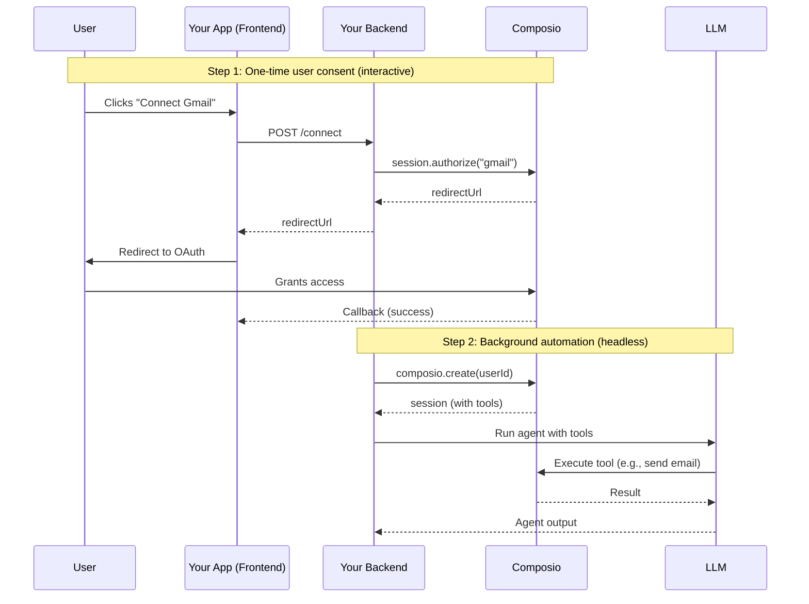

A common pattern is to collect OAuth consent from users through your UI, then run agents autonomously in the background — without any interactive prompts. This is useful for:

- **Scheduled automations** — daily email digests, weekly report generation
- **Event-driven workflows** — process new data when a webhook fires
- **Batch operations** — bulk actions across a user's connected apps

## How it works

1. **User authenticates once** — through your UI, they connect their accounts via OAuth
2. **Connections persist** — Composio stores and refreshes tokens automatically
3. **Agent runs headless** — your backend creates a session with the same user ID and executes tools using their stored connections



## Step 1: Collect user consent in your UI

During onboarding or in a settings page, let users connect their accounts. This only needs to happen once per toolkit.

<Tabs groupId="language" items={['Python', 'TypeScript']} persist>
<Tab value="Python">
```python
from composio import Composio

composio = Composio(api_key="your-api-key")

# Create a session for this user
session = composio.create(
    user_id="user_123",
    manage_connections=False,  # Handle auth in your UI, not in chat
)

# Generate a connect link for Gmail
connection_request = session.authorize(
    "gmail",
    callback_url="https://your-app.com/settings?connected=gmail"
)

# Redirect user to this URL in your frontend
print(connection_request.redirect_url)
# https://connect.composio.dev/link/ln_abc123

# Wait for OAuth to complete
connected_account = connection_request.wait_for_connection()
print(f"Connected: {connected_account.id}")  # ca_abc123
```
</Tab>
<Tab value="TypeScript">
```typescript
import { Composio } from "@composio/core";

const composio = new Composio({ apiKey: "your-api-key" });

// Create a session for this user
const session = await composio.create("user_123", {
  manageConnections: false, // Handle auth in your UI, not in chat
});

// Generate a connect link for Gmail
const connectionRequest = await session.authorize("gmail", {
  callbackUrl: "https://your-app.com/settings?connected=gmail",
});

// Redirect user to this URL in your frontend
console.log(connectionRequest.redirectUrl);
// https://connect.composio.dev/link/ln_abc123

// Wait for OAuth to complete
const connectedAccount = await connectionRequest.waitForConnection();
console.log(`Connected: ${connectedAccount.id}`); // ca_abc123
```
</Tab>
</Tabs>

## Step 2: Run agents in the background

Later — in a cron job, webhook handler, or queue worker — create a session with the same user ID. Composio automatically uses their existing connections.

<Tabs groupId="language" items={['Python', 'TypeScript']} persist>
<Tab value="Python">
```python
from composio import Composio
from composio_openai_agents import OpenAIAgentsProvider
from agents import Agent, Runner

composio = Composio(provider=OpenAIAgentsProvider())

def run_daily_digest(user_id: str):
    """Background job: summarize today's emails for a user."""
    # No OAuth prompts — uses the connection from Step 1
    session = composio.create(
        user_id=user_id,
        toolkits=["gmail"],           # Only enable what's needed
        manage_connections=False,      # No interactive auth
    )
    tools = session.tools()

    agent = Agent(
        name="Email Digest",
        instructions="Summarize the user's emails from today. Be concise.",
        tools=tools,
    )

    result = Runner.run_sync(agent, "Summarize my emails from today")
    return result.final_output

# Called from a cron job or task queue
for user_id in get_subscribed_users():
    summary = run_daily_digest(user_id)
    send_digest_notification(user_id, summary)
```
</Tab>
<Tab value="TypeScript">
```typescript
// @noErrors
import { Composio } from "@composio/core";
import { VercelProvider } from "@composio/vercel";
import { generateText } from "ai";
import { anthropic } from "@ai-sdk/anthropic";

const composio = new Composio({ provider: new VercelProvider() });

async function runDailyDigest(userId: string) {
  // No OAuth prompts — uses the connection from Step 1
  const session = await composio.create(userId, {
    toolkits: ["gmail"],           // Only enable what's needed
    manageConnections: false,      // No interactive auth
  });
  const tools = await session.tools();

  const { text } = await generateText({
    model: anthropic("claude-sonnet-4-6"),
    tools,
    prompt: "Summarize my emails from today. Be concise.",
  });

  return text;
}

// Called from a cron job or task queue
for (const userId of await getSubscribedUsers()) {
  const summary = await runDailyDigest(userId);
  await sendDigestNotification(userId, summary);
}
```
</Tab>
</Tabs>

## Verify connections before running

Before running a background agent, check that the user still has active connections. If a connection expired or was revoked, you can notify them to re-authenticate.

<Tabs groupId="language" items={['Python', 'TypeScript']} persist>
<Tab value="Python">
```python
session = composio.create(
    user_id=user_id,
    toolkits=["gmail"],
    manage_connections=False,
)

toolkits = session.toolkits()

gmail = next((t for t in toolkits.items if t.slug == "gmail"), None)
if not gmail or not gmail.connection.is_active:
    # Notify user to reconnect
    notify_user(user_id, "Your Gmail connection expired. Please reconnect.")
    return

# Connection is active — run the agent
tools = session.tools()
# ...
```
</Tab>
<Tab value="TypeScript">
```typescript
// @noErrors
import { Composio } from "@composio/core";
const composio = new Composio({ apiKey: "your-api-key" });
const userId = "user_123";
// ---cut---
const session = await composio.create(userId, {
  toolkits: ["gmail"],
  manageConnections: false,
});

const toolkits = await session.toolkits();

const gmail = toolkits.items.find((t) => t.slug === "gmail");
if (!gmail?.connection?.connectedAccount) {
  // Notify user to reconnect
  await notifyUser(userId, "Your Gmail connection expired. Please reconnect.");
  return;
}

// Connection is active — run the agent
const tools = await session.tools();
// ...
```
</Tab>
</Tabs>

<Callout type="info">
Composio automatically refreshes OAuth tokens before they expire. You generally don't need to handle token expiry yourself — but it's good practice to check connection status before long-running background jobs, since users can revoke access at any time.
</Callout>

## Full example: Next.js app with background cron

Here's a complete end-to-end example showing a Next.js app where users connect Gmail in a settings page, and a cron job runs a daily email digest agent in the background.

### Settings page: collect OAuth consent

```typescript
// @noErrors
// app/api/connect/gmail/route.ts — Server-side API route
import { Composio } from "@composio/core";
import { NextResponse } from "next/server";

const composio = new Composio({ apiKey: process.env.COMPOSIO_API_KEY! });

export async function POST(req: Request) {
  const { userId } = await req.json(); // your app's authenticated user ID

  const session = await composio.create(userId, {
    manageConnections: false,
  });

  const connectionRequest = await session.authorize("gmail", {
    callbackUrl: `${process.env.NEXT_PUBLIC_APP_URL}/settings?connected=gmail`,
  });

  return NextResponse.json({ redirectUrl: connectionRequest.redirectUrl });
}
```

Your frontend calls this endpoint and redirects the user to the OAuth page:

```typescript
// @noErrors
// app/settings/page.tsx — Client component
const connectGmail = async () => {
  const res = await fetch("/api/connect/gmail", {
    method: "POST",
    body: JSON.stringify({ userId: currentUser.id }),
  });
  const { redirectUrl } = await res.json();
  window.location.href = redirectUrl; // User completes OAuth
};
```

### Cron job: run the background agent

```typescript
// @noErrors
// app/api/cron/daily-digest/route.ts — Called by Vercel Cron or similar
import { Composio } from "@composio/core";
import { VercelProvider } from "@composio/vercel";
import { generateText } from "ai";
import { anthropic } from "@ai-sdk/anthropic";

const composio = new Composio({
  apiKey: process.env.COMPOSIO_API_KEY!,
  provider: new VercelProvider(),
});

export async function GET(req: Request) {
  // Verify cron secret in production
  const subscribedUserIds = await getSubscribedUsers(); // from your database

  for (const userId of subscribedUserIds) {
    // Check if user still has Gmail connected
    const session = await composio.create(userId, {
      toolkits: ["gmail"],
      manageConnections: false, // No interactive prompts
    });

    const toolkits = await session.toolkits();
    const gmail = toolkits.items.find((t) => t.slug === "gmail");
    if (!gmail?.connection?.connectedAccount) {
      console.log(`Skipping ${userId}: Gmail not connected`);
      continue;
    }

    // Run the agent — uses stored OAuth tokens, no user interaction needed
    const tools = await session.tools();
    const { text } = await generateText({
      model: anthropic("claude-sonnet-4-6"),
      tools,
      prompt: "Summarize my unread emails from today. Be concise.",
    });

    await sendDigestNotification(userId, text);
  }

  return new Response("OK");
}
```

The key points:
- **`composio.create(userId)`** uses the same user ID from the OAuth step — Composio automatically finds their stored connection
- **`manageConnections: false`** prevents the agent from trying to prompt for OAuth (there's no user to prompt)
- **`session.toolkits()`** lets you verify the connection is still active before running the agent
- **Composio handles token refresh** — if the Gmail token expired, it's refreshed automatically before the tool executes
