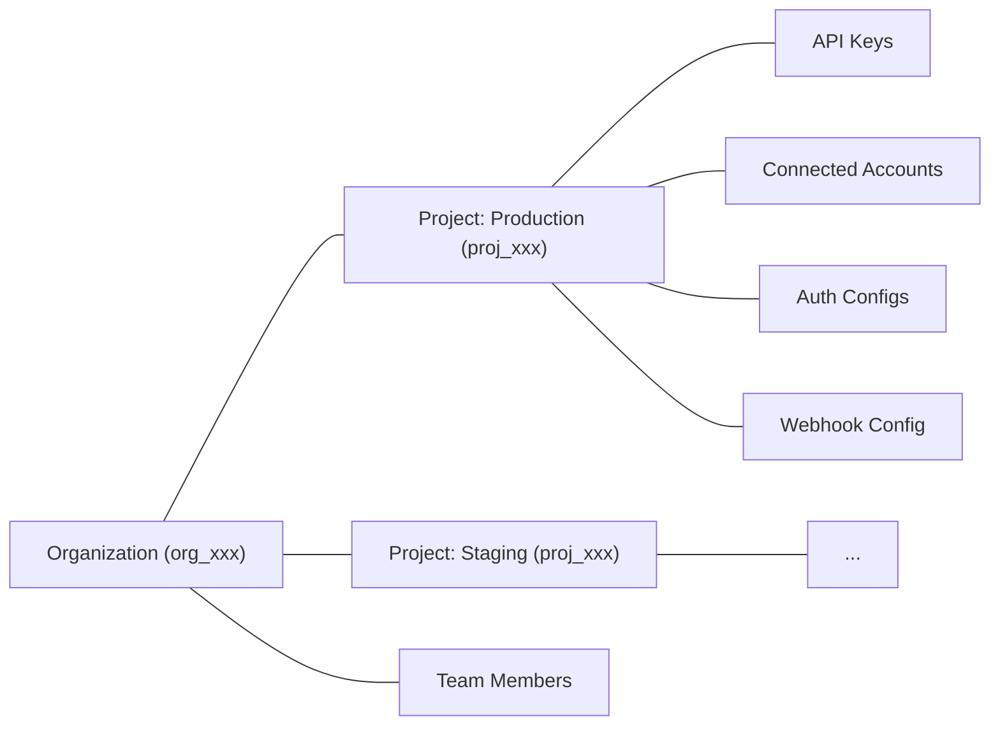
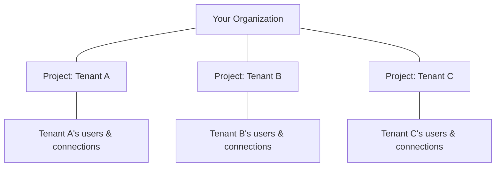

Every Composio account belongs to an **organization**. Inside an organization, **projects** are isolated environments that scope your API keys, connected accounts, auth configs, and webhook configurations. Resources in one project are not accessible from another.

<Callout type="info">
**Best practice for multi-tenant apps:** If you're building a B2B SaaS where each customer has their own end-users, use **one Composio project per customer** for complete isolation. This is the recommended pattern — see [Multi-tenant isolation](#multi-tenant-isolation) below.
</Callout>



Common reasons to use multiple projects:
- **Separate environments** — keep production and staging isolated
- **Separate products** — keep resources for different apps independent
- **Client isolation** — give each client their own project with separate credentials and data

## Managing projects

You can manage projects from the [dashboard](https://platform.composio.dev?next_page=/settings) or via the API using an **organization API key** (`x-org-api-key`).

<Callout type="info">
Project management endpoints use the `x-org-api-key` header, not the regular `x-api-key`. You can find your org API key in the dashboard under **Settings > Organization**.
</Callout>

### Create a project

```bash
curl -X POST https://backend.composio.dev/api/v3/org/owner/project/new \
  -H "x-org-api-key: YOUR_ORG_API_KEY" \
  -H "Content-Type: application/json" \
  -d '{
    "name": "my-staging-project",
    "should_create_api_key": true
  }'
```

The response includes the project ID and, if requested, an API key:

```json
{
  "id": "proj_abc123xyz456",
  "name": "my-staging-project",
  "api_key": "ak_abc123xyz456"
}
```

### List projects

```bash
curl https://backend.composio.dev/api/v3/org/owner/project/list \
  -H "x-org-api-key: YOUR_ORG_API_KEY"
```

Supports pagination with `limit` and `cursor` query parameters.

### Get project details

```bash
curl https://backend.composio.dev/api/v3/org/owner/project/proj_abc123xyz456 \
  -H "x-org-api-key: YOUR_ORG_API_KEY"
```

Returns the full project object including its API keys.

## Project settings

Each project has settings that control security, logging, and display behavior. These endpoints use your **project API key** (`x-api-key`), not the org key.

```bash
curl -X PATCH https://backend.composio.dev/api/v3/org/project/config \
  -H "x-api-key: YOUR_API_KEY" \
  -H "Content-Type: application/json" \
  -d '{
    "mask_secret_keys_in_connected_account": false,
    "log_visibility_setting": "show_all"
  }'
```

You can also view and update these from **Settings > Project Settings** in the [dashboard](https://platform.composio.dev?next_page=/settings). See the [Projects API reference](/reference/api-reference/projects) for all available settings.

## Multi-tenant isolation

If you're building a platform where multiple customers (tenants) each have their own end-users, use **separate projects per tenant** to achieve clean isolation. This ensures:

- **User ID isolation** — `user_123` in Tenant A's project is completely separate from `user_123` in Tenant B's project
- **Credential isolation** — each tenant's OAuth credentials, API keys, and connected accounts are scoped to their project
- **Audit separation** — logs and webhook events are scoped per project



### Setting up per-tenant projects

When a new tenant signs up for your platform, create a Composio project for them:

```bash
# Create a project for the new tenant
curl -X POST https://backend.composio.dev/api/v3/org/owner/project/new \
  -H "x-org-api-key: YOUR_ORG_API_KEY" \
  -H "Content-Type: application/json" \
  -d '{
    "name": "tenant-acme-corp",
    "should_create_api_key": true
  }'
```

Store the returned `api_key` for this tenant. When initializing the Composio SDK for a tenant's request, use their project API key:

<Tabs groupId="language" items={['Python', 'TypeScript']} persist>
<Tab value="Python">
```python
from composio import Composio

# Each tenant gets their own Composio client with their project API key
composio = Composio(api_key=tenant.composio_api_key)

session = composio.create(user_id=end_user.id)
```
</Tab>
<Tab value="TypeScript">
```typescript
// @noErrors
import { Composio } from "@composio/core";

// Each tenant gets their own Composio client with their project API key
const composio = new Composio({ apiKey: tenant.composioApiKey });

const session = await composio.create(endUser.id);
```
</Tab>
</Tabs>

<Callout type="info">
**When to use this pattern:** If your app has distinct customers who each manage their own users (B2B SaaS), use one project per customer. If you have a single-tenant app with many users, one project is sufficient — user IDs already provide per-user isolation of connections.
</Callout>

### Deciding your isolation strategy

| Scenario | Strategy | Why |
|----------|----------|-----|
| **Single-tenant app** (e.g., a personal productivity tool) | One project, unique user IDs | User IDs already isolate connections per user |
| **B2B SaaS** (e.g., each customer has their own users) | One project per customer | Prevents user ID collisions, keeps credentials separate, enables per-customer billing |
| **Separate environments** (dev, staging, prod) | One project per environment | Prevents test data from leaking into production |
| **Multiple products** (e.g., separate apps under one company) | One project per product | Keeps OAuth credentials and user namespaces independent |
