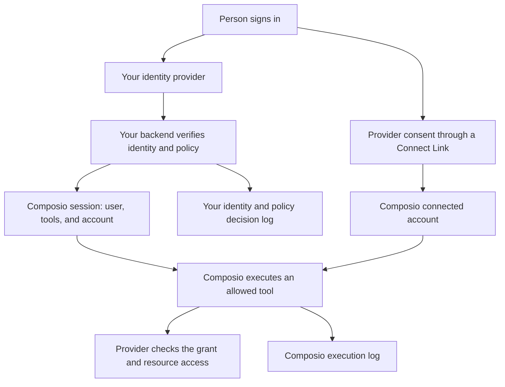

Composio lets your application delegate specific tools to an agent acting on a person's connected accounts. Provider OAuth scopes limit the account's grant. Session filters restrict which Composio tools the agent can discover and execute. Your application decides who can start that session and which business operations they can approve.

For example, an email assistant can have access to `GMAIL_FETCH_EMAILS` while sending and deleting email remain outside its session's tool allowlist. The underlying OAuth grant may cover more operations, so use both provider scopes and session restrictions.

## A restricted session

This example creates a session that can fetch email from one existing Gmail connection. It disables in-chat connection management and the remote sandbox. Set `COMPOSIO_API_KEY` to your project API key, replace `user_123` with your application's user ID, and replace `ca_work_gmail` with that user's active connected-account ID.

```bash
curl --fail-with-body --request POST \
	--url https://backend.composio.dev/api/v3.1/tool_router/session \
	--header "x-api-key: $COMPOSIO_API_KEY" \
	--header 'Content-Type: application/json' \
	--data '{
		"user_id": "user_123",
		"toolkits": {"enable": ["gmail"]},
		"tools": {"gmail": {"enable": ["GMAIL_FETCH_EMAILS"]}},
		"connected_accounts": {"gmail": ["ca_work_gmail"]},
		"manage_connections": {"enable": false},
		"workbench": {"enable": false}
	}'
```

The response includes a `session_id`. Calls through that session use its configured tools and account. This request does not change the connected account's existing OAuth scopes. The REST API calls the sandbox configuration `workbench`; the SDKs expose it as `sandbox`.

The toolkit allowlist restricts the catalog to Gmail. The tool allowlist then restricts Gmail to one operation. Without a toolkit restriction, sessions can access other toolkits. See [Configuring sessions](/docs/configuring-sessions) for the SDK equivalents and [Create a session](/reference/api-reference/tool-router/postToolRouterSession) for the request schema.

## Identity and execution flow



Your application authenticates people through its existing identity system, such as Okta, Microsoft Entra ID, or Auth0. After validating sign-in, your backend maps the authenticated subject to a stable Composio `user_id`. This is an application integration pattern. Passing `user_id` does not validate an identity-provider token or import its group memberships into Composio.

Keep that mapping scoped to your tenants. Derive the ID and session configuration on your backend, and check ownership before returning an existing session. A user ID supplied by a browser or an agent is not proof of identity. The project API key authenticates your application to Composio.

During connection, Composio returns a [Connect Link](/docs/authentication/manually-authenticating). The person follows the link and grants access at the provider. Composio associates the resulting connected account with the supplied user ID. Private connections belong to that user. A pinned account must not be deleted or disabled.

For team credentials, experimental [shared connections](/docs/extending-sessions/shared-connections) support per-user allow and deny lists. They require an explicit session pin and default to denying access to other users until you grant it. This is a separate model from the private connection in the example above.

For Composio-managed tool execution, Composio uses the connected account's credentials to call the provider. Your application receives the tool result without needing the raw OAuth token. Tokens are redacted by default in API responses. See [Credential protection](/docs/security/overview#credential-protection) for those defaults.

## Authorization granularity

| Control | What it governs | Boundary |
| --- | --- | --- |
| Project API key permissions | Which Composio API resource areas your backend can use | A key permission is not an end-user identity or a per-tool grant. |
| Provider OAuth scopes | Operations granted to a connected account at the provider | Granularity depends on the provider. One scope can cover several tools. |
| Session `toolkits` and `tools` | Which toolkits and individual tools the session can discover and execute | Restrictions apply to calls through that session. |
| Session `tags` | Tool selection by behavior annotations such as `readOnlyHint` | Tags describe tools, not a person's role or permission to access a record. |
| Connected-account selection | Which person's provider account the session uses | Account selection does not narrow that account's provider grant. |
| Your application's policy | Tenant membership, business roles, allowed arguments, and required approvals | Your backend must enforce these decisions on every execution path you expose. |

The [session tool policy guide](/kb/guide/platform-session-tool-policies) documents that session filters apply during execution as well as discovery. An exact tool allowlist also prevents a newly added tool from becoming available just because it shares a toolkit or tag.

OAuth scopes and tool allowlists remain separate. Allowing a tool does not grant missing provider permissions. Restricting a session does not reduce the OAuth token's scopes. Configure the minimum scopes through an [auth config](/docs/authentication/controlling-scopes), then associate that config with the session when people connect.

Changing an auth config's scopes affects new connections. Existing connections keep their prior grants until the person reconnects. When pinning an existing connected account, verify its grant rather than assuming a new auth-config setting changed it.

## Policy controls and execution paths

Your backend can translate an application role into a session configuration. For example, a support reader can receive only email retrieval tools, while a reply workflow can receive a sending tool after your application approves the action. Neither a tool allowlist nor an OAuth scope expresses a rule such as "send only to this customer's verified address." Validate those arguments in your application.

Keep project API keys in trusted backend services. Use [scoped project API keys](/reference/authenticating-to-composio/project-api-key-permissions) to separate session management, tool execution, connection management, and observability where your architecture permits. Default project keys have full project access.

Calls through [direct execution](/docs/sessions-vs-direct-execution) skip the session. Apply your policy explicitly if your application exposes that route. [Proxy Execute](/docs/extending-sessions/proxy-execute) can call provider endpoints beyond predefined tools and has a separate API key permission. A list of allowed tool slugs is not a list of allowed proxy URLs. Leave Proxy Execute ungranted when the application does not need it, and disable the sandbox when the agent does not need code execution.

### Hosted MCP sessions

Composio exposes a configured session through a [hosted MCP endpoint](/docs/sessions-via-mcp). Toolkit, tool, and account restrictions belong to the session. Use the returned `session.mcp.url` and `session.mcp.headers` with the intended client, and treat access to that configuration as delegated access to the session.

SDK `beforeExecute` and `afterExecute` hooks run in your application's SDK execution path. They do not run when a hosted MCP client calls Composio directly. If an action requires an application approval or an argument check, keep execution behind a backend that enforces it. A local SDK hook cannot enforce policy on a separate hosted MCP route.

<Callout type="info" title="Experimental approval controls">
The session API also exposes `experimental.permissions` for default and per-tool approval behavior, including overrides for a tool and connected-account pair. Treat this as experimental, not as a portable approval guarantee across clients. MCP approval flows require client support for elicitation. Review the [session API schema](/reference/api-reference/tool-router/postToolRouterSession) and [MCP elicitation requirements](/kb/guide/mcp-tool-router-sessions#enhanced-control-requires-client-support-for-mcp-elicitation) before relying on them.
</Callout>

### Removing access

When a person leaves your application or loses a role, stop issuing sessions and [delete the affected sessions](/reference/api-reference/tool-router/deleteToolRouterSessionBySessionId). Sessions do not currently expire with time. Deleting a session takes effect immediately, but leaves connected accounts and auth configs intact.

To stop using an account through Composio, [disable or delete the connected account](/reference/sdk-reference/typescript/connected-accounts). Handle provider-side grant revocation as a separate part of offboarding. Application sign-out alone does not delete a Composio session or revoke an OAuth grant.

## Audit trail

Composio's [Logs API](/reference/api-reference/logs) records individual tool executions. Records include the tool and toolkit, supplied user ID, connected-account and auth-config IDs, execution status, and timing. Session, request, and trace identifiers provide additional context where available.

Your application holds the evidence that connects those executions to a verified identity and a business decision. Record the authenticated subject, tenant, Composio user ID, session ID, policy version, approval decision, and relevant execution identifiers. Record application-denied attempts there too, because a request blocked before reaching Composio cannot produce a Composio execution log.

Execution records do not replace identity-provider sign-in logs or establish who approved an action. The Logs API is a tool-execution feed, not a general organization audit feed. Use the [SIEM collection guide](/docs/poc-to-prod/stream-logs-to-a-siem) to collect and correlate execution records with your application logs.

Tool execution and trigger event logs are retained for up to one year. **Don't store data** disables request and response payload storage for new calls while preserving audit metadata, including the supplied user ID. It does not delete previously stored payloads. See [Data retention](/docs/security/data-retention) for retention, temporary files, and downstream processing.

For a security evaluation, use the [Composio Trust Center](https://trust.composio.dev) to obtain the current SOC 2 Type II report and confirm its scope. Assess that evidence alongside your application's identity checks, policy enforcement, and log retention.
