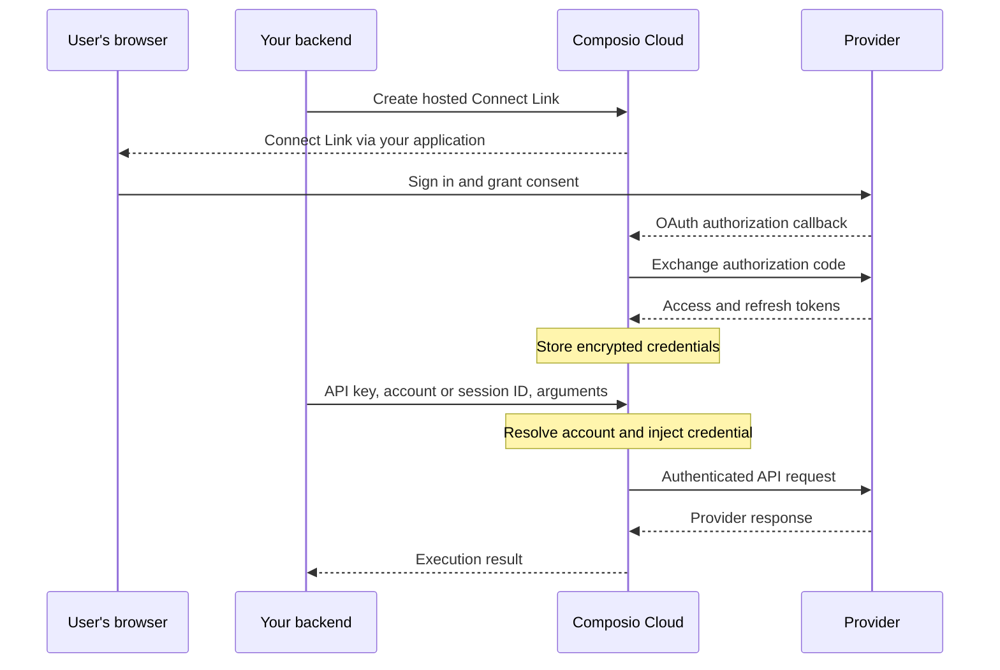

Composio stores provider credentials and uses them to execute requests on your behalf. With hosted authentication and managed execution, your application passes account identifiers and tool arguments. Composio resolves the credentials and authenticates the provider request server-side.

In the default Composio Cloud deployment, Composio has custody of those credentials. Keeping a token out of your application and keeping it outside Composio's infrastructure are different requirements. The [deployment options](#deployment-options) below describe that distinction.

For example, after connecting a GitHub account, your backend can call GitHub through [Proxy Execute](/reference/api-reference/tools/postToolsExecuteProxy):

```bash
curl --request POST \
  --url https://backend.composio.dev/api/v3.1/tools/execute/proxy \
  --header "x-api-key: $COMPOSIO_API_KEY" \
  --header 'Content-Type: application/json' \
  --data '{
    "connected_account_id": "ca_your_github_account",
    "endpoint": "/user",
    "method": "GET"
  }'
```

Replace the account ID with your connected account. `COMPOSIO_API_KEY` must belong to that project and have the **Proxy execute** permission. The request contains a Composio API key, which authorizes execution, but no GitHub token. Composio injects that token and returns the provider response.

## Token boundaries in Composio Cloud

The following flow covers hosted OAuth and execution through Composio:



The browser participates in consent. Your backend receives connection status and identifiers. Composio stores the provider credentials, handles refresh where supported, and uses them during execution. The provider receives the credential needed to authenticate its API call.

Your model receives the tool definitions and results your application or MCP client supplies. Provider credentials are not required in prompts, tool arguments, or model context. A Composio API key is still a secret with permission to act on connected accounts, so keep it in your trusted backend or client credential store.

The [security overview](/docs/security/overview#credential-protection) documents AES-256-GCM encryption at rest and TLS in transit. Encryption at rest protects stored credentials; the execution service still needs to use them to authenticate requests.

## Default redaction is an API boundary

Get Connected Account and List Connected Accounts redact sensitive credential fields by default. This applies to both Composio-managed and custom auth configs. Redaction happens in API responses before your application receives them; it does not depend on your application masking a token after retrieval.

The response can still contain an authentication-state object such as `account.state.val`, including field names such as `access_token`. The presence of those fields in an SDK type or response schema does not establish that the API returns usable secrets or provides an unmasking option. See [credential masking](/docs/auth-configuration/connected-accounts#credential-masking) for the response format.

Use tool execution or Proxy Execute when you need to act on an account. Reading connected-account state is not a supported token-export workflow.

This redaction has a specific scope. It does not sanitize every provider response, a secret your own code supplies, or every log your application writes. Tool results can contain sensitive business data even when the authentication token stays inside the execution service.

## Execution paths

| Path | Where code runs and credentials are used |
| --- | --- |
| Native tools through a session, MCP, or direct execution | Composio executes the provider call and supplies the connected account's credential. Your caller receives the result. |
| Proxy Execute | Composio authenticates an HTTP request to the connected provider. Use this for endpoints or request shapes that predefined tools do not cover. |
| Session extension tools | Your custom function runs in your process. Its `ctx.proxyExecute()` or `ctx.proxy_execute()` call delegates authentication and the provider request to Composio. |
| Independent local tools or imported credentials | Your code controls any secrets it reads or supplies. Importing an existing token means your application already handles that token before sending it to Composio. |

[Sessions](/docs/configuring-sessions) and [direct execution](/docs/sessions-vs-direct-execution) also work from deterministic backend code. An LLM is not required to execute a tool or proxy request.

[Proxy Execute](/docs/extending-sessions/proxy-execute) checks the destination against the connected account's toolkit domain and requires its own API-key permission. Use relative provider paths and let Composio supply authentication. Granting proxy access allows provider operations beyond predefined tool schemas, subject to the provider's permissions. Review that permission separately from tool selection.

For custom business logic, [session extension tools](/docs/extending-sessions/custom-tools-and-toolkits) let your code call the proxy without reading tokens. If you instead [import credentials](/docs/authentication/importing-existing-connections) or handle authentication yourself, include those code paths in your credential review.

## OAuth app ownership and token custody

A [custom auth config](/docs/authentication/custom-app-vs-managed-app) lets you use your own OAuth app for branding, scopes, and provider quota. In Composio Cloud, Composio still stores and uses the resulting connected-account tokens. Owning the OAuth app does not move the token store into your infrastructure or change default API redaction.

## Deployment options

| Option | Credential boundary | Availability |
| --- | --- | --- |
| Composio Cloud | Composio hosts credential storage and execution. Your application calls the managed API. | Default hosted deployment. |
| Private VPC deployment | Places the deployment within a private network boundary. Credential storage, operator access, and key ownership must be specified in the deployment design. | Enterprise arrangement. |
| Self-hosted deployment | Runs Composio in your environment. Your team takes responsibility for the agreed infrastructure and operations. | Enterprise arrangement, with Helm deployment support. |
| Customer-managed key deployment | A proxy in your cloud handles credential plaintext under keys in your KMS. Composio retains the control plane without the key material needed to decrypt those credentials. | Set up with the Composio team, rather than enabled by a dashboard toggle. |

The [Enterprise overview](https://composio.dev/enterprise) and [MCP gateway deployment options](https://composio.dev/mcp-gateway) describe private and self-hosted availability. The [Helm troubleshooting guide](/kb/guide/platform-self-hosted-helm) covers existing self-hosted installations.

The [customer-managed key architecture](https://composio.dev/blog/two-questions-every-security-review-asks-us) supports AWS KMS, Google Cloud KMS, and HashiCorp Vault Transit. This is a separate deployment choice from bringing your own OAuth app.

If your requirement is that Composio cannot decrypt provider credentials, evaluate the customer-managed key arrangement with the team. For VPC or self-hosted deployments, confirm who operates each service, who can decrypt credentials, where logs and backups reside, and which outbound connections are required. A deployment label alone does not answer those questions. [Contact Composio](https://composio.dev/contact?utm_source=docs) to establish the architecture and contractual requirements.

## Application authorization and retained data

Your backend must bind the signed-in user to the correct Composio `user_id` and connected accounts. A caller-supplied user ID is not proof of identity. Choose [provider scopes](/docs/authentication/controlling-scopes), [session tools](/docs/configuring-sessions), and [API-key permissions](/reference/authenticating-to-composio/project-api-key-permissions) for the operations your application needs.

Credential redaction and payload retention are separate controls. Tool arguments and results are stored in execution logs by default. The project's **Don't store data** setting stops storage of new call payloads while retaining audit metadata. It does not prevent processing during execution, delete existing logs, or govern your own logs and model provider. See [data retention](/docs/security/data-retention) for file storage, Workbench processing, and retention details.

For compliance reports and the current sub-processor list, use the [Composio Trust Center](https://trust.composio.dev).
