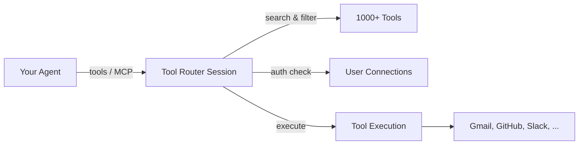
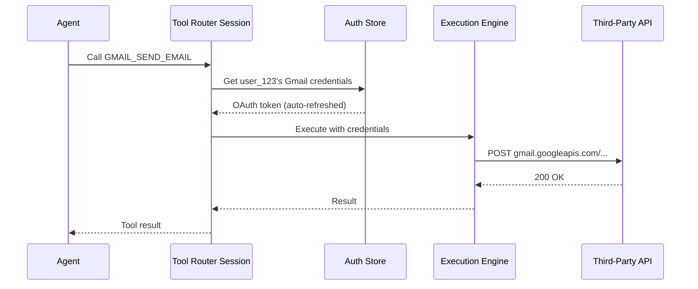

Tool Router is the core runtime that powers Composio sessions. When you call `composio.create()`, you're creating a Tool Router session — it handles tool discovery, authentication prompts, and execution routing so your agent can use 1000+ tools without managing any of that yourself.

## Why Tool Router exists

Without Tool Router, connecting an AI agent to external tools means: managing 1000+ tool definitions (too many for any LLM context window), handling OAuth flows for each user, routing tool calls to the right API with the right credentials, and keeping tool schemas up to date. Tool Router solves all of this in a single session abstraction.

## What Tool Router does

When an agent needs to use a tool, Tool Router:

1. **Discovers relevant tools** — surfaces the right tools based on the agent's task, so the LLM doesn't get overwhelmed with 1000+ tool definitions
2. **Handles authentication** — prompts users to connect accounts when needed (via [Connect Links](/docs/authentication)), or uses existing connections silently
3. **Routes execution** — sends tool calls to the right service with the right credentials
4. **Manages context** — provides tool schemas, descriptions, and metadata optimized for LLM consumption



## Architecture

Under the hood, Tool Router is a server-side session manager. When you call `composio.create()`, here's what happens:

1. A session is created on Composio's servers, scoped to the user ID you provide
2. The session is configured with the toolkits, auth configs, and connected accounts you specify (or defaults)
3. You get back a session object with methods to retrieve tools or an MCP endpoint

The session then serves as the bridge between your agent and Composio's tool execution infrastructure. When the agent calls a tool, Tool Router:
- Resolves which connected account to use (based on the user ID and toolkit)
- Injects the user's credentials into the tool call
- Routes the execution to the right backend service
- Returns the result to the agent



## How to use it

Tool Router is accessed through the Composio SDK. You don't interact with it directly — it's the engine behind `composio.create()`. Every session is scoped to a user ID, so connections and tool access are isolated per user.

There are two ways to consume Tool Router tools: **native providers** and **MCP**. Choose based on your framework.

### Via native provider (recommended)

Native providers give your AI framework typed tool objects with built-in execution. Use this when your AI framework has a Composio provider package (Vercel AI SDK, OpenAI Agents, LangChain, etc.):

<Tabs groupId="language" items={['Python', 'TypeScript']} persist>
<Tab value="Python">
```python
from composio import Composio
from composio_openai_agents import OpenAIAgentsProvider

composio = Composio(provider=OpenAIAgentsProvider())
session = composio.create(user_id="user_123")
tools = session.tools()  # Native tool objects for your framework
```
</Tab>
<Tab value="TypeScript">
```typescript
import { Composio } from "@composio/core";
import { VercelProvider } from "@composio/vercel";

const composio = new Composio({ provider: new VercelProvider() });
const session = await composio.create("user_123");
const tools = await session.tools(); // Native Vercel AI SDK tools
```
</Tab>
</Tabs>

### Via MCP

Use MCP when your client supports the Model Context Protocol but doesn't have a dedicated Composio provider (e.g., Claude Desktop, Cursor, custom MCP clients). Any MCP-compatible client can connect to a Tool Router session:

<Tabs groupId="language" items={['Python', 'TypeScript']} persist>
<Tab value="Python">
```python
from composio import Composio

composio = Composio()
session = composio.create(user_id="user_123")

# Use with any MCP client
mcp_url = session.mcp.url
mcp_headers = session.mcp.headers
```
</Tab>
<Tab value="TypeScript">
```typescript
import { Composio } from "@composio/core";

const composio = new Composio();
const session = await composio.create("user_123");

// Use with any MCP client
const { url, headers } = session.mcp;
```
</Tab>
</Tabs>

## Meta tools

Tool Router sessions include **meta tools** — special tools that the agent uses to interact with Composio itself. Instead of loading all 1000+ tool definitions into the LLM context, the agent uses meta tools to dynamically discover and execute only the tools it needs.

| Meta Tool | Purpose |
|-----------|---------|
| `COMPOSIO_SEARCH_TOOLS` | Find relevant tools based on a natural language query. Returns tool names, descriptions, and schemas for the top matches. |
| `COMPOSIO_MANAGE_CONNECTIONS` | Prompt users to connect accounts when a tool requires auth. Returns a Connect Link URL the user can click. |
| `COMPOSIO_EXECUTE_TOOL` | Execute a discovered tool with arguments. Handles credential injection and API routing. |

### How meta tools work in a conversation

Here's a typical flow when a user asks "send an email to Alice":

1. Agent calls `COMPOSIO_SEARCH_TOOLS` with query "send email" → gets back `GMAIL_SEND_EMAIL` with its schema
2. Agent calls `COMPOSIO_MANAGE_CONNECTIONS` to check if Gmail is connected → if not, returns a Connect Link for the user
3. User clicks the link and completes OAuth
4. Agent calls `COMPOSIO_EXECUTE_TOOL` with `GMAIL_SEND_EMAIL` and the email arguments → email is sent

If the user already has Gmail connected (e.g., from a previous session), step 2-3 is skipped automatically.

### Disabling connection management

You can disable the `COMPOSIO_MANAGE_CONNECTIONS` meta tool if you handle auth in your own UI (e.g., a settings page where users connect accounts). This prevents the agent from prompting users to authenticate mid-conversation — useful for [background agents](/docs/background-agents) and apps with dedicated connection management UIs:

<Tabs groupId="language" items={['Python', 'TypeScript']} persist>
<Tab value="Python">
```python
session = composio.create(
    user_id="user_123",
    manage_connections=False,
)
```
</Tab>
<Tab value="TypeScript">
```typescript
import { Composio } from '@composio/core';
const composio = new Composio({ apiKey: 'your_api_key' });
// ---cut---
const session = await composio.create("user_123", {
  manageConnections: false,
});
```
</Tab>
</Tabs>

## Configuring sessions

Sessions can be customized to control which toolkits are available, which auth configs to use, and which connected accounts to prefer. See [Configuring Sessions](/docs/configuring-sessions) for details.

## Common patterns

### Interactive chat agent

The default — users chat with an agent that discovers and uses tools on the fly. Tool Router handles auth prompts in-conversation via `COMPOSIO_MANAGE_CONNECTIONS`.

### Background automation

Collect OAuth consent upfront in your UI, then run headless agents in cron jobs or webhooks. Disable in-chat auth with `manageConnections: false`. See [Background Agents](/docs/background-agents) for a full walkthrough.

### Scoped sessions

Restrict a session to specific toolkits for security or performance. See [Configuring Sessions](/docs/configuring-sessions).

## API reference

For the underlying HTTP API, see the [Tool Router API reference](/reference/api-reference/tool-router).
