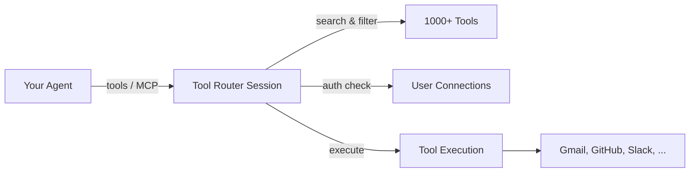

Tool Router is the core runtime that powers Composio sessions. When you call `composio.create()`, you're creating a Tool Router session — it handles tool discovery, authentication prompts, and execution routing so your agent can use 1000+ tools without managing any of that yourself.

## What Tool Router does

When an agent needs to use a tool, Tool Router:

1. **Discovers relevant tools** — surfaces the right tools based on the agent's task, so the LLM doesn't get overwhelmed with 1000+ tool definitions
2. **Handles authentication** — prompts users to connect accounts when needed (via [Connect Links](/docs/authentication)), or uses existing connections silently
3. **Routes execution** — sends tool calls to the right service with the right credentials
4. **Manages context** — provides tool schemas, descriptions, and metadata optimized for LLM consumption



## How to use it

Tool Router is accessed through the Composio SDK. You don't interact with it directly — it's the engine behind `composio.create()`.

### Via native provider (recommended)

Native providers give your AI framework typed tool objects with built-in execution:

<Tabs groupId="language" items={['Python', 'TypeScript']} persist>
<Tab value="Python">
```python
from composio import Composio
from composio_openai_agents import OpenAIAgentsProvider

composio = Composio(provider=OpenAIAgentsProvider())
session = composio.create(user_id="user_123")
tools = session.tools()  # Native tool objects for your framework
```
</Tab>
<Tab value="TypeScript">
```typescript
import { Composio } from "@composio/core";
import { VercelProvider } from "@composio/vercel";

const composio = new Composio({ provider: new VercelProvider() });
const session = await composio.create("user_123");
const tools = await session.tools(); // Native Vercel AI SDK tools
```
</Tab>
</Tabs>

### Via MCP

Any MCP-compatible client can connect to a Tool Router session:

<Tabs groupId="language" items={['Python', 'TypeScript']} persist>
<Tab value="Python">
```python
from composio import Composio

composio = Composio()
session = composio.create(user_id="user_123")

# Use with any MCP client
mcp_url = session.mcp.url
mcp_headers = session.mcp.headers
```
</Tab>
<Tab value="TypeScript">
```typescript
import { Composio } from "@composio/core";

const composio = new Composio();
const session = await composio.create("user_123");

// Use with any MCP client
const { url, headers } = session.mcp;
```
</Tab>
</Tabs>

## Meta tools

Tool Router sessions include **meta tools** — special tools that the agent uses to interact with Composio itself:

| Meta Tool | Purpose |
|-----------|---------|
| `COMPOSIO_SEARCH_TOOLS` | Find relevant tools based on a natural language query |
| `COMPOSIO_MANAGE_CONNECTIONS` | Prompt users to connect accounts when a tool requires auth |
| `COMPOSIO_EXECUTE_TOOL` | Execute a discovered tool with arguments |

These meta tools are automatically included in every session. The agent uses `COMPOSIO_SEARCH_TOOLS` to find the right tool for a task, `COMPOSIO_MANAGE_CONNECTIONS` to handle auth if needed, and `COMPOSIO_EXECUTE_TOOL` to run it.

You can disable the connection management meta tool if you handle auth in your own UI:

<Tabs groupId="language" items={['Python', 'TypeScript']} persist>
<Tab value="Python">
```python
session = composio.create(
    user_id="user_123",
    manage_connections=False,
)
```
</Tab>
<Tab value="TypeScript">
```typescript
import { Composio } from '@composio/core';
const composio = new Composio({ apiKey: 'your_api_key' });
// ---cut---
const session = await composio.create("user_123", {
  manageConnections: false,
});
```
</Tab>
</Tabs>

## Configuring sessions

Sessions can be customized to control which toolkits are available, which auth configs to use, and which connected accounts to prefer. See [Configuring Sessions](/docs/configuring-sessions) for details.

## API reference

For the underlying HTTP API, see the [Tool Router API reference](/reference/api-reference/tool-router).
