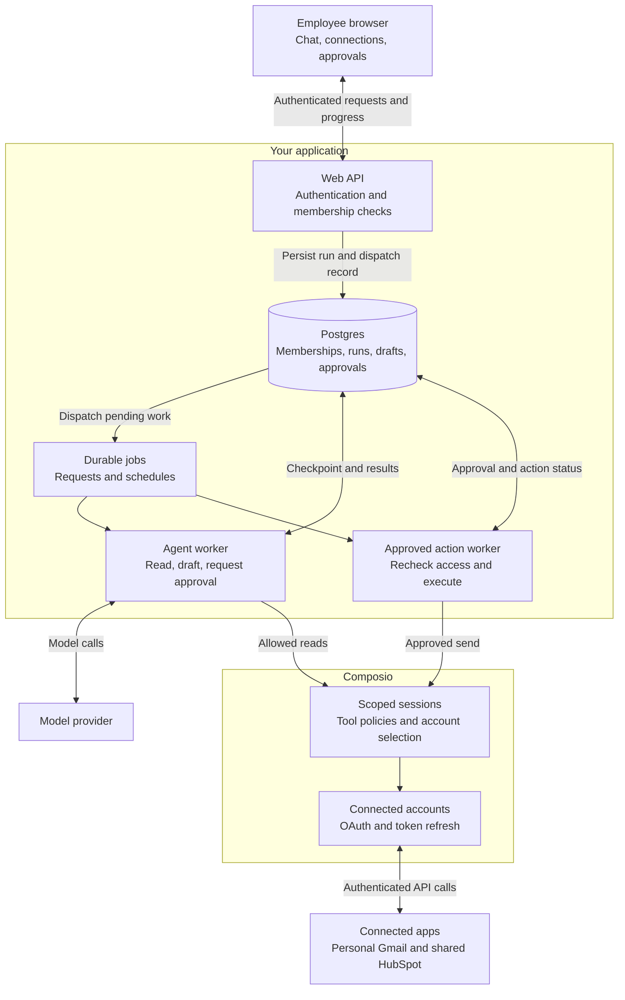
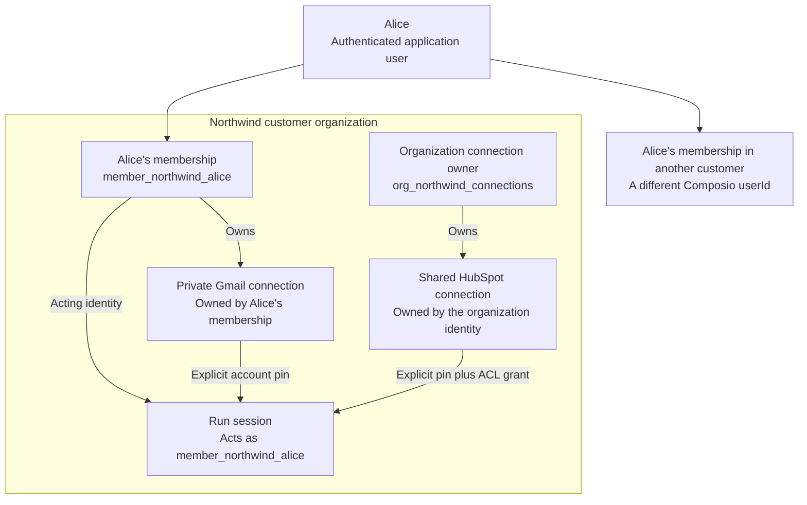
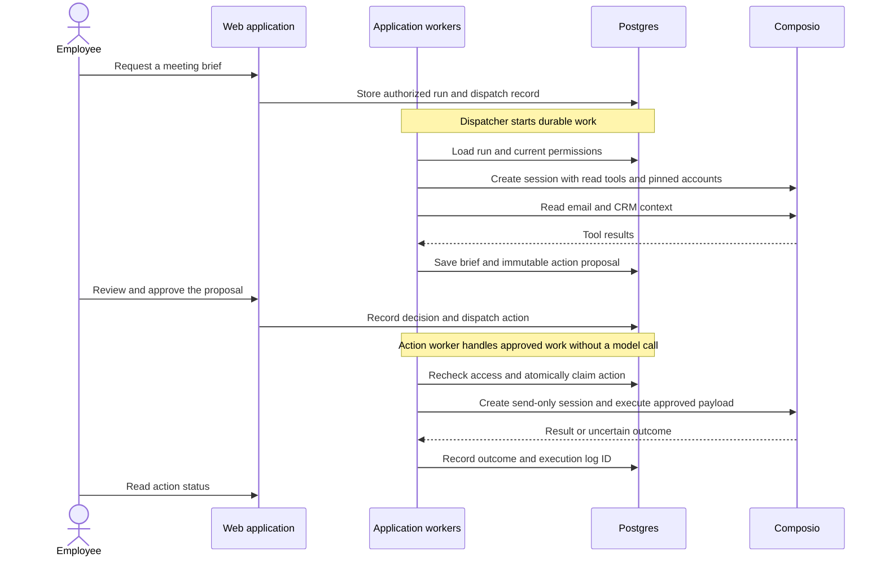

A B2B agent acts for a person inside a customer organization. Your application establishes that identity, decides which connections the agent can use, and records the work. Composio handles authentication to connected apps and tool execution.

This architecture describes a workplace assistant embedded in your SaaS product. An employee asks:

> Prepare me for tomorrow's meeting with Acme using our CRM and my email. Draft a follow-up for me to review.

The assistant reads the organization's shared HubSpot connection and the employee's private Gmail connection. It saves a brief and a proposed email in your application. Sending the email requires the employee's approval. A schedule can prepare the same brief without an open browser.

<Callout title="Architecture first">
This page describes a proposed application design. The runnable companion project is planned and is not available yet. Shared connections use an experimental Composio API.
</Callout>

## Application architecture

The web application and the background worker use the same identity checks, connection selection, and execution policy. The browser submits work and displays progress. The worker runs the agent and persists its results.

The request follows these boundaries:

1. Your API verifies the signed-in person and their membership in the active customer organization.
2. Your database stores a run and a pending dispatch record in one transaction. A dispatcher submits the job and retries delivery if needed.
3. The worker loads the run by ID, rechecks access, and creates a Composio session with explicit connections and allowed tools.
4. The agent reads app data through that session and saves the brief and proposed email. Your application stores the conversation and results.
5. After approval, an action worker rechecks access and sends the exact approved email through a separate, restricted session.

Composio [sessions](/docs/how-composio-works) provide integration context, including account selection and tool access. Your application owns customer membership, conversation history, approval records, scheduling, and run recovery.

### A concrete stack

The proposed companion uses TypeScript throughout. The choices below make the design implementable without requiring the same vendors in your product.

| Responsibility | Proposed component | Reason for the choice |
|---|---|---|
| Web interface and API | Next.js | One application for chat, connection settings, approvals, and server endpoints |
| Sign-in and organizations | [Clerk Organizations](https://clerk.com/docs/guides/organizations/overview) | An identity provider with organization membership |
| Application state | Postgres | Transactions and constraints for tenant-scoped records and action status |
| Model calls and tool schemas | [Vercel AI SDK](https://ai-sdk.dev/docs/ai-sdk-core/tools-and-tool-calling) | A TypeScript interface to model providers, with application-owned tool execution |
| Background execution | [Inngest](https://www.inngest.com/docs/learn/inngest-steps) | Checkpointed work and schedules outside the browser request |
| App connections and tools | Composio TypeScript SDK | Per-user sessions, shared connections, OAuth, and authenticated execution |

Next.js serves the application endpoints, including worker handlers. Inngest coordinates background execution. Postgres holds the business records that your application queries and authorizes. Inngest's execution history supports job recovery; it does not replace those records.

An existing identity provider, queue, or agent framework can fill the same role. The design depends on the responsibilities and persisted state, rather than a particular hosting provider.

## Customer identity and connection ownership

A customer organization is a tenant in your application. A person can belong to several tenants. Each membership has its own stable Composio `userId`, stored in your database.

For example, Alice's membership in Northwind maps to `member_northwind_alice`. Her membership in another customer organization maps to a different ID. The illustrative IDs below stand for opaque database identifiers in the implementation.

Your backend resolves this mapping from the authenticated request and active membership. Browser input and model output cannot choose the acting `userId` or supply an arbitrary connected account ID. Every lookup of a conversation, run, connection, or approval includes its tenant and permitted membership.

This design gives a person separate connections in each customer organization. That requires separate onboarding when they use the product in more than one organization. It avoids implicitly sharing personal data across those organizations.

### Personal connections

An employee connects Gmail from the application's connection settings. Your backend starts the [Connect Link flow](/docs/authentication/manually-authenticating) for that membership's Composio user ID.

The pending connection record binds the flow to the tenant, membership, and expected toolkit. The backend confirms the account's status and ownership with Composio before storing the selected account ID. A browser redirect alone does not prove a successful connection.

Each run pins that selected account. A newly connected Gmail account does not silently replace the account used by an existing schedule.

### Organization connections

A customer administrator connects HubSpot under a stable organization connection identity. That identity is a Composio user ID controlled by your backend, separate from an employee's membership.

The backend creates a [shared connection](/docs/extending-sessions/shared-connections) and grants access to specific membership user IDs. Each run explicitly pins the shared connection. The application checks membership and permissions before using it, even when the shared connection's ACL permits access.

The shared account grants the provider permissions of the connected CRM account. It does not reproduce each employee's CRM permissions. This design assumes that authorized members may read the CRM data available to that shared connection. A product with per-record CRM permissions needs additional resource authorization or personal CRM connections.

<Callout title="Shared connection limits">
Shared connections are experimental. Each allow or deny list supports up to 1,000 user IDs, and a session can pin at most one shared connection per toolkit. This design uses explicit grants rather than `allowAllUsers`, which would not represent your application's tenant boundary.
</Callout>

## Session policy and agent execution

The assistant's capabilities are defined by an application policy. For this task, the agent can read selected email and CRM records and produce a local draft. It cannot send email during the reasoning loop.

The worker creates a session with `composio.sessions.create()` and stores the session ID on the run. Its configuration specifies:

- The membership's `userId` and explicit `connectedAccounts` for Gmail and HubSpot.
- An exact allowlist of the read tools needed for the brief.
- `SessionPreset.DIRECT_TOOLS`, so the model sees the selected app tools directly.
- `manageConnections: false`, because connection onboarding happens in the application.
- `sandbox: { enable: false }`, because this task needs no generated code execution.

The worker validates each requested tool and its arguments before calling `session.execute()`. It passes tool results back to the model within configured limits on steps, output size, elapsed time, and model usage. Those limits are application controls.

This assistant can grow to handle more tasks, but its first workflow has a small tool set. A broader assistant can use [dynamic tool discovery](/docs/how-composio-works#meta-tools). That change also requires reviewing approval enforcement for nested tool calls, batch execution, and sandbox access.

### Session lifetime

A run owns its session. The worker resumes it with `composio.sessions.use()` after a retry. A new run gets a new session, including each scheduled occurrence. Multiple runs may belong to the same conversation.

The application stores conversation history separately and selects the context for each run. It rechecks current permissions before resumed work. If the policy or selected connections changed, it invalidates the pending work and creates a new session under the new configuration.

This keeps a run's tool context separate from later tasks while allowing recovery within that run. Composio sessions persist, so application cleanup includes deleting sessions when their runs no longer need them.

## Approval and external actions

Session policy and approval solve different problems. Session configuration defines available tools and connections. Your application records a person's authorization for a particular action.

The proposed email stays in Postgres. The approval record identifies the tenant, requesting membership, connected account, tool, exact arguments, policy version, and expiry. The review UI displays the sending account, recipients, subject, and body.

Editing the proposal invalidates its approval. The action worker loads the approved payload from the database, rechecks membership and connection access, and atomically claims the action. It creates a separate session that permits only the required send tool. No model rewrites the approved email.

Rejection or expiry ends the action without sending. A duplicate approval request cannot claim the same action again. The reference design lets the requesting employee approve a send from their own mailbox.

Local `beforeExecute` hooks can help instrument an execution path. They do not cover every SDK or hosted MCP path. In this design, the model receives no send tool, proxy tool, or code execution tool. The application routes every external write through the approved action worker.

## Scheduled work and recovery

A schedule stores the tenant, acting membership, task, selected connections, and timezone. Each occurrence creates a run with a unique schedule-and-occurrence key. It uses the same worker as an interactive request.

The worker reloads current membership and permissions when it starts. If a connection needs authentication, the run enters `needs_connection` and the application asks the employee to reconnect. Background work never waits for an interactive OAuth flow inside the model loop.

Approval also lives in persisted application state. The agent worker finishes after saving the proposal. Approval starts a separate action job, so an open browser or an in-memory promise is unnecessary.

The run and its pending dispatch record are committed together. A dispatcher retries undelivered records, and workers deduplicate by run or action ID. This closes the gap between saving work and submitting a job.

### Retry behavior

Read failures can use bounded retries for transient errors and rate limits. Authentication failures require reconnection. Invalid arguments require correction.

An external write needs different treatment. A provider may accept an email just before a timeout or worker crash. A persisted action claim prevents another worker from sending it immediately, but cannot prove whether the provider accepted it.

An interrupted send enters `outcome_unknown`. The worker does not automatically resend it. Recovery checks the provider's result where possible and otherwise requires review. A provider-supported idempotency key can improve this path when the specific tool exposes one. Durable execution alone does not guarantee exactly-once external effects.

Event-triggered work can later enter the same run path. A [Composio webhook handler](/docs/setting-up-triggers/subscribing-to-events) verifies the raw signed payload, resolves its connection to a tenant, and persists it before acknowledging delivery. It also deduplicates events. The initial companion only needs interactive requests and schedules.

## State, access, and operations

Postgres stores tenant-scoped memberships, connection references, conversations, runs, schedules, proposals, approvals, and execution attempts. Tenant-aware foreign keys and uniqueness constraints prevent records from linking across customers. The application also checks access on every read, mutation, and worker entry point.

Composio stores connected-account credentials. Your application stores connection IDs and keeps its Composio API key server-side. It treats session IDs and MCP URLs as sensitive and never gives them to the browser or model as credentials.

Email and CRM content remain untrusted input. The worker passes retrieved content as tool results, not application instructions. Deterministic tool restrictions and the separate approval path limit what the model can execute.

When a membership is removed, the application blocks new work, disables its schedules, and cancels pending approvals. It revokes shared-account grants and deletes affected sessions. Workers recheck access before subsequent calls. A request already accepted by an external provider cannot be recalled by deleting a session.

Each run records the tenant, membership, session ID, policy version, model usage, and tool outcomes. Each external action also records its proposal, approver, attempts, and Composio execution log ID when available. Operational logs omit email bodies and OAuth links. Access to stored briefs and drafts follows the same membership checks as the originating conversation.

Separate Composio projects keep development and production connections apart. Application configuration sets per-tenant concurrency and run budgets. Failed dispatches, overdue jobs, reconnect requests, and unknown write outcomes are visible to operators. Application records, job history, and [Composio logs](/docs/poc-to-prod/stream-logs-to-a-siem) each need a defined retention policy.

## Adapting the design

The first implementation has one agent, one shared CRM connection per customer, and one selected Gmail connection per membership. It has no vector database, multi-agent coordinator, or generated-code sandbox. The meeting brief reads current app data directly.

Your product can use another agent framework or job runner while preserving the same identity mapping, account selection, and approval records. Per-customer infrastructure, finer CRM permissions, or larger shared-account ACLs require a separate isolation and access design.

The next step is a companion implementation that proves the request, schedule, and approval paths. Until that project exists, the diagrams describe the intended design rather than a tested deployment.

<Cards>
  <Card title="Configuring sessions" href="/docs/configuring-sessions" description="Tool policies, direct tools, account selection, and sandbox configuration." />
  <Card title="Shared connections" href="/docs/extending-sessions/shared-connections" description="Experimental shared accounts, explicit pins, and access rules." />
  <Card title="General agent with Pi" href="/examples/general-agent-with-pi" description="An existing runnable example with per-user sessions and a shared workspace connection." />
</Cards>
