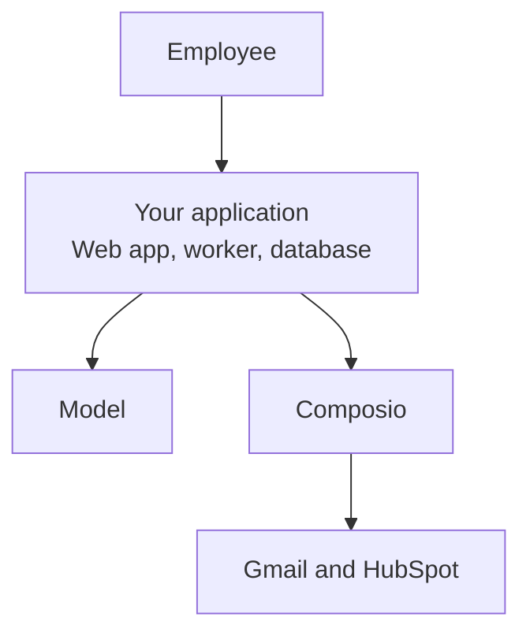
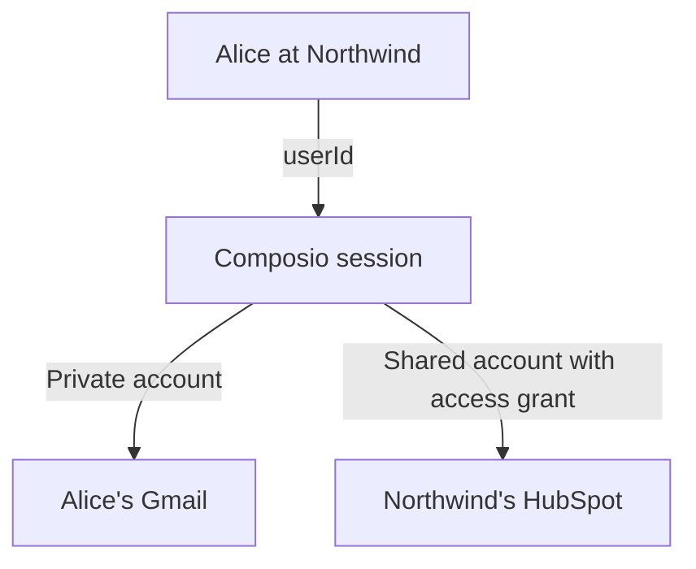
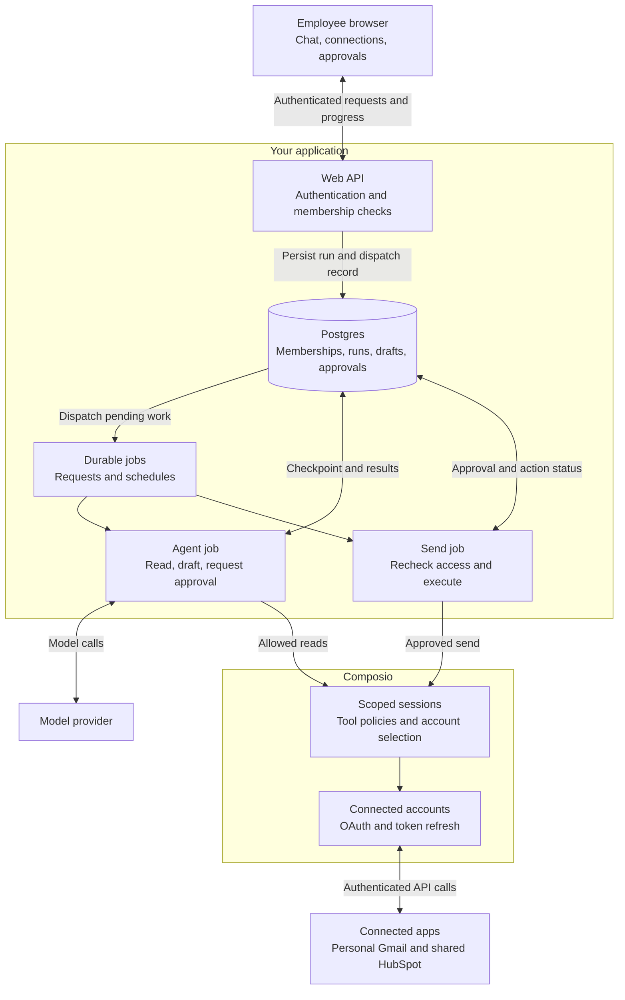
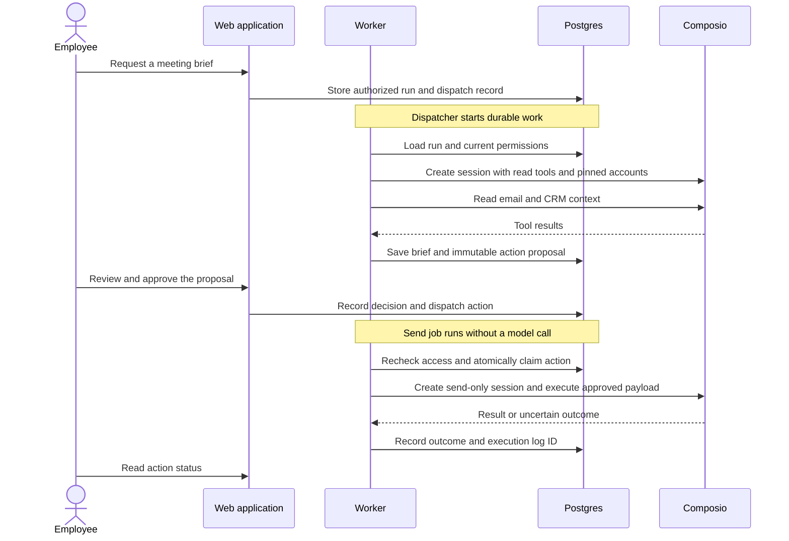

Your customers want an assistant that can work across their apps. This architecture shows how to add one to your SaaS product, using a meeting brief as the example:

> Prepare me for tomorrow's meeting with Acme using our CRM and my email. Draft a follow-up for me to review.

The assistant reads shared HubSpot data and the employee's private Gmail, then saves a brief and an email draft. The employee approves the email before it is sent. A schedule can prepare the same brief each morning.

<Callout title="Proposed architecture">
The companion app is planned but not built yet. Shared connections use an experimental Composio API.
</Callout>

## The application

Start with one web app, one worker, and a database. The worker runs the agent outside the browser request, so closing the page doesn't stop the task.

Your application checks who is asking, selects their connections, and saves the work. The model chooses from the tools you allow. Composio manages authentication to connected apps and executes tool calls.

Chat requests and schedules start the same worker. Sending an approved email is a separate job in that worker, with no model call. These jobs can share one deployment.

The proposed stack gives each component a concrete implementation:

| Component | Choice | Responsibility |
|---|---|---|
| Web app | Next.js | Chat, connection settings, approvals, and API endpoints |
| Sign-in | [Clerk Organizations](https://clerk.com/docs/guides/organizations/overview) | User identity and customer membership |
| Database | Postgres | Conversations, runs, drafts, and approvals |
| Agent | [Vercel AI SDK](https://ai-sdk.dev/docs/ai-sdk-core/tools-and-tool-calling) | Model calls and tool schemas |
| Background jobs | [Inngest](https://www.inngest.com/docs/learn/inngest-steps) | Schedules and resumable work |
| App integrations | Composio | Connections, tool access, and execution |

You can substitute your existing stack. The meeting brief needs one agent reading current app data. It needs no vector database or code execution sandbox.

## Users and connections

Each customer organization is a tenant. Your database maps each person's membership in that tenant to a stable Composio `userId`.

Alice might belong to both Northwind and Contoso. This design gives her a different Composio user ID in each, with separate connections. Your backend resolves the ID after checking her membership. The browser and model cannot choose it.

For a run at Northwind, the application selects two accounts:

Alice connects Gmail from the application's settings through a [Connect Link](/docs/authentication/manually-authenticating). The backend verifies the completed connection before saving its account ID against her membership.

An administrator connects HubSpot under a stable, backend-controlled Composio user ID for Northwind. The application creates a [shared connection](/docs/extending-sessions/shared-connections) and grants access to specific membership user IDs. It checks current membership before each use and pins the account explicitly into the session.

That shared connection uses the connected CRM account's permissions. If employees need different access to CRM records, use personal connections or add record-level authorization. The shared account alone does not enforce those differences.

Shared connections have [ACL and session limits](/docs/extending-sessions/shared-connections#using-a-shared-connection). This design uses explicit grants. `allowAllUsers` does not represent a customer boundary.

## A session for each run

The worker creates a [session](/docs/configuring-sessions) for the run's user and selected accounts. For the meeting brief, its configuration has:

- Explicit `connectedAccounts` for Gmail and HubSpot.
- An allowlist of read tools, exposed through `SessionPreset.DIRECT_TOOLS`.
- `manageConnections: false`, because employees connect apps in settings.
- `sandbox: { enable: false }`, because the task needs no code execution.

The model can request those read tools. Your worker validates each call before `session.execute()`, then passes the result back to the model. It saves the brief and email draft in Postgres. The draft stays inside your application until approval.

A new task gets a new session through `composio.sessions.create()`. A retried run restores its saved session with `composio.sessions.use()`. Conversation history lives in your database and can span several runs.

The worker checks permissions again when work resumes. Changed permissions or accounts invalidate pending work. The application deletes sessions when finished runs no longer need them.

## Approval before sending

Session configuration limits tool access. Your application records approval for a specific email. The agent's read session has no send tool, proxy tool, or sandbox that could bypass that approval.

The send path is short:

1. The application shows the sender, recipients, subject, and body to the requesting employee.
2. The employee approves that exact version. Editing it requires a new approval.
3. A send job checks current access and approval expiry, then claims the action in the database so another job cannot send it too.
4. The job uses a separate send-only session to execute the saved email and records the result.

No model rewrites the email after approval. Rejection or expiry ends the action without sending. Approval lives in the database, so the employee can close the browser and return later.

This check belongs on the execution path. A local `beforeExecute` hook does not cover every SDK or hosted MCP call.

## Scheduled work and failures

A schedule stores the task, acting membership, selected connections, and timezone. Each occurrence starts an ordinary run with current permission checks. It uses the same agent and approval rules as chat.

The application saves pending jobs with their run records and retries delivery to the job service. Workers use run IDs and database constraints to reject duplicate work. If OAuth expires, the run stops and asks the employee to reconnect through the application.

Reads can retry transient failures within a limit. Sending email needs more care: the provider might accept a message just before a timeout. In that case, the action records an unknown outcome and does not automatically resend. Recovery checks the provider or asks for review. A durable job runner cannot guarantee exactly-once delivery to an external app.

## Operating the app

The production responsibilities remain in your application:

- Check tenant and membership access for every conversation, run, connection, and approval. Database relationships also prevent records from linking across tenants.
- Keep the Composio API key, session IDs, and connection credentials out of the browser and model context. Treat email and CRM content as untrusted tool results.
- On membership removal, stop new work, disable schedules, cancel approvals, revoke shared grants, and delete affected sessions. Calls already accepted by a provider cannot be recalled.
- Bound each run's steps, runtime, and model usage. Limit concurrent work per customer.
- Record the acting user, session, approval, and tool outcome. Keep email bodies and OAuth links out of operational logs, and set retention for stored drafts and job history.

Use separate Composio projects for development and production. [Composio execution logs](/docs/poc-to-prod/stream-logs-to-a-siem) help trace tool calls alongside your application's run records.

## Detailed flows

These diagrams expand the overview above for implementation.

### Components and stored state

Postgres holds the run, draft, and approval records. Pending dispatch records keep work recoverable if the job service is unavailable. The agent and send jobs are separate handlers in the same worker deployment.

### Request and approval sequence

The agent job ends after saving its proposal. Approval starts the send job, which rechecks access and executes the saved email. An uncertain send result is recorded for review rather than automatically retried.

<Cards>
  <Card title="Configuring sessions" href="/docs/configuring-sessions" description="Tool access, account selection, and sandbox settings." />
  <Card title="Shared connections" href="/docs/extending-sessions/shared-connections" description="Shared accounts, access rules, and current limits." />
  <Card title="General agent with Pi" href="/examples/general-agent-with-pi" description="A runnable example with per-user sessions and a shared connection." />
</Cards>
