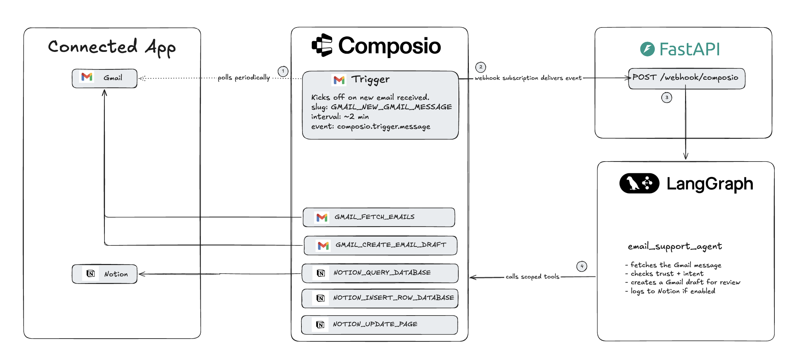
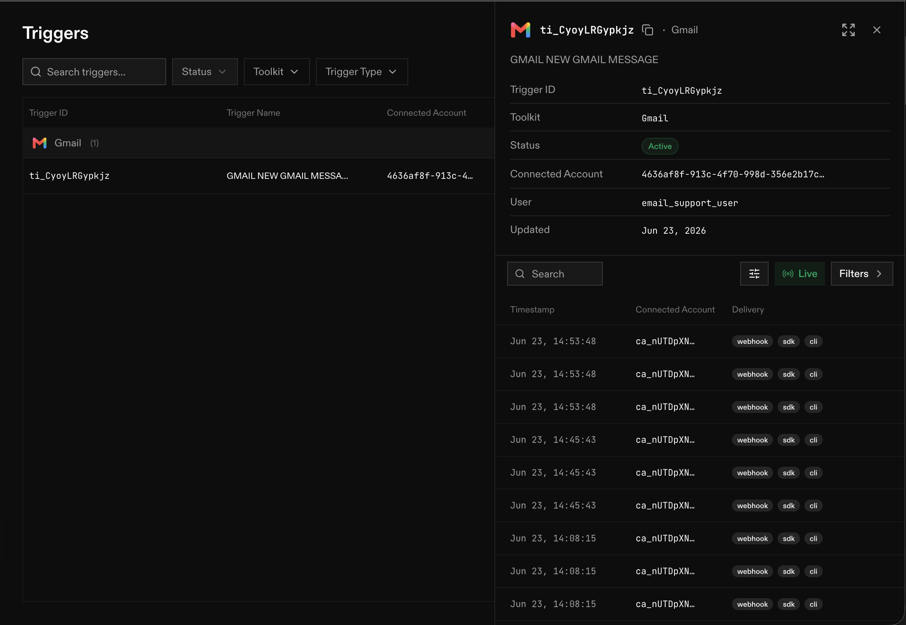
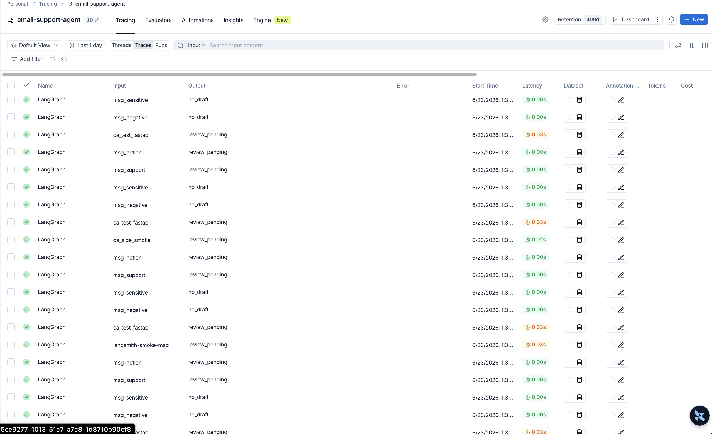

# Email Support Agent with Composio, Gmail, LangGraph, and Notion

Build an email support agent that drafts replies from a connected Gmail inbox.

When a new email arrives, Composio notifies this app, the LangGraph workflow checks the message against your support rules, and Gmail gets a draft reply for a human to review. The agent never sends email.

The part you personalize is [workflows/support_email.md](workflows/support_email.md). Add your company context, support policy, FAQ, escalation rules, and draft examples there before using this with a real inbox.



## What You Need

Required:

1. [Python 3.11+](https://www.python.org/downloads/)
2. [uv](https://docs.astral.sh/uv/)
3. [Composio API key](https://dashboard.composio.dev/)
4. [OpenAI API key](https://platform.openai.com/)
5. A Gmail account you can connect through Composio
6. [ngrok](https://ngrok.com/) for a public local webhook URL

Optional:

- A LangSmith account and API key, if you want LangGraph traces while dogfooding. See the [LangSmith tracing quickstart](https://docs.langchain.com/langsmith/observability-quickstart).

This example uses the Composio Python SDK. It does not use the Composio CLI.

## Run Locally

### 1. Install dependencies

```bash
uv sync
```

### 2. Create your local environment file

```bash
cp .env.example .env
```

Set these values in `.env`:

```text
COMPOSIO_API_KEY=
OPENAI_API_KEY=
COMPOSIO_USER_ID=email_support_user
```

`COMPOSIO_USER_ID` is the stable demo user. Composio uses it to scope the connected Gmail account and all tool calls.

Optional, for LangSmith traces while dogfooding:

```text
LANGSMITH_API_KEY=
LANGSMITH_PROJECT=email-support-agent
```

### 3. Start the app

```bash
uv run --env-file .env uvicorn email_support_agent.app:app --reload --port 8000
```

Leave this running.

### 4. Expose the local webhook endpoint

In another terminal:

```bash
ngrok http 8000
```

Copy the HTTPS URL and add `/webhook/composio` to it:

```text
https://YOUR-NGROK.ngrok-free.app/webhook/composio
```

### 5. Set up Composio

In a third terminal:

```bash
uv run --env-file .env python scripts/setup_composio.py \
  https://YOUR-NGROK.ngrok-free.app/webhook/composio
```

The setup script will:

- create or reuse the Gmail connection for `COMPOSIO_USER_ID`
- print a Gmail Connect Link
- wait while you finish Gmail OAuth in the browser
- create the Composio webhook subscription
- save `COMPOSIO_WEBHOOK_SECRET` to `.env`
- create the `GMAIL_NEW_GMAIL_MESSAGE` trigger
- save `COMPOSIO_GMAIL_TRIGGER_ID` to `.env`
- create or reuse the Notion connection for `COMPOSIO_USER_ID`
- create an `Email Support Agent` Notion page
- create an `Email Support Inbox` Notion database under that page
- insert a smoke-test row
- save `NOTION_PAGE_ID`, `NOTION_DATABASE_ID`, and `NOTION_LOG_ROWS=true` to `.env`

The script opens Gmail and Notion Connect Links automatically when either toolkit still needs authorization.

Add `--setup-langsmith` if you also want setup to create or reuse the LangSmith project and enable tracing in `.env`:

```bash
uv run --env-file .env python scripts/setup_composio.py \
  https://YOUR-NGROK.ngrok-free.app/webhook/composio \
  --setup-langsmith
```

Use `--langsmith-project your-project-name` if you want a different trace project name.

After setup, the Composio Triggers page should show an active Gmail trigger and recent webhook deliveries:



### 6. Try it

Send an email to the connected Gmail inbox. Composio delivers the trigger event to the FastAPI webhook, LangGraph runs the support workflow, and Gmail gets a draft reply for review.

Gmail triggers are polling-based. With Composio-managed auth, expect delivery to take up to 15 minutes.

## Personalize The Support Rules

Open [workflows/support_email.md](workflows/support_email.md) and replace the example company details with your own:

- what your product does
- what the agent is allowed to answer
- what must be escalated to a human
- approved troubleshooting steps
- FAQ answers
- examples of good drafts and no-draft decisions

The LLM draft step treats that Markdown file as the source of truth. If the workflow file does not contain the answer, the agent should ask for safe diagnostic details or avoid drafting.

## What To Understand About Composio

- **User ID**: your app's stable identifier for a connected user. This example uses `email_support_user`.
- **Toolkit**: an app integration, such as `gmail` or `notion`.
- **Connected account**: the authenticated Gmail or Notion account attached to a user ID.
- **Session**: the scoped Composio object the agent uses to access tools for one user.
- **Tool**: a concrete action, such as `GMAIL_FETCH_EMAILS` or `GMAIL_CREATE_EMAIL_DRAFT`.
- **Trigger**: the event source. Here it is `GMAIL_NEW_GMAIL_MESSAGE`.
- **Webhook subscription**: the public URL where Composio sends trigger events.
- **Webhook secret**: the secret used to verify that incoming events came from Composio.

Composio has two separate setup pieces:

- the **webhook subscription** is project-level and tells Composio where to POST events
- the **Gmail trigger** is user-level and watches one connected Gmail account for new messages

That is why the setup script creates both.

The setup script uses Composio's Webhook Subscriptions API to create the project-level webhook URL:

```http
POST https://backend.composio.dev/api/v3.1/webhook_subscriptions
```

Useful Composio docs:

- [Create webhook subscription](https://docs.composio.dev/reference/api-reference/webhook-subscriptions/postWebhookSubscriptions)
- [Subscribing to events](https://docs.composio.dev/docs/setting-up-triggers/subscribing-to-events)
- [Verifying webhooks](https://docs.composio.dev/docs/webhook-verification)
- [Triggers](https://docs.composio.dev/docs/triggers)

## Where The Composio Code Is

- `scripts/setup_composio.py`: connects Gmail and Notion, creates the webhook subscription, creates the Gmail trigger, creates the Notion logging database, and optionally enables LangSmith tracing.
- `email_support_agent/webhook.py`: verifies Composio webhook signatures and routes trigger events.
- `email_support_agent/utils/tools.py`: creates scoped Composio Gmail and Notion sessions.
- `email_support_agent/utils/gmail.py`: fetches the triggering Gmail message and creates draft replies.
- `email_support_agent/utils/notion.py`: optionally claims, writes, and updates Notion tracking rows.

The Gmail session is intentionally scoped:

```python
SAFE_GMAIL_TOOLS = [
    "GMAIL_FETCH_EMAILS",
    "GMAIL_CREATE_EMAIL_DRAFT",
]
```

`GMAIL_SEND_EMAIL` is not enabled.

By default, sessions expose [meta tools](https://docs.composio.dev/reference/meta-tools) that let an agent discover app tools at runtime. This example does not expose those discovery tools because the agent already knows the exact Gmail and Notion tools it is allowed to use.

Instead, `email_support_agent/utils/tools.py` passes `preload={"tools": ...}` so `session.tools()` returns the small allowed set directly. Preloading is useful for frequently used tools because the agent can call them without searching first, but keep the list small, generally fewer than 20 tools, to avoid context bloat. See [Configuring Sessions: Preloading tools](https://docs.composio.dev/docs/configuring-sessions#preloading-tools).

## Where LangGraph Is

- `email_support_agent/agent.py`: graph construction and exported `graph`.
- `email_support_agent/utils/nodes.py`: core graph nodes for trust checks, intent classification, and orchestration.
- `email_support_agent/utils/state.py`: graph state and webhook payload normalization.
- `email_support_agent/utils/drafting.py`: draft generation.

`langgraph.json` exposes the compiled graph:

```json
{
  "dependencies": ["."],
  "graphs": {
    "email_support_agent": "./email_support_agent/agent.py:graph"
  },
  "env": ".env"
}
```

## Notion Logging

The setup script creates the page/database and turns Notion logging on for the full demo.

Turn it off after setup if you want a Gmail-only run:

```text
NOTION_LOG_ROWS=false
```

Enable it after connecting Notion in Composio and creating a database, or let `scripts/setup_composio.py` create one:

```text
NOTION_LOG_ROWS=true
NOTION_DATABASE_ID=your_notion_database_id
```

Expected Notion properties:

```text
Date
Company
Priority
From
Draft Link
Why?
Message ID
```

Notion rows are used for tracking and duplicate protection. Gmail remains the human review surface.

## Optional LangSmith Tracing

LangSmith is useful for seeing each LangGraph node run, the input email, the draft decision, and any tool/runtime errors.

Keep tracing off while running unit tests:

```text
LANGSMITH_TRACING=false
```

Turn it on when you want live traces:

```text
LANGSMITH_TRACING=true
LANGSMITH_API_KEY=your_langsmith_api_key
LANGSMITH_PROJECT=email-support-agent
```

The setup script can also create or reuse the project for you:

```bash
uv run --env-file .env python scripts/setup_composio.py \
  https://YOUR-NGROK.ngrok-free.app/webhook/composio \
  --setup-langsmith
```

LangSmith tracing is still optional. The flag only runs when you already have `LANGSMITH_API_KEY` in `.env`.

With tracing enabled, LangSmith shows each graph run, input message, decision, and latency:



## Project Shape

```text
email_support_agent/
  __init__.py
  agent.py
  app.py
  webhook.py
  utils/
    __init__.py
    tools.py
    nodes.py
    state.py
    gmail.py
    drafting.py
    notion.py
    workflow.py
scripts/
  setup_composio.py
  delete_webhook_subscription.py
langgraph.json
pyproject.toml
```

This mirrors the LangGraph docs pattern: `agent.py` constructs and exports the compiled `graph`, while helpers live under `utils`.

## Verify

```bash
uv run --env-file .env python -m unittest discover -s tests -p 'test_*.py'
```

The unit tests disable LangSmith tracing at import time, even if your local `.env` has tracing enabled. That keeps test runs from uploading dry-run graph traces.

## Troubleshooting

### I deleted my triggers, but setup still says a webhook subscription exists

That is expected. A Composio **trigger instance** and a Composio **webhook subscription** are different resources.

- A trigger instance watches one connected account for one event type, such as `GMAIL_NEW_GMAIL_MESSAGE` for `email_support_user`.
- A webhook subscription is the project-level URL where Composio delivers signed events, such as `https://YOUR-NGROK.ngrok-free.app/webhook/composio`.
- Multiple triggers can deliver events to the same webhook subscription.
- Deleting triggers does not delete the webhook subscription.

If local setup fails with a webhook subscription limit error, the project probably still has an old webhook subscription, often pointing at a previous ngrok or deployed URL. Either keep using that URL, delete the old subscription, or rerun setup with:

```bash
uv run --env-file .env python scripts/setup_composio.py \
  https://YOUR-NGROK.ngrok-free.app/webhook/composio \
  --replace-webhook
```

Use `--replace-webhook` only when you are sure the old project webhook URL is no longer needed.
