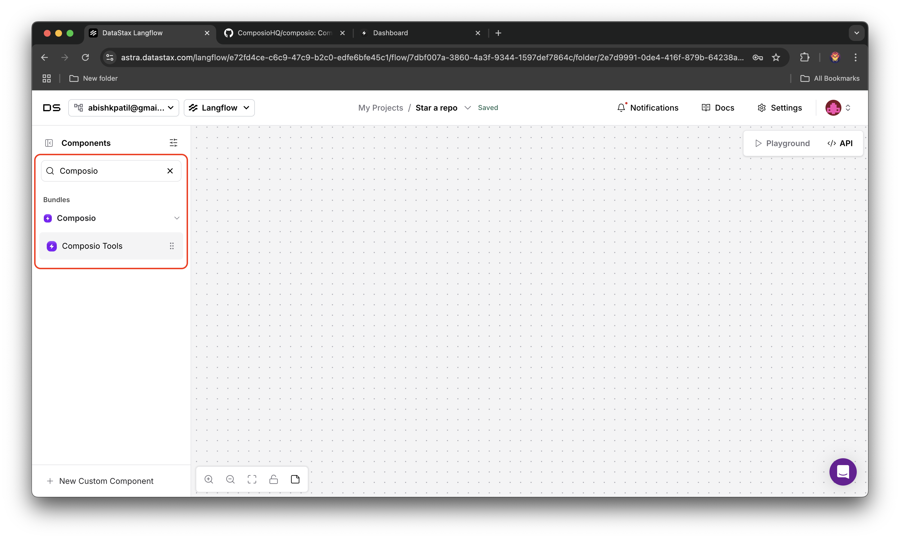
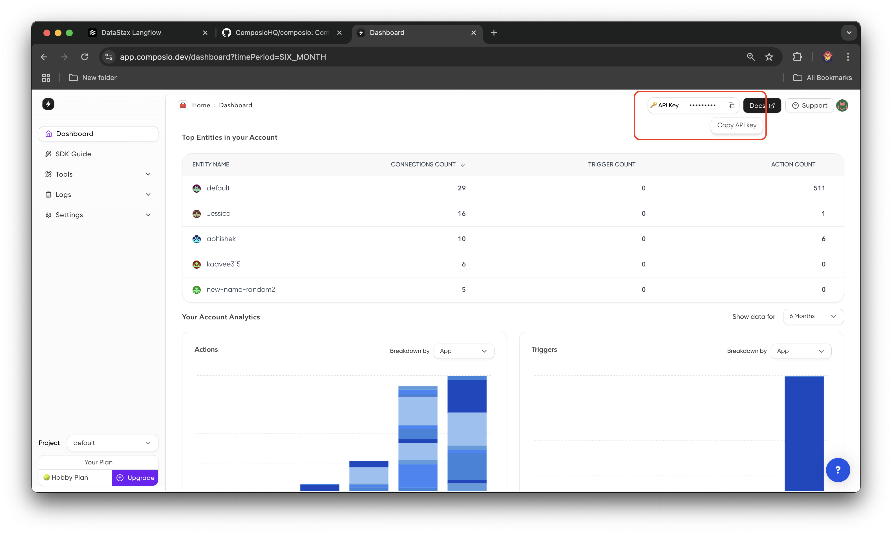
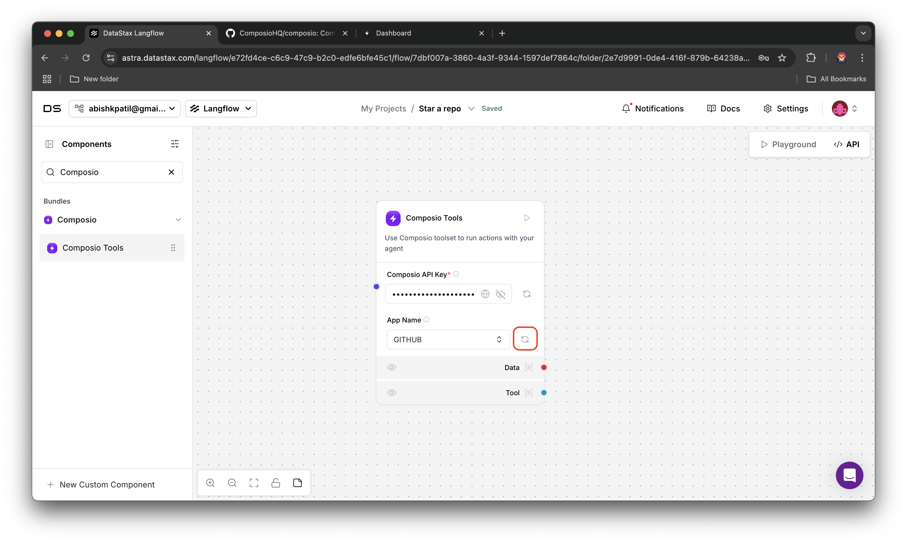
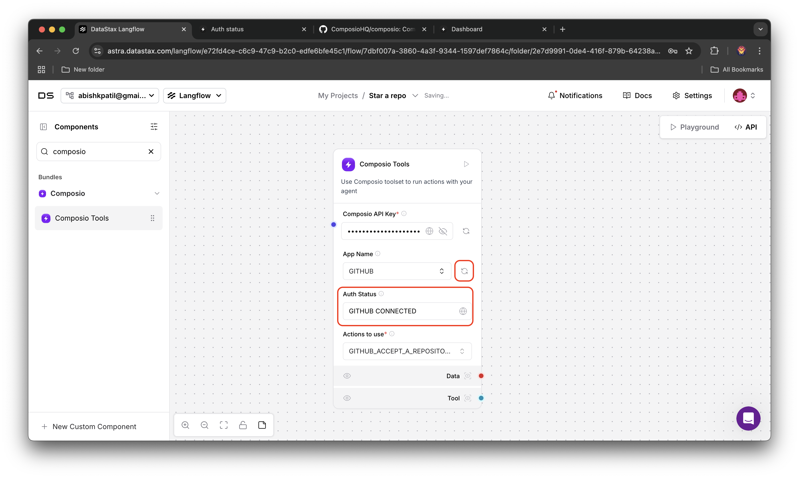
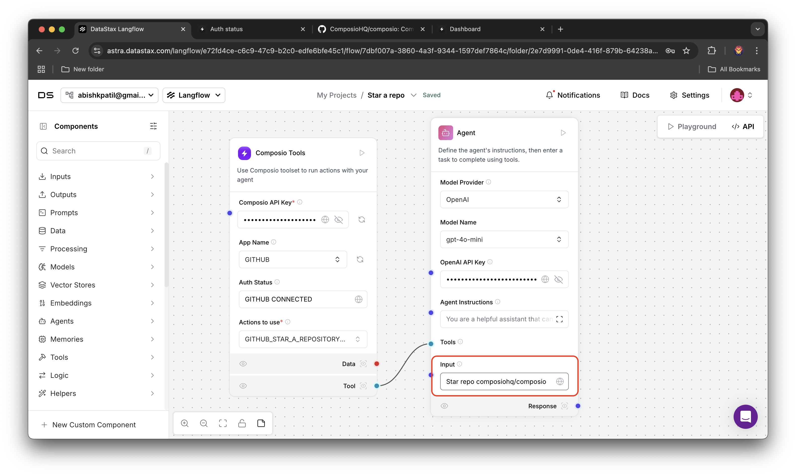
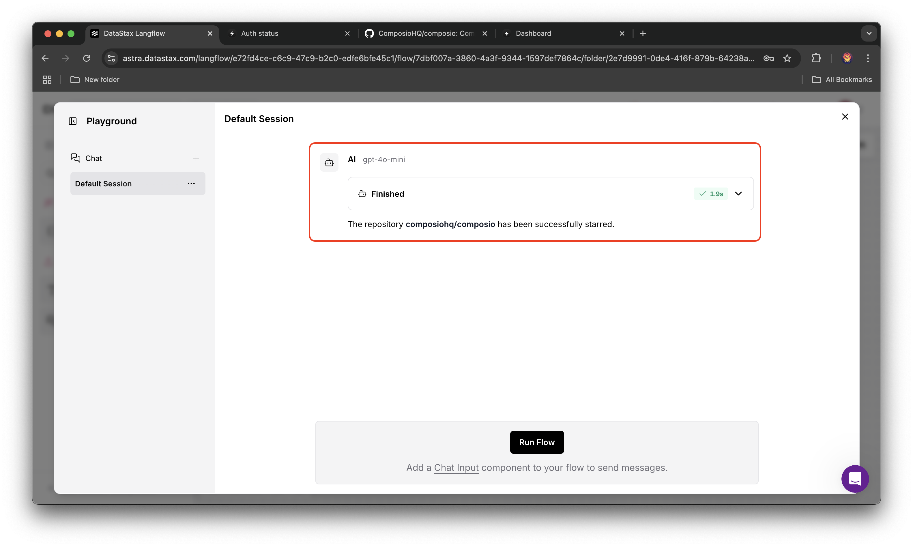

## Star A Repository on Github
In this example, we will use LangFlow to star a repository on Github using Composio Tools

<Steps>
<Step title="Add Composio Component">
Head over to the [LangFlow](https://astra.datastax.com/langflow) website, create a new project, look for Composio component in the component list and add it to your project

</Step>
<Step title="Configure Composio Component">
Go to your [Composio Dashboard](https://app.composio.dev/) and copy your API key, paste it in the API Key field in the Composio component and then search for Github in apps list and select it

</Step>
<Step title="Authenticate with Github">
Click on refresh button, a link to authenticate with Github will be generated (if you don't have connected Github account), click on it and authenticate
<Info>
Most recent connected Github account with entity Id `default` will be considered for executing the action
</Info>

</Step>
<Step title="Verify Connection Status">
After authenticating, click on the refresh button to verify connection status

</Step>
<Step title="Select the Action">
Select the action `GITHUB_STAR_A_REPOSITORY_FOR_THE_AUTHENTICATED_USER` and you're done configuring the Composio component

</Step>
<Step title="Add Agent">
Look for agent in Components list, add it to your project, connect Composio component as tools to the agent then configure the agent (model provider, model name, api key, etc.).

Lastly modify the agent input to **Star the repo composiohq/composio**

</Step>
<Step title="Add Chat Output">
Look for chat output in Components list, add it to your project, connect agent's response to the chat output component. We will use this component to monitor the agent's response

</Step>
<Step title="Run the Agent">
Click on the run button on chat output to run the agent, and open playground to monitor the agent's response

</Step>
<Step title="Agent's Response">
Hurray! You have successfully starred the repository composiohq/composio

</Step>
</Steps>
