## Set up OAuth
There are four steps to connecting your n8n credential to Google services:
1. Create a Google Cloud Project
2. Configure Project
3. Configure your OAuth consent screen APIs
4. Create your Google OAuth Client credentials

## Video Guide
<iframe
  width="560"
  height="315"
  src="https://www.youtube.com/embed/1Jju5nx51Z8?si=uaF_FAEIV02xvg1A"
  title="YouTube video player"
  frameborder="0"
  allow="accelerometer; autoplay; clipboard-write; encrypted-media; gyroscope; picture-in-picture"
  allowfullscreen
></iframe>

## Steps
<Steps>
    <Step title="Create a Google Cloud Project">
        First, create a Google Cloud Console project:
        - Log in to your Google Cloud Console using your Google credentials
        - In the top menu, select the project dropdown in the top navigation and select New project or go directly to the New Project page
        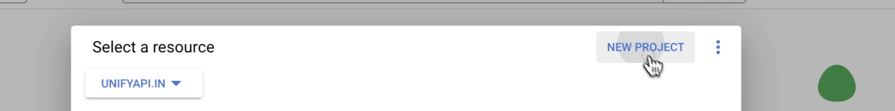
        - Enter a Project name and select the Location for your project
        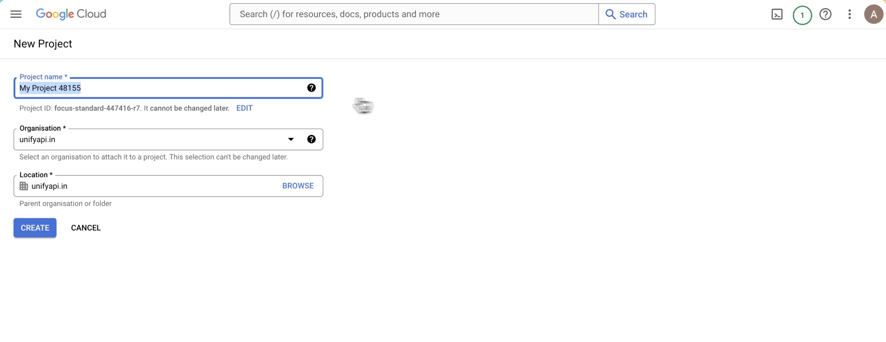
    </Step>
    <Step title="Configure Project">
        Head over to APIs and services section of the project:
        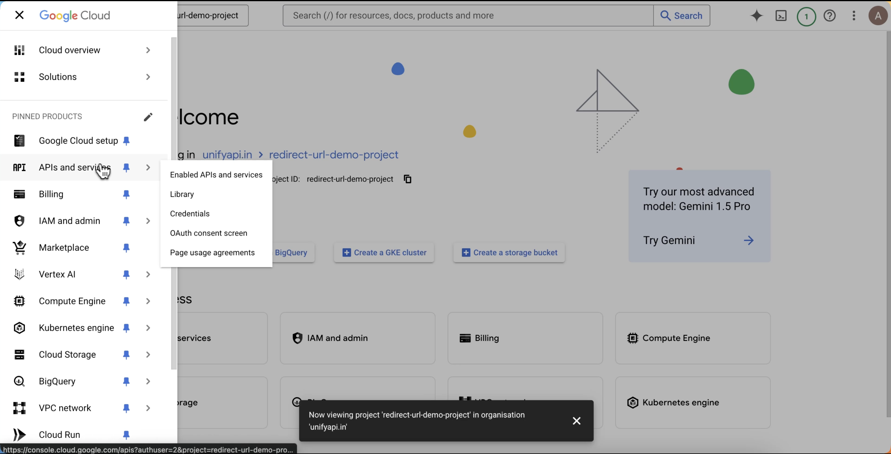
        - Click on overview and configure the project:
        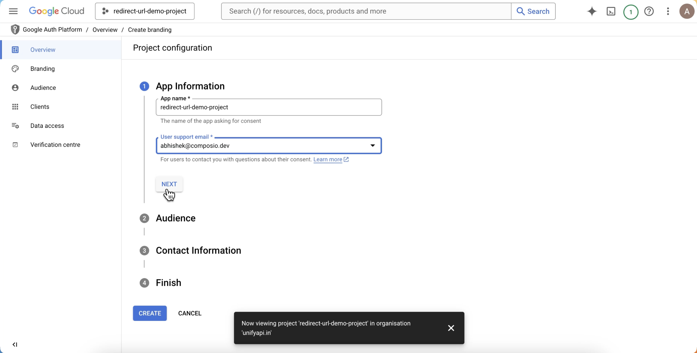
    </Step>
    <Step title="Configure your OAuth consent screen APIs">
        After project configuration, click on Create OAuth client
        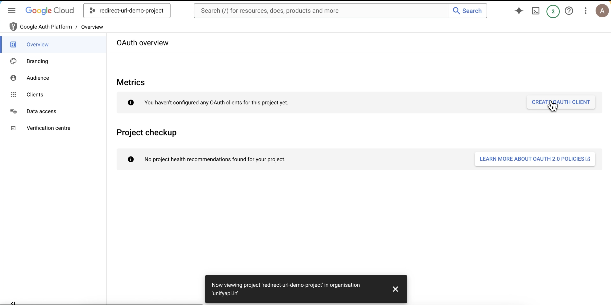
        - Click on configure consent screen
        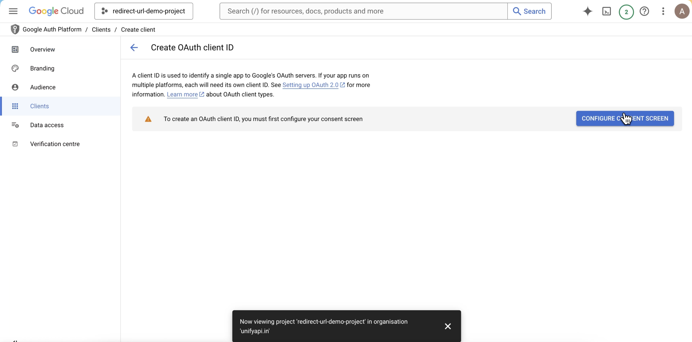
        - Configure the branding
        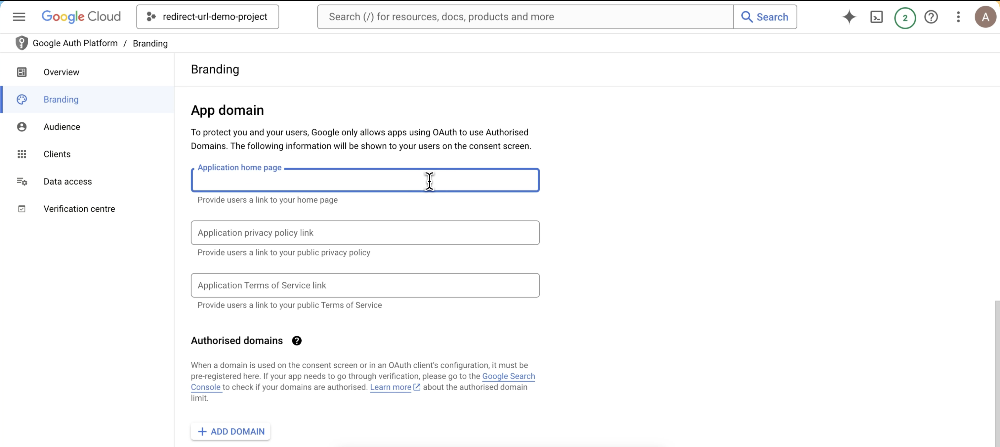
        - then publish the app
        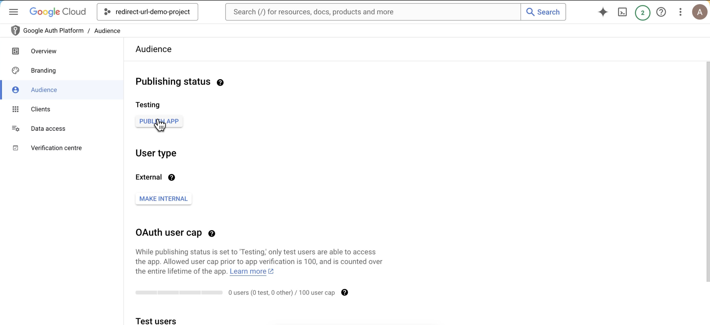
    </Step>
    <Step title="Create your Google OAuth Client credentials">
        Head over to Clients section:
        - Click on Create Client
        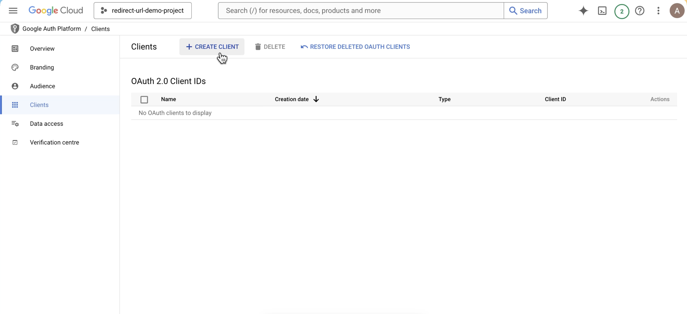
        - Click on Configure Consent Screen
        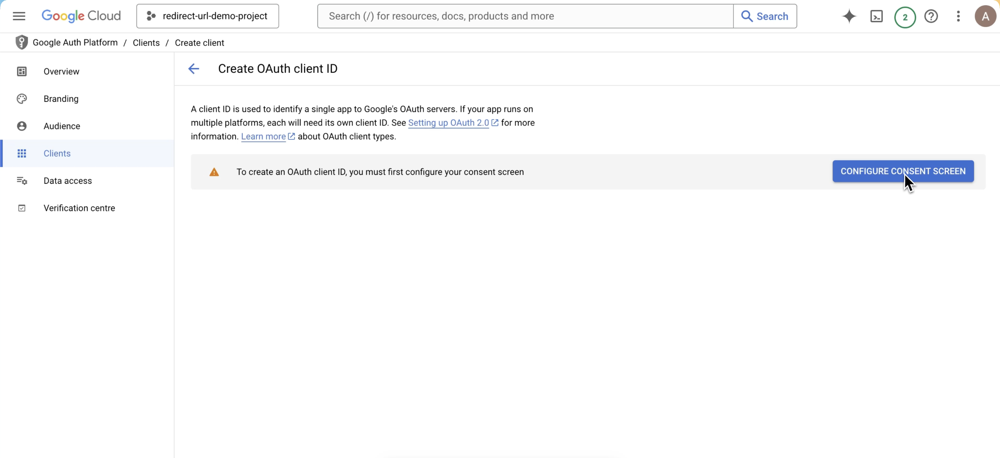
        - Configure the consent screen
        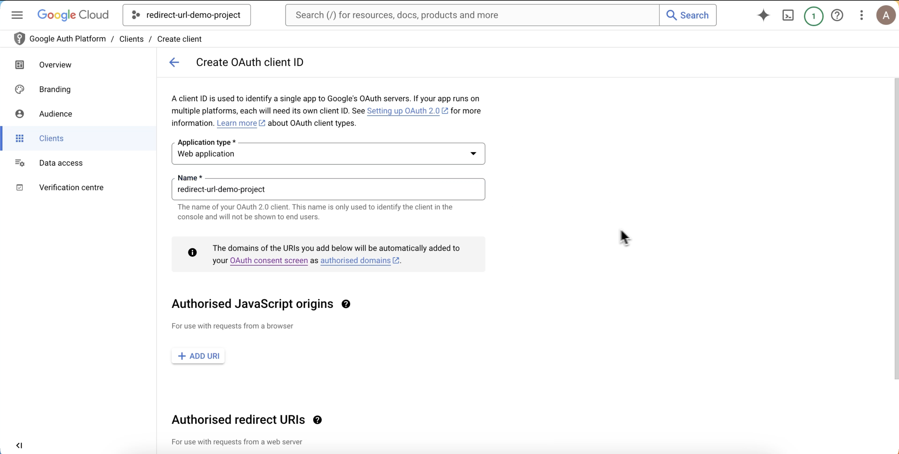
        - And you're done, you've successfully created new Client ID and Client Secret for the project
        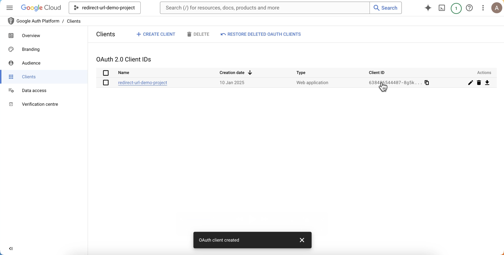
    </Step>
</Steps>
