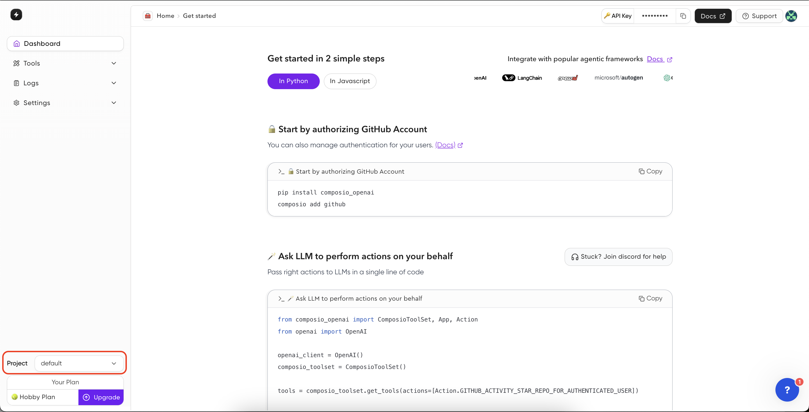
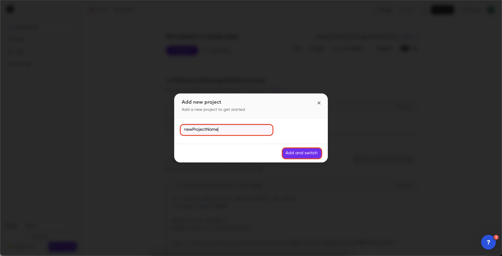
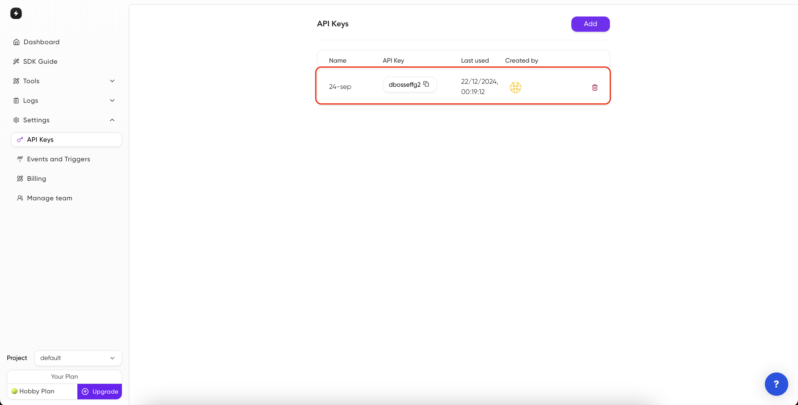
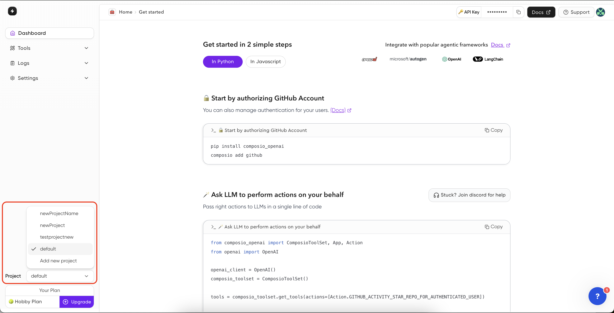
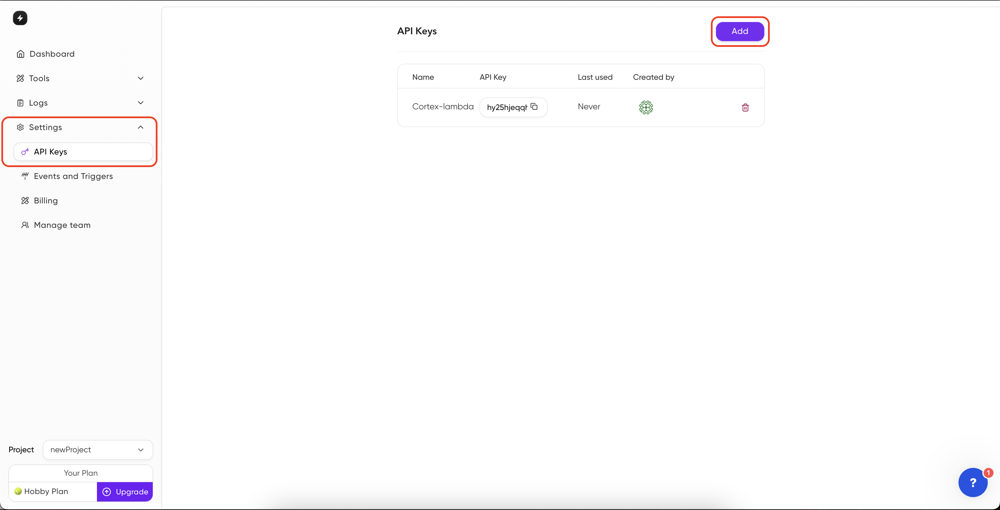
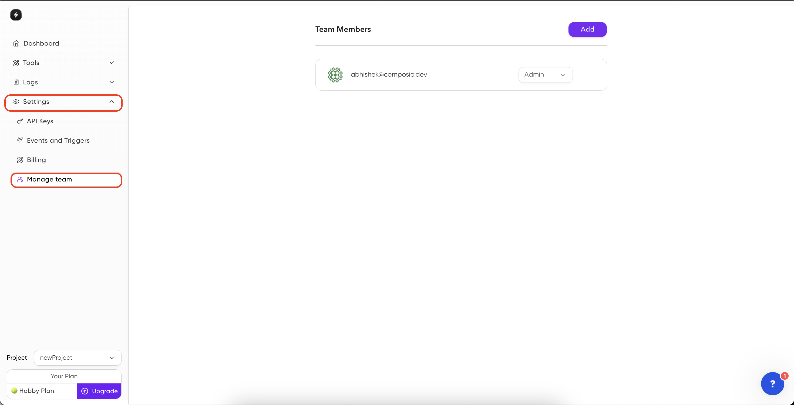
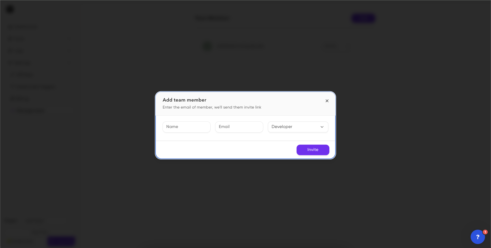
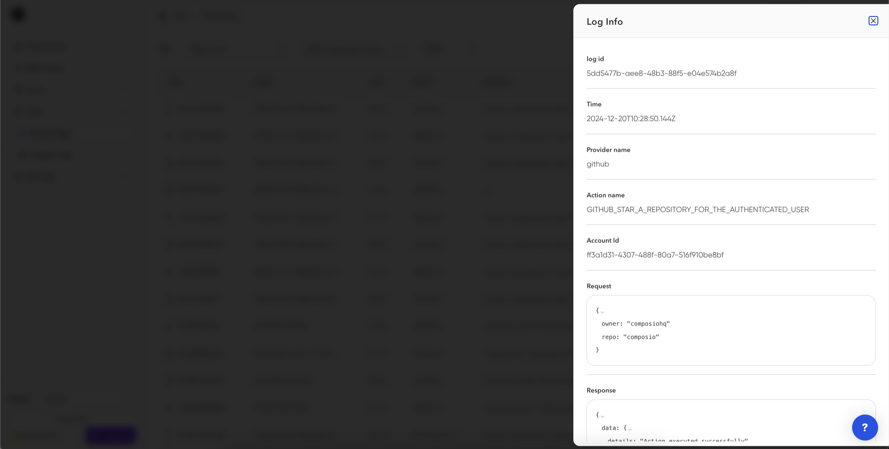

## Overview

Within a single account, you can create and manage multiple independent projects. Each project exists in its own isolated environment, with complete separation of data and resources. Using your master API key, you can programmatically create and manage these projects through our [APIs](https://docs.composio.dev/api-reference/client/get-user-info).

## Project Isolation Architecture

Each project within your account is fully isolated, providing:

- Isolated entity IDs and data storage
- Project-specific admin API keys
- Segregated action execution and trigger logs
- Team management with separate permissions

## How to Create and Delete a Project?

<Tabs>
<Tab title="Dashboard">
<Steps>
<Step title="Head over to Dashboard">
Go to [Dashboard](https://app.composio.dev/dashboard) and click on dropdown corresponding to **Project**

</Step>
<Step title="Click on Add New Project">

</Step>
<Step title="Configure Project">
Enter the project name and click on **Add and switch**.

</Step>
<Step title="Delete a project">
Coming soon
</Step>
</Steps>
</Tab>
<Tab title="API">

<Steps>
<Step title="Get your API key">
Get your API key from [Settings](https://app.composio.dev/settings).

</Step>
<Step title="Create project for different users (team/org/etc)">
Make a POST request to create a new project by passing your API key in the header and the project name in the body. You'll receive a response with name of project, id and project API key.
```python Python
import requests

# Create a new project
response = requests.post(
    'api/v1/client/org/projects/create',
    headers={
        'X-ORG-API-KEY': '<your-org-api-key>',
        'Content-Type': 'application/json'
    },
    json={
        'name': '<new-project-name>'
    }
)

# Response: { name, id, projectAPIKey }
```
</Step>
<Step title="Delete a project">
Make a DELETE request to delete a project by passing your API key in the header and the project id in the body.
```python Python
# Delete a project (irreversible)
response = requests.delete(
    'api/v1/org/projects/project-uuid/delete',
    headers={
        'X-ORG-API-KEY': 'your-org-api-key'
    }
)

# Response: status code (200/401/404) with body and status
```
</Step>
</Steps>
</Tab>
</Tabs>


## How to Manage Projects?

#### Listing and Switching between projects
<Tabs>
<Tab title="Dashboard">
Here's how you can list existing projects and switch between projects. Click on the dropdown corresponding to **Project** in the bottom-left corner of the dashboard.

</Tab>
<Tab title="API">
<Steps>
<Step title="Get your API key">
Get your API key from [Settings](https://app.composio.dev/settings).

</Step>
<Step title="List all projects">
Here's how you can list all existing projects. Pass the API key in the header and make a GET request to the endpoint, it returns an array of projects with `name`, `id`, `projectAPIKey` and `createdAt`.
```python Python
# List all projects
response = requests.get(
    'api/v1/org/projects',
    headers={
        'X-ORG-API-KEY': 'your-org-api-key'
    }
)

# Response: Array of { name, id, projectAPIKey, createdAt }
```
</Step>
<Step title="Get single project">
Here's how you can get a single project. Pass the API key in the header and make a GET request to the endpoint.
```python Python
# Get single project
response = requests.get(
    'api/v1/org/projects/project-uuid',
    headers={
        'X-ORG-API-KEY': 'your-org-api-key'
    }
)

# Response: { name, id, projectAPIKey, createdAt }
```
</Step>
</Steps>
</Tab>
</Tabs>

#### Adding Project Specific API Key
You can add a project specific API key by clicking on the **API Keys** under **Settings** on the dashboard.


#### Adding Team Member
You can add a team member by with specific role to the project.
<Steps>
<Step title="Head over to Dashboard">
Go to [Dashboard](https://app.composio.dev/dashboard) and click **Manage teams** under **Settings**.

</Step>
<Step title="Add Team Member">
Click on **Add** & configure the team member by entering the name, email, role and click on **Invite**. An invite email will be sent to the team member.

</Step>
<Step title="Deleting Team Member">
Click on **Delete** button corresponding to the team member to remove them from the project.
</Step>
</Steps>

#### Monitoring Action Execution & Triggers Logs
<Steps>
<Step title="Head over to Dashboard">
You can monitor the action execution & triggers logs by clicking on **Action Logs** and **Triggers Logs** under **Logs** on the dashboard.

</Step>
<Step title="Click on any log to view details">
Click on any log to view detais like log id, provider name, action name, request & response body.

</Step>
</Steps>

