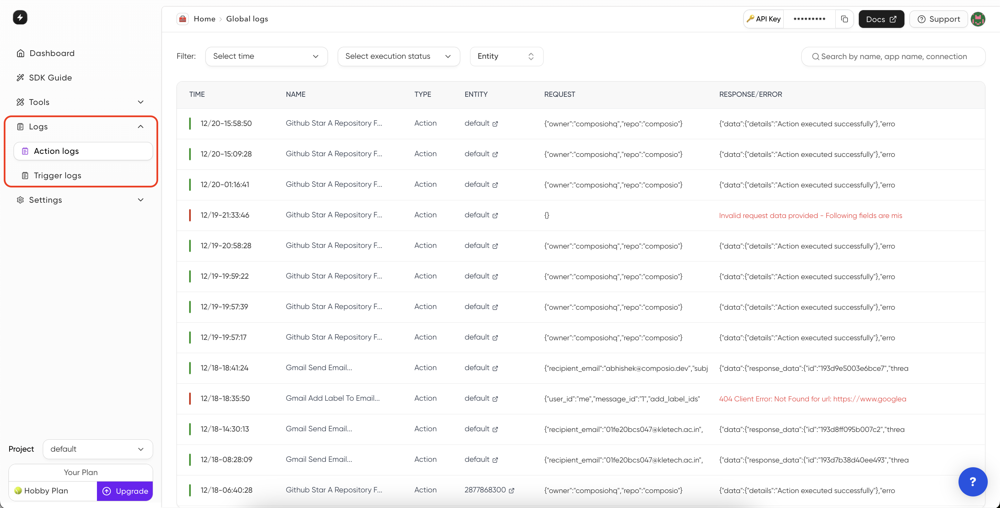

#### Monitoring Action Execution & Triggers Logs
<Steps>
<Step title="Head over to Dashboard">
You can monitor the action execution & triggers logs by clicking on [Action Logs](https://app.composio.dev/logs) and [Triggers Logs](https://app.composio.dev/trigger_logs) under **Logs** on the dashboard.

</Step>
<Step title="Click on any log to view details">
Click on any log to view detais like log id, provider name, action name, request & response body. Similarly in triggers logs, you can view the trigger name, trigger ID & payload

</Step>
</Steps>
