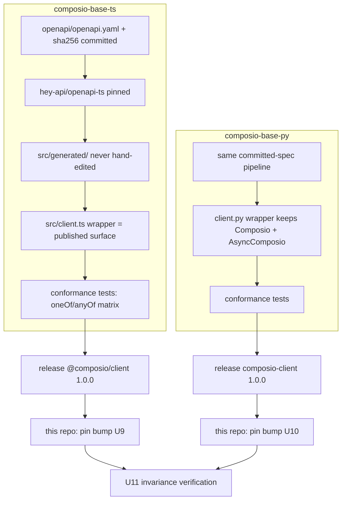

# Step 1 — Generated Client Graduation (Stainless to Hey API) - Plan

## Goal Capsule

- **Objective:** Replace Stainless with a self-hosted Hey API pipeline in the two private client repos (`composio-base-ts`, `composio-base-py`), cut stable (>= 1.0) `@composio/client` and `composio-client` releases, and bump this monorepo's pins without moving a single public SDK type.
- **Authority:** `docs/decisions/generated-client-codegen.md` is the settled decision; do not re-run the generator survey. `docs/decisions/sdk-1.0-stability-contract.md` §Generated client defines the graduation requirement.
- **Stop conditions:** Units U1–U8 live in private repos. If `composio-base-ts`/`composio-base-py` are not accessible from the current checkout, hand off U1–U8 with this plan as the spec and hold U9–U11 (they depend on the released clients; nothing in this repo is executable beyond preparation until then). Never publish; releases go through each repo's existing automation with human review.
- **Blocks:** every surface freeze downstream (Steps 3, 4, and the `raw` passthrough typing in plan 010).

---

## Product Contract

### Summary

Both SDKs are thin shells over Stainless-generated clients pinned at `@composio/client@0.1.0-alpha.74` (TS) and `composio-client==1.41.0` (Python). The stability contract cannot freeze a public surface that leaks alpha, vendor-generated types. This plan executes the accepted Hey API decision: same deterministic PR pipeline, new generator, a hand-written wrapper as the only public surface, conformance tests as the acceptance gate, then a coordinated pin bump here.

### Problem Frame

The generator is the one component that fixes the shape of every public type in both SDKs, and it currently sits with a closed hosted vendor. The TS pin is an alpha; the Python client has already dropped types the SDK had to re-declare (`ConfigToolkit` in `python/composio/core/models/mcp.py:23`). Graduating the client is the foundation of the critical path: Step 3 cannot lock `tool_router` session types, and plan 010 cannot type its `raw` passthrough, until the client is stable and owned.

### Requirements

Client repos (executed there, specified here):

- R1. `composio-base-ts` generates `@composio/client` with a pinned `@hey-api/openapi-ts` from a committed `openapi/openapi.yaml` + `openapi/openapi.sha256`, never from the remote URL in a normal run.
- R2. Generated code lives under `src/generated/` and is never hand-edited; a hand-written wrapper is the published surface.
- R3. The wrapper preserves the client API surface this monorepo consumes (see Planning Contract → Consumed surface inventory), so the SDK migration is a pin bump, not a rewrite.
- R4. Conformance tests against mocked HTTP responses cover the composition hard cases before any Stainless output is deleted: discriminated `oneOf`, non-discriminated `oneOf`, `anyOf` with overlapping object shapes, nested `allOf`+`oneOf`, nullable object fields, `additionalProperties` maps, enums with unknown values, arrays of unions, multipart/binary upload-download, structured error responses, auth-required vs auth-optional operations.
- R5. The scheduled update workflow commits spec + hash, regenerates, runs lint/typecheck/tests/build, and opens a PR only on a non-empty diff, from a branch named `heyapi/openapi-<short-sha>`. Generator-version bumps and schema updates never share a PR. A CI check regenerates and fails on non-empty `git diff`.
- R6. `composio-base-py` repeats R1–R5 with `@hey-api/openapi-python` after the TS pipeline is merged and running; Python is treated as the higher-risk half.
- R7. Both clients release a stable >= 1.0 line under semver through their existing release automation.

This monorepo:

- R8. TS pin moves from `0.1.0-alpha.74` to the stable release in `pnpm-workspace.yaml` (catalog), with `ts/packages/core` still consuming via `catalog:`; Python pin moves in `python/pyproject.toml`, `python/setup.py`, and `uv.lock` (via `uv`); `ts/scripts/validate-sdk-parity.mjs` `expectedGeneratedClientPins` updates in the same PR.
- R9. The SDK public surface is byte-for-byte invariant across the swap: all mocked-client suites, type-tests, and `python/tests/test_no_retry_writes.py` pass without assertion changes.

### Scope Boundaries

- Release automation in the client repos does not change; the update workflow never publishes.
- The backend OpenAPI spec's stability declaration is a prerequisite owned by the backend team; this plan consumes it (tracked as the one external dependency).
- No transformer plugins in the first pass; no Zod/validator generation until the generated SDK is accepted (phases 3–4 of the ADR are out of scope here).
- The SDK-side de-leaking of client types from the public surface is Step 3 / plan 010 work, not this plan.

---

## Planning Contract

### Key Technical Decisions

- **KTD1 — Wrapper-compatibility over import-migration.** The wrapper in `composio-base-ts` replicates the surface the SDK consumes (below) including deep-import paths, so `ts/packages/core` changes are limited to the pin bump. Rationale: 40 files in `ts/packages/core/src` import `@composio/client`, several via deep subpaths; replicating the surface once in the wrapper is cheaper and safer than rewriting 40 import sites in lockstep with a version bump. If a subpath proves impossible to replicate, fall back to a compat re-export module inside the wrapper package (`resources/*` files that re-export from the wrapper root).
- **KTD2 — Fetch client for TS** unless conformance tests surface Axios-specific behavior in the current contract (per ADR).
- **KTD3 — Version scheme:** `@composio/client` cuts `1.0.0` (graduating from `0.1.0-alpha.74`); `composio-client` cuts `2.0.0` — it already sits at `1.41.0`, so a "1.0.0" would sort *below* the current release, and a clean major honestly signals the generator swap. Both are exact-pinned by the SDK as today; the parity validator remains the single enforcement point for the pin pair. "Stable >= 1.0 line" from the roadmap is satisfied by both.
- **KTD4 — Conformance tests are the deletion gate:** Stainless configuration is removed from a client repo only in the PR where that repo's conformance suite passes on Hey API output.
- **KTD5 — Naming:** wrapper entry `src/client.ts` exporting `ComposioClient` (TS) and `client.py` re-exported from `__init__.py` keeping `Composio` as the class name (Python) — the Python SDK's `HttpClient(BaseComposio)` subclass relies on the constructor and `copy`/`with_options` semantics, so the generated rename ambition in `python/composio/client/__init__.py:121` (`TODO: Rename Composio to HttpClient in stainless generator`) is explicitly dropped; the wrapper keeps the `Composio` name.

### Consumed surface inventory (the compatibility contract for R3)

From the monorepo audit; this is what the wrapper must provide.

TypeScript (`@composio/client`):

- Root class exported as `Composio` (default *and* named export — the current package exports both, and core imports `Composio as ComposioClient` at `ts/packages/core/src/models/ToolRouter.ts:20`), with constructor options `{ apiKey, baseURL, defaultHeaders, logLevel }` and `withOptions({ maxRetries })` (no-retry clone used by `ts/packages/core/src/models/Tools.ts:170`).
- Resource tree used by the SDK (pinned by `ts/packages/core/test/utils/mocks/client.mock.ts`): `tools.{list,retrieve,execute,retrieveEnum,getInput,proxy}`, `connectedAccounts.*`, `toolkits.*`, `authConfigs.*`, `toolRouter.session.{create,execute,tools,...}`, `mcp.*`, `triggersTypes.*`, `link.*`.
- Error classes: `APIError`, `BadRequestError`, `APIUserAbortError` (imported by `ts/packages/core/src/errors/*.ts` and `models/Triggers.ts`).
- Deep-import subpaths currently used: `resources/tool-router/session/session.mjs`, `resources/mcp`, `resources/auth-configs`, `resources/connected-accounts`, `resources/tools`, `resources/toolkits`, `resources/triggers-types`, `resources/link`, `resources.js`, `resources/index`.
- The request-options positional shape asserted by the compile-time guard in `ts/packages/core/src/types/requestOptions.types.ts:48-62`.

Python (`composio-client`):

- `Composio` base class subclassable with `provider` kwarg surviving `copy`/`with_options` (see override at `python/composio/client/__init__.py:188-219`), `_prepare_request` as an override point for header injection, `max_retries`/`DEFAULT_MAX_RETRIES`, and the `NOT_GIVEN`/`NotGiven`/`omit` sentinels.
- `AsyncComposio` dual with the same resource tree (load-bearing for plan 007 — the async lane assumes the generated async client keeps existing).
- Typed params/response modules consumed by the SDK (e.g. `types/tool_router/session_create_params.py`), including the granular session flags (`Execute.enable_multi_execute`, `Search.enable`, `ManageConnections.enable_connection_removal`) that plan 010 exposes.

### High-Level Technical Design



---

## Implementation Units

### U1. TS pipeline bootstrap (composio-base-ts)

- **Goal:** Committed spec + pinned `@hey-api/openapi-ts` generating into `src/generated/`, alongside (not yet replacing) the Stainless output.
- **Requirements:** R1, R2.
- **Files:** (in `composio-base-ts`) `openapi/openapi.yaml`, `openapi/openapi.sha256`, `openapi-ts.config.ts`, `src/generated/**`, lockfile.
- **Approach:** Fetch the backend spec once, commit it, generate with the Fetch client (KTD2). Normalize key ordering only if the URL output is nondeterministic; never dereference or flatten (ADR rule — flattening changes `oneOf`/`anyOf` generation).
- **Test scenarios:** regeneration from the committed spec is byte-identical (CI re-run check); generator version is exact-pinned (lockfile assertion).
- **Verification:** repo lint/typecheck/build green with generated code present.

### U2. TS wrapper surface (composio-base-ts)

- **Goal:** Hand-written wrapper exporting the full consumed-surface inventory above, backed by `src/generated/`.
- **Requirements:** R3.
- **Dependencies:** U1.
- **Files:** (in `composio-base-ts`) `src/client.ts`, `src/resources/*.ts` compat modules, `package.json` `exports` map, wrapper unit tests.
- **Approach:** Build outside-in from the inventory: start from `client.mock.ts`'s method tree and the deep-import list, not from what Hey API happens to generate. `withOptions` and the three error classes are part of the wrapper contract. Directional sketch:

  ```ts
  // src/client.ts — the published surface; generated/ is an implementation detail.
  // Class name stays `Composio` (default + named export) to preserve the import contract.
  export class Composio {
    constructor(opts: ClientOptions) { /* wires generated fetch client */ }
    withOptions(overrides: Partial<ClientOptions>): Composio { /* clone */ }
    readonly tools: ToolsResource;           // delegates to generated SDK fns
    readonly toolRouter: { session: SessionResource };
    // ...
  }
  export default Composio;
  export { APIError, BadRequestError, APIUserAbortError } from './errors';
  ```

- **Test scenarios:** every method in the inventory exists and forwards to a mocked transport; `withOptions({ maxRetries: 0 })` produces a client that does not retry a failed POST; error classes carry status and body like today.
- **Verification:** a scratch consumer compiling the monorepo's import list (all deep subpaths) against the packed tarball.

### U3. TS conformance suite (composio-base-ts)

- **Goal:** The R4 matrix, written against mocked HTTP responses, passing on Hey API output.
- **Requirements:** R4. **Dependencies:** U2.
- **Approach:** One test file per composition case; each case pins both the runtime parse result and (via type-level tests) the generated static type. These tests are the Stainless-deletion gate (KTD4) and stay as the permanent regression net for future spec updates.
- **Test scenarios:** the eleven ADR cases, each with at least one positive and one mismatch fixture; unknown enum value does not throw; structured error response surfaces `APIError` with parsed body.

### U4. TS update workflow + determinism checks (composio-base-ts)

- **Goal:** Scheduled GitHub Action per R5.
- **Requirements:** R5. **Dependencies:** U1–U3.
- **Test scenarios:** re-run on an unchanged schema updates the existing `heyapi/openapi-<short-sha>` branch instead of opening a second PR; CI fails when committed generated code drifts from the committed spec.

### U5. Release @composio/client 1.0.0

- **Goal:** Stable line on npm through existing automation; Stainless config removed in the same PR the conformance suite gates (KTD4).
- **Requirements:** R7. **Dependencies:** U3, U4.
- **Verification:** human-reviewed release; npm dist-tags sane; no publish from the update workflow.

### U6. Python pipeline + wrapper (composio-base-py)

- **Goal:** Mirror U1+U2 with `@hey-api/openapi-python`, keeping `Composio`/`AsyncComposio` class names and the subclass-ability contract (KTD5).
- **Requirements:** R1, R2, R3, R6. **Dependencies:** U5 (TS proven first, per ADR).
- **Approach:** Treat as higher-risk: do not assume package layout or naming from the TS experience; verify the SDK's `HttpClient` subclass patterns (`copy`/`with_options` re-injection, `_prepare_request` override) against the generated base early, and keep the async dual generating.
- **Test scenarios:** subclass with an extra required ctor kwarg survives `copy()`/`with_options()`; `_prepare_request`-equivalent hook exists and fires per request; sentinels (`NOT_GIVEN`, `omit`) behave as today; `types/tool_router/session_create_params.py` still exposes `Execute`/`Search`/`ManageConnections` granular flags.

### U7. Python conformance suite (composio-base-py)

- **Goal:** R4 matrix for Python, same deletion-gate role.
- **Requirements:** R4, R6. **Dependencies:** U6.

### U8. Release composio-client 1.0.0

- **Goal:** Stable PyPI line at `2.0.0` per KTD3. **Requirements:** R7. **Dependencies:** U7.

### U9. Monorepo TS pin bump

- **Goal:** `pnpm-workspace.yaml` catalog → stable version; core compiles and tests green with zero public-surface change.
- **Requirements:** R8, R9. **Dependencies:** U5.
- **Files:** `pnpm-workspace.yaml`, `pnpm-lock.yaml` (via pnpm), `ts/scripts/validate-sdk-parity.mjs` (expected pins map), plus any internal-import fixes the swap forces inside `ts/packages/core/src` (allowed) — never in exported type shapes (forbidden).
- **Approach:** The compile-time guard in `src/types/requestOptions.types.ts:59-62` and the mock suite are the tripwires; treat any assertion change request as a wrapper bug to fix in `composio-base-ts`, not here. Remove the stale-client cast at `src/models/ConnectedAccounts.ts:121-125` if the regenerated types allow.
- **Test scenarios:** full existing suite unchanged; `ts/packages/core/type-tests/` unchanged; `pnpm validate:sdk-parity` green with updated expected pins.
- **Verification:** `pnpm typecheck && pnpm test && pnpm build:packages && pnpm validate:sdk-parity`.

### U10. Monorepo Python pin bump

- **Goal:** `composio-client==2.0.0` pinned (KTD3); `HttpClient` adapted with zero public-surface change.
- **Requirements:** R8, R9. **Dependencies:** U8.
- **Files:** `python/pyproject.toml`, `python/setup.py`, `uv.lock` (via `uv lock`), `python/composio/client/__init__.py` (only if the wrapper's internals demand), `ts/scripts/validate-sdk-parity.mjs` (same PR as U9 or updated again — validator requires pyproject/setup.py agreement).
- **Test scenarios:** `python/tests/test_no_retry_writes.py` unchanged and green (the no-retry contract survives); `python/composio/integration_test/test_mcp.py::test_api_compatibility_with_typescript` green; local re-declarations (`ConfigToolkit` at `core/models/mcp.py:23`) removed if the stable client restores them, else kept with an updated comment.
- **Verification:** from `python/`: `make chk && make type_inference && make tst && make build`.

### U11. Invariance sign-off

- **Goal:** Documented proof the swap moved nothing public.
- **Requirements:** R9. **Dependencies:** U9, U10.
- **Approach:** Run both SDKs' full gates plus `pnpm check:package-exports`; diff the packed `@composio/core` type surface (`attw`/`publint` already run in that script) before/after. Record the result in the PR description, not in a new doc.

---

## Verification Contract

| Gate | Command | Applies to |
| --- | --- | --- |
| TS suite | `pnpm typecheck && pnpm test && pnpm build:packages` | U9, U11 |
| TS exports | `pnpm check:package-exports` | U9, U11 |
| Parity + pins | `pnpm validate:sdk-parity` | U9, U10, U11 |
| Python suite | `cd python && make chk && make type_inference && make tst && make build` | U10, U11 |
| Client repos | each repo's lint/typecheck/test/build + conformance suite | U1–U8 |

## Definition of Done

- Both client repos generate from committed specs with Hey API, wrapped surfaces published, conformance suites green, Stainless configuration deleted.
- `@composio/client >= 1.0.0` and `composio-client >= 1.0.0` pinned here; `validate:sdk-parity` green with the new expected pins.
- All monorepo suites pass without assertion changes (R9), proving surface invariance.
- No dead-end experiments left in any repo; the four pin sites and the validator map moved together.

## Risks & Dependencies

- **Backend spec stability declaration** is external and gating; without it a "stable" client is a fiction. Track it as the entry criterion for U5/U8.
- **`oneOf`/`anyOf` misgeneration** is the named fallback trigger: isolate the failing schema, try discriminator/normalization fixes that preserve semantics, file upstream, and fall back to OpenAPI Generator for the failing area only (ADR §Fallback).
- **`@hey-api/openapi-python` maturity**: if the async dual or subclass contract cannot be preserved, the Python half stops at U6 and escalates — the SDK's `HttpClient` and plan 007 both depend on it.
- **Deep-import replication (KTD1)** may hit Hey API layout constraints; the compat re-export fallback keeps the monorepo unchanged either way.
