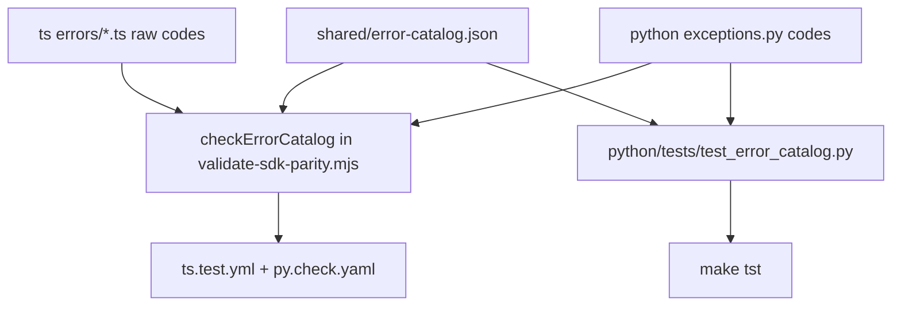

# Step 4 — Name Freeze and Shared Error Catalog - Plan

## Goal Capsule

- **Objective:** Drain the parity validator's allowance list to a fixed, declared target (the name freeze), execute the `@composio/google` → `@composio/gemini` rename, and build the shared `COMPOSIO::` error catalog both SDKs build against.
- **Authority:** `docs/decisions/cross-sdk-parity-policy.md` (naming rule, gemini rename, error catalog); TypeScript is the reference implementation — Python moves toward TS names, not vice versa, except where a verdict below says otherwise.
- **Stop conditions:** verdicts marked *(settle-at-execution)* below need a maintainer call if evidence contradicts the recommendation; everything else is decided here. Do not remove any old name in this step — Step 4 adds and deprecates; removal is Steps 5–6.
- **Depends on:** plan 003 U1–U3 (settled surfaces), guarded by Step 2 (plan 002); this plan's verdict table in turn finalizes plan 003's ledger rename rows (two-pass ledger, see plan 003 U4) — no circular wait. The gemini rename and error catalog are independent of each other and parallelizable.

---

## Product Contract

### Summary

Three requirement groups. (1) **Naming:** every allowance in `ts/scripts/validate-sdk-parity.mjs` `resourceSpecs` gets a verdict — mirror-in-Python, rename-with-bridge, add-to-TS, or declared-divergence — and the work lands so the allowance list shrinks to declared divergence only. (2) **Gemini rename:** `@composio/gemini` becomes the Google GenAI package; `@composio/google` becomes a deprecated re-export bridge. (3) **Errors:** a committed language-neutral catalog with `COMPOSIO::` codes; TypeScript seeds it and drops `TS-SDK::` (staged), Python gains codes and stops collapsing MCP failures into `ValidationError`.

### Problem Frame

The freeze cannot assert a fixed target while the validator encodes "pending pre-1.0 name audit" allowances, `google` means two different SDKs in two languages, and the error contract diverges exactly when it is being frozen (TS: ~40 coded classes under `TS-SDK::` — the exact set is established from const-object metadata during U5, not trusted from any count; Python: zero codes, MCP failures all `ValidationError`).

### Requirements

Naming (verdicts in Planning Contract):

- R1. Every method-name allowance in `resourceSpecs` (`validate-sdk-parity.mjs:294-396`) and the root-namespace `files` allowance is resolved per the verdict table; drained allowances are removed from the validator in the same PR as the code change (the staleness check forces this).
- R2. New Python methods added for parity are implemented (not stubs), tested, and documented; renames on either side ship as new-name-plus-deprecated-alias (bridge policy from the migration ADR).

Gemini rename:

- R3. `ts/packages/providers/gemini` publishes `@composio/gemini` with the current `@composio/google` implementation (Google GenAI); `@composio/google` becomes a thin deprecated re-export of `@composio/gemini` (bridge through 1.x, removed 2.0).
- R4. The parity-policy provider matrix and the validator's provider check accept the new directory layout in the same PR; docs and examples move to `@composio/gemini`.

Error catalog:

- R5. A committed artifact `shared/error-catalog.json` defines every code once: neutral code (`TOOL_NOT_FOUND`), description, and per-language class names. Both SDKs build against it; a CI check fails when either SDK emits a code not in the catalog or omits a catalog code it claims.
- R6. TypeScript emits `COMPOSIO::`-prefixed codes at 1.0; the final 0.x exposes both (old `code`, new `catalogCode`) plus a matching helper, per the migration ADR's "add the new codes alongside the old ones."
- R7. Python's `ComposioError` gains a `code` attribute (`COMPOSIO::` values from the catalog); MCP methods raise typed, coded errors (404/401/network distinguishable) instead of blanket `ValidationError` (`python/composio/core/models/mcp.py:184-499`).
- R8. Known TS taxonomy bugs are fixed as part of seeding: the two Pusher classes that bypass the prefix via class-field initializers (`PusherErrors.ts:10,21`), the `TOOLKIT_FETCH_ERROR` literal missing from its const object (`ToolkitErrors.ts:3-5,30`), and the `TS-SDK::undefined` case when `options.code` is absent.

### Scope Boundaries

- Removing old names/codes: Steps 5–6. This step only adds, renames-with-bridge, and deprecates.
- The docs blast radius for the code prefix is near zero (authored docs never reference `TS-SDK::`); only decision records and the migration guide mention it.
- `errorId` on `ComposioError` is declared but never assigned — its fate (implement or ledger it for removal) goes to the plan 003 ledger, not here *(settle-at-execution)*.

---

## Planning Contract

### Key Technical Decisions

- **KTD1 — Naming verdicts (the freeze table).** One verdict per allowance; "TS is reference" is the tiebreak, idiom divergence must be declared.

  | Scope | Allowance today | Verdict |
  | --- | --- | --- |
  | root | `files` TS-only | **Add `composio.files` to Python**, wrapping the existing `core/models/_files.py` machinery with `upload`/`download`; the parity matrix already claims files stable on both sides, so the namespace should exist on both |
  | tools | Py `proxy` vs TS `proxyExecute` | **Rename Python to `proxy_execute`**, keep `proxy` as deprecated alias |
  | tools | TS-only `getInput` ("pending name audit") | **Keep `getInput`/add Python `get_input`** — audit closes by adoption, not rename *(settle-at-execution: confirm the method is worth freezing rather than ledgering)* |
  | tools | Py `get_raw_tool_router_meta_tools` vs TS `getRawToolRouterSessionTools` | **Python renames to `get_raw_tool_router_session_tools`** with alias; "session tools" is the frozen term (matches `sessions` naming) |
  | tools | TS-only `executeSessionTool`, `wrapToolsForProvider`, `wrapToolsForToolRouter`, `getToolsEnum` | **Declared divergence** — provider-SPI/session plumbing that Python surfaces differently (`session.execute`, provider internals); record in matrix with reasons |
  | toolkits | Py-only `list` | **Add `toolkits.list` to TS** (additive); TS `get` keeps its current list-capable overloads — freezing both is allowed, collapsing `get` would be a needless break |
  | triggers | TS-only `update`, `delete`, `enable`, `disable`, `unsubscribe` | **Add all five to Python** — trigger lifecycle parity is a real gap, not idiom |
  | triggers | Py `list` vs TS `listTypes`; TS-only `listEnum` | **Python renames `list` → `list_types`** with alias; `listEnum` → **declared divergence** (enum plumbing used by CLI/codegen) *(settle-at-execution: consider deprecating in TS instead)* |
  | auth_configs | TS-only `updateStatus` | **Add Python `update_status`**; `enable`/`disable` remain the sugar on both sides |
  | connected_accounts | TS-only `list`, `get`, `delete`, `refresh`, `enable`, `disable`, `updateStatus` | **Add all seven to Python** — the lifecycle gap is the largest single parity debt |
  | experimental | Py-only `tool` decorator vs TS `experimental_createTool` factory | **Declared divergence** (idiomatic decorator vs factory), recorded in the matrix |

- **KTD2 — Bridge mechanics.** Python aliases: real methods emitting `DeprecationWarning` once per process (match the `initiate()` pattern at `connected_accounts.py:603-612`). TS bridges: `@deprecated` JSDoc + delegation. All bridges appear as ledger rows (plan 003 U4).
- **KTD3 — Catalog location and shape.** `shared/error-catalog.json` (new top-level `shared/` directory for cross-SDK committed artifacts). Shape:

  ```json
  {
    "$schema": "./error-catalog.schema.json",
    "prefix": "COMPOSIO::",
    "codes": {
      "TOOL_NOT_FOUND": {
        "description": "Requested tool slug does not exist or is not available to this project",
        "typescript": "ComposioToolNotFoundError",
        "python": "ToolNotFoundError"
      }
    }
  }
  ```

  Enforcement: extend `validate-sdk-parity.mjs` with a `checkErrorCatalog()` that (a) reads TS codes from the exported `*ErrorCodes` const objects only — never from arbitrary `code:` literals, which would capture non-catalog strings like the Zod issue literal `code: 'custom'` in `ValidationErrors.ts:25-30` — (b) parses Python class-attribute codes from `python/composio/exceptions.py`, and (c) diffs both against the catalog. Precondition: every TS error routes its code through a const object (the R8 const-drift fix generalizes to all error files). Python additionally asserts it in a unit test (`python/tests/test_error_catalog.py`) so `make tst` catches drift without Node.
- **KTD4 — TS prefix transition.** 0.x: base constructor keeps `code = 'TS-SDK::' + raw` and adds `catalogCode = 'COMPOSIO::' + raw`; new static helper `ComposioError.matchesCode(err, 'COMPOSIO::TOOL_NOT_FOUND')` accepts both prefixes. 1.0: `code` flips to `COMPOSIO::`, `catalogCode` remains (now equal), helper keeps accepting the old prefix through 1.x. The two Pusher bypass classes move their code into the constructor call so the transition covers them (R8).
- **KTD5 — Python error codes are additive.** `ComposioError.__init__` gains an optional `code` kwarg; subclasses declare their catalog code as a class attribute (`code = "COMPOSIO::TOOL_NOT_FOUND"`). No Python back-compat concern — there is nothing to migrate from. MCP de-collapsing maps: HTTP 404 → `NotFoundError` subclass with code, 401/403 → coded auth error, network/timeout → coded transport error, schema mismatch → `ValidationError` (only genuine validation keeps it).
- **KTD6 — Gemini rename mechanics.** New directory `ts/packages/providers/gemini` (package `@composio/gemini`) receives the implementation as `GeminiProvider` (aligning with Python's `GeminiProvider(name="gemini")`); `ts/packages/providers/google` shrinks to a deprecated bridge re-exporting from `@composio/gemini` (including `GoogleProvider` as a deprecated alias of `GeminiProvider`), depending on it with a workspace range. Two wrinkles the review surfaced, both settled here: (1) the runtime `name` property — currently `'google'` — feeds telemetry/provider identification; the gemini package sets `name = 'gemini'`, and the bridge's aliased class keeps emitting `'google'` only if the backend requires continuity *(settle-at-execution: confirm with backend telemetry owners)*. (2) The validator's provider check strips parentheticals and treats `n/a-by-design` as "no directory expected" (`validate-sdk-parity.mjs:436-463`), so a real bridge directory cannot be declared that way — extend the parser with an explicit third state (e.g. `bridge-until-2.0`) that expects the directory to exist, and mark the matrix's TS `google` cell with it. Matrix rows update in the same PR.

### High-Level Technical Design — catalog enforcement flow



## Implementation Units

### U1. Python parity — promote runtime-assigned methods and fill true gaps (connected accounts, triggers)

- **Goal:** R1, R2 for the two biggest allowance groups — with a corrected diagnosis: adversarial review found Python *already assigns* several of these as runtime attributes (`connected_accounts.py:367-378`, `triggers.py:903-912`), which the validator's `def`-extraction regex cannot see. Part of the "gap" is a validator blind spot, not missing API.
- **Files:** `python/composio/core/models/connected_accounts.py`, `python/composio/core/models/triggers.py` (convert runtime attribute assignments into explicit typed `def` methods with docstrings; implement only the genuinely missing ones), `python/tests/test_connected_accounts.py`, `python/tests/test_triggers.py`, `ts/scripts/validate-sdk-parity.mjs` (remove drained allowances; optionally teach the extractor to flag runtime-assigned public attrs so this blind spot cannot recur).
- **Approach:** First inventory what actually exists at runtime vs what mypy/the validator can see. Convert existing runtime-assigned methods to explicit `def` methods — a frozen 1.0 surface should be statically visible, typed, and documented, not attribute-wired. Then implement only the true remainder, wrapping the generated-client calls with concrete return types (no bare `t.Dict`). Mirror TS behavior exactly — e.g. `refresh` calls the refresh endpoint with its optional redirect/validation params (see `ts/packages/core/src/models/ConnectedAccounts.ts:543-580`), it does not re-initiate.
- **Test scenarios:** happy path per method against the mocked client; 404 → typed error; `update_status`/`enable`/`disable` state matrix; converted methods keep their runtime behavior (regression against existing attribute-call tests if any); validator green with allowances removed; a deliberately reintroduced allowance fails the staleness check (scratch verification).
- **Verification:** `cd python && make chk && make type_inference && make tst`; `pnpm validate:sdk-parity`.

### U2. Python parity additions — tools, toolkits, auth_configs, files namespace

- **Goal:** Remaining R1 verdicts: `proxy_execute` rename (+alias), `get_input`, `get_raw_tool_router_session_tools` rename (+alias), `auth_configs.update_status`, `composio.files` namespace; TS `toolkits.list` addition.
- **Files:** `python/composio/core/models/tools.py`, `toolkits.py`, `auth_configs.py`, `python/composio/core/models/files.py` (new, wrapping `_files.py`), `python/composio/sdk.py` (mount `files`), `ts/packages/core/src/models/Toolkits.ts` (+`list`), matching tests both sides, validator allowances drained.
- **Approach:** Aliases per KTD2. `composio.files.upload/download` delegates to the existing `_files` helpers with the same safety model (denylist, allowlist, `dangerously_allow_*`).
- **Test scenarios:** alias emits `DeprecationWarning` exactly once per process and delegates; new `files` namespace honors the sensitive-path denylist; TS `toolkits.list` returns the same payload `get` (list form) returns today.
- **Verification:** same gates as U1 plus `pnpm test`.

### U3. Declared-divergence matrix updates

- **Goal:** R1 for verdicts that resolve to divergence, so the validator's allowance list documents target state, not pending work.
- **Files:** `docs/decisions/cross-sdk-parity-policy.md` (capabilities/methods notes), `ts/scripts/validate-sdk-parity.mjs` (allowance reasons rewritten from "pending…" to "declared: …").
- **Test scenarios:** validator green; no allowance reason contains "pending" afterward (grep check).

### U4. Gemini rename

- **Goal:** R3, R4 per KTD6.
- **Files:** `ts/packages/providers/gemini/**` (new, `GeminiProvider`), `ts/packages/providers/google/**` (bridge with deprecated `GoogleProvider` alias), root `pnpm-workspace.yaml` if package lists need it, `ts/scripts/validate-sdk-parity.mjs` (the `bridge-until-2.0` provider state from KTD6), `docs/decisions/cross-sdk-parity-policy.md` (matrix), `docs/package.json` + lockfile (the docs app depends on `@composio/google` directly) and `docs/content/docs/providers/google.mdx` plus examples referencing `@composio/google`, changesets for both packages.
- **Test scenarios:** gemini package tests are the moved google tests updated for `GeminiProvider`; bridge package compiles and `new GoogleProvider()` is an instance of the gemini export with a `@deprecated` marker; provider `name` behavior matches the KTD6 telemetry decision; `pnpm validate:sdk-parity` provider check green with the bridge state; `pnpm check:package-exports` green for both packages; docs app builds with the updated dependency.
- **Verification:** `pnpm typecheck && pnpm test && pnpm build:packages && pnpm validate:sdk-parity && pnpm check:package-exports`.

### U5. Error catalog artifact + TS seeding

- **Goal:** R5, R6, R8 per KTD3/KTD4.
- **Files:** `shared/error-catalog.json` + `shared/error-catalog.schema.json` (new), `ts/packages/core/src/errors/ComposioError.ts` (catalogCode + matchesCode + undefined-code guard), `errors/PusherErrors.ts` (constructor-routed codes), `errors/ToolkitErrors.ts` (const drift fix), `ts/scripts/validate-sdk-parity.mjs` (`checkErrorCatalog`), TS error tests.
- **Approach:** First normalize: every error file routes its code through an exported `*ErrorCodes` const object (fixing the existing drift, R8); the catalog is then seeded mechanically from those const objects — not from a hand-counted inventory. The raw code strings do not change, only prefixes and plumbing. `matchesCode` is the public migration helper and gets exported from the package root.
- **Test scenarios:** every TS error class emits `catalogCode` present in the catalog (loop test); Pusher classes now carry both prefixed codes; constructing `ComposioError` without a code yields a defined fallback code (not `TS-SDK::undefined`); `matchesCode` accepts old and new prefixes; catalog check fails on a scratch out-of-catalog code.
- **Verification:** `pnpm test && pnpm validate:sdk-parity`.

### U6. Python catalog adoption + MCP error de-collapse

- **Goal:** R5, R7 per KTD5.
- **Files:** `python/composio/exceptions.py` (base `code` support + per-class codes), `python/composio/core/models/mcp.py` (typed raises), `python/tests/test_error_catalog.py` (new), `python/tests/test_mcp_errors.py` (new or extended), catalog file gains the Python class-name column entries.
- **Test scenarios:** each coded class exposes `code` matching the catalog; MCP get of a missing server raises the 404-coded class (not `ValidationError`); auth failure vs network failure raise distinct classes; catalog test fails when a class code is missing from `shared/error-catalog.json`.
- **Verification:** `cd python && make chk && make tst`; `pnpm validate:sdk-parity`.

## Verification Contract

| Gate | Command | Applies to |
| --- | --- | --- |
| Parity + catalog + providers + pins | `pnpm validate:sdk-parity` | all units |
| TS | `pnpm typecheck && pnpm test && pnpm build:packages` | U2, U4, U5 |
| TS exports | `pnpm check:package-exports` | U4 |
| Python | `cd python && make chk && make type_inference && make tst` | U1, U2, U6 |
| Docs | `cd docs && bun run lint:links` | U3, U4 |

## Definition of Done

- `validate:sdk-parity` passes with zero "pending" allowances: every remaining allowance is declared divergence with a matrix citation.
- `@composio/gemini` exists with the full implementation; `@composio/google` is a deprecated bridge; matrix and validator agree.
- `shared/error-catalog.json` is enforced in both CI paths; TS exposes dual codes + `matchesCode`; Python errors carry codes and MCP failures are distinguishable by class and code.
- Normalized public name sets match across SDKs (the roadmap's Step 4 done-when), demonstrated by the validator output attached to the PR.

## Risks & Dependencies

- Twelve new Python methods is the largest implementation surface in this plan; they ride on generated-client endpoints that must exist in `composio-client` — verify endpoint availability before committing to each method, and declare divergence instead if the backend lacks one (matrix note, not silence).
- The gemini rename touches published-package identity; the npm deprecation message on `@composio/google` is written at Step 6, not here — this step must not unpublish or break the old install.
- Catalog enforcement parses source with regexes (same technique the validator already uses); keep codes as literal class attributes/strings so the parser stays trivial.
