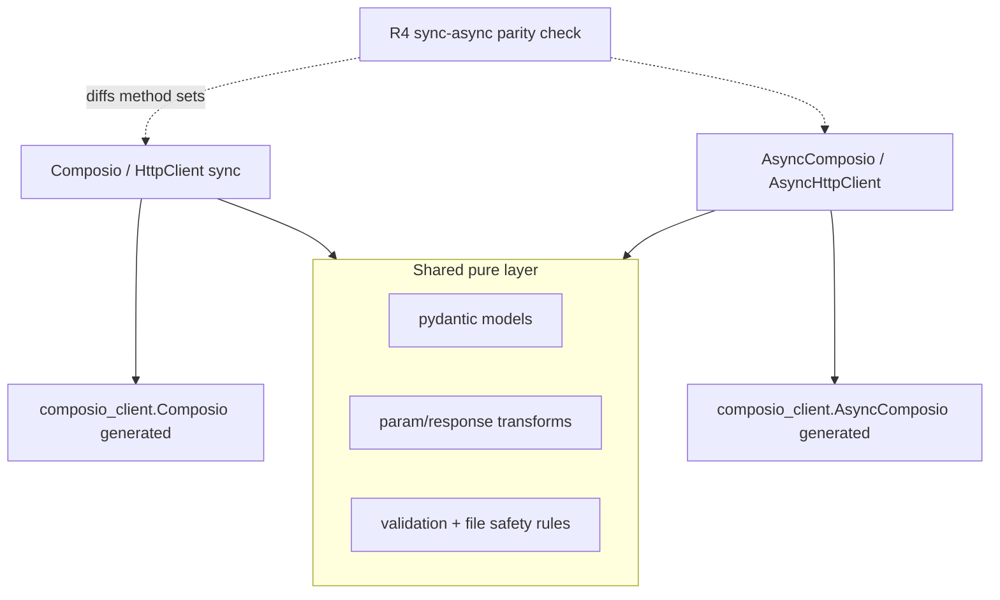

# Lane — AsyncComposio for Python - Plan

## Goal Capsule

- **Objective:** Ship `AsyncComposio` alongside the synchronous `Composio`, mirroring the `openai`/`anthropic` dual-client pattern, closing the one real capability gap in the parity matrix before the 1.0 cut.
- **Authority:** `docs/decisions/cross-sdk-parity-policy.md` §Async; naming frozen per Step 4 (plan 004) — async methods carry the same frozen names.
- **Stop conditions:** if `composio-client` 1.0 (plan 001 U6–U8) drops or breaks the generated `AsyncComposio` base, this lane stops and escalates — do not hand-roll an async HTTP layer. Realtime triggers (`subscribe`) are excluded at 1.0 by decision, not by omission (KTD4); do not attempt an async pysher port inside this lane.
- **Depends on:** best started after Step 3 (plan 003) settles the surface shape; must follow plan 004's frozen names. Gates the cut (plan 006 checklist row 6) — either shipped or a dated deferral decision.

---

## Product Contract

### Summary

The generated substrate already exists: `composio_client` ships `AsyncComposio(AsyncAPIClient)` with the full async resource tree, and it keeps existing under Hey API (plan 001 R3 inventory pins it). This lane adds the SDK layer: an `AsyncHttpClient` wrapper, an `AsyncComposio` SDK class, and async variants of the stable namespaces — sharing the pure logic (transforms, pydantic models, validation) with the sync path and duplicating only the thin I/O orchestration, guarded by a sync/async parity check.

### Problem Frame

The gap is visible the day someone builds an async server and reaches for our SDK out of habit; peer SDKs (`openai`, `anthropic`) all ship duals. Adding async is non-breaking, but pulling it into 1.0 is the declared policy. Three sync-only dependencies shape the scope: custom tools explicitly reject `async def` (`core/models/custom_tool.py:201-206,299-304`), realtime subscribe rides the synchronous `pysher` (`core/models/triggers.py`), and file transfer uses `requests` (`core/models/_files.py:141-158,262,373`).

### Requirements

- R1. `composio.AsyncComposio` exists, exported from the package root, constructed like `Composio` (same kwargs), backed by an `AsyncHttpClient(composio_client.AsyncComposio)` that reproduces the sync wrapper's contract: header injection, `provider` kwarg surviving `copy`/`with_options`, and a `without_retries` async sibling for non-idempotent writes.
- R2. Async namespaces cover the stable surface at frozen names: `tools` (get, execute, proxy_execute, raw getters), `toolkits`, `triggers` (management methods; see R5), `auth_configs`, `connected_accounts` (including `wait_for_connection` on `asyncio.sleep`), `files` (plan 004 U2 namespace, on async HTTP), `sessions` (`create`/`use`/`delete` + session object incl. `tools(...)`), and `mcp` (experimental label carries over).
- R3. Custom tools registered on `AsyncComposio` accept both `async def` and plain `def` execute functions; the sync client keeps rejecting `async def` with the existing message.
- R4. A sync/async parity check asserts the async namespaces expose the same normalized method names *and parameter signatures* as sync (introspection-based Python test), so the duals cannot drift; name-set equality alone is not sufficient — behavioral drift is additionally covered by parametrizing shared suites over both clients.
- R5. Exclusions are declared, not silent: async realtime (`triggers.subscribe`/`unsubscribe`) is deferred per KTD4 with a parity-matrix row and a dated decision at the cut; anything else missing is a documented decision in the parity matrix.
- R6. Modifiers work on the async path: `before_execute`/`after_execute`/`schema_modifier` accept both sync and `async def` callables under `AsyncComposio`.
- R7. Providers: agentic provider wrapping (`provider.wrap_tools`) is CPU-bound and shared as-is; any provider whose execution path calls back into the SDK documents which client it requires. No new provider work in this lane.

### Scope Boundaries

- No async realtime (pysher) at 1.0 — graduates later if demand shows.
- No `trio` support; `asyncio` only (matches peer SDKs).
- TypeScript is untouched (async-native already).

---

## Planning Contract

### Key Technical Decisions

- **KTD1 — Hand-written duals over a sync-generation script.** The SDK's orchestration layer is thin (transforms and models are pure and shared); a code-generation step (à la `openai`'s sync-from-async) buys little and costs a build stage. Drift risk is covered by R4's parity check plus parametrized tests. Revisit only if the duplicated surface exceeds expectations at execution.
- **KTD2 — Layout: `_async/` package mirroring `core/models/`.**

  ```text
  python/composio/
    async_sdk.py                  # AsyncComposio class (mirrors sdk.py)
    client/__init__.py            # + AsyncHttpClient(BaseAsyncComposio)
    core/models/_async/
      tools.py toolkits.py triggers.py auth_configs.py
      connected_accounts.py files.py tool_router.py
      tool_router_session.py mcp.py
  ```

  Shared pure logic stays where it is; where a sync model method mixes I/O and logic, extract the logic into a private module-level function both variants call (extract-on-touch, not a big-bang refactor).
- **KTD3 — Naming convention:** class `AsyncComposio`, namespaces keep their names (`composio.tools` on the async instance is the async `Tools`); no `a`-prefixes on methods (`await composio.tools.execute(...)`, matching `openai`/`anthropic` idiom).
- **KTD4 — Realtime exclusion mechanics:** `AsyncTriggers` ships *without* `subscribe`/`unsubscribe` — a method that exists only to throw would repeat the throwing-stub anti-pattern the migration ADR rejects, and it would falsely satisfy name parity. Instead: the R4 parity test carries a declared-exclusion list containing exactly these entries, each citing the parity-matrix row ("async realtime: deferred; sync client or webhooks are the supported paths"); the docs "Async client" page states it; and plan 006's checklist row 6 requires a dated maintainer decision (defer to a 1.x minor, or fund an async subscribe implementation) before the cut. Note the tension consciously: the matrix row "triggers — Pusher realtime both sides" describes the sync capability; the async column records the declared gap.
- **KTD5 — Files transport:** async paths use `httpx.AsyncClient` for the S3 presigned-URL PUT/GET; the sync path stays on `requests` untouched. `httpx` is today only a transitive dependency (via the generated client) — declare it as a direct dependency in `python/pyproject.toml` when the SDK starts importing it directly.
- **KTD6 — Docs placement:** async usage documented on each surface page plus one "Async client" page; examples added under the Python examples tree so the plan-009 examples CI covers them.

### High-Level Technical Design



## Implementation Units

### U1. AsyncHttpClient wrapper

- **Goal:** R1 (client half).
- **Files:** `python/composio/client/__init__.py` (+`AsyncHttpClient`), `python/tests/test_async_client.py` (new).
- **Approach:** Mirror `HttpClient` against `composio_client.AsyncComposio`: same header injection via the async `_prepare_request` hook, same `copy`/`with_options` provider re-injection, `without_retries` cached property.
- **Test scenarios:** mirror `test_no_retry_writes.py` with an async transport — async `tools.execute`/`proxy` route through `max_retries=0`, reads keep `DEFAULT_MAX_RETRIES`; headers present on every request; `copy()` keeps `provider`.
- **Verification:** `cd python && make chk && make tst`.

### U2. AsyncComposio class + core namespaces (tools, toolkits, auth_configs)

- **Goal:** R1 (class half), R2 subset, R6.
- **Dependencies:** U1.
- **Files:** `python/composio/async_sdk.py` (new), `python/composio/__init__.py` (export), `core/models/_async/{tools,toolkits,auth_configs}.py`, extracted shared helpers where touched (KTD2), parametrized tests.
- **Approach:** Constructor mirrors `sdk.py:90-201` including provider generics (`AsyncComposio(t.Generic[TTool, TToolCollection])`). Modifier dispatch gains an await-if-coroutine step on the async path.
- **Test scenarios:** parametrize existing tools/toolkits/auth_configs suites over sync/async where the fixtures allow; async modifiers (`async def before_execute`) applied; sync modifiers still work under async; provider generic inference covered by a `type_inference` case for `AsyncComposio`.
- **Verification:** `cd python && make chk && make type_inference && make tst`.

### U3. Connected accounts, files, triggers management

- **Goal:** R2 subset, R5.
- **Dependencies:** U2; plan 004 U1/U2 (the parity additions exist to mirror).
- **Files:** `core/models/_async/{connected_accounts,files,triggers}.py`, tests.
- **Test scenarios:** `wait_for_connection` polls with `asyncio.sleep` and honors timeout; files upload/download via mocked `httpx.AsyncClient` respecting the sensitive-path denylist; `AsyncTriggers` exposes the management methods and demonstrably lacks `subscribe` (parity-test exclusion entry asserts this, per KTD4).
- **Verification:** `cd python && make tst`.

### U4. Async sessions + session object + custom tools + MCP

- **Goal:** R2 remainder, R3.
- **Dependencies:** U2.
- **Files:** `core/models/_async/{tool_router,tool_router_session,mcp}.py`, `core/models/custom_tool.py` (`_create_tool` and `_infer_tool_from_function` validation gain a client-mode parameter — the coroutine rejection at `custom_tool.py:201-206,299-304` becomes conditional), `core/models/custom_tool_types.py` (execute callable type gains an awaitable-return variant), `core/models/experimental.py` (the `tool` decorator must thread client mode into inference), tests.
- **Approach:** This is the lane's real refactor, not a tweak: the custom-tool validation and typing layer is sync-only today and has no notion of which client owns the tool. Introduce an explicit `async_mode` (or client-owner) parameter through the creation path rather than sniffing. The session `tools(...)` routing-execute path awaits local custom tools; hooks (plan 008), if landed, must be await-aware here — coordinate the two lanes' merge order explicitly at execution.
- **Test scenarios:** async session create/use/delete against mocked client; async custom tool with `async def` executes through session routing; sync `Composio` still rejects `async def` with the unchanged message; MCP surface carries the experimental label.
- **Verification:** `cd python && make chk && make tst`.

### U5. Sync/async parity gate + docs

- **Goal:** R4, KTD6.
- **Dependencies:** U2–U4.
- **Files:** `python/tests/test_sync_async_parity.py` (introspection diff of public method sets *and* `inspect.signature` parameter lists, normalized) — Python-side test, no Node dependency for a Python-only invariant; docs pages + examples.
- **Test scenarios:** method-set and signature diffs empty modulo the declared-exclusion list (whose every entry must cite a matrix row — expected content: exactly the realtime entries per KTD4); shared behavioral suites parametrized over sync/async clients; a guard test that patches `requests` to raise inside async namespaces (no hidden sync HTTP); examples validated by the examples CI session (`uv run nox -s examples`).
- **Verification:** `cd python && make tst`; `cd docs && bun run lint:links`.

## Verification Contract

| Gate | Command |
| --- | --- |
| Python full | `cd python && make chk && make type_inference && make tst && make build` |
| Examples | `cd python && uv run nox -s examples` |
| Catalog/parity | `pnpm validate:sdk-parity` |
| Docs | `cd docs && bun run lint:links` |

## Definition of Done

- `AsyncComposio` importable from `composio`, covering R2 at frozen names; parity matrix "async client" row flips from "pre-1.0 work" to shipped, with the realtime deferral recorded as its own matrix note.
- Sync/async parity test green; the declared-exclusion list contains exactly the realtime entries, each citing its matrix row.
- The parity matrix and cut checklist (plan 006 row 6) reference this lane's completion; no undeclared gap remains.

## Risks & Dependencies

- Largest lane by code volume; start immediately after plan 003 lands to keep it off the cut's critical path. If it slips, plan 006's checklist explicitly allows a dated deferral decision — that decision belongs to the maintainer, recorded in the cut checklist, not silently taken.
- Event-loop hygiene: no sync HTTP call may hide inside an async path (the R4 test can't see this) — add a targeted test that patches `requests` to raise inside async namespaces.
- Interaction with plan 008 (hooks) in session tools: whichever lands second adapts; both plans carry this note.
