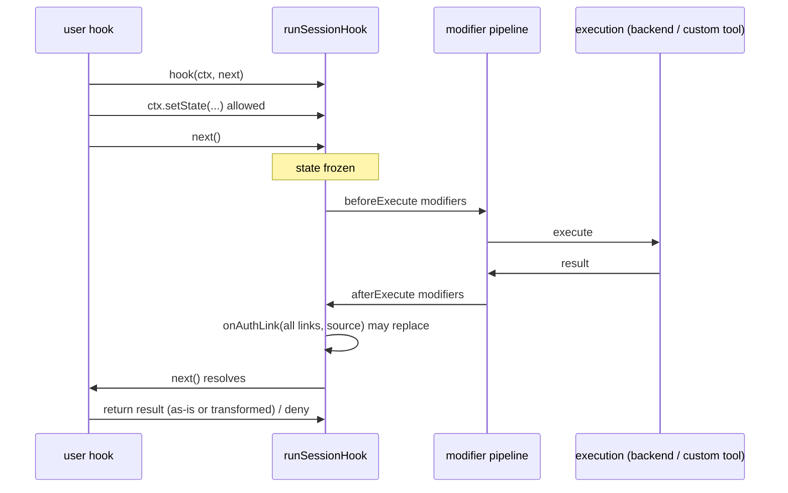

# Lane — Tool Router Session Hooks (Experimental) - Plan

## Goal Capsule

- **Objective:** Implement the accepted session-hooks ADR: experimental `(ctx, next)` middleware on `session.tools(...)` in both SDKs — hook slots `search`, `manageConnections`/`manage_connections`, `execute`, `onAuthLink`/`on_auth_link` — wrapping (not replacing) the existing modifier pipeline.
- **Authority:** `docs/decisions/tool-router-session-hooks.md` is the contract — hook semantics, state rules, denial shape, and the avoid-list are settled there; this plan only adds implementation structure. The Pi provider (`ts/packages/experimental/src/pi/`) is prior art to mirror, explicitly not to refactor.
- **Stop conditions:** additive and non-gating for 1.0 — if it competes with critical-path work, it yields. `session.tools(...)` itself stays stable; only the `hooks` option and its types are experimental.
- **Depends on:** rides Tool Router stabilization (plan 003 U1) — land after or alongside it so the stable `tools(...)` signature is the one being extended. Coordinate merge order with plan 007 U4 (async session tools); whichever lands second adapts.

---

## Product Contract

### Summary

Hooks are client-side policy middleware for session helper behavior: deny a helper call (`ctx.deny(...)`), replace its result, mutate pre-`next()` state (`ctx.setState`), and intercept auth links before the model sees them. Modifiers remain the inner schema/input/output layer. The ADR fixes the contract; the Pi provider fixes the implementation idiom (`runHook` with single-`next()` memoization).

### Requirements

Contract (all from the ADR, restated as checkable items):

- R1. Hook slots: `search`, `manageConnections` (TS) / `manage_connections` (Py), `execute`, `onAuthLink` (TS) / `on_auth_link` (Py); one middleware function per slot; no arrays, no `composeHooks`.
- R2. Continuation semantics: `return next()` continues; `return ctx.deny(reason)` yields the denial shape `{ successful: false, error, data: null, denied: true }`; returning any other value replaces the result; returning nothing without having called `next()` is an SDK error; calling `next()` twice is an SDK error.
- R3. State: `ctx.state` read-only; `ctx.setState`/`ctx.set_state` synchronous, accepts partial or updater function, shallow-merges, reads reflect immediately; updates after `next()` starts throw. Per-hook mutable fields: `search` → `query`, `toolkits`; `manageConnections` → `toolkits`, `reinitiateAll`/`reinitiate_all`; `execute` → identity/request fields only (no schemas, no preloaded connection state).
- R4. `execute` contexts expose `ctx.manageConnections(...)`/`ctx.manage_connections(...)` for explicit connection checks; `onAuthLink` runs once per result with all extracted links, inside `next()`, before the outer hook resumes, carrying `source` (`"search" | "manageConnections" | "execute"` in TS; snake_case source value in Py).
- R5. Order: hooks are the outer layer around the modifier pipeline (before/after-execute modifiers run inside `next()`); replacement/denial without `next()` skips modifiers entirely; hooks apply to locally-routed custom tools with their concrete slug; remote workbench/bash flow through `execute` with their slug when visible.
- R6. Errors propagate from hooks by default (no `catchErrors`); the SDK validates only SDK-created results.
- R7. Placement: TS types in `ts/packages/core/src/types/sessionHooks.types.ts`, runtime in `ts/packages/core/src/utils/sessionHooks.ts`, types exported from `@composio/core`; Python in `python/composio/core/models/_session_hooks.py` with minimal exports under `composio.core.models`. The `hooks` option and types carry experimental markers.
- R8. TS ships a minor changeset; Python documents the feature in changelog/release notes only when release prep is in scope.

### Scope Boundaries

The ADR's avoid-list is binding: no hook arrays, no `composeHooks`, no declarative scoping, no provider/user-id fields in state, no full schemas in execute state, no separate workbench/bash hooks, no hook-level catch. Pi provider is not refactored onto the new runner.

---

## Planning Contract

### Key Technical Decisions

- **KTD1 — Naming (TS).** Public types drop the `Pi` prefix and gain the `Session` scope: `SessionHooks`, `SessionHookNext<T>`, `SessionHookDeniedResult`, contexts `SessionSearchHookContext`, `SessionManageConnectionsHookContext`, `SessionExecuteHookContext`, `SessionAuthLinkContext`; runner `runSessionHook`. All exported from the root barrel with `@experimental` JSDoc.
- **KTD2 — Naming (Py).** `_session_hooks.py` defines `SessionHooks` (a `TypedDict` with the four optional slots — structural, matching the "users can write hooks without importing many types" intent), `SessionHookContext` base class with `state` (read-only mapping view), `set_state`, `deny`; per-slot context subclasses mirror KTD1 names in snake_case file-internal form.
- **KTD3 — Wiring point.** TS: `session.tools(options)` — the existing first parameter (currently named `modifiers`, typed `SessionMetaToolOptions` at `models/ToolRouterSession.ts:188`) gains an optional `hooks?: SessionHooks` field on the type. Python: `def tools(self, modifiers=None, *, hooks=None)` — `hooks` is keyword-only (note the `*`), because the existing `modifiers` is a `List[Modifier]`, not an options object; a keyword-only kwarg is the idiomatic Python equivalent of the ADR's "options surface". This asymmetry is declared, consistent with how modifiers already diverge (inline objects vs decorators).
- **KTD4 — Runner semantics beyond Pi.** Pi's `runHook` memoizes `next()` but does not throw on double-`next()` or enforce state freezing; the core runner adds both (R2, R3): a `nextCalled` flag that throws `ComposioInvalidHookError` (new, catalog-coded per plan 004 conventions, e.g. `COMPOSIO::INVALID_SESSION_HOOK`) on the second call, and a frozen flag flipped when `next()` starts that makes `setState` throw. Directional sketch:

  ```ts
  // utils/sessionHooks.ts — directional, mirrors pi/hooks.ts with R2/R3 guards
  async function runSessionHook<T>(hook, ctx, invoke: () => Promise<T>): Promise<T> {
    if (!hook) return invoke();
    let nextCalled = false;
    const next = async () => {
      if (nextCalled) throw new ComposioInvalidHookError('next() called twice');
      nextCalled = true; ctx._freezeState();
      return invoke();
    };
    const result = await hook(ctx, next);
    if (result === undefined && !nextCalled) throw new ComposioInvalidHookError('hook returned without next() or a result');
    return result === undefined ? ctx._nextResult : result;
  }
  ```

- **KTD5 — Auth-link extraction.** Reuse the extraction approach from Pi's `auth-links.ts` (`applyAuthLinkHandlers`) as the reference for what counts as an auth link and where it runs (inside `next()`); the core implementation lives in `sessionHooks.ts`, not shared with Pi (ADR rule).

### High-Level Technical Design — execution order (R5)



## Implementation Units

### U1. TS types + runner

- **Goal:** R1–R4, R6 type/runtime foundation per KTD1/KTD4.
- **Files:** `ts/packages/core/src/types/sessionHooks.types.ts` (new), `ts/packages/core/src/utils/sessionHooks.ts` (new), `src/index.ts` (exports), `errors/` (new coded error + catalog row), unit tests `test/utils/sessionHooks.test.ts`.
- **Patterns to follow:** `ts/packages/experimental/src/pi/hooks.ts` (runner), `pi/types.ts` (context shapes), `pi/results.ts` (`deny`).
- **Test scenarios (from the ADR verification list):** partial state merge with immediate reads; updater-function merge; `setState` after `next()` throws; double `next()` throws; return-without-next-or-result throws; replacement result bypasses `invoke`; `ctx.deny(...)` yields the exact denial shape; hook exceptions propagate unchanged.
- **Verification:** `pnpm typecheck && pnpm test`.

### U2. TS wiring into `session.tools(...)`

- **Goal:** R5, R7 (TS half).
- **Dependencies:** U1.
- **Files:** `types/modifiers.types.ts` (`SessionMetaToolOptions` + `hooks?`), `models/ToolRouterSession.ts` (wrap search/manage-connections/execute paths and the routing-execute fn), `models/Tools.ts` where `wrapToolsForToolRouter`/`executeSessionTool` thread options, integration tests.
- **Test scenarios:** hooks wrap modifiers in the R5 order (spy-order test); denial without `next()` means modifiers never run; execute hook sees concrete slug for locally routed custom tools; `onAuthLink` fires once per result with all links and correct `source`; sessions without hooks behave byte-identically (regression: existing suites untouched).
- **Verification:** `pnpm typecheck && pnpm test`; plan 003 freeze test updated in the same PR if it locks `SessionMetaToolOptions` keys.

### U3. Python `_session_hooks.py` + wiring

- **Goal:** R1–R7 (Python half) per KTD2/KTD3.
- **Dependencies:** U1 (contract fixed by the TS reference implementation).
- **Files:** `python/composio/core/models/_session_hooks.py` (new), `tool_router_session.py` (`tools(..., *, hooks=...)` + routing-execute wrap), `exceptions.py` (coded invalid-hook error), `python/tests/test_session_hooks.py`.
- **Approach note (async coupling):** design the hook runner to be await-capable from the start — the invoke callable it wraps is the seam plan 007 U4 makes awaitable. If the async lane has landed, run the hook suite against `AsyncComposio` sessions too (hook functions may be `async def` there); if not, keep the runner's core loop transport-agnostic and record the seam in a code comment so the async lane adapts without changing the public hook contract. Whichever lane lands second owns the integration tests.
- **Test scenarios:** the same ADR verification list as U1/U2 in pytest form; `set_state` with dict and with updater callable; hooks + decorator modifiers compose in order; no-hooks path unchanged; `hooks` rejected as a positional argument (keyword-only enforced).
- **Verification:** `cd python && make chk && make type_inference && make tst`.

### U4. Docs + changeset

- **Goal:** R8; experimental labeling per plan 003 KTD4 conventions.
- **Files:** docs page under the Tool Router section, TS changeset (minor), `python/CHANGELOG.md` note if release prep is active.
- **Test scenarios:** docs examples compile/validate under the examples gates; every public hook type carries the experimental marker (grep check).
- **Verification:** `cd docs && bun run lint:links`; `pnpm validate:sdk-parity` (method sets unchanged — hooks add options, not methods).

## Verification Contract

| Gate | Command |
| --- | --- |
| TS | `pnpm typecheck && pnpm test` |
| Python | `cd python && make chk && make type_inference && make tst` |
| Parity | `pnpm validate:sdk-parity` |
| Docs | `cd docs && bun run lint:links` |

## Definition of Done

- All ADR verification scenarios have passing tests in both SDKs; the denial shape and error semantics match the ADR byte-for-byte.
- `hooks` is available on `session.tools(...)` in both SDKs, experimental-labeled, with zero behavior change when absent.
- Pi provider untouched; avoid-list respected (reviewed against the ADR §Consequences list).
- TS minor changeset present.
