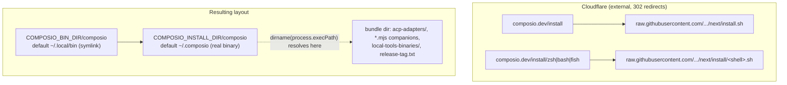

# Mise-Style CLI Installer Rewrite - Plan

## Goal Capsule

- **Objective:** Rewrite `install.sh` as a POSIX-sh, mise-style installer (binary install to `~/.local/bin` by default, install-only default flow, mise-equivalent env-var surface, `/install/zsh|bash|fish` shell variants), extend `composio install` with a `--shell` flag, rewrite the install docs to mise depth, update install-related CI, and add a Docker-based installation e2e workflow.
- **Authority hierarchy:** This plan's Product Contract and KTDs > repo conventions (`AGENTS.md`, nested `AGENTS.md`, `ts/packages/cli/CLAUDE.md`) > implementer judgment. The scope was negotiated with the user across three rounds; do not re-litigate the decisions recorded in KTDs.
- **Execution profile:** Execute in two context-isolated stages. Stage 1 is U1 and ends with a verified stable CLI release. Stage 2 is U2-U8 and consumes only Stage 1's published-contract handoff, not its implementation context. U7-U8 remain an explicit follow-up within Stage 2. See Sequencing and Two-Stage Execution.
- **Stop conditions:** Stop and surface to the user if (a) the Linux e2e falsifies the Bun `process.execPath` symlink-resolution behavior that KTD2 depends on, (b) the Cloudflare redirect rules for `/install/<shell>` cannot be provisioned before docs advertise those URLs, (c) any change would alter product scope (e.g. dropping a preserved env var), (d) the exact U1 beta tag, source commit, six uploaded assets, and installation workflow have not been verified and explicitly approved by the user before `promote-stable`, or (e) `next` does not enforce code-owner review for `install.sh` and `install/**` before U2 merges.
- **Tail ownership:** The implementer owns green CI, docs build, and the Definition of Done checklist. Cloudflare rule changes are external (see Risks & Dependencies) and are requested, not implemented, here.

---

## Product Contract

### Summary

Replace the current bash-only `install.sh` (which installs everything into `~/.composio`, edits rc files, and installs agent plugins by default) with a POSIX-sh installer modeled on mise: the default `curl -fsSL https://composio.dev/install | sh` performs a verified binary-bundle install and nothing else, the `composio` entry point lands on a directory that is already on PATH on mainstream distros (`~/.local/bin`), and shell-specific setup (rc file, PATH line, completions) moves behind explicit `/install/zsh|bash|fish` endpoints that delegate to the binary's own `composio install --shell <shell>` command. The docs `## Install` section is rewritten to mise depth, install-related CI is updated to the new contract, and a new Docker-based e2e workflow proves the flow end-to-end in fresh zsh and bash-only containers.

### Problem Frame

The current installer has caused real "composio: command not found" failures (the user's CTO hit it on a fresh Ubuntu box): `~/.composio` is never on PATH by default, PATH guidance has been silently broken by TTY-gating regressions (#3450, fixed by #3951), and the only channels that gave instant PATH availability (npm, Homebrew) were decommissioned in #3960. The installer is also bash-only while documented as pipe-to-shell, mutates rc files and installs plugins without opt-in, and its behavior is under-documented (a 2-line docs snippet; a factually wrong `INSTALL.md`). Structural fix: install the entry point to `~/.local/bin` (on PATH by default via `~/.profile` on Debian/Ubuntu skeletons), make the default flow install-only like mise, and give shell setup an explicit, documented, idempotent path.

### Requirements

**Installer script**

- R1. The default `curl -fsSL https://composio.dev/install | sh` flow performs only: platform detection, version resolution, download, sha256 verification, bundle install into `COMPOSIO_INSTALL_DIR` (default `~/.composio`), entry-point symlink into `COMPOSIO_BIN_DIR` (default `~/.local/bin`), a `composio --version` smoke probe, and post-install guidance. No rc-file edits, no `composio install` delegation, no plugin setup, no login. The guidance must classify reachability: when the bin dir is missing from the current `PATH`, **or** `~/.bash_profile`/`~/.bash_login` exists (bash login shells read only the first of `~/.bash_profile`, `~/.bash_login`, `~/.profile` — so Debian/Ubuntu's skeleton `~/.profile` line that adds `~/.local/bin` never runs for those users), present the `/install/<shell>` step as a required next step, not an optional one.
- R2. Every served script is POSIX sh: runs under `sh` and `dash` with no bashisms or implementation-specific builtins (no `[[ ]]`, arrays, `pipefail`, process substitution, `local`, `echo -e`, here-strings, `(( ))`). `shellcheck -s sh` passes without suppressing POSIX portability findings.
- R3. Env/arg contract per KTD3's table: existing vars keep their current meaning (`COMPOSIO_INSTALL_DIR` remains the complete bundle directory; `COMPOSIO_INSTALL_PLUGINS`, `COMPOSIO_GITHUB_{OWNER,REPO,URL,API_BASE_URL}`, positional version tag, `--agent`, `--no-plugins`, `-h/--help` remain supported); new vars are `COMPOSIO_BIN_DIR`, `COMPOSIO_INSTALL_VERSION`, `COMPOSIO_QUIET`, `COMPOSIO_DEBUG`, `COMPOSIO_INSTALL_HELP`. `COMPOSIO_INSTALL_PLUGINS` default flips from `1` to `0`.
- R4. Supply-chain guards are preserved and extended: https-only `COMPOSIO_GITHUB_URL`/`COMPOSIO_GITHUB_API_BASE_URL`/`COMPOSIO_INSTALL_SCRIPT_URL` (with the exact-host http exception of KTD6), identifier-safe owner/repo validation, validation of every constructed or API-returned download URL before use, curl protocol restrictions that reject redirect downgrade, sha256 verification against the release's `checksums.txt` (mismatch fatal; missing checksum warn-and-continue, matching current behavior — note this verifies transport and asset integrity only, since `checksums.txt` shares the archive's origin; it is not signing), stable-only automatic resolution (`@composio/cli@X.Y.Z`), strictly validated explicit stable or beta tags (`@composio/cli@X.Y.Z` or `@composio/cli@X.Y.Z-beta.N`) so the release workflow can test published betas, no `git` usage, and the KTD9 single-entrypoint structure on every served script.
- R5. Shell-variant scripts served at `/install/zsh|bash|fish` run the base install then delegate shell setup to `composio install --shell <shell>`, with the fallback chain of KTD5 for older released binaries and broken binaries.

**CLI command**

- R6. `composio install` gains a `--shell <zsh|bash|fish>` option that overrides `$SHELL` detection; everything downstream of detection is already a pure function of the shell value.
- R7. `composio install` writes a PATH block that targets the bin dir (resolution order per KTD4), stays marker-idempotent, and keeps completions behavior (bash in `~/.bashrc`, fish separate file, zsh skipped). Auto-detected-shell mode may skip PATH writes when the bin dir is already on the invoking `PATH`; an explicit `--shell` request must configure the requested shell's startup files regardless of the invoking process's `PATH`.
- R8. The restart hint bug is fixed: bash prints `source ~/.bashrc` instead of the literal string `exec $SHELL`; when a login override file (`~/.bash_profile` or `~/.bash_login`) is updated, the hint also says that entry applies to new login shells.

**Serving**

- R9. Shell-variant scripts ship as files in this repo (`install/zsh.sh`, `install/bash.sh`, `install/fish.sh`) compatible with the existing Cloudflare-redirect scheme; the redirect model is kept for launch (KTD1). The three new redirect rules are an external dependency.

**Docs**

- R10. The `## Install` section of `docs/content/docs/cli.mdx` is rewritten to mirror mise's install docs structure and depth: canonical one-liner, options/env-var table, shell-specific variants, install verification, alternatives (manual GitHub-release install), uninstall.
- R11. Every other occurrence of the install one-liner is updated in lockstep to `curl -fsSL https://composio.dev/install | sh`: `docs/lib/source.ts`, `docs/components/ai-tools-banner.tsx`, `docs/components/home-surfaces.tsx`, `README.md`, `docs/content/docs/claude-code-plugin.mdx`, `INSTALL.md` (full factual rewrite), plus a docs changelog entry.

**CI and e2e**

- R12. Install-related CI is updated to the new contract: `test/install-sh-release-resolution.test.sh` (ported to invoke `sh`/`dash`), `.github/workflows/cli.test-installation.yml`, `.github/workflows/cli.install-health-check.yml`, the smoke test in `.github/workflows/build-cli-binaries.yml`, and the literal-string assertions in `test/release-workflow.test.ts`.
- R13. A new Docker-based install e2e exists: two container images (zsh, bash-only), Bun-coordinated under `ts/e2e-tests/cli/` conventions, asserting `composio` is on PATH in a fresh login shell after install. PR mode uses one locally built, explicitly tagged CLI bundle served from a local Bun server. Nightly production coverage runs `latest` on bash and zsh plus one exact pre-`--shell` compatibility case, `@composio/cli@0.3.1` on zsh.

**Compatibility**

- R14. Already-released binaries keep working throughout rollout: the default flow never requires new CLI flags, and variant scripts degrade gracefully when `--shell` is unsupported (KTD5).
- R15. Existing installs migrate without reinterpreting `COMPOSIO_INSTALL_DIR`: re-running the installer upgrades the complete bundle in that directory (default `~/.composio`) and creates the entry-point symlink in `COMPOSIO_BIN_DIR` (default `~/.local/bin`). A legacy rc export such as `COMPOSIO_INSTALL_DIR="$HOME/.composio"` therefore remains correct and no longer needs heuristic leak detection; old PATH blocks pointing at the bundle remain functional alongside the new symlink. Setting `COMPOSIO_BIN_DIR=$COMPOSIO_INSTALL_DIR` deliberately selects the legacy single-directory layout with no symlink.

### Acceptance Examples

- AE1. **Fresh Ubuntu, bash only** (the CTO scenario): run the default one-liner in a container with no `~/.local/bin`; open a fresh login shell (`bash -ilc`); `composio --version` succeeds because Ubuntu's skeleton `~/.profile` puts `~/.local/bin` on PATH once it exists.
- AE2. **zsh via variant:** `curl -fsSL https://composio.dev/install/zsh | sh` in a zsh container; fresh `zsh -ilc 'composio --version'` succeeds via the rc block written by `composio install --shell zsh`.
- AE3. **Pinned version:** `COMPOSIO_INSTALL_VERSION=0.1.32 sh` and positional `@composio/cli@0.1.32` both install that tag; positional wins when both are set; bare `X.Y.Z` is normalized to `@composio/cli@X.Y.Z`; an explicitly supplied `@composio/cli@X.Y.Z-beta.N` installs that published beta, while automatic resolution never selects a prerelease.
- AE4. **Tampered download:** a zip whose sha256 does not match `checksums.txt` aborts the install with a fatal error before anything is written to the install dirs.
- AE5. **Deliberate legacy layout:** `COMPOSIO_INSTALL_DIR=$HOME/.composio COMPOSIO_BIN_DIR=$HOME/.composio` installs the complete bundle into `~/.composio` and creates no symlink.
- AE5b. **Legacy migration:** on a machine whose rc file contains the old `# Composio CLI` block exporting `COMPOSIO_INSTALL_DIR="$HOME/.composio"`, re-running the installer upgrades the bundle in `~/.composio`, creates `~/.local/bin/composio` because `COMPOSIO_BIN_DIR` is unset, and leaves the old working PATH block untouched.
- AE6. **Upgrade preserves symlink:** with the new layout in place, `composio upgrade` replaces `~/.composio/composio` and its sidecars; `~/.local/bin/composio` remains a symlink pointing at the refreshed binary. U7 proves symlinked execution, bundle-relative sidecar placement, and version lookup; a focused `upgrade-binary` unit test proves replacement leaves the entry-point symlink unchanged.
- AE7. **Variant against an old release:** `/install/zsh` with a pinned pre-`--shell` CLI version detects that `composio install --help` lacks `--shell` and uses the inline rc-append fallback for the requested shell. If `--shell` is advertised but its invocation fails, the same fallback runs. The variant never retries plain `composio install` or configures a different shell.

### Scope Boundaries

**In scope:** everything in Requirements; the exact file list per unit.

**Deferred to Follow-Up Work**

- Direct-serve (Cloudflare Worker proxy à la `mise.run`, enabling `curl https://composio.dev/install | sh` with no `-L`). Reference implementation: mise's `cloudflare/workers/mise-run.js`. Revisit after the redirect-based launch proves out.
- Additional mise vars not in confirmed scope: `COMPOSIO_INSTALL_OS`/`COMPOSIO_INSTALL_ARCH` overrides, `COMPOSIO_INSTALL_SKIP_IF_EXISTS`, musl/archive-format controls.
- A `composio uninstall` command (docs document manual uninstall for now).
- Client-side protocol pinning in the canonical one-liner (`--proto '=https' --proto-redir '=https'`, the rustup pattern). It would backstop a Cloudflare rule whose redirect target is ever changed to http, but it lengthens the one-liner users have memorized; the primary mitigation (https redirect target, https raw.githubusercontent) already holds.
- A dedicated `/docs/install` page (the rewrite stays in `cli.mdx` per docs conventions).

**Outside this product's identity**

- Windows-native support (WSL redirect message stays).
- Re-introducing npm/Homebrew channels (decommissioned in #3960).

---

## Planning Contract

### Key Technical Decisions

- KTD1. **Keep the Cloudflare 302-redirect serving model for launch; resolve the redirect-vs-direct-serve fork in favor of redirect.** The canonical one-liner keeps `-fsSL` (`-L` follows the 302), which is already the documented muscle memory. Direct-serve requires deploying and owning a Cloudflare Worker from outside this repo (mise's approach); the redirect needs only three one-line rules (`/install/zsh|bash|fish` → `https://raw.githubusercontent.com/ComposioHQ/composio/refs/heads/next/install/<shell>.sh`). mise's strongest argument for direct-serve — baking per-release checksums into the served script — does not apply: Composio verifies checksums dynamically from the release's `checksums.txt`. Direct-serve is recorded as deferred follow-up.
- KTD2. **Two-directory layout with preserved bundle-dir semantics.** The full bundle (binary + run-companion sidecars + `local-tools-binaries/` + `release-tag.txt`) installs to `COMPOSIO_INSTALL_DIR`, whose existing meaning and default (`~/.composio`) remain unchanged. The user-facing entry point is a symlink `$COMPOSIO_BIN_DIR/composio → $COMPOSIO_INSTALL_DIR/composio`, with `COMPOSIO_BIN_DIR` defaulting to `~/.local/bin`. When the resolved directories are equal, the bundle's real binary is already the entry point and no symlink is created. This separation means an inherited legacy `COMPOSIO_INSTALL_DIR="$HOME/.composio"` is valid bundle configuration rather than a value that needs heuristic rc-file detection. **Verified 2026-07-31 (Bun 1.3.10, compiled binary):** `process.execPath` resolves symlinks to the real path for relative symlinks, absolute symlinks, and PATH lookups; on Linux this is guaranteed by `/proc/self/exe` semantics. Consequence: all `path.dirname(process.execPath)` sidecar resolvers (11 call sites incl. `ts/packages/cli/src/services/run-companion-modules.ts`, `effects/version.ts`, `effects/install-skill.ts`, `cli-local-tools/src/bundled-binaries.ts`), companion self-repair, and `services/upgrade-binary.ts` (`replaceBinary` targets `process.execPath`, i.e. the real file) operate on the configured bundle directory with **zero CLI resolver changes**. The e2e (U7) pins this behavior. Sidecar resolvers take `execPath` as a parameter threaded from `process.execPath` at the entry points — grep for `execPath`, not `process.execPath`, when auditing. The installer replaces an existing regular file at the symlink path (a pre-existing copy) and errors if the target is a directory.
- KTD3. **Env-var surface** (mirrors mise capabilities, prefers existing Composio names — user decision):

  | Variable / arg | Default | Behavior |
  |---|---|---|
  | `COMPOSIO_INSTALL_DIR` | `$HOME/.composio` | Existing. Directory receiving the complete binary bundle and `release-tag.txt`; its meaning does not change. |
  | `COMPOSIO_BIN_DIR` | `$HOME/.local/bin` | New. Directory receiving the `composio` entry-point symlink. If it resolves to `COMPOSIO_INSTALL_DIR`, no symlink is needed. |
  | `COMPOSIO_INSTALL_VERSION` | latest stable | New. Pins the release. Accepts `@composio/cli@X.Y.Z`, `@composio/cli@X.Y.Z-beta.N`, or the corresponding bare value (normalized). Automatic resolution remains stable-only. **Not** `COMPOSIO_VERSION`: that name is taken by the CLI config service's debug-override surface (`ts/packages/cli/test/src/services/config.test.ts:314`, `DEBUG_OVERRIDE_CONFIG`). |
  | positional `version-tag` | — | Highest-precedence version pin (positional > env > latest). Same stable/beta validation and normalization. |
  | `COMPOSIO_QUIET` | unset | New. `1`/`true` silences progress info; warnings and errors still print (mise `MISE_QUIET` semantics). |
  | `COMPOSIO_DEBUG` | unset | New. `1`/`true` traces commands (curl invocations, resolved URLs, temp paths) to stderr (mise `MISE_DEBUG` semantics). |
  | `COMPOSIO_INSTALL_HELP` | unset | New. `0` suppresses the post-install guidance block; set by the shell-variant scripts, which print their own tail (mise `MISE_INSTALL_HELP` semantics). |
  | `COMPOSIO_INSTALL_PLUGINS` | `0` (**was `1`**) | `1` opts in to `composio setup --target auto --yes --if-present` after install. |
  | `COMPOSIO_GITHUB_{OWNER,REPO,URL,API_BASE_URL}` | unchanged | Same validation as today, plus KTD6's loopback http exception. |
  | `--agent` | off | Unchanged: runs `composio login --agent --no-skill-install` after install. |
  | `--no-plugins` | — | Kept for back-compat; now matches the default. |

- KTD4. **`composio install` bin-dir and startup-file rules.** Bin-dir resolution order is `COMPOSIO_BIN_DIR` env (the new installer passes it at delegation) → `~/.local/bin` if `~/.local/bin/composio` exists → `path.dirname(process.execPath)` (the real binary's dir, always a correct PATH target). The rc block becomes marker + literal PATH line only; drop the historical `export COMPOSIO_INSTALL_DIR=...` line because that variable continues to identify the bundle, not the PATH entry point. In auto-detected-shell mode, the command may skip PATH writes when the bin dir is already on the invoking `PATH`. With explicit `--shell`, it must inspect and configure the requested shell's files regardless of the invoking `PATH`. Zsh writes `~/.zshrc`; fish writes `~/.config/fish/config.fish`; bash writes PATH setup to `~/.bashrc` and, when present, also to the first active login override (`~/.bash_profile`, then `~/.bash_login`) so `bash -ilc` cannot bypass it. Bash completions remain in `~/.bashrc` only. Marker checks are per file and remain idempotent. Touching `install.cmd.ts:189-190` requires regenerating `ts/packages/cli/lint-boundaries.json` (`pnpm run validate:boundaries -- --update`), which pins that exact source line.
- KTD5. **Variant delegation with one capability probe.** After the base installer succeeds, locate the installed executable and inspect `"$exe" install --help` for `--shell`. If supported, run `COMPOSIO_BIN_DIR="$bin_dir" "$exe" install --shell <shell>` with stderr attached; if unsupported or that invocation fails, use the inline fallback for the requested shell. Do not add a separate `--version` probe, a requested-vs-current-shell branch, a plain `composio install` retry, or a legacy `COMPOSIO_INSTALL_DIR="$bin_dir"` handoff. Before any inline rc write, validate the resolved bin dir with the CLI's exact unsafe-character policy (`;`, backtick, `$`, `|`, `&`, quotes, parentheses, newline, carriage return, and backslash) and abort without modifying files on rejection; only after validation may rendering substitute a literal `$HOME/` prefix. Inline fallback writes the same per-shell PATH destinations as KTD4: zsh `~/.zshrc`; fish `~/.config/fish/config.fish`; bash `~/.bashrc` plus the first existing login override among `~/.bash_profile`/`~/.bash_login`. An explicit shell variant never suppresses these writes merely because the invoking `PATH` already contains the bin dir. Keeping stderr attached preserves the CLI's PATH guidance via `canDecorate` gating (regression class of #3450).
- KTD6. **Exact-host http exception and redirect policy for hermetic tests:** the https-only validation on `COMPOSIO_GITHUB_URL`/`COMPOSIO_GITHUB_API_BASE_URL`/`COMPOSIO_INSTALL_SCRIPT_URL` additionally accepts `http://` iff the host is true loopback — `localhost`, `127.0.0.1`, `[::1]` (with optional port). `host.docker.internal` is **not** in that set: it is an ordinary hostname that Docker injects into `/etc/hosts` inside containers but that resolves through the normal resolver everywhere else, so allowing it unconditionally would let a rogue LAN resolver serve both the archive and its `checksums.txt` over plaintext. The e2e opts in explicitly via `COMPOSIO_INSTALL_ALLOW_HTTP_HOST=host.docker.internal` (single hostname, exact match, testing-internal — documented in a script comment, never in user docs); without that variable, `http://host.docker.internal` is rejected like any other host. Apply the same parser to every constructed checksum URL and API-returned `browser_download_url`; userinfo and suffix lookalikes never count as an allowed host. Centralize curl calls so https inputs use `--proto '=https' --proto-redir '=https'`, while an explicitly allowed direct-http test URL may enable `http` for the initial request but still permits only https after a redirect. The local server therefore serves allowed http endpoints directly without redirects.
- KTD9. **Single-entrypoint structure, without an arbitrary-truncation guarantee.** `install.sh` and the three variant scripts contain function definitions followed by a single `main "$@"` invocation as the final top-level command. This keeps operational work out of the definition section and avoids an incomplete operational tail. It does **not** promise that every byte-prefix truncation is inert: a stream ending after a syntactically complete `main` token can execute it. That stronger compound-command construction is explicitly out of scope as disproportionate to mise parity. The live `mise.run` script inspected on 2026-07-31 is less strict: after its function definitions it executes bare top-level `install_mise`, then conditionally calls `after_finish_help`; it therefore has the same class of truncation exposure. Variant scripts still download the base installer to a temporary file and require curl success before executing it, as specified in U3.
- KTD7. **Keep existing workflow coverage at launch.** The new Docker e2e adds clean images, fresh-login-shell PATH assertions, and unreleased-CLI validation without replacing either existing workflow. `cli.install-health-check.yml` remains the cheap hourly production monitor with Slack alerting, with assertions updated to the new layout. `cli.test-installation.yml` keeps its current Linux and macOS coverage. After several green scheduled U8 runs, any deduplication is a separate cleanup with its own review; it is not part of U8 or this plan's Definition of Done.
- KTD8. **Version normalization moves into the installer without breaking beta verification:** automatic discovery accepts only stable `@composio/cli@X.Y.Z` releases; explicit positional/env pins accept strictly validated stable or workflow-shaped beta tags (`@composio/cli@X.Y.Z-beta.N`) and normalize the corresponding bare values. This keeps the short docs form (`COMPOSIO_INSTALL_VERSION=0.1.32`) while allowing `build-cli-binaries.yml` to install-test its published beta.

### High-Level Technical Design

Install flows (default vs shell-variant, with the KTD5 fallback chain):

```mermaid
flowchart TB
  subgraph default["curl -fsSL composio.dev/install | sh"]
    A[validate args + env] --> B[detect platform] --> C[resolve version<br/>positional > COMPOSIO_INSTALL_VERSION > latest stable]
    C --> D[download zip + checksums.txt] --> E{sha256 ok?}
    E -->|no| F[fatal error]
    E -->|yes| G[install bundle to COMPOSIO_INSTALL_DIR<br/>default ~/.composio; write release-tag.txt]
    G --> H{COMPOSIO_BIN_DIR == COMPOSIO_INSTALL_DIR?}
    H -->|yes| I[legacy layout: no symlink]
    H -->|no| J[symlink COMPOSIO_BIN_DIR/composio<br/>-> COMPOSIO_INSTALL_DIR/composio]
    I --> K[probe: composio --version]
    J --> K
    K --> L{COMPOSIO_INSTALL_PLUGINS=1?} -->|yes| M[composio setup --target auto --yes --if-present]
    L -->|no| N{COMPOSIO_INSTALL_HELP != 0?}
    M --> N
    N -->|yes| O[print PATH status + per-shell hint]
  end
  subgraph variant["curl -fsSL composio.dev/install/zsh | sh"]
    V0[download base script to temp file<br/>require curl success; run A..K with args forwarded] --> V2{--shell supported?}
    V2 -->|yes| V3[composio install --shell zsh]
    V3 -->|fail| V4[inline POSIX rc-append fallback]
    V2 -->|no| V4
    V3 -->|ok| V6[print restart hint]
    V4 --> V6
  end
```

Serving and layout after install:



### Assumptions

- A1. `~/.local/bin` reaches PATH via exactly one mechanism on Debian/Ubuntu: the skeleton `~/.profile` guard `if [ -d "$HOME/.local/bin" ]` (evaluated at login — the dir must exist when the shell starts). The entry is lost in three known ways: (a) non-login shells that never source `~/.profile`, (b) bash users with `~/.bash_profile` or `~/.bash_login` — bash reads only the first of `~/.bash_profile`, `~/.bash_login`, `~/.profile`, so `~/.profile` (and its `~/.bashrc` sourcing) is skipped entirely, (c) zsh login shells, which never read `~/.profile`. That is why the default-flow tail must escalate to a required `/install/<shell>` hint in those cases (R1) and why the variant/`--shell` path writes an rc block.
- A2. Bun's compiled-binary `process.execPath` symlink resolution (verified on 1.3.10/darwin; `/proc/self/exe`-backed on Linux) is stable across the Bun versions used by `build-cli-binaries.yml`. The U7 e2e turns this assumption into a regression gate.
- A3. `raw.githubusercontent.com` serves the merged script within its normal CDN staleness window (~5 min); no extra cache-busting is needed.
- A4. The Cloudflare rules are managed by whoever owns the `composio.dev` zone today (outside this repo); requesting them is a coordination task, not a code task.

### Sequencing

1. **U1 first, released *stable* before anything else merges.** `install.sh` is served live from `next` on merge and must work against already-released binaries; conversely, the variant scripts want a released CLI that understands `--shell`. Note the release mechanics: merging U1 to `next` only produces a **beta** build (`build-cli-binaries.yml` push trigger), and the installer's automatic tag filter `^@composio/cli@[0-9]+\.[0-9]+\.[0-9]+$` makes betas invisible to latest-version discovery even though explicit beta pins remain valid. After the automatic beta finishes, resolve it from live GitHub state, verify its exact tag and source commit, all six uploaded assets, and the green installation workflow, then stop and obtain explicit user approval for that candidate before dispatching `promote-stable`. U2-U5 may merge only after the resulting stable `@composio/cli@X.Y.Z` containing `--shell` is published. `@composio/cli` is Changesets-ignored — release notes go in `CHANGELOG.md`.
2. **U2-U5 merge together** (installer rewrite + variants + script tests + CI updates) — CI must flip to the new contract in the same PR or the workflows go red.
3. **U6 (docs) merges after the Cloudflare `/install/<shell>` rules are confirmed live** (external dependency), so docs never advertise dead URLs. The base-flow docs changes could ship with U2-U5 if the variant section is the only gated part; prefer one docs PR after confirmation for simplicity.
4. **U7-U8 (e2e) follow after the rewrite lands** — explicit user-sequenced follow-up.

---

### Two-Stage Execution

The stages are sequential, not parallel: Stage 2 requires Stage 1's stable release. They are independent implementation contexts: a Stage 2 implementer treats the published CLI behavior as an external contract and does not need the U1 source diff or its design history.

#### Stage 1 — CLI capability release

- **Scope:** U1 only: `composio install --shell`, bin-directory PATH logic, and the restart-hint fix.
- **Completion gate:** Focused CLI tests, boundary validation, root lint/typecheck, then a stable `@composio/cli` release. Verify the exact tag, source commit, six assets, and installation workflow; obtain explicit approval before promoting the verified beta candidate.
- **Handoff artifact:** Record the stable version/tag, source commit, asset-verification evidence, and this immutable CLI contract: `composio install --shell zsh|bash|fish` configures the explicitly requested shell and honors `COMPOSIO_BIN_DIR` for PATH setup.
- **Context rule:** A fresh Stage 2 context reads this handoff plus the installer product contract and U2-U8; it does not need U1 implementation files, tests, or release mechanics.

#### Stage 2 — Installer rollout and system proof

- **Scope:** U2-U8: POSIX installer, shell variants, hermetic script tests, CI/CODEOWNERS, docs, Docker e2e, and its workflow.
- **Entry gate:** The Stage 1 handoff is complete and its stable CLI version is publicly installable. Cloudflare redirect confirmation remains a separate gate for U6's variant documentation.
- **Execution contexts:** Use fresh implementation contexts for U2-U5 (atomic live-on-merge installer change), U6 (documentation), and U7-U8 (Docker e2e and CI). Each context relies on the published Stage 1 contract and its own unit-level verification, not on prior context history.
- **Completion gate:** All U2-U8 verification passes, post-merge production checks are green, and the Definition of Done is satisfied.

---

## Implementation Units

### U1. `composio install --shell` flag, bin-dir PATH logic, restart-hint fix

- **Goal:** The CLI command can be invoked shell-targeted by the variant scripts and writes correct PATH guidance for the new layout.
- **Requirements:** R6, R7, R8; enables R5, R14.
- **Dependencies:** none (ships first).
- **Files:** `ts/packages/cli/src/commands/install.cmd.ts`, `ts/packages/cli/test/src/commands/install.cmd.test.ts`, `ts/packages/cli/lint-boundaries.json` (regenerate), `ts/packages/cli/CHANGELOG.md`.
- **Approach:** Add `Options.choice('shell', ['zsh','bash','fish'] as const).pipe(Options.optional)` and unwrap the resulting `Option` with `Option.getOrUndefined`; the explicit value replaces `detectShell` only when present (precedent: optional `--mode` in `dev.cmd.ts`, not defaulted `--target` in `setup.cmd.ts`). Replace the hardcoded `~/.composio` default at `install.cmd.ts:189-190` with KTD4's `COMPOSIO_BIN_DIR` resolution order; `COMPOSIO_INSTALL_DIR` remains the installer's bundle directory and is no longer the CLI command's PATH input. Rc blocks contain exactly the `# Composio CLI` marker plus a literal PATH line (and the fish equivalent). **Exact-string rules:** the current `pathBlockForShell` interpolates the raw directory (`tildify` is display-only — do not emit `~`, which does not expand inside quotes); emit the absolute bin dir, substituting a literal `$HOME/` prefix for the home directory *after* the `isUnsafePath` check (that check rejects `$`, so the substitution must not run before it). Drop the historical `export COMPOSIO_INSTALL_DIR=...` line everywhere it is emitted, including the undetected-shell fallback message and fish block. Split bash PATH destinations from completion destinations: PATH goes to `~/.bashrc` plus the first existing login override (`~/.bash_profile`, then `~/.bash_login`), while completions remain only in `~/.bashrc`. In auto-detected-shell mode, a bin dir already present on the invoking `PATH` produces no PATH write or restart hint. In explicit `--shell` mode, do not use the invoking `PATH` to suppress the requested shell's marker-idempotent writes. Read `PATH`, `SHELL`, and `COMPOSIO_BIN_DIR` via `effect/Config`, then pass resolved values into pure helpers rather than adding new raw-environment boundaries. Fix restart hints per R8 and keep other completions semantics unchanged. Existing tests at `install.cmd.test.ts:321/:349/:432` assert the old block content and marker-always semantics — rewrite them to the new contract.
- **Patterns to follow:** `ts/packages/cli/src/commands/setup.cmd.ts` for `Options.choice`; existing atomic-write and marker logic in `install.cmd.ts` (keep both); test conventions in `install.cmd.test.ts` (`[When]`/`[Then]`, `TestLive`).
- **Test scenarios:**
  - `--shell zsh|bash|fish` overrides a conflicting `$SHELL` (e.g. `SHELL=/bin/bash` + `--shell zsh` writes `~/.zshrc`).
  - Existing `composio install` invocation with no `--shell` still parses and follows auto-detection.
  - Covers AE2 (partially). `COMPOSIO_BIN_DIR=/custom/bin composio install --shell zsh` writes a PATH line for `/custom/bin`.
  - Auto-detected shell + bin dir already on `PATH` → nothing written, "already on PATH" reported, no restart hint; bin dir not on `PATH` → block written.
  - Explicit `--shell zsh` with a conflicting invoking shell and with the bin dir already on the invoking `PATH` still writes `~/.zshrc`; re-run produces no duplicate marker or line.
  - Emitted PATH line uses `$HOME/`-prefixed absolute path — never a literal `~` (tilde does not expand inside double quotes).
  - Env unset, `~/.local/bin/composio` exists → PATH line targets `~/.local/bin`; env unset and no symlink → targets `dirname(process.execPath)`.
  - Bash always configures `~/.bashrc`; when `~/.bash_profile` exists it also receives one PATH block, and when only `~/.bash_login` exists that file receives the login PATH block. `bash -ilc 'command -v composio'` succeeds in both cases.
  - Bash hint prints `source ~/.bashrc` plus a login-shell note when a login override changed; no literal `exec $SHELL` anywhere in output.
  - Existing per-shell, completions, unsafe-path, non-TTY-stderr tests still pass with updated expectations (block no longer contains `COMPOSIO_INSTALL_DIR=`).
- **Verification:** CLI package vitest suite green; `pnpm run validate:boundaries` green; `command pnpm run lint` and `pnpm typecheck` green.

### U2. Rewrite `install.sh` (POSIX, install-only default, new layout and env surface)

- **Goal:** The served installer implements R1-R4 and KTD2/KTD3/KTD6/KTD8.
- **Requirements:** R1, R2, R3, R4, R14, R15.
- **Dependencies:** U1 released (only so the ecosystem is ready; the default flow itself has no new-CLI dependency).
- **Files:** `install.sh`.
- **Approach:** Full rewrite as `#!/bin/sh` + `set -eu`, structured per KTD9 (all logic in functions; a single `main "$@"` as the last line). Port every behavior worth keeping from the current script: validation order (args → platform → prereqs, which the tests assert), owner/repo/URL validation, WSL message, Rosetta detection, 5-page GitHub releases pagination with the stable-tag awk/sed filter, `composio-<target>.zip` asset match, checksum handling, `mktemp -d` + `trap` cleanup, bundle install preserving relative paths in `COMPOSIO_INSTALL_DIR`, `release-tag.txt`, `COMPOSIO_CLI_INVOCATION_ORIGIN=installer` tagging, `--agent`/`--no-plugins`/positional-tag parsing. New behavior: KTD3 env surface (`COMPOSIO_BIN_DIR`, `COMPOSIO_INSTALL_VERSION` with KTD8 stable/beta normalization, `COMPOSIO_QUIET` info-gating, `COMPOSIO_DEBUG` tracing, `COMPOSIO_INSTALL_HELP`), KTD2 symlink step comparing the separately resolved bundle/bin dirs and handling existing files/directories, plugins default `0`, install-only default (no `composio install` delegation in the default flow; keep the `--version` probe as a smoke check), KTD6 exact-host/protocol policy applied to configured, constructed, and API-returned URLs, and a mise-style tail: print install status, whether the bin dir is on PATH, and per-`$SHELL` guidance pointing at `/install/<shell>` (suppressed by `COMPOSIO_INSTALL_HELP=0` or `COMPOSIO_QUIET=1`). Automatic release discovery stays stable-only; explicit env/positional tags accept the strict beta shape required by the binary release workflow. Replace bashisms per the inventory (use `printf`, `case` instead of `[[ =~ ]]` where possible or `expr`/`grep` for regex, positional-args iteration instead of arrays, `while read` loops without process substitution); do not use `local` in any served script. Keep external-tool usage PATH-shadowable (`curl`, `unzip`, `uname`, `sha256sum`/`shasum`, `ln`, `mktemp`) — the test harness depends on it; no `git`.
- **Execution note:** Port the unit-test harness (U4) in lockstep. The harness remains Bash, but runs every installer case once with `sh` and again with `dash` when available, creating a fresh home/install/temp fixture per interpreter. The harness is the fastest feedback loop for this file.
- **Test scenarios:** covered by U4 (script-level); U7 is the post-merge system regression gate and is not a completion dependency for U2.
- **Verification:** `bash test/install-sh-release-resolution.test.sh` green with its internal `sh`/`dash` matrix; `shellcheck -s sh install.sh` clean with no POSIX-portability disables.

### U3. Shell-variant scripts `install/zsh.sh`, `install/bash.sh`, `install/fish.sh`

- **Goal:** `/install/<shell>` endpoints deliver base install + deterministic shell setup (R5).
- **Requirements:** R5, R9, R14.
- **Dependencies:** U2 (shares the base flow).
- **Files:** `install/zsh.sh`, `install/bash.sh`, `install/fish.sh` (new directory at repo root, beside `install.sh`).
- **Approach:** Three small POSIX scripts generated from one shape (hand-written near-identical files are fine at n=3; a generator is over-engineering — mise generates because it templates checksums, which we don't). Each defines its own `info`/`error` honoring `COMPOSIO_QUIET`/`COMPOSIO_DEBUG`; validates the production or overridden `COMPOSIO_INSTALL_SCRIPT_URL` under KTD6; downloads the base script with the centralized protocol policy to `"$tmpdir/install.sh"`; aborts before any rc write if the download fails or is empty; then runs `COMPOSIO_INSTALL_HELP=0 sh "$tmpdir/install.sh" "$@"`, forwarding every positional flag/version and the caller's environment. Only after that command succeeds does it locate the real binary at `${COMPOSIO_INSTALL_DIR:-$HOME/.composio}/composio`, resolve and safety-check `${COMPOSIO_BIN_DIR:-$HOME/.local/bin}` under KTD5, and apply the fallback chain with `COMPOSIO_CLI_INVOCATION_ORIGIN=installer` set and stderr left attached. Tail prints the restart hint ("restart your shell or run `source ...`") mirroring mise's variant tail. Mode-(b)-style overrides keep working because the child `sh` inherits `COMPOSIO_GITHUB_*`, `COMPOSIO_INSTALL_DIR`, and `COMPOSIO_BIN_DIR`. A piped script cannot know the origin it was itself fetched from, so hardcode the production URL and allow a `COMPOSIO_INSTALL_SCRIPT_URL` override (consumed first by U4's harness, then by U7's e2e; document as internal/testing in a script comment, never in user docs). Structure each variant per KTD9 (function definitions + a final `main "$@"`) without `local` or other non-POSIX builtins.
- **Test scenarios:**
  - Covers AE2, AE7 (container-level in U7): variant → fresh-shell PATH assertion; pinned old release → target-specific inline fallback.
  - Script-level (U4 harness, fake `curl`/`composio`): capability probe checks `install --help` output for `--shell`; when supported, `--shell <x>` argv is logged; when supported but the run fails, inline fallback fires for the requested shell; when unsupported, inline fallback edits the requested shell's startup files without a plain retry; `COMPOSIO_INSTALL_HELP=0` is exported to the nested install; `COMPOSIO_INSTALL_SCRIPT_URL` override is respected; positional version/flags arrive unchanged at the base script; failed or empty base-script downloads exit non-zero without changing any rc file; an unsafe bin dir exits non-zero before any rc-file change.
- **Verification:** U4 harness cases green; `shellcheck -s sh` clean.

### U4. Port the installer test harness to the new contract

- **Goal:** Script-level regression suite proves the rewritten installer and variants without network access.
- **Requirements:** R12 (partial), guards R1-R5.
- **Dependencies:** U2, U3 (developed in lockstep with U2).
- **Files:** `test/install-sh-release-resolution.test.sh`.
- **Approach:** Keep the harness architecture exactly (Bash runner; hermetic `PATH` of fake `curl`/`unzip`/`uname`/`sha256sum` executables; fake `composio` logging argv; no-`git` assertion), but parameterize only the served-script interpreter. Run the full case matrix through `sh` and, when present, `dash`, with a separate home/install/temp fixture for each interpreter so one pass cannot satisfy another. Update expected argv/strings to the new contract (no default `composio install` delegation; `setup` only when `COMPOSIO_INSTALL_PLUGINS=1`; preserved bundle-dir plus separate bin-dir assertions; plugins-default flip; stable/beta explicit-version normalization; quiet/debug/help gating; KTD6 URL/protocol policy). Add variant-script coverage using the same fakes, including fatal/empty download, exact argument forwarding, unsafe-bin-dir no-write, API-returned unsafe URLs, malicious userinfo/suffix hosts, and redirect-downgrade rejection. Keep missing `checksums.txt` as warn-and-continue per R4; if a manifest is downloaded, malformed hashes or mismatches remain fatal. The release-guide literal change moves to U6 so U2-U5 can stay green while `INSTALL.md` still documents the old compatible layout.
- **Test scenarios** (the suite itself — key cases beyond ports of existing ones):
  - Default flow performs no rc-file writes and never invokes `composio install` (fake binary logs prove absence).
  - Bundle installs to `COMPOSIO_INSTALL_DIR`; symlink is created at default `COMPOSIO_BIN_DIR`; equal resolved directories → no symlink (AE5); a legacy rc export of `COMPOSIO_INSTALL_DIR=$HOME/.composio` with `COMPOSIO_BIN_DIR` unset still creates the default symlink without heuristic rc scanning (AE5b); existing regular file at the symlink path is replaced; directory at the symlink path → fatal.
  - Post-install tail escalates to a required `/install/<shell>` hint when `~/.bash_profile` exists or the bin dir is absent from `PATH` (R1).
  - Version precedence positional > `COMPOSIO_INSTALL_VERSION` > latest; `0.1.32` normalized (AE3).
  - Automatic resolution ignores prereleases; explicit `@composio/cli@98.0.0-beta.123` is accepted and downloaded; malformed prerelease forms are rejected before network access.
  - Checksum mismatch fatal (AE4); missing checksums warns and continues.
  - `COMPOSIO_QUIET=1` silences info but not errors; `COMPOSIO_DEBUG=1` emits traces; `COMPOSIO_INSTALL_HELP=0` suppresses tail.
  - `COMPOSIO_GITHUB_URL=http://127.0.0.1:8929` accepted; `http://evil.example` rejected; `http://host.docker.internal:8929` rejected unless `COMPOSIO_INSTALL_ALLOW_HTTP_HOST=host.docker.internal` is set (KTD6). Same acceptance/rejection matrix for `COMPOSIO_INSTALL_SCRIPT_URL`, constructed checksum URLs, and API-returned asset URLs; userinfo/suffix-host tricks and https-to-http redirects are rejected before extraction.
  - Every served script keeps operational work inside functions and has exactly one final top-level `main "$@"` invocation (KTD9 structural check); arbitrary byte-prefix inertness is not tested or claimed.
  - Script runs identically under `sh` and `dash` (matrix the interpreter).
- **Verification:** `bash test/install-sh-release-resolution.test.sh` green (including its internal `sh`/`dash` matrix); `pnpm test` green from the root.

### U5. Update install-related CI workflows to the new contract

- **Goal:** Existing CI asserts the new layout and keeps its monitoring value (R12, KTD7).
- **Requirements:** R12.
- **Dependencies:** U2-U4 (same PR).
- **Files:** `.github/workflows/cli.test-installation.yml`, `.github/workflows/cli.install-health-check.yml`, `.github/workflows/build-cli-binaries.yml` (executable smoke step only), `.github/CODEOWNERS`.
- **Approach:** `cli.test-installation.yml`: point invocations at `sh install.sh`; assert the real bundle under `COMPOSIO_INSTALL_DIR` (default `$HOME/.composio`) and the entry-point symlink under `COMPOSIO_BIN_DIR` (default `$HOME/.local/bin`); update the rc-grep assertions (blocks now appear only in shell-variant/`--shell` legs; add such a leg or drop the rc assertions from default-flow legs); keep the macOS matrix; fix the always-green "error handling" step to actually fail on unexpected success; add a `shellcheck -s sh install.sh install/*.sh` step (shellcheck is preinstalled on `ubuntu-latest`; no workflow currently runs it). `cli.install-health-check.yml` remains production-only under its existing schedule and manual dispatch: replace the manual `$GITHUB_PATH` push of `~/.composio` with `~/.local/bin`, assert both symlink and bundle exist, and update the between-legs cleanup to remove installer-owned bundle artifacts plus the symlink without deleting CLI user state. Keep pinned-then-latest ordering and Slack alerting. `build-cli-binaries.yml`: update only executable smoke invocations to `sh`; its generated guide moves with `INSTALL.md` in U6 so the static two-guide contract changes atomically. `.github/CODEOWNERS`: add root-anchored `/install.sh @CryogenicPlanet` and `/install/ @CryogenicPlanet`; before merge, verify the live `next` ruleset has `require_code_owner_review: true` rather than treating a request as sufficient.
- **Test scenarios:** Test expectation: none — CI config; `cli.test-installation.yml` proves the PR checkout before merge, and the production health check is proven after merge when `/install` resolves the new script.
- **Verification:** Before merge, `cli.test-installation.yml` is green against the PR ref, `pnpm test` is green with the existing compatible guide literals, and the live `next` ruleset reports code-owner review required. Do not dispatch `build-cli-binaries.yml` merely as validation because its default action publishes a beta; the executable smoke change is covered statically here and exercised by the next authorized beta. After U2-U5 merge, dispatch the production health check and require it green.

### U6. Docs rewrite (cli.mdx Install section + every one-liner touchpoint)

- **Goal:** Install docs at mise depth; zero stale one-liners anywhere (R10, R11).
- **Requirements:** R10, R11.
- **Dependencies:** U2-U5 merged; Cloudflare `/install/<shell>` rules confirmed live (external).
- **Files:** `docs/content/docs/cli.mdx`, `docs/lib/source.ts` (the hardcoded snippet at ~line 266 feeding `llms.txt`), `docs/components/ai-tools-banner.tsx`, `docs/components/home-surfaces.tsx`, `README.md`, `docs/content/docs/claude-code-plugin.mdx`, `INSTALL.md`, `.github/workflows/build-cli-binaries.yml` (generated install guide), `test/release-workflow.test.ts`, `docs/content/changelog/<MM-DD-YY>-installer.mdx` (new).
- **Approach:** Rewrite `## Install` in place in `cli.mdx` (convention: everything CLI lives on one page; a separate page would need a `meta.json` allowlist entry and forks content). Structure mirrors mise's install page: canonical one-liner (`curl -fsSL https://composio.dev/install | sh`), "or with options" example, shell-specific setup via `<Tabs groupId="shell" items={['zsh','bash','fish']} persist>` (established idiom — see `docs/content/docs/quickstart.mdx:21` for the `groupId`/`persist` shape) showing the `/install/<shell>` one-liners and what each writes where, an options table (3-column `Variable | Description | Default` — condensed from the 4-column table shape in `ts/packages/cli/README.md:58-70`) covering the full KTD3 surface including the distinct bundle/bin directories, verification steps (`composio --version`, `which composio`), supported platforms, alternatives (manual GitHub-release install), and safe manual uninstall. Normal uninstall removes `${COMPOSIO_BIN_DIR:-$HOME/.local/bin}/composio` and only the exact release-bundle artifacts under `${COMPOSIO_INSTALL_DIR:-$HOME/.composio}` (`composio`, `release-tag.txt`, the five named `run-*.mjs` wrappers, `services/`, `acp-adapters/`, and `local-tools-binaries/`), then removes the `# Composio CLI` blocks; it must not delete the bundle directory itself because that directory also holds auth, configuration, and cache state. Document `rm -rf "${COMPOSIO_INSTALL_DIR:-$HOME/.composio}"` only in a separate, explicit **Purge all CLI state** warning that names the data loss. Voice per `good-docs-writing`: second person, runnable example first, no em-dashes, backtick every command/path/var. Links relative. Update the other six touchpoints and the workflow-generated guide to the same one-liner (`| sh` not `| bash`); `INSTALL.md` gets a full factual rewrite (it currently documents a non-existent `COMPOSIO_INSTALL` var and wrong paths) sharing the cli.mdx content in condensed form. Update `test/release-workflow.test.ts` in the same unit so both guides atomically require the exact literals `cp -Rp "$bundle"/. "$COMPOSIO_INSTALL_DIR/"`, `mkdir -p "$COMPOSIO_BIN_DIR"`, and `ln -sf "$COMPOSIO_INSTALL_DIR/composio" "$COMPOSIO_BIN_DIR/composio"`, while retaining `INSTALL.md`'s `## Manual Installation` / `## Verification` heading pair. Changelog entry follows `docs/agent-guidance/guides/changelog.md` (frontmatter `title` + `date`, sections from `###`, no emojis).
- **Test scenarios:** Test expectation: none — docs; verified by build/link checks and the static tests below.
- **Verification:** From `docs/`: `bun run types:check`, `bun run lint`, `bun run build`, `bun run lint:links`, and `bun test tests/static/` green; from the repo root, `pnpm test:release-workflow` is green. Inventory every `composio.dev/install` and raw `install.sh` URL under `docs/`, `README.md`, `INSTALL.md`, and `.github/workflows`, then require `rg -n '\|[[:space:]]+bash\b|bash[[:space:]]+[^[:space:]]*install\.sh' docs/ README.md INSTALL.md .github/workflows --glob '!docs/plans/**'` to return nothing. This catches literal and Markdown-escaped pipes plus direct Bash invocation. Rendered `llms.txt` contains the new one-liner.

### U7. Docker install e2e suite (`ts/e2e-tests/cli/install/`)

- **Goal:** Container-level proof of the install contract: fresh zsh and bash-only machines end with `composio` on PATH in a fresh login shell (R13; pins KTD2's execPath assumption per A2).
- **Requirements:** R13; covers AE1, AE2, AE6, AE7.
- **Dependencies:** U2-U5 landed (follow-up phase).
- **Files:** `ts/e2e-tests/cli/install/{e2e.test.ts,package.json,README.md,release-server.ts}`, `ts/e2e-tests/_utils/Dockerfile.install` (new; build-arg `INSTALL_SHELL=zsh|bash`), extensions in `ts/e2e-tests/_utils/src/image-lifecycle.ts` + `config.ts`/`const.ts` (second image kind: `composio-e2e-install:<shell>`; opt-out of the host `~/.composio` read-only bind mount because an install suite needs a virgin `$HOME`), `ts/packages/cli/test/src/services/upgrade-binary.test.ts`, root `package.json`, generated `pnpm-lock.yaml`, and `turbo.jsonc`.
- **Approach:** New Dockerfile(s) based on `debian:bookworm-slim`/`ubuntu` with `curl`, `unzip`, `ca-certificates`, and either `zsh` (variant leg) or bash-only (default leg); no CLI preinstalled because the existing `Dockerfile.cli` bakes in the binary and uses a different home/PATH contract. Create the test user with `useradd -m -s /bin/bash|/bin/zsh` (`useradd -m` copies `/etc/skel`, including `~/.profile`), set explicit `USER`/`HOME`/`WORKDIR` and a default `PATH` including `/usr/bin`, and do not pre-create `~/.local/bin`. Do not inherit `runCliContainer`'s hardcoded host `~/.composio` bind mount (`image-lifecycle.ts:673`); add the opt-out in `_utils`. Package name `@e2e-tests/cli-install` defines `typecheck: "tsc --noEmit"` and `test:e2e:install`, but no `test:e2e` or `test:e2e:cli` keys because root `test:e2e` filters `@e2e-tests/*`; add the root `test:e2e:install` script, regenerate the lockfile with pnpm, and add the Turbo task. The host-read env contract is `COMPOSIO_INSTALL_E2E_MODE=local|prod`, `COMPOSIO_INSTALL_E2E_SHELL=bash|zsh`, `COMPOSIO_INSTALL_E2E_VERSION=latest|@composio/cli@0.3.1` (prod only), and `COMPOSIO_INSTALL_E2E_RELEASE_DIR=<absolute single-fixture directory>` (local only); allowlist all four on `test:e2e:install` in `turbo.jsonc`, and have the workflow forward each relevant matrix/artifact value explicitly. **Prod mode** curls `https://composio.dev/install[...]` directly. **Local mode** uses a minimal server co-located with the suite; it serves checked-out `install.sh` + `install/*.sh`, `/repos/<o>/<r>/releases?page=N`, and `/releases/download/<tag>/{composio-linux-x64.zip,checksums.txt}` for one fixed `@composio/cli@98.0.0` fixture. It does not emulate the CLI upgrade API. The server is reachable at `http://host.docker.internal:<port>` via `--add-host host.docker.internal:host-gateway`. Inject only the installer overrides `COMPOSIO_GITHUB_URL`, `COMPOSIO_GITHUB_API_BASE_URL`, and `COMPOSIO_INSTALL_SCRIPT_URL`, plus `COMPOSIO_INSTALL_ALLOW_HTTP_HOST=host.docker.internal` required by KTD6. For AE6, extend the existing focused `upgrade-binary.test.ts` suite using `DEBUG_OVERRIDE_UPGRADE_TARGET`: install a real bundle target behind an entry-point symlink, run the replacement, and assert the real target changes while the symlink path and target remain unchanged.
- **Test scenarios:**
  - Covers AE1: bash-only image, default install, then `bash -ilc 'composio --version'` succeeds and `command -v composio` resolves to `~/.local/bin/composio`.
  - The `~/.bash_profile` trap (B-class regression guard): bash image with a pre-existing one-line `~/.bash_profile` → default install → tail presents `/install/bash` as required; running `/install/bash` then makes `bash -ilc 'composio --version'` pass.
  - Covers AE2: zsh image, `/install/zsh` variant, then `zsh -ilc 'composio --version'` succeeds; `~/.zshrc` contains exactly one `# Composio CLI` marker after running the variant twice (idempotency).
  - Symlink integrity: install local fixture `@composio/cli@98.0.0`; resolve `~/.local/bin/composio` to `~/.composio/composio`; assert `release-tag.txt` and the packaged run-companion files sit beside that real target; invoke the entry point through `PATH` and require `composio --version` to report `98.0.0` (the KTD2/A2 regression gate).
  - Covers AE7 (prod mode, nightly): exact stable `@composio/cli@0.3.1` (published from `98b7fcee272a0ca390eff7467352109f59578a3a`, before U1) installs via positional arg and passes the fresh-shell assertion; first assert its `composio install --help` lacks `--shell`, then run the variant and prove the compatibility fallback configures the requested shell.
  - Covers AE6 (focused unit test): replacing the real bundle binary through `DEBUG_OVERRIDE_UPGRADE_TARGET` changes that target without replacing or retargeting its entry-point symlink.
  - Failure path: server returning a corrupted zip → installer exits non-zero, nothing installed to `~/.local/bin`.
- **Verification:** `pnpm turbo typecheck --filter=@e2e-tests/cli-install` green; `pnpm vitest run test/src/services/upgrade-binary.test.ts` from `ts/packages/cli` is green; `pnpm turbo test:e2e:install` is green locally in both modes (local mode hermetic; prod mode against live URLs).

### U8. Install e2e workflow (`.github/workflows/cli.install-e2e.yml`)

- **Goal:** CI wiring for U7: nightly production coverage and PR-time validation of installer+CLI changes together, producing one tagged local release fixture per workflow run (R13).
- **Requirements:** R13.
- **Dependencies:** U7.
- **Files:** `.github/workflows/cli.install-e2e.yml`.
- **Approach:** Triggers: `schedule` (daily, mirroring `ts.examples-nightly.yml`'s shape: `concurrency` group without cancel, `permissions: contents: read`, `timeout-minutes`, `fail-fast: false`), `workflow_dispatch`, and `pull_request` with `paths:` filter `install.sh`, `install/**`, `test/install-sh-release-resolution.test.sh`, `ts/packages/cli/**`, `ts/packages/cli-local-tools/**`, `ts/e2e-tests/cli/install/**`, `ts/e2e-tests/_utils/**`, `.github/actions/setup-node-pnpm-bun/action.yml`, `.github/workflows/cli.install-e2e.yml`, `package.json`, `pnpm-lock.yaml`, `pnpm-workspace.yaml`, `turbo.jsonc`, `mise.toml`, `mise.lock` (repo convention: plain `paths:` globs, no `dorny/paths-filter`). Guard production jobs to `schedule`/`workflow_dispatch` and local fixture jobs to `pull_request`. **Nightly/dispatch job:** use `matrix.include` for exactly three prod cases: latest on bash, latest on zsh, and `@composio/cli@0.3.1` on zsh. Alert on failure via `SLACK_RELEASE_WEBHOOK_URL` (precedent: `cli.install-health-check.yml`). **PR jobs:** one `build` job runs `./.github/actions/setup-node-pnpm-bun`, `pnpm install --frozen-lockfile`, `pnpm turbo typecheck --filter=@e2e-tests/cli-install`, the focused `upgrade-binary.test.ts` case, and `pnpm build:packages`; then from `ts/packages/cli` it builds/packages once with `RELEASE_TAG=@composio/cli@98.0.0`, stages `composio-linux-x64.zip` plus a freshly generated `checksums.txt` under one fixture directory, and verifies the archive's embedded `release-tag.txt` and executable `--version` before uploading it via `actions/upload-artifact`. `build-cli-binaries.yml` is push-to-next-only and not `workflow_call`-reusable, so PR runs must produce this non-published fixture. A matrix `{shell: [zsh, bash]}` e2e job downloads the artifact and runs U7 in local mode with the relevant U7 env contract. Cache posture: pnpm-store caching via the composite action with `cache-save: 'false'` on PRs; artifact upload/download fans the single build out to both shell jobs.
- **Test scenarios:** Test expectation: none — CI config; local mode is proven by the PR trigger before merge, and production mode is proven by a dispatch after the workflow reaches the default branch.
- **Verification:** Before merge, the focused typecheck, upgrade unit test, and local-mode jobs are green through the workflow's `pull_request` trigger. The new workflow cannot be manually dispatched until its file exists on the default branch. After merge, run `workflow_dispatch` and require all three prod cases green. Leave the existing Linux installation workflow coverage unchanged at launch; consider deduplication only as a separately reviewed cleanup after several green scheduled runs.

---

## Verification Contract

| Gate | Command | Applies to |
|---|---|---|
| Installer unit tests | `bash test/install-sh-release-resolution.test.sh` (the Bash harness internally matrices `sh`/`dash`; also first step of root `pnpm test`) | U2, U3, U4 |
| POSIX lint | `shellcheck -s sh install.sh install/*.sh` | U2, U3 |
| CLI tests | `pnpm vitest run` in `ts/packages/cli` (or `pnpm test` from root) | U1 |
| Upgrade symlink regression | `pnpm vitest run test/src/services/upgrade-binary.test.ts` in `ts/packages/cli` | U7, U8 |
| Boundary manifest | `pnpm run validate:boundaries` (regenerate with `-- --update` when touching registered lines) | U1 |
| Lint / typecheck | `command pnpm run lint` (not `pnpm lint` — a local hook breaks it), `pnpm typecheck` | U1 |
| Install-e2e typecheck | `pnpm turbo typecheck --filter=@e2e-tests/cli-install` | U7, U8 |
| Docs | `bun run types:check && bun run lint && bun run build && bun run lint:links && bun test tests/static/` from `docs/` | U6 |
| Install e2e | `pnpm turbo test:e2e:install` (local mode hermetic; prod mode via env) | U7, U8 |
| Workflows | Before merge: dispatch `cli.test-installation.yml` and require the `cli.install-e2e.yml` PR-triggered local jobs. After merge: dispatch the production health and install-e2e workflows | U5, U8 |

---

## Definition of Done

- All eight units implemented with their per-unit verification green; full `pnpm test`, `pnpm typecheck`, `command pnpm run lint` green at root.
- AE1-AE7 each demonstrably covered by a named U4 script test, U7 container test, or focused CLI unit test.
- Automatic release discovery remains stable-only, while strict explicit stable and beta tags both pass the installer harness.
- The local install e2e uses one explicitly tagged `@composio/cli@98.0.0` fixture and proves symlinked execution, bundle-relative sidecar placement, and version lookup; the focused upgrade unit test proves replacing the real bundle target leaves the entry-point symlink unchanged.
- No stale one-liner: the U6 URL inventory has been reviewed and `rg -n '\|[[:space:]]+bash\b|bash[[:space:]]+[^[:space:]]*install\.sh' docs/ README.md INSTALL.md .github/workflows --glob '!docs/plans/**'` returns nothing; `INSTALL.md` contains no reference to `COMPOSIO_INSTALL` (the non-existent var) or `~/.composio/bin`.
- Normal uninstall documentation removes only the entry-point symlink, exact release-bundle artifacts, and managed rc blocks; deleting the entire bundle directory appears only under an explicit purge-all-state warning.
- CLI release containing U1 published before U2-U6 merge (Sequencing step 1), with the exact beta tag/source commit/six assets/installation run verified and that candidate explicitly approved before promotion; `CHANGELOG.md` entry for the CLI changes; no changeset for `@composio/cli` (Changesets-ignored).
- Cloudflare request for the three `/install/<shell>` redirect rules filed with the zone owner, and docs advertising them merged only after confirmation.
- `.github/CODEOWNERS` has root-anchored owners for `/install.sh` and `/install/`, and the live `next` ruleset reports `require_code_owner_review: true`, before U2 merges — those paths are live-on-merge production.
- No abandoned experimental code left in the diff; no AI attribution in commits/PRs; Conventional Commits style.

---

## Risks & Dependencies

- **External: Cloudflare redirect rules** for `/install/zsh|bash|fish` (and no change needed for `/install` itself). Owner: `composio.dev` zone admin, outside this repo. Blocking only for U6's variant docs section and prod-mode variant e2e legs.
- **Bun execPath behavior** (KTD2/A2): verified empirically on Bun 1.3.10; pinned forever after by U7's symlink-integrity scenario. If a future Bun changes it, the e2e catches it before users do.
- **`~/.local/bin` PATH variance:** guaranteed on Debian/Ubuntu skeletons only when the dir exists at login; zsh login shells never read `~/.profile`. Mitigated by the default flow's PATH-status hint and the variant flow's rc block; measured by AE1/AE2.
- **Live-on-merge exposure is a supply-chain control, not just an operational one:** `install.sh` and `install/**` on `next` become production the moment they merge (≤ ~5 min CDN staleness), with no release gate of the kind the binaries get. U2-U5 merge as one PR after the existing installation workflow is green; U8's new workflow is proven by its PR-triggered local jobs, then by a production dispatch after merge. The default flow requires no unreleased CLI feature (R14), but the required mitigation is root-anchored CODEOWNERS entries plus live `next` enforcement of code-owner review. The current checkout has neither installer ownership entry, and the live ruleset reported `require_code_owner_review: false` on 2026-07-31; both must be corrected and re-verified before U2 merges.
- **The Cloudflare redirect rules are a production supply-chain control living outside this repo's review process.** A changed redirect target reroutes every install with no signal in git. Ask the zone owner whether change alerting exists on the `/install*` rules when filing the rule request.
- **Literal-string couplings:** `test/release-workflow.test.ts:616-619` (release-guide snippets) and `ts/packages/cli/lint-boundaries.json` (exact source lines in `install.cmd.ts`) both break silently-looking builds if forgotten — called out in U6/U1 respectively.
- **`docs/lib/source.ts` divergence:** the llms.txt snippet is a hardcoded string, not derived from `cli.mdx`; U6 updates it in lockstep and the DoD grep catches drift.

---

## Sources & Research

- mise primary artifacts (fetched 2026-07-31): `https://mise.run` script body (function definitions followed by bare top-level `install_mise` and conditional `after_finish_help`; no arbitrary byte-prefix truncation guarantee), `https://mise.run/zsh|bash|fish` variant scripts, `jdx/mise` `cloudflare/workers/mise-run.js` (Worker proxy, 200 + `text/plain`), `scripts/render-mise-run.sh`, `https://mise.jdx.dev/installing-mise.html` (docs structure: options as a short list, shell tabs, verification, alternatives).
- Bun symlink experiment (2026-07-31, Bun 1.3.10): compiled binary invoked via relative symlink, absolute symlink, and PATH lookup all report `process.execPath` = real path.
- Repo ground truth: `install.sh` (full bash contract inventory), `ts/packages/cli/src/commands/install.cmd.ts` (shell detection ~:50, rc blocks ~:91-106, hint bug ~:307-316, hardcoded default ~:189-190), `ts/packages/cli/scripts/package-binaries.ts` (zip manifest), `ts/packages/cli/src/services/run-companion-modules.ts` + `services/upgrade-binary.ts` (execPath resolution table), `test/install-sh-release-resolution.test.sh` (hermetic fake-PATH harness), `.github/workflows/{cli.test-installation,cli.install-health-check,build-cli-binaries}.yml`, `ts/e2e-tests/_utils/` (Dockerfile.cli, image-lifecycle, `mock-agents-server.ts` local-server pattern), `docs/content/docs/cli.mdx` + `docs/lib/source.ts:266` + `docs/content/docs/meta.json` (allowlist), `.agents/skills/{cli-e2e,cli-command,cli-release,docs-decisions,good-docs-writing}`.
- `COMPOSIO_VERSION` collision evidence: `ts/packages/cli/test/src/services/config.test.ts:314` (`DEBUG_OVERRIDE_CONFIG`).
- Scope provenance: user-negotiated handoff (three revision rounds, 2026-07-31); its decisions are recorded as KTDs above.
