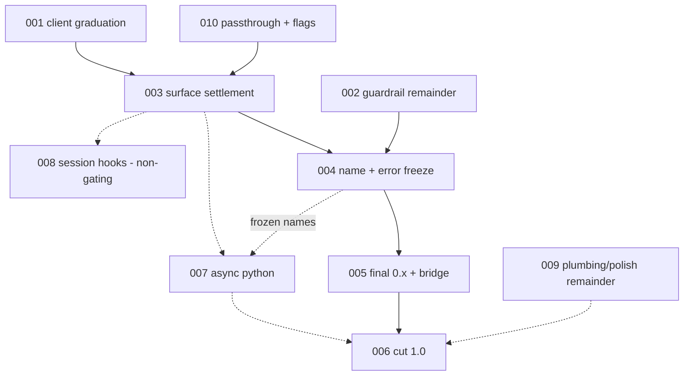

# SDK v1 Implementation Plans

Per-phase implementation plans for `road-to-v1.md` (the ordered execution plan) and the SDK decision records under `docs/decisions/`. Each plan is a `ce-unified-plan/v1` artifact: Goal Capsule, Product Contract (R-IDs), Planning Contract (KTDs), Implementation Units (U-IDs), Verification Contract, Definition of Done.

## Plans

| Plan | Roadmap item | Gating for 1.0 |
| --- | --- | --- |
| [001 — Generated client graduation (Hey API)](2026-07-03-001-chore-step1-heyapi-client-graduation-plan.md) | Step 1 | yes — foundation |
| [002 — Parity guardrail completion](2026-07-03-002-chore-step2-parity-guardrail-completion-plan.md) | Step 2 (mostly landed on this branch) | yes — small remainder |
| [003 — Surface settlement](2026-07-03-003-feat-step3-surface-settlement-plan.md) | Step 3 | yes |
| [004 — Name freeze + error catalog](2026-07-03-004-feat-step4-name-error-freeze-plan.md) | Step 4 | yes |
| [005 — Final 0.x + migration bridge](2026-07-03-005-feat-step5-final-0x-migration-bridge-plan.md) | Step 5 | yes |
| [006 — Coordinated 1.0 cut](2026-07-03-006-chore-step6-coordinated-v1-cut-plan.md) | Step 6 | yes — terminal |
| [007 — AsyncComposio (Python)](2026-07-03-007-feat-lane-async-python-plan.md) | Lane: async Python | yes (or dated deferral) |
| [008 — Session hooks (experimental)](2026-07-03-008-feat-lane-session-hooks-plan.md) | Lane: session hooks | no — additive |
| [009 — Plumbing + polish remainder](2026-07-03-009-chore-lane-plumbing-polish-remainder-plan.md) | Lanes: plumbing, polish (mostly landed) | yes — small remainder |
| [010 — Client passthrough + granular session flags](2026-07-03-010-feat-client-passthrough-and-session-flags-plan.md) | New (feeds Step 3) | yes — must precede the Step 3 type lock |

## Sequencing

Parallelizable now: 001 (client repos), 002, 009, and 010 have no mutual dependencies. 010 U1/U2 must merge before 003 U1 locks the session-create config. 004's gemini rename and error catalog are internally parallel. 008 never gates the cut.

## Status baseline (2026-07-03)

The `docs/sdk-v1-decision-records` branch already landed: the parity guardrail in both CI workflows, provider peer-range widening, Python provider pins, the version-drift fix, publint/attw via `check:package-exports`, provider typecheck scripts, Python examples CI, the un-skipped custom-provider type-inference test, the Zod matrix, the narrowed MCP barrel, and the `./generated` major-version guard. Plans 002 and 009 cover only the remainders; do not redo landed work.
