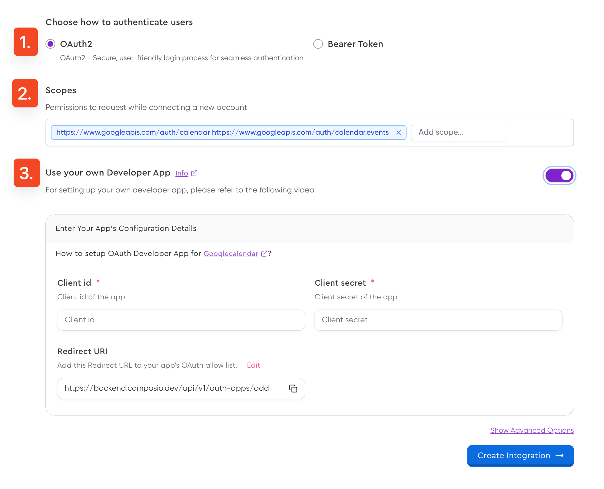

The typical lifecycle of using Auth in Composio is as follows:

1. Create and configure an integration.
2. Fetch parameters for a connection from the user.
3. Create the connection using the parameters.
4. Check and confirm the connection status.
5. Use the connection to make API calls.
6. If required, delete the connection.


## Configuring an integration
Integrations are configuration objects that store credentials and settings for specific APIs. They store the following properties, among others:

<Accordion title="Integration Properties">
An Integration stores all necessary authentication and API communication details required for making authenticated requests to third-party services. These properties define how Composio interacts with the external API.

| Property               | Description |
|------------------------|-------------|
| **Base URL**          | The root endpoint for all API calls. |
| **Scopes**           | If needed, the scopes required for the integration. |
| **Authentication Scheme** | Defines the supported authentication methods, such as API Key, OAuth 2.0, or JWT. |
| **Callback URL**      | If needed, the endpoint for handling authentication responses and obtaining JWT tokens. |
| **Authorization Parameters** | Custom parameters required when initiating authentication. |
| **Token Parameters**  | If needed, parameters needed to retrieve and refresh access tokens. |
| **API Endpoints**     | A list of necessary endpoints used for executing tool calls. |
</Accordion>

Typically you only need to create an integration once. That integration can be used by multiple users (called entities in Composio).

Each entity *connects* to an *integration* using a *connection*.

<Tabs>
<Tab title="Dashboard">
<Steps>
<Step title="Navigate to an application">
Navigate to the [dashboard](https://app.composio.dev/apps).
Search for your desired application and select it.

<Frame background="subtle" title="Application Selection Screen">
  
</Frame>


</Step>
<Step title="Setup Integration">
Click on the *Setup Integration* button.


<Frame background="subtle" title="Integration Setup Interface">
  
</Frame>
</Step>

<Step title="(Optional) Limit Available Actions">
{/* add the fact that this is for security not for limiting the actions */}
{/* may only wanna give read only actions for example */}
If desired, you can restrict the actions available to this Integration.

This ensures that users and agents can only perform specific operations, preventing unintended access to unnecessary API endpoints.


<Frame background="subtle" title="Action Limitation Configuration">
  
</Frame>
</Step>
<Step title="Create and Save Integration">

Complete the integration setup by clicking **Create Integration**. Upon successful creation, you'll receive an **Integration ID** - a unique identifier used for managing your integration.
</Step>
</Steps>


{/* <video
    src="../assets/videos/creating-integration.mp4"
    width="854"
    height="480"
    autoplay
    loop
    playsinline
    controls
>
</video> */}
</Tab>
<Tab title="CLI">
Add an integration through the CLI and follow the steps outlined in the CLI.
Make sure you have logged in.

```bash
composio add github
```

On successful creation, you'll receive an **Integration ID** - a unique identifier used for managing your integration.
</Tab>
<Tab title="Code">
<CodeGroup>
```python Python maxLines=100 wordWrap {7-10}
from composio_openai import ComposioToolSet, App

toolset = ComposioToolSet()

app=App.GMAIL

integration = toolset.create_integration(
    app=app,
    use_composio_oauth_app=True,
    force_new_integration=True
)

print(integration.id)
```

```typescript TypeScript maxLines=100 wordWrap {6-9}
import { OpenAIToolSet } from "composio-core";

const composioToolset = new OpenAIToolSet();

const integration = await composioToolset.integrations.create({
    name: "gmail_integration",
    appUniqueKey: "gmail",
    useComposioAuth: true,
    forceNewIntegration: true,
})

console.log(integration.id)
```
</CodeGroup>

<AccordionGroup>
  <Accordion title="Arguments">
  | Parameters (Python/TypeScript) | Expected Values | Description |
  | --- | --- | --- |
  | `app` / `appUniqueKey` | Name of the app. Eg: `GITHUB`, `NOTION`, `GMAIL` | Specifies the target app for the integration |
  | `auth_mode` / `authScheme` | `OAUTH2`, `OAUTH1`, `API_KEY`, `BASIC`, `BEARER_TOKEN`, `BASIC_WITH_JWT`, `NO_AUTH` | Defines the authentication method for the integration. |
  | `use_composio_oauth_app` / `useComposioAuth` | `True` or `False` | Determines whether to use Composio's managed OAuth app instead of your own credentials. |
  | `force_new_integration` | `True` or `False` | Forces the creation of a new integration instead of using an existing one. |
  | `auth_config` | Dictionary/object containing values like `client_id`, `client_secret`, `redirect_uri`, etc. | Contains authentication configuration details specific to the chosen auth scheme. |
  </Accordion>

  <Accordion title="Integration Response Model">
  ```json
  {
      "id": "00000000-0000-0000-0000-000000000000",
      "name": "github_1",
      "authScheme": "OAUTH2", 
      "createdAt": "2025-03-19T09:06:24.181Z",
      "updatedAt": "2025-03-19T09:06:24.181Z",
      "enabled": true,
      "deleted": false,
      "appId": "01e22f33-dc3f-46ae-b58d-050e4d2d1909",
      "appName": "github",
      "expectedInputFields": [],
      "logo": "https://cdn.jsdelivr.net/gh/ComposioHQ/open-logos@master/github.png",
      "defaultConnectorId": "test-github-connector",
      "connections": null
  }
  ```
  </Accordion>
</AccordionGroup>
</Tab>
</Tabs>

<Tip>Ensure you save the integration ID in an environment variable or a secret manager for production use.</Tip>

{/* <Card title="Customizing Integrations" href="/authentication/custom-auth" icon="fa-solid fa-key">
Learn how to customize integrations to use your own credentials and configurations.
</Card> */}

## Managing Connections
A connection in Composio is an object that stores and manages your users' authentication state and details for a specific app (integration).

An integration can have multiple connections, each representing a different user's authentication state.

### Creating a connection
Assuming the integration has been created and the ID is known, you can initiate a connection with the following code:

<CodeGroup>
```python Python maxLines=100 wordWrap
from composio_openai import ComposioToolSet, Action, App

toolset = ComposioToolSet()

user_id = "alice"

connection_req = toolset.initiate_connection(
    integration_id=GMAIL_INTEGRATION_ID,
    entity_id=user_id,
)
print(f"Navigate to {connection_req.redirectUrl} to connect your Gmail account")
print(f"Connection status: {connection_req.status}")    # Status will be INITIATED

connection = connection_req.wait_until_active(toolset.client, timeout=20)

print(f"Connection created: {connection.id}")
```

```typescript TypeScript maxLines=100 wordWrap
import { OpenAIToolSet } from "composio-core";

const userId = "alice";

const toolset = new OpenAIToolSet();
const entity = await toolset.getEntity(userId);

const connectionReq = await entity.initiateConnection({
  appName: "GMAIL",
  redirectUri: "https://yourwebsite.com/threads/thread-id",
});

const connection = await connectionReq.waitUntilActive(20);
```
</CodeGroup>

**Connection Parameters**
| Parameter | Type | Description |
|-----------|------|-------------|
| `integration_id` | string | ID of an existing integration to use for the connection. If not provided, the system will attempt to find or create an integration based on the `app` parameter. |
| `app` | string | The app to connect to (e.g., `GMAIL`, `GITHUB`). Required if `integration_id` is not provided. |
| `labels` | array | Tags or categories to associate with this connection for organizational purposes. |
| `entity_id` | string | The identifier for the user/entity making the connection. Defaults to the toolset's current entity ID if not specified. |
| `redirect_url` | string | Custom URL where the user will be redirected after authentication completes. |
| `connected_account_params` | object | Additional parameters required for the connection, such as API keys or tokens. Required parameters depend on the app and auth scheme. |
| `auth_scheme` | string | Authentication method to use (e.g., `OAUTH2`, `API_KEY`). If not specified, will use the default scheme for the app. |
| `auth_config` | object | Advanced integration parameters required when creating a new integration, such as OAuth client credentials and redirect URIs. Only needed if integration doesn't exist. |


### Checking the status of a connection
Checking for status of a connection is useful to keep track of the authentication flow. This is especially useful for OAuth based flows. 
<CodeGroup>
```python Python maxLines=100 wordWrap
entity = toolset.getEntity("default")   # An entity is required to get a connection

connection = entity.get_connection(app=App.GMAIL)
print(connection.status)
```

```typescript TypeScript maxLines=100 wordWrap
const entity = await toolset.getEntity("default");  // An entity is required to get a connection

const connection = await entity.getConnection({
    appName: "GMAIL",
});

console.log(connection.status);
```
</CodeGroup>
The valid connection states are:

- `ACTIVE`
- `INACTIVE`
- `DELETED`
- `INITIATED`
- `EXPIRED`

### Getting connection details
You can get the details of a connection to inspect the connection parameters.
<CodeGroup>
```python Python maxLines=100 wordWrap
connection = toolset.get_connected_account(connection_id)
print(connection)

# Alternatively, you can get the connection details from the entity

entity = toolset.getEntity("default")
connection = entity.get_connection(app=App.GMAIL)
print(connection)
```

```typescript TypeScript maxLines=100 wordWrap
const connectionDetails = await toolset.connectedAccounts.get({
  connectedAccountId: connection.id,
});

// Alternatively, you can get the connection details from the entity

const entity = await toolset.getEntity("default");
const connection = await entity.getConnection({
  appName: "GMAIL",
});


console.log(connectionDetails);
```
</CodeGroup>

<Accordion title="Connection Response Model">
```json
{
    "id": "********",
    "status": "ACTIVE", 
    "createdAt": "2025-03-28T06:18:57.611Z",
    "updatedAt": "2025-03-28T11:21:55.679Z",
    "appUniqueId": "gmail",
    "appName": "gmail",
    "integrationId": "********",
    "connectionParams": {
        "scope": "********",
        "base_url": "https://www.googleapis.com",
        "client_id": "********",
        "token_type": "********", 
        "access_token": "********",
        "refresh_token": "********",
        "client_secret": "********",
        "consumer_id": null,
        "consumer_secret": null,
        "headers": {
            "Authorization": "********",
            "x-request-id": "********"
        },
        "queryParams": {}
    },
    "clientUniqueUserId": "default",
    "entityId": "default"
}
```
</Accordion>

### Deleting a connection
Deleting a connection is useful to remove a connection from the system. Typically done when a user wants to disconnect from an app or no longer wishes to give access to an app.

<CodeGroup>
```python Python maxLines=100 wordWrap
```

```typescript TypeScript maxLines=100 wordWrap
const res =  toolset.client.connectedAccounts.delete({
    connectedAccountId: "********",
})

console.log(res)
```
</CodeGroup>

