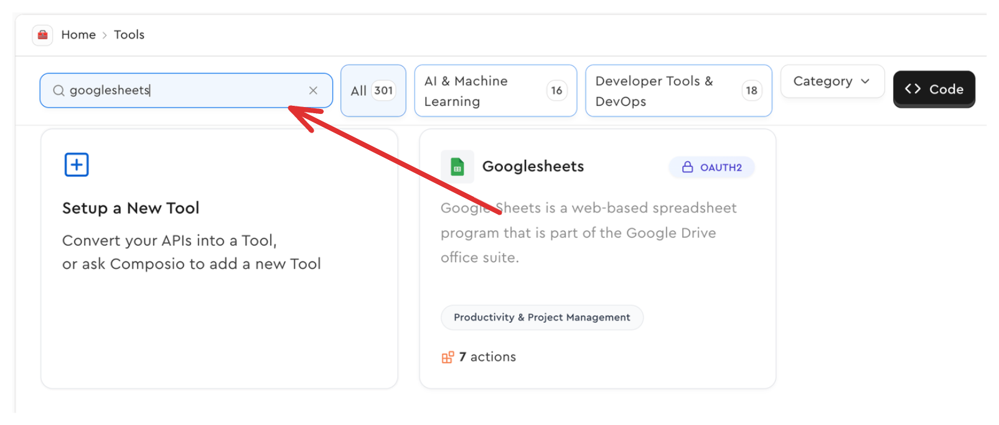
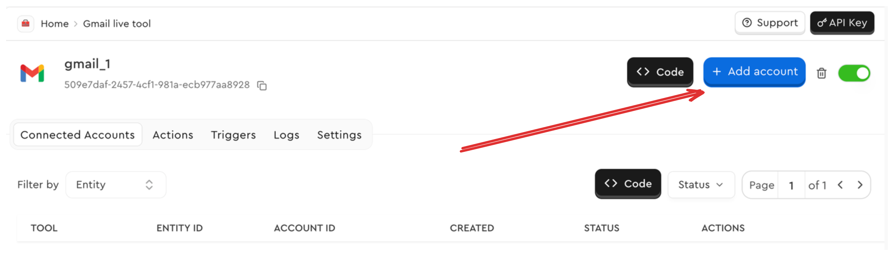

Composio Auth relies on three core concepts. [Integration](#integration), [Connection](#connection), [Entities](#entity).

<Frame background="subtle" title="Composio Auth Concepts">
  
</Frame>

## Integration

An Integration in Composio is a configuration that connects your app to third-party services like GitHub, Google Drive, or Slack. It contains all the authentication details (OAuth 2.0, API Key, or JWT) and service-specific settings needed to create secure connections for your users.

<AccordionGroup>
  <Accordion title="Integration Properties">
  An Integration stores all necessary authentication and API communication details required for making authenticated requests to third-party services. These properties define how Composio interacts with the external API.

  | Property               | Description |
  |------------------------|-------------|
  | **Base URL**          | The root endpoint for all API calls. |
  | **Authentication Scheme** | Defines the supported authentication methods, such as API Key, OAuth 2.0, or JWT. |
  | **Required Headers**  | Any mandatory headers required for API communication. |
  | **Callback URL**      | The endpoint for handling authentication responses and obtaining JWT tokens (if applicable). |
  | **Authorization Parameters** | Custom parameters required when initiating authentication. |
  | **Token Parameters**  | Parameters needed to retrieve and refresh access tokens. |
  | **API Endpoints**     | A list of necessary endpoints used for executing tool calls. |
  </Accordion>

  <Accordion title="Authentication Methods">
  Composio supports multiple authentication schemes, and each Integration can define one or more of these:

  | Authentication Method | Description |
  |----------------------|-------------|
  | **OAuth 2.0**       | Requires an authorization URL, token URL, and scopes for user authentication. |
  | **OAuth 1.0**       | An older version of OAuth, requiring a request token and access token for user authentication. |
  | **API Key**         | Uses a static API key, optionally with an API secret, included in request headers or query parameters. |
  | **Basic Authentication** | Requires a username and password for authentication, typically sent in an `Authorization` header. |
  | **Bearer Token**    | Uses a token in the `Authorization` header, often retrieved from OAuth 2.0 or another identity provider. |
  | **Basic with JWT**  | A hybrid approach that combines basic authentication (username/password) with JWT-based token authentication. |
  | **No Authentication** | Some APIs do not require authentication, allowing open access to endpoints. |

  - Developers configure Integrations once per third-party service.
  - Users authenticate against these Integrations to establish personalized connections.
  - API calls are routed through Composio, leveraging stored authentication details for seamless execution.
  </Accordion>
</AccordionGroup>


### Creating Integrations

{/* - add all the parameters that an integration takes
- show the important and common methods and uses */}
<Tabs>
<Tab title="Code">

<CodeGroup>
```python Python wordWrap maxLines=100
from typing import Any
from composio_openai import ComposioToolSet, App, Action
from composio.client.collections import IntegrationModel
from composio.client.collections import AuthSchemeType

toolset = ComposioToolSet()

def create_integration_if_not_exists(
    app: App,
    auth_mode: AuthSchemeType,
    auth_config: dict,
    use_composio_oauth_app: bool = False,
    force_new_integration: bool = False,
) -> IntegrationModel:
    """
    Create an integration if it doesn't exist.
    """
    integrations = toolset.get_integrations(app=app)
    if not integrations:
        integration = toolset.create_integration(
            app=app,
            auth_mode=auth_mode,
            auth_config=auth_config,
            use_composio_oauth_app=use_composio_oauth_app,
        )
        return integration
    return integrations[0]


integration = create_integration_if_not_exists(
    app=App.GITHUB,
    auth_mode="OAUTH2",
    auth_config={"client_id": "1234567890", "client_secret": "1234567890"},
    use_composio_oauth_app=False,
)
```

```typescript TypeScript wordWrap maxLines=100
import { OpenAIToolSet } from "composio-core";
const composioToolset = new OpenAIToolSet();


interface AuthConfig {
  clientId?: string;
  clientSecret?: string;
  [key: string]: any;
}

async function createIntegrationIfNotExists(
  app: string,
  name: string,
  authScheme: "OAUTH2" | "OAUTH1" | "OAUTH1A" | "API_KEY" | "BASIC" | "BEARER_TOKEN" | "GOOGLE_SERVICE_ACCOUNT" | "NO_AUTH" | "BASIC_WITH_JWT" | "COMPOSIO_LINK",
  authConfig: AuthConfig,
  useComposioAuth: boolean = false
) {
  try {
    // Get existing integrations for the app
    const integrations = await composioToolset.integrations.list({ 
      appName: app 
    });
    // Return first existing integration if found
    if (integrations && Array.isArray(integrations) && integrations.length > 0) {
      return integrations[0];
    }

    // Create new integration if none exists
    const integration = await composioToolset.integrations.create({
      name: name,
      appUniqueKey: app,
      authScheme: authScheme,
      authConfig: authConfig,
      useComposioAuth: useComposioAuth,
    });
    return integration;

  } catch (error) {
    console.error('Error creating/getting integration:', error);
    throw error;
  }
}


const integration = await createIntegrationIfNotExists("github", "github-ts", "OAUTH2", {
  client_id: "1234567890",
  client_secret: "1234567890",
});

console.log(integration);
```
</CodeGroup>


Below are the parameters while creating an integration through code.
<AccordionGroup>
  <Accordion title="Arguments">
  | Parameters (Python/TypeScript) | Expected Values | Description |
  | --- | --- | --- |
  | `app` / `appUniqueKey` | Name of the app. Eg: `GITHUB`, `NOTION`, `GMAIL` | Specifies the target app for the integration |
  | `auth_mode` / `authScheme` | `OAUTH2`, `OAUTH1`, `API_KEY`, `BASIC`, `BEARER_TOKEN`, `BASIC_WITH_JWT`, `NO_AUTH` | Defines the authentication method for the integration. |
  | `use_composio_oauth_app` / `useComposioAuth` | `True` or `False` | Determines whether to use Composio's managed OAuth app instead of your own credentials. |
  | `force_new_integration` | `True` or `False` | Forces the creation of a new integration instead of using an existing one. |
  | `auth_config` | Dictionary/object containing values like `client_id`, `client_secret`, `redirect_uri`, etc. | Contains authentication configuration details specific to the chosen auth scheme. |
  </Accordion>

  <Accordion title="Example Integration Model">
  ```json
  {
      "id": "00000000-0000-0000-0000-000000000000",
      "name": "github_1",
      "authScheme": "OAUTH2", 
      "createdAt": "2025-03-19T09:06:24.181Z",
      "updatedAt": "2025-03-19T09:06:24.181Z",
      "enabled": true,
      "deleted": false,
      "appId": "01e22f33-dc3f-46ae-b58d-050e4d2d1909",
      "appName": "github",
      "expectedInputFields": [],
      "logo": "https://cdn.jsdelivr.net/gh/ComposioHQ/open-logos@master/github.png",
      "defaultConnectorId": "test-github-connector",
      "connections": null
  }
  ```
  </Accordion>
</AccordionGroup>

{/* add some info about adding an integration and not using composio auth */}

</Tab>
<Tab title="Dashboard">
<Steps>
<Step title="Navigate to an application">
Navigate to the [dashboard](https://app.composio.dev/apps).
Search for your desired application and select it.

<Frame background="subtle" title="Application Selection Screen">
  
</Frame>


</Step>
<Step title="Setup Integration">
Click on the *Setup Integration* button.


<Frame background="subtle" title="Integration Setup Interface">
  
</Frame>

Depending on the authentication method, you may need to provide specific details.

For:
For authentication methods like:
- **Bearer Token**
- **JWT**
- **API Key**
- **Basic Authentication**

These credentials are typically provided by the user when establishing a connection.

<Accordion title="OAuth 2.0 Configuration">
- **Scopes**: Specify the required permissions for the Integration.
- **Client ID**: If using your own OAuth application, enter the client ID.
- **Client Secret**: Provide the secret key associated with your OAuth application.
- **Redirect URI**: This is the URL where the third-party service will redirect users after authentication.


<Frame background="subtle" title="OAuth 2.0 Configuration Screen">
  
</Frame>

<Note>
While you can use Composio's client credentials for prototyping, we recommend setting up your own developer application and using your own client ID and client secret for production use.
</Note>

</Accordion>
</Step>

<Step title="(Optional) Limit Available Actions">
If desired, you can restrict the actions available to this Integration.

This ensures that users and agents can only perform specific operations, preventing unintended access to unnecessary API endpoints.


<Frame background="subtle" title="Action Limitation Configuration">
  
</Frame>

<Tip>This is a helpful configuration when there is a lot of tools available or when you want to limit access to tools on an integration level</Tip>
</Step>
<Step title="Create and Save Integration">

Complete the integration setup by clicking **Create Integration**. Upon successful creation, you'll receive an **Integration ID** - a unique identifier used for managing your integration.
</Step>
</Steps>


{/* <video
    src="../assets/videos/creating-integration.mp4"
    width="854"
    height="480"
    autoplay
    loop
    playsinline
    controls
>
</video> */}

</Tab>
<Tab title="CLI">
Add an integration through the CLI and follow the steps outlined in the CLI.
Make sure you have logged in!

<CodeGroup>
```uvx uvx
uvx --from composio-core composio add github
```

```npx npx
npx composio-core add github
```
</CodeGroup>
</Tab>
</Tabs>


## Entity

An Entity in Composio serves as an abstraction over a user in your application. It represents an individual user and provides a structured way to manage their authenticated API interactions. 

Instead of directly handling user authentication at the application level, Composio uses Entities to link users to their respective service connections.

- User Identification: Entities allow you to manage users in Composio without directly dealing with user-specific authentication details.

- Seamless Authentication: Each Entity can have multiple connections to third-party services, enabling secure API interactions on behalf of users.

- Scoped API Execution: When executing API calls, the Entity ID ensures the correct user's authentication details are applied.

### Entity Management

Entities provide a set of methods that allow you to manage connections for each user efficiently.

| Action | Description |
| --- | --- |
| `get_connection` | Retrieves a specific connection for the entity, linked to a service. |
| `get_connections` | Lists all connections associated with the entity (e.g., Gmail, Notion, etc.). |
| `initiate_connection` | Starts the authentication flow for a user to establish a new connection. |


<CodeGroup>
```python Python wordWrap
from composio_openai import ComposioToolSet
toolset = ComposioToolSet()
# Expected to fetch the entity ID from application logic
entity = toolset.get_entity(id='default')
```

```typescript TypeScript wordWrap
import { OpenAIToolSet } from "composio-core";
const toolset = new OpenAIToolSet();

// Expected to fetch the entity ID from application logic
const entity = toolset.client.getEntity(id='default');
```
</CodeGroup>

Once you create the Entity object, you can use it to handle tool calls and execute actions. Alternatively, you can specify the Entity ID itself while handling tool calls.

<CodeGroup>
```python Python wordWrap
result = toolset.handle_tool_calls(tool_request, entity_id="user_123")
```

```typescript TypeScript wordWrap
const result = await toolset.handleToolCall(toolRequest, entity: "default");
```
</CodeGroup>

In essence, an Entity in Composio is the mechanism that links your application's user identity system with Composio's connection management, enabling personalized API interactions on behalf of specific users.


## Connection

A Connection in Composio represents an authenticated link between a specific [entity](#entity) and an external service through an Integration.

It's an abstraction that stores and manages your users' auth configuration.
Connections serve as the runtime authentication context that enables Composio to:
1. Make authenticated API calls on behalf of specific users
2. Automatically handle token refreshes when needed
3. Associate API responses with the correct user
4. Route tool calls to the appropriate external service with proper authentication

<Note>For OAuth 2.0 based connections, Composio automatically refreshes the access token.</Note>

### Creating Connections
To create a connection for an entity, you need to provide the auth scheme and the connection parameters. 

Creating a connection in application level code requires some basic steps.
<Steps>
<Step title="Fetch Integration ID and Entity">
You need to fetch the `entity_id` from your database or application logic.

<CodeGroup>
```python Python
import json

from composio.client.collections import ExpectedFieldInput
from composio.exceptions import NoItemsFound
from composio_openai import App, ComposioToolSet

toolset = ComposioToolSet()

# Fetched from application logic
user_id = "00000000-0000-0000-0000-000000000000"
integration = toolset.get_integrations(App.GITHUB)[0] # or App.SHOPIFY
```

```typescript TypeScript
import { OpenAIToolSet } from "composio-core";
const composioToolset = new OpenAIToolSet();

const userId = "00000000-0000-0000-0000-000000000000";
const integration = await composioToolset.integrations.list({
  appName: "github",
});
```
</CodeGroup>

</Step>

<Step title="Check for an active connection">

Here's how to check for an active connection.
<CodeGroup>
```python Python wordWrap
def has_active_connection(user_id: str, app: App):
    entity = toolset.get_entity(user_id)
    try:
        connection = entity.get_connection(app=app)
        return connection.status == "ACTIVE"
    except NoItemsFound:
        return False

if has_active_connection(user_id, App.GITHUB):
    print("Connection already exists for this user")
else:
    print("\nSetting up new connection...")
```

```typescript TypeScript maxLines=50 wordWrap
async function hasActiveConnection(userId: string, app: string) {
  try {
    const entity = await composioToolset.getEntity(userId);
    const connection = await entity.getConnection({ app });
    if (connection.status === "ACTIVE") {
      console.log(`Connection already exists for user ${userId}`);
      return true;
    }
    return false;
  } catch (error) {
    // Check if the error is about not finding a connection
    if (error instanceof Error && 
        error.message?.includes("Could not find a connection") ||
        (error as any)?.errCode === "SDK::NO_CONNECTED_ACCOUNT_FOUND") {
      return false;
    }
    // Re-throw other errors
    throw error;
  }
}

const isConnected = await hasActiveConnection(userId, "github");
if (isConnected) {
  console.log("Connection already exists for this user");
} else {
  console.log("\nSetting up new connection...");
}
```
</CodeGroup>
</Step>

<Step title="Retrieve connection parameters">
<Tabs>

<Tab title="Code">

Since every auth scheme in an integration can have different connection parameters, you can view and later, emit the parameters to your users to enter.


Connection parameters vary per integration. For example, `OAUTH2` based integrations don't require any additional parameters from the user, however other methods may require things like the Base URL or JWT token.

| Pre-requisite | Description |
|--------------|-------------|
| Auth Scheme | One of: `OAUTH2`, `OAUTH1`, `API_KEY`, `BASIC`, `BEARER_TOKEN`, `BASIC_WITH_JWT`, `NO_AUTH` |
| Connection Parameters | Optional user-provided details based on the auth scheme. For example, if using `API_KEY`, the user may need to enter the API key and Base URL. |

<Tip> It is recommended to check the connection parameters and then accept each field from the user within your application logic.</Tip>

**Fetching connection parameters with an integration ID**

<CodeGroup>
```python Python wordWrap

def request_connection_params(integration_id: str):
    return toolset.get_expected_params_for_user(integration_id=integration_id)

conn_params = request_connection_params(integration.id)
print(conn_params["expected_params"])
```

```typescript TypeScript wordWrap
async function requestConnectionParams(integrationId: string) {
  const connectionParams = await composioToolset.integrations.getRequiredParams({
    integrationId: integrationId,
  });
  return connectionParams;
}

const connectionParams = await requestConnectionParams(integrations.items[0].id);
console.log(connectionParams);
```
</CodeGroup>

**Fetching connection parameters with app and auth scheme**
<CodeGroup>
```python Python wordWrap
def request_connection_params(app: App, auth_scheme: str):
    return toolset.get_expected_params_for_user(app=app, auth_scheme)

conn_params = request_connection_params(app=App.GMAIL, auth_scheme="BEARER_TOKEN")
print(conn_params["expected_params"])
```


```typescript TypeScript wordWrap
async function requestConnectionParams(app: string, authScheme: string) {
  const connectionParams = await composioToolset.apps.getRequiredParamsForAuthScheme({
    appId: app,
    authScheme: authScheme,
  });
  return connectionParams;
}

const connectionParams = await requestConnectionParams("gmail", "BEARER_TOKEN");
console.log(connectionParams);
```
</CodeGroup>
</Tab>

<Tab title="Dashboard">
You can also view the connection parameters via the dashboard. Head to the [integrations page](https://app.composio.dev/integrations) and select an integration.

<Frame caption="Click on 'Add Account'" background="subtle">
  
</Frame>

Here you'll be able to see all the required parameters.

<Frame background="subtle">
  
</Frame>

</Tab>
</Tabs>

<Warning>For integrations which supported auth schemes, the parameters for the configured auth schemes should be provided </Warning>

</Step>

<Step title="Initiate Connection">
<Accordion title="Arguments for initiating a connection">
| Argument | Expected Values | Description |
|----------|----------------|-------------|
| app_name / appName | `str` or `App` enum | The name or enum value of the application to connect to |
| auth_mode / authMode | `"OAUTH2"`, `"OAUTH1"`, `"OAUTH1A"`, `"API_KEY"`, `"BASIC"`, `"BEARER_TOKEN"`, `"GOOGLE_SERVICE_ACCOUNT"`, `"NO_AUTH"`, `"BASIC_WITH_JWT"`, `"COMPOSIO_LINK"` or `None` | The authentication mode to use |
| auth_config / authConfig | `Dict[str, Any]` or `None` | Additional authentication configuration parameters |
| redirect_url / redirectUri | `str` or `None` | URL to redirect to after authentication flow. Usually back to your app. |
| integration_id / integrationId | `str` or `None` | ID of an existing integration to use |
| connection_params / connectionParams | `Dict[str, Any]` or `None` | Parameters required for the connection |
| config | `Dict` containing optional `labels` and `redirectUrl` | Additional configuration options |
| labels | `List[str]` or `None` | Labels to attach to the connection |
| use_composio_auth | `bool` | Whether to use Composio's OAuth apps. Defaults to `True` |
| force_new_integration | `bool` | Whether to force creation of new integration. Defaults to `False` |
</Accordion>

**Initiating a connection without parameters**
<CodeGroup>
```python Python wordWrap
connection = entity.initiate_connection(
    app_name=app,
    use_composio_auth=False,
    force_new_integration=True,
    auth_mode=auth_mode,
)
```

```typescript TypeScript wordWrap
type AuthMode = "API_KEY" | "OAUTH2" | "OAUTH1" | "OAUTH1A" | "BASIC" | "BEARER_TOKEN" | 
  "GOOGLE_SERVICE_ACCOUNT" | "NO_AUTH" | "BASIC_WITH_JWT" | "COMPOSIO_LINK";
  
const connection = await entity.initiateConnection({
  appName: app,
  auth
  authMode,
});
```
</CodeGroup>


**Initiating connection with parameters**
<CodeGroup>
```python Python maxLines=50 wordWrap

def request_connection_params(app: App, integration_id: str):
    return toolset.get_expected_params_for_user(integration_id=integration_id)

def get_connection_values(connection_params_info: list[ExpectedFieldInput]):
    print(
        "\nTo connect to this service, you'll need to provide the following authentication details:"
    )
    connection_params = {}
    for param in connection_params_info:
        param_dict = param.model_dump()
        # Collect input from user
        value = input(f"Enter value for {param_dict['name']}: ")
        connection_params[param_dict["name"]] = value
    return connection_params

def initiate_connection(
    user_id: str, app: App, connection_params: dict, auth_mode: str, redirect_url: str
):
    entity = toolset.get_entity(user_id)
    connection = entity.initiate_connection(
        app_name=app,
        use_composio_auth=False,
        force_new_integration=True,
        connected_account_params=connection_params,
        auth_mode=auth_mode,
        redirect_url=redirect_url,
    )
    return connection

connection_params_info = request_connection_params(integration_id)
connection_params = get_connection_values(
    connection_params_info["expected_params"]
)
connection = initiate_connection(user_id, app, connection_params, "BEARER_TOKEN")

```

```typescript TypeScript wordWrap
async function requestConnectionParams(app: string, authScheme: AuthMode) {
  return await composioToolset.apps.getRequiredParamsForAuthScheme({
    appId: app,
    authScheme: authScheme
  });
}

function getConnectionValues(connectionParamsInfo: any): ConnectionParams {
  console.log("\nTo connect to this service, you'll need to provide the following authentication details:");
  console.log("=".repeat(80));
  console.log();
  
  const connectionParams: ConnectionParams = {};
  
  // Handle required fields
  if (connectionParamsInfo.required_fields && connectionParamsInfo.required_fields.length > 0) {
    console.log("Required Parameters:");
    for (const paramName of connectionParamsInfo.required_fields) {
      console.log(`Parameter: ${paramName}`);
      console.log("-".repeat(40));
      
      // In browser environment, this would be replaced with form inputs
      const value = prompt(`Enter value for ${paramName}:`);
      if (value) {
        connectionParams[paramName] = value;
      }
      console.log();
    }
  }
  
  // Handle optional fields if needed
  if (connectionParamsInfo.optional_fields && connectionParamsInfo.optional_fields.length > 0) {
    console.log("Optional Parameters:");
    for (const paramName of connectionParamsInfo.optional_fields) {
      console.log(`Parameter: ${paramName}`);
      console.log("-".repeat(40));
      
      const value = prompt(`Enter value for ${paramName} (optional):`);
      if (value) {
        connectionParams[paramName] = value;
      }
      console.log();
    }
  }
  
  return connectionParams;
}

async function initiateConnection(
  userId: string,
  app: string,
  connectionParams: ConnectionParams,
  authMode: AuthMode,
  redirectUrl?: string
) {
  const entity = await composioToolset.getEntity(userId);
  const connection = await entity.initiateConnection({
    appName: app,
    authMode,
    connectionParams: connectionParams,
  });
  
  return connection;
}


const connectionParamsInfo = await requestConnectionParams(app, authMode);
console.log(connectionParamsInfo);

const connectionParams = getConnectionValues(connectionParamsInfo);

console.log("Connection parameters collected:", connectionParams);

if (Object.keys(connectionParams).length === 0) {
  console.log("No connection parameters provided. Exiting.");
  process.exit(0);
}

try {
  const connection = await initiateConnection(
    user_id,
    app,
    connectionParams,
    authMode,
  );
  console.log("Connection established successfully:");
  console.log(JSON.stringify(connection, null, 4));
} catch (error) {
  console.error("Failed to establish connection:", error);
}


```
</CodeGroup>

</Step>
</Steps>


### Examples

<AccordionGroup>
  <Accordion title="Connection with OAuth 2.0">
  OAuth 2.0 applications generally don't have any `expected_params` since the OAuth flow is supposed to capture and store the relevant credentials.
  
    <CodeGroup>
      ```python Python wordWrap
      from composio_openai import App, ComposioToolSet


      toolset = ComposioToolSet()
      entity = toolset.get_entity("default")
      github_params = toolset.get_expected_params_for_user(app=App.GITHUB)
      # []

      github_connection_request = entity.initiate_connection(
          app_name=App.GITHUB,
          auth_mode=github_params["auth_scheme"],
          auth_config={},
      )
      print(github_connection_request.model_dump_json(indent=2))
      ```

      ```typescript TypeScript wordWrap
import { OpenAIToolSet } from "composio-core";

const composioToolset = new OpenAIToolSet();

const entity = await composioToolset.getEntity("default");

const githubParams = await composioToolset.apps.getRequiredParamsForAuthScheme({
  appId: "github",
  authScheme: "OAUTH2",
});
// []

console.log(githubParams.required_fields);

const githubConnectionReq = await entity.initiateConnection({
  appName: "github",
  authMode: "OAUTH2",
  connectionParams: {},
});

console.log(githubConnectionReq);
      ```
    </CodeGroup>
    Once the connection object has been created, the `redirectUrl` has to be emitted back to the user so that they can follow the OAuth credentials.
 
    ```json Connection Request Object
    {
      "connectionStatus": "INITIATED",
      "connectedAccountId": "ec33a9e2-75e1-4e01-9c7a-60a1481e4d8e",
      "redirectUrl": "https://backend.composio.dev/s/9eNG2Svq"
    }
    ```

    <Warning>The redirectUrl in the connection object is the URL that initiates the OAuth flow, guiding the user to the authentication page. In contrast, the redirectUrl specified as an argument when initiating the connection determines where the user will be redirected after completing the OAuth process.</Warning>
  </Accordion>

  <Accordion title="Connection with Bearer Token">
  Many applications that have OAuth 2.0, also support the user providing their own Bearer token.

  <CodeGroup>
  ```python Python wordWrap
from composio_openai import App, ComposioToolSet


toolset = ComposioToolSet()
entity = toolset.get_entity("default")
gmail_params = toolset.get_expected_params_for_user(app=App.GMAIL)
print(gmail_params["expected_params"])
# [ExpectedFieldInput(name='token', type='string', description='Token for bearer token auth', displayName='Token', is_secret=False, required=True, expected_from_customer=True, default=None, get_current_user_endpoint=None)]


gmail_connection_request = entity.initiate_connection(
    app_name=App.GMAIL,
    auth_mode=gmail_params["auth_scheme"],
    auth_config={"token": "gmail_token"},
)

print(gmail_connection_request.model_dump_json(indent=2))
      ```

```typescript TypeScript wordWrap
import { OpenAIToolSet } from "composio-core";

const composioToolset = new OpenAIToolSet();

const entity = await composioToolset.getEntity("default");

const gmailParams = await composioToolset.apps.getRequiredParamsForAuthScheme({
  appId: "gmail",
  authScheme: "BEARER_TOKEN",
});

console.log(gmailParams.required_fields);
// [ "token" ]

const gmailConnectionReq = await entity.initiateConnection({
  appName: "gmail",
  authMode: "BEARER_TOKEN",
  connectionParams: {
    token: "secret_1234567890",
  },
});

console.log(gmailConnectionReq);

```
  </CodeGroup>

```json Connection Request Object
{
  "connectionStatus": "ACTIVE",
  "connectedAccountId": "3362dc81-4313-4564-927e-571e4ff51b95",
  "redirectUrl": null
}
```

  </Accordion>

  <Accordion title="Connection with API Key">
  You can ask the user's to enter in their API key for apps and services that support it. Composio will store the key securely.
  <CodeGroup>
```python Python
from composio_openai import App, ComposioToolSet

toolset = ComposioToolSet()
entity = toolset.get_entity("default")

notion_params = toolset.get_expected_params_for_user(app=App.NOTION)
notion_params["expected_params"]
print(notion_params["expected_params"])
# [ExpectedFieldInput(name='api_key', type='string', description='Your notion API key for authentication. Obtain it from your notion settings.', displayName='API Key', is_secret=False, required=True, expected_from_customer=True, default=None, get_current_user_endpoint=None)]

notion_connection_request = entity.initiate_connection(
    app_name=App.NOTION,
    auth_mode=notion_params["auth_scheme"],
    auth_config={"token": "notion_token"},
)
```

```typescript TypeScript
import { OpenAIToolSet } from "composio-core";

const composioToolset = new OpenAIToolSet();

const entity = await composioToolset.getEntity("default");

const notionParams = await composioToolset.apps.getRequiredParamsForAuthScheme({
  appId: "notion",
  authScheme: "API_KEY",
});
console.log(notionParams.required_fields);
// [ "api_key" ]

const notionConnectionReq = await entity.initiateConnection({
  appName: "notion",
  authMode: "API_KEY",
  connectionParams: {
    api_key: "secret_1234567890",
  },
});

console.log(notionConnectionReq);
```
  </CodeGroup>
```json Connnection request object
{
  "connectionStatus": "ACTIVE",
  "connectedAccountId": "da821894-2383-4f75-8590-ebbc242a4129",
  "redirectUrl": null
}
```
  </Accordion>
</AccordionGroup>


