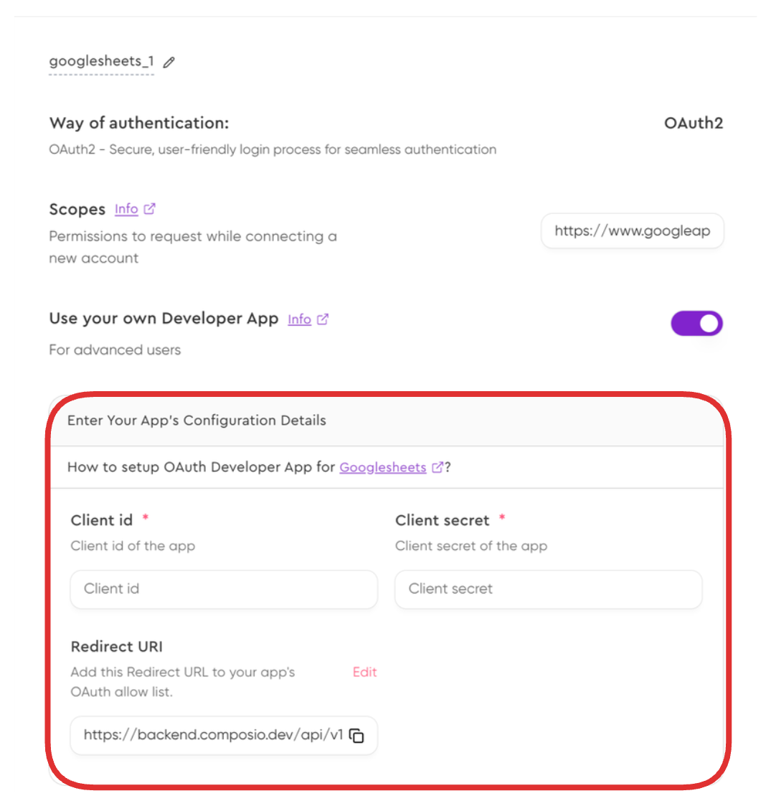
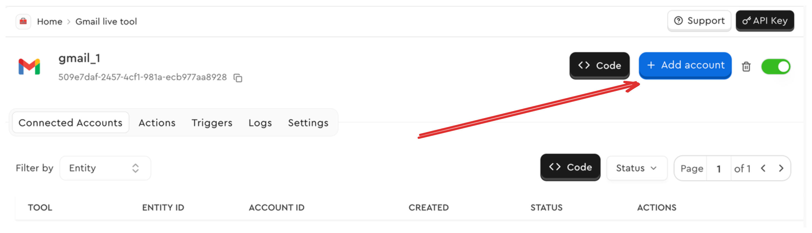
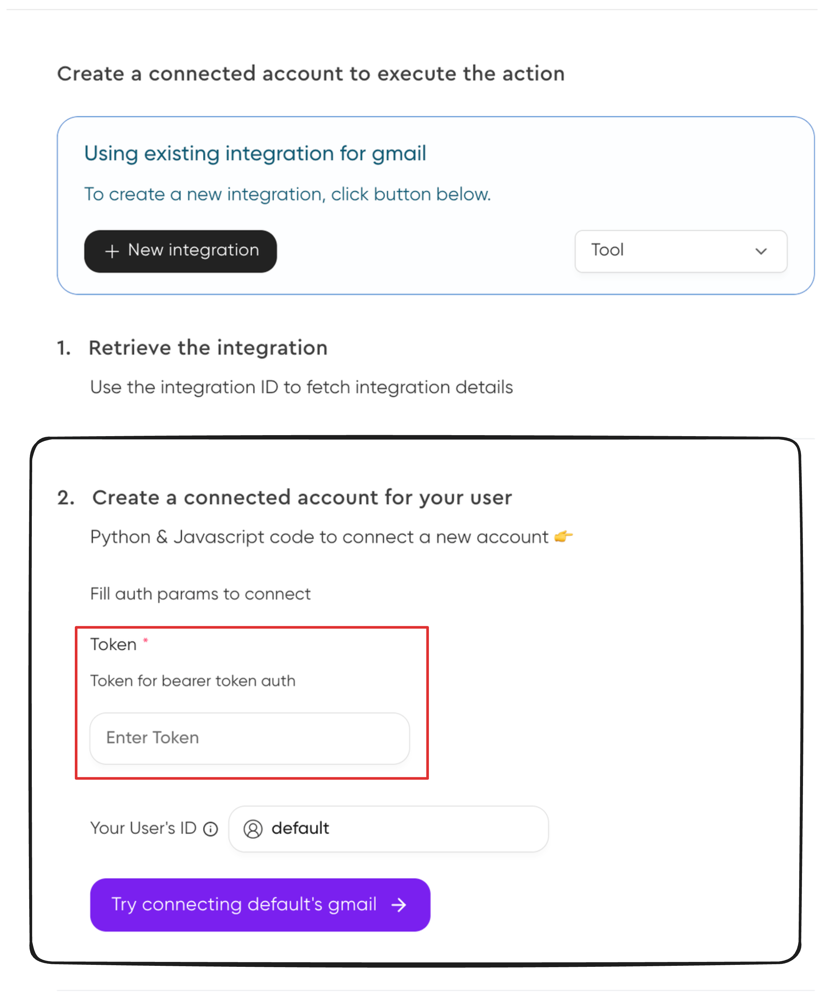

Composio supports multiple authentication schemes, and a connection can be created with any of these.

| Authentication Method | Description |
|----------------------|-------------|
| **OAuth 2.0**       | Requires an authorization URL, token URL, and scopes for user authentication. |
| **OAuth 1.0**       | An older version of OAuth, requiring a request token and access token for user authentication. |
| **API Key**         | Uses a static API key, optionally with an API secret, included in request headers or query parameters. |
| **Basic Authentication** | Requires a username and password for authentication, typically sent in an `Authorization` header. |
| **Bearer Token**    | Uses a token in the `Authorization` header, often retrieved from OAuth 2.0 or another identity provider. |
| **Basic with JWT**  | A hybrid approach that combines basic authentication (username/password) with JWT-based token authentication. |
| **No Authentication** | Some APIs do not require authentication, allowing open access to endpoints. |

<AccordionGroup>
<Accordion title="Auth with OAuth 2.0">

To add custom OAuth 2.0 credentials, you can specify your own *client id* and *client secret* while [creating an integration](/auth/auth-lifecycle#configuring-an-integration).

<Frame background="subtle" title="Specifying custom OAuth 2.0 credentials">
  
</Frame>

<Steps>
<Step title="Initiate the Connection">
The first step is to initiate a connection request using your integration ID. This creates a connection request with the OAuth 2.0 credentials you configured.

<CodeGroup>
```python Python wordWrap maxLines=100
from composio_openai import App, ComposioToolSet, Action
from uuid import uuid4
import os

toolset = ComposioToolSet()

# Get the integration ID from environment variables
integration_id = os.environ["GITHUB_INTEGRATION_ID"]

# Initialize the connection request
connection_request = toolset.initiate_connection(
    integration_id=integration_id,
    entity_id=str(uuid4()),
    auth_scheme="OAUTH2"
)
```

```typescript TypeScript wordWrap maxLines=100
import { OpenAIToolSet } from "composio-core";
import { v4 as uuidv4 } from "uuid";

const composioToolset = new OpenAIToolSet();
const integrationId = process.env.GITHUB_INTEGRATION_ID;
const entity = await composioToolset.getEntity(uuidv4());

// Initialize the connection request
const connectionRequest = await entity.initiateConnection({
  appName: "github",
  authMode: "OAUTH2", 
  integrationId: integrationId,
});
```
</CodeGroup>
</Step>
<Step title="Display the Redirect URL and Wait for Activation">
After initiating the connection, you'll receive a redirect URL. This URL should be presented to the user, who needs to complete the OAuth flow by authorizing the application. Once authorized, you can wait for the connection to become active.

<CodeGroup>
```python Python wordWrap maxLines=100
# Display the redirect URL for the user to complete OAuth authentication
print("Connect to GitHub: ", connection_request.redirectUrl)

# Wait for the connection to become active (timeout after 10 minutes)
connection = connection_request.wait_until_active(toolset.client, 10)
```

```typescript TypeScript wordWrap maxLines=100
// Display the redirect URL for the user to complete OAuth authentication
console.log("Connect to GitHub:", connectionRequest.redirectUrl);

// Wait for the connection to become active
const connection = await connectionRequest.waitUntilActive();
```
</CodeGroup>
</Step>
<Step title="Checking the Connection Status">
The status can be checked by:

<CodeGroup>
```python Python wordWrap maxLines=100
print(f"Connection Status: {connection.connectionStatus}")
```

```typescript TypeScript wordWrap maxLines=100
console.log(`Connection Status: ${connection.status}`);
```
</CodeGroup>
</Step>
</Steps>

{/* ### Retrieving Parameters Users Need to Provide
When creating connections with certain authentication methods, you'll need to determine what specific information to collect from your end users. Different apps require different parameters from users, such as API keys, subdomains, or tokens. The following examples show how to retrieve these required parameters.

<Tabs>
<Tab title="Code">
<CodeGroup>
```python Python wordWrap
from composio_openai import App, ComposioToolSet

toolset = ComposioToolSet()

auth_scheme = toolset.get_auth_scheme_for_app(App.GMAIL)

print(auth_scheme.fields[0].name)
print(auth_scheme.fields[1].name)
```

```typescript TypeScript wordWrap
import { OpenAIToolSet } from "composio-core";
const composioToolset = new OpenAIToolSet();

const authScheme = await composioToolset.integrations.getRequiredParams({
  integrationId: "1234567890",
});

console.log(authScheme);
```
</CodeGroup>
</Tab>
<Tab title="Dashboard">
You can also view the connection parameters via the dashboard. Head to the [integrations page](https://app.composio.dev/integrations) and select an integration.

<Frame caption="Click on 'Add Account'" background="subtle">
  
</Frame>

Here you'll be able to see all the required parameters.

<Frame background="subtle">
  
</Frame>

</Tab>
</Tabs> */}
</Accordion>

<Accordion title="Auth with API keys">
Many applications have API key or token based authentication, in these cases, your users will need to provide the API key, token or other parameters to authenticate and use the service.

<Steps>
<Step title="Retrieving Parameters Users Need to Provide">
*In this case, Shopify requires the user to provide the `api_key` and `shop` parameters.*
<CodeGroup>
```python Python maxLines=100 wordWrap {6, 13-17, 22, 31}
from composio_openai import App, ComposioToolSet

toolset = ComposioToolSet()

shopify_params = toolset.get_expected_params_for_user(app=App.SHOPIFY, auth_scheme="API_KEY")
print(shopify_params["expected_params"])

# [ "api_key" , "shop"]
```

```typescript TypeScript wordWrap maxLines=100
import { OpenAIToolSet } from "composio-core";

const composioToolset = new OpenAIToolSet();

const shopifyParams = await composioToolset.apps.getRequiredParamsForAuthScheme(
  {
    appId: "shopify",
    authScheme: "API_KEY",
  }
);
console.log(shopifyParams.required_fields);
// [ "api_key" , "shop"]
```
</CodeGroup>
</Step>
<Step title="Initiating the Connection">
Once the user has been prompted for the required parameters, you can initiate a connection with the `connected_account_params` parameter.

<CodeGroup>
```python Python wordWrap maxLines=100
shopify_connection = toolset.initiate_connection(
    app=App.SHOPIFY,
    auth_scheme="API_KEY",
    connected_account_params={
      "api_key": "secret_1234567890", # This is the api key the user will provide
      "shop": "test-shop.myshopify.com", # This is the shop the user will provide
    },
)
```

```typescript TypeScript wordWrap maxLines=100
const shopifyConnectionReq = await entity.initiateConnection({
  appName: "shopify",
  authMode: "API_KEY",
  connectionParams: {
    api_key: "secret_1234567890",
    shop: "test-shop.myshopify.com",
  },
  integrationId: integration.id,
});
```
</CodeGroup>
</Step>
<Step title="Checking the Connection Status">
In this case, there is no redirect URL, so the connection will be activated immediately.

The status can be checked by:

<CodeGroup>
```python Python wordWrap maxLines=100
print(f"Connection Status: {shopify_connection.connectionStatus}")
```

```typescript TypeScript wordWrap maxLines=100
console.log(`Connection Status: ${shopifyConnectionReq.status}`);
```
</CodeGroup>
</Step>
</Steps>
</Accordion>

<Accordion title="Auth with Bearer Token">
Many applications that have OAuth 2.0, also support the user providing their own Bearer token.
For these, the user is expected to provide the token in the `connectionParams` parameter.

<Steps>
<Step title="Retrieving Parameters Users Need to Provide">
Gmail also supports authentication via a Bearer token. If configured to use the Bearer token, the user will need to provide the token in the `connectionParams` parameter.

<CodeGroup>
```python Python wordWrap maxLines=100
from composio_openai import Action, App, ComposioToolSet

toolset = ComposioToolSet()

gmail_params = toolset.get_expected_params_for_user(
    app=App.GMAIL, auth_scheme="BEARER_TOKEN"
)
print(gmail_params["expected_params"])
# [ "token" ]
```

```typescript TypeScript wordWrap maxLines=100
import { OpenAIToolSet } from "composio-core";

const composioToolset = new OpenAIToolSet();

const gmailParams = await composioToolset.apps.getRequiredParamsForAuthScheme({
  appId: "gmail",
  authScheme: "BEARER_TOKEN",
});
console.log(gmailParams.required_fields);
// [ "token" ]
```
</CodeGroup>

</Step>
<Step title="Initiating the Connection">
Once the user has been prompted for the required parameters, you can initiate a connection with the `connected_account_params` parameter.

<CodeGroup>
```python Python wordWrap maxLines=100
gmail_connection = toolset.initiate_connection(
    integration_id=integration.id,
    entity_id=str(uuid4()),
    auth_scheme="BEARER_TOKEN",
    connected_account_params={"token": "secret_1234567890"},  # This is the token the user will provide
)
```

```typescript TypeScript wordWrap maxLines=100
const gmailConnectionReq = await entity.initiateConnection({
  appName: "gmail",
  authMode: "BEARER_TOKEN",
  connectionParams: {
    token: "secret_1234567890", // This is the token the user will provide
  },
  integrationId: integration.id,
});
```
</CodeGroup>
</Step>
<Step title="Checking the Connection Status">
The status can be checked by:

<CodeGroup>
```python Python wordWrap maxLines=100
print(f"Connection Status: {gmail_connection.connectionStatus}")
```

```typescript TypeScript wordWrap maxLines=100
console.log(`Connection Status: ${gmailConnectionReq.status}`);
```
</CodeGroup>
</Step>
</Steps>
</Accordion>
</AccordionGroup>
