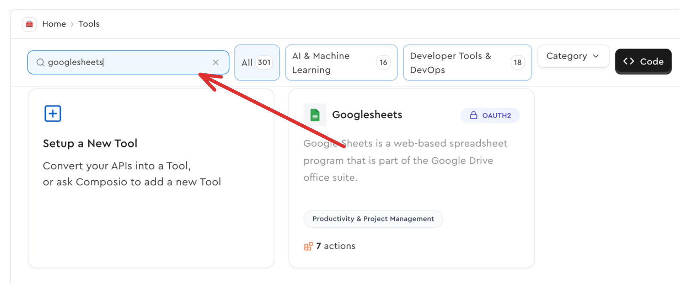
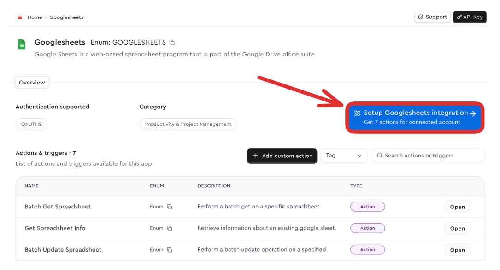
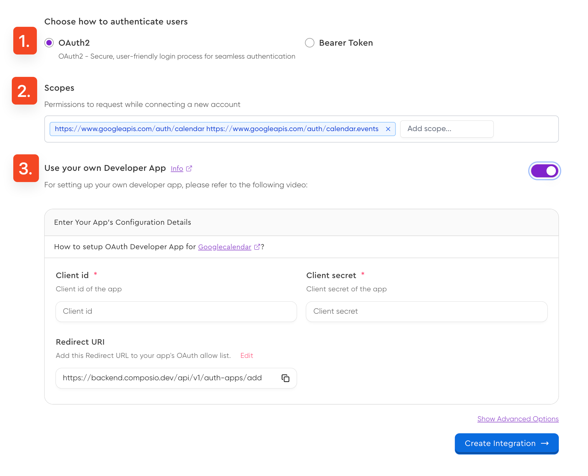

An **Integration** is the developer-level configuration within Composio for a specific external app (like GitHub, Slack, Google Calendar). It acts as the **blueprint** defining *how* Composio should interact with that app, including its authentication method (OAuth, API Key, etc.) and API details.

*   Integrations **do not** store individual user credentials.
*   You typically **create an Integration once per app**, per environment (e.g., one for development, one for production).
*   The main outcome is obtaining a unique **`integration_id`**, which you'll use later to [connect your users](/auth/connection).

## Creating an Integration

You can set up Integrations via the Composio Dashboard (recommended for visual configuration) or the CLI.

<Tabs>
<Tab title="Dashboard (Recommended)">
The dashboard offers a guided process for all app types.

<Steps>
<Step title="Select App">
Navigate to the [Apps page](https://app.composio.dev/apps) and choose the app you want to integrate (e.g., Slack).
<Frame background="subtle" title="Application Selection Screen">
  
</Frame>
</Step>
<Step title="Initiate Setup">
Click the **"Setup Integration"** button.
<Frame background="subtle" title="Integration Setup Interface">
  
</Frame>
</Step>
<Step title="Configure Integration Settings (If Required)">
The next steps depend on the app's authentication method:

- **For OAuth 2.0 Apps:** You'll need to decide whether to use Composio's default OAuth app or your own developer credentials. For more details, see **[Handling OAuth Connections](/auth/connection/oauth)** and **[White-labelling](/auth/white-labelling)**.
- **For API Key/Token Apps:** The keys are typically provided by the end-user later in the connection flow. See **[Handling API Key Connections](/auth/connection/non-oauth)** for that process.

You might also configure default scopes or API base URLs here if applicable.
</Step>
<Step title="(Optional) Limit Actions">
You can restrict which specific tools (actions) are enabled for this Integration, providing an extra layer of security.
<Frame background="subtle" title="Action Limitation Configuration">
  
</Frame>
</Step>
<Step title="Create and Get ID">
Click **"Create Integration"**. After creation, **copy the displayed `integration_id`**. You'll need this ID in your application code.

<Info>
Ensure you save the `integration_id` in a secrets manager or environment variable for later use.
</Info>
</Step>
</Steps>
</Tab>

<Tab title="CLI">
The `composio add <app>` command provides an interactive setup, usually defaulting to the simplest configuration (like using Composio's shared OAuth app).

```bash CLI Example
# Add a Slack integration using defaults
composio add slack
```
Follow the prompts, which may include browser authentication for OAuth apps. Upon success, the CLI will output the **`integration_id`**.

```bash Output Example
# ... authentication steps ...
# ✔ slack added successfully with ID: int_abc123def456...
```
<Note>
Setting up integrations with custom credentials (like your own OAuth app) via the CLI might be less straightforward than using the Dashboard. Use the Dashboard for complex configurations.
</Note>
</Tab>

<Tab title="Code (Advanced)">
Programmatic creation is useful for infrastructure-as-code or dynamic setups. Use `create_integration` (Python) or `integrations.create` (TypeScript).

This example creates a basic integration using Composio's default settings where applicable (like for OAuth).

<CodeGroup>
```python Python
from composio_openai import App, ComposioToolSet

toolset = ComposioToolSet()

integration = toolset.create_integration(
    app=App.GITHUB,
    auth_mode="OAUTH2",
    use_composio_oauth_app=True,
    # For use_composio_oauth_app=False, you can provide your own OAuth app credentials here
    # auth_config={
    #     "client_id": "123456",
    #     "client_secret": "123456"
    # }
)
print(integration.id)

```
```typescript TypeScript
import { OpenAIToolSet } from "composio-core";

const composioToolset = new OpenAIToolSet();

const integration = await composioToolset.integrations.create({
    name: "gmail_integration",
    appUniqueKey: "gmail",
    useComposioAuth: true,
    forceNewIntegration: true,
})

console.log(integration.id)
```
</CodeGroup>
<Info>
For details on providing specific `auth_config` parameters programmatically (e.g., for custom OAuth or other schemes), consult the [SDK Reference](/sdk-reference/) and the relevant guides like [Handling OAuth](/auth/connection/oauth) or [White-labelling](/auth/white-labelling).
</Info>
</Tab>
</Tabs>

## Using the Integration ID

The key outcome of this setup process is the **`integration_id`**. This unique identifier represents the specific configuration you've created for an app within Composio.

You will use this `integration_id` in the next step to initiate the authentication flow for your end-users.

➡️ **Next: [Connecting Users Overview](/auth/connection/)**