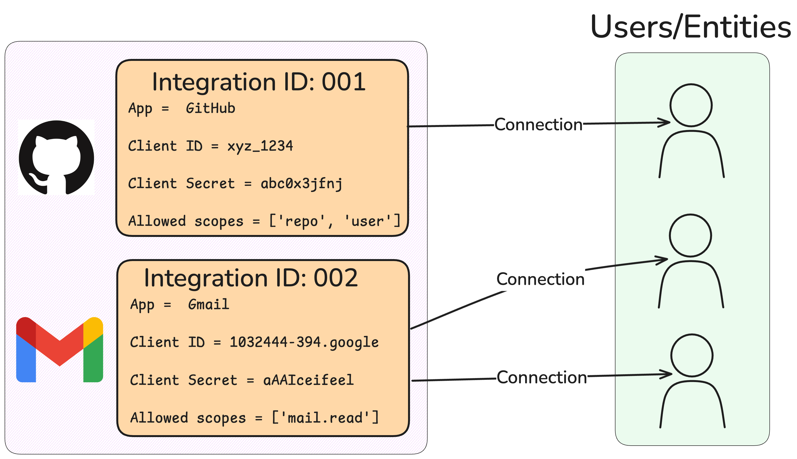

AI agents often need to perform actions on behalf of users like;
- sending an email from their Gmail
- creating an issue in their Jira
- or posting to their Slack

Doing this securely requires handling complex authentication flows like OAuth 2.0, managing API keys, storing sensitive tokens, and refreshing credentials. This distracts from building the core agent logic.

Let's see how Composio Auth works in a basic example where we connect a user to their GitHub account.

## Quickstart with Composio Auth


**1. Identify the User (Entity) & App**

Composio lets you specify a unique `entity_id` for each user in your application. This is the user's identifier in your application.

<CodeGroup>
```python Python
# User identifier from your application
user_id_in_my_app = "user-alice-456"    # Can be UUID from DB
app_to_connect = "github" # The app key
```
```typescript TypeScript
// User identifier from your application
const userIdInMyApp = "user-alice-456"; // Can be UUID from DB
const appToConnect = "github"; // The app key
```
</CodeGroup>

**2. Initiate the Connection**

You'll need the `integration_id` for the app (which you typically set up once - see [Integrations](/auth/set-up-integrations)) and the `entity_id` you specified for your user.

<CodeGroup>
```python Python
from composio_openai import ComposioToolSet, Action # Or framework-specific ToolSet

toolset = ComposioToolSet()
entity = toolset.get_entity(id=user_id_in_my_app) # Get Entity object

print(f"Initiating GitHub connection for entity: {entity.id}")
# Initiate connection using the app's Integration and the user's Entity ID
connection_request = entity.initiate_connection(app_name=app_to_connect)

# Composio returns a redirect URL for OAuth flows
if connection_request.redirectUrl:
    print(f"Please direct the user to visit: {connection_request.redirectUrl}")
```
```typescript TypeScript
import { OpenAIToolSet } from "composio-core"; // Or framework-specific ToolSet

// Assume GITHUB_INTEGRATION_ID is fetched from config/env
const GITHUB_INTEGRATION_ID = "int_xxxxxxxx...";
const toolset = new OpenAIToolSet(); // Or other ToolSet

async function initiate() {
    const entity = await toolset.getEntity(userIdInMyApp); // Get Entity object

    console.log(`Initiating GitHub connection for entity: ${entity.id}`);
    // Initiate connection using the app's Integration and the user's Entity ID
    const connectionRequest = await entity.initiateConnection({
        appName: appToConnect
    });

    // Composio returns a redirect URL for OAuth flows
    if (connectionRequest.redirectUrl) {
        console.log(`Please direct the user to visit: ${connectionRequest.redirectUrl}`);
    }
}

initiate();
```
</CodeGroup>

**3. Wait for Connection Activation (OAuth)**

For OAuth flows, the user needs to visit the `redirectUrl` and authorize the connection. Your application can wait for the connection to become active.

<CodeGroup>
```python Python
# Wait for the user to complete the OAuth flow in their browser
print("Waiting for connection to become active...")
try:
    # This polls until the connection status is ACTIVE or timeout occurs
    active_connection = connection_request.wait_until_active(
        client=toolset.client, # Pass the underlying client
        timeout=120 # Wait for up to 2 minutes
    )
    print(f"Connection successful! ID: {active_connection.id}")
    # Store active_connection.id associated with user_id_in_my_app
except Exception as e:
    print(f"Connection timed out or failed: {e}")
```
```typescript TypeScript
async function waitForActive(connectionRequest: ConnectionRequest) { // Assuming connectionRequest from step 2
    console.log("Waiting for connection to become active...");
    try {
        // This polls until the connection status is ACTIVE or timeout occurs
        const activeConnection = await connectionRequest.waitUntilActive(120); // Wait up to 2 minutes
        console.log(`Connection successful! ID: ${activeConnection.id}`);
        // Store activeConnection.id associated with userIdInMyApp
    } catch (e) {
        console.error("Connection timed out or failed:", e);
    }
}

// You would call waitForActive after the user interaction is expected
// Example call (needs connectionRequest object from previous step):
waitForActive(connectionRequest);
```
</CodeGroup>

**4. Execute Actions Using the Connection**

Once the connection is active, you (or realistically, an agent) can execute actions for that app *on behalf of that specific user* by providing their `entity_id`

<CodeGroup>
```python Python
# Execute using the user's entity_id (Composio finds the right connection)
print(f"\nFetching GitHub username for entity: {user_id_in_my_app}")
user_info = toolset.execute_action(
    action=Action.GITHUB_GET_THE_AUTHENTICATED_USER,
    params={},
    entity_id=user_id_in_my_app # Specify the user context
)

if user_info.get("successful"):
    print("GitHub username:", user_info.get("data", {}).get("login"))
else:
    print("Failed to fetch user:", user_info.get("error"))
```
```typescript TypeScript
console.log(`\nFetching GitHub username for entity: ${userIdInMyApp}`);
try {
    const user_info = await toolset.executeAction({
        action: Action.GITHUB_GET_THE_AUTHENTICATED_USER,
        params: {},
        entityId: userIdInMyApp // Specify the user context
        // Or use connectionId if you have it and need precision:
        // connectedAccountId: activeConnection?.id
    });

    if (user_info.successful) {
        console.log("GitHub username:", (user_info.data as any)?.login);
    } else {
        console.error("Failed to fetch user:", user_info.error);
    }
} catch (error) {
    console.error("Error during execution:", error);
}
```
</CodeGroup>

Alternatively, you can execute actions directly using the connection ID if you have it:
<CodeGroup>
```python
user_info_direct = toolset.execute_action(
    action=Action.GITHUB_GET_THE_AUTHENTICATED_USER,
    params={},
    connected_account_id=active_connection.id
)
```
```typescript TypeScript
const user_info_direct = await toolset.executeAction({
    action: Action.GITHUB_GET_THE_AUTHENTICATED_USER,
    params: {},
    connectedAccountId: activeConnection.id
});
```
</CodeGroup>

This flow demonstrates how Composio uses **Integrations** (app config), **Entities** (your users), and **Connections** (the secure link between them) to simplify authenticated interactions for your AI agents.



<AccordionGroup>
  <Accordion title="Full Runnable Example Code">
    <CodeGroup>
      ```python Python
      # filename: connect_and_fetch_github.py
      from composio_openai import ComposioToolSet, Action, App
      from dotenv import load_dotenv
      import os
      import sys
      import time

      # Load environment variables from .env file
      # Ensure COMPOSIO_API_KEY is set
      load_dotenv()

      def run_auth_flow():
          # --- 1. Identify User & App ---
          user_id_in_my_app = "user-quickstart-py-example" # Example user ID
          app_to_connect = App.GITHUB # Use Enum for clarity

          print(f"--- Starting GitHub connection for Entity: {user_id_in_my_app} ---")

          toolset = ComposioToolSet()
          entity = toolset.get_entity(id=user_id_in_my_app)

          active_connection = None # Initialize variable

          try:
              # --- 2. Initiate Connection ---
              print(f"Initiating {app_to_connect.value} connection...")
              # Use app_name; SDK finds appropriate integration
              connection_request = entity.initiate_connection(app_name=app_to_connect)

              # --- 3. Handle Redirect & Wait for Activation (OAuth) ---
              if connection_request.redirectUrl:
                  print("\n!!! ACTION REQUIRED !!!")
                  print(f"Please visit this URL to authorize the connection:\n{connection_request.redirectUrl}\n")
                  print("Waiting for connection to become active (up to 120 seconds)...")

                  try:
                      # Poll Composio until the connection is marked active
                      active_connection = connection_request.wait_until_active(
                          client=toolset.client, # Pass the underlying client
                          timeout=120
                      )
                      print(f"\nConnection successful! ID: {active_connection.id}")
                      # In a real app, you'd store active_connection.id linked to user_id_in_my_app
                  except Exception as e:
                      print(f"Error waiting for connection: {e}", file=sys.stderr)
                      print("Please ensure you visited the URL and approved the connection.")
                      return # Exit if connection failed

              else:
                  # Handle non-OAuth flows if needed (e.g., API Key where connection is instant)
                  print("Connection established (non-OAuth flow). Fetching details...")
                  # Fetch the connection details using the ID from the request
                  active_connection = toolset.client.connected_accounts.get(connection_id=connection_request.connectedAccountId)
                  if active_connection.status != "ACTIVE":
                       print(f"Connection is not active (Status: {active_connection.status}). Exiting.", file=sys.stderr)
                       return


              # --- 4. Execute Action ---
              if active_connection and active_connection.status == "ACTIVE":
                  print(f"\nExecuting action using connection ID: {active_connection.id}")
                  print(f"Fetching GitHub username for entity: {user_id_in_my_app}...")

                  user_info = toolset.execute_action(
                      action=Action.GITHUB_GET_THE_AUTHENTICATED_USER,
                      params={},
                      # Provide context via entity_id (recommended)
                      entity_id=user_id_in_my_app
                      # OR precisely target the connection (if ID was stored)
                      # connected_account_id=active_connection.id
                  )

                  print("\n--- Execution Result ---")
                  if user_info.get("successful"):
                      username = user_info.get("data", {}).get("login", "N/A")
                      print(f"Successfully fetched GitHub username: {username}")
                  else:
                      print(f"Failed to fetch user info: {user_info.get('error', 'Unknown error')}")
                  # import json
                  # print("\nFull response:")
                  # print(json.dumps(user_info, indent=2))
              else:
                   print("\nSkipping action execution as connection is not active.")


          except Exception as e:
              print(f"\nAn unexpected error occurred: {e}", file=sys.stderr)

      if __name__ == "__main__":
          run_auth_flow()
      ```
      ```typescript TypeScript
      // filename: connectAndFetchGithub.ts
      import { OpenAIToolSet, Action, App, ConnectionRequest } from "composio-core";
      import dotenv from "dotenv";

      // Load environment variables from .env file
      // Ensure COMPOSIO_API_KEY is set
      dotenv.config();

      // Helper function to introduce delay
      const sleep = (ms: number) => new Promise(resolve => setTimeout(resolve, ms));

      async function main() { // Renamed to main for standard practice
          // --- 1. Identify User & App ---
          const userIdInMyApp = "user-quickstart-ts-example"; // Example user ID
          const appToConnect = App.GITHUB; // Use Enum

          console.log(`--- Starting GitHub connection for Entity: ${userIdInMyApp} ---`);

          const toolset = new OpenAIToolSet(); // Initialize ToolSet
          let connectionRequest: ConnectionRequest | null = null;
          let activeConnection: any = null; // Initialize variable

          try {
              const entity = await toolset.getEntity(userIdInMyApp);

              // --- 2. Initiate Connection ---
              console.log(`Initiating ${appToConnect} connection...`);
              // Use appName; SDK finds appropriate integration
              connectionRequest = await entity.initiateConnection({
                  appName: appToConnect,
              });

              // --- 3. Handle Redirect & Wait for Activation (OAuth) ---
              if (connectionRequest?.redirectUrl) {
                  console.log("\n!!! ACTION REQUIRED !!!");
                  console.log(`Please visit this URL to authorize the connection:\n${connectionRequest.redirectUrl}\n`);
                  console.log("Waiting for connection to become active (up to 120 seconds)...");

                  try {
                      // Poll Composio until the connection is marked active
                      activeConnection = await connectionRequest.waitUntilActive(120); // Wait up to 120 seconds
                      console.log(`\nConnection successful! ID: ${activeConnection.id}`);
                      // In a real app, you'd store activeConnection.id linked to userIdInMyApp
                  } catch (e) {
                      console.error("Error waiting for connection:", e);
                      console.error("Please ensure you visited the URL and approved the connection.");
                      return; // Exit if connection failed
                  }
              } else if (connectionRequest?.connectedAccountId) {
                   // Handle non-OAuth flows if needed
                   console.log("Connection established (non-OAuth flow). Fetching details...");
                   // Wait a moment for backend processing if needed, then fetch details
                   await sleep(2000); // Small delay might be needed
                   activeConnection = await toolset.client.connectedAccounts.get({
                       connectedAccountId: connectionRequest.connectedAccountId
                   });
                    if (activeConnection.status !== "ACTIVE") {
                       console.error(`Connection is not active (Status: ${activeConnection.status}). Exiting.`);
                       return;
                    }
                    console.log(`Connection active! ID: ${activeConnection.id}`);
              } else {
                   console.error("Failed to initiate connection properly.");
                   return;
              }

              // --- 4. Execute Action ---
              if (activeConnection && activeConnection.status === "ACTIVE") {
                  console.log(`\nExecuting action using connection ID: ${activeConnection.id}`);
                  console.log(`Fetching GitHub username for entity: ${userIdInMyApp}...`);

                  const user_info = await toolset.executeAction({
                      action: Action.GITHUB_GET_THE_AUTHENTICATED_USER, // Use Enum
                      params: {},
                      // Provide context via entityId (recommended)
                      entityId: userIdInMyApp
                      // OR precisely target the connection (if ID was stored)
                      // connectedAccountId: activeConnection.id
                  });

                  console.log("\n--- Execution Result ---");
                  if (user_info.successful) {
                      const username = (user_info.data as any)?.login ?? "N/A";
                      console.log(`Successfully fetched GitHub username: ${username}`);
                  } else {
                      console.error(`Failed to fetch user info: ${user_info.error ?? 'Unknown error'}`);
                  }
                  // console.log("\nFull response:");
                  // console.log(JSON.stringify(user_info, null, 2));

              } else {
                   console.log("\nSkipping action execution as connection is not active.");
              }

          } catch (error) {
              console.error("\nAn unexpected error occurred:", error);
          }
      }

      // Run the async function
      main();
      ```
    </CodeGroup>
  </Accordion>
</AccordionGroup>
