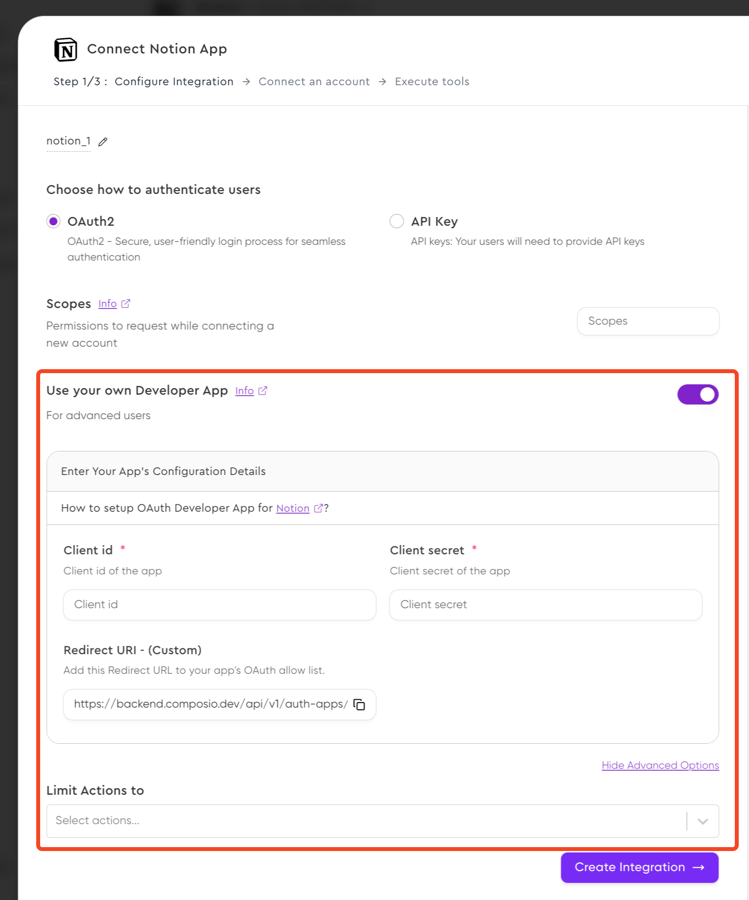

## Overview


As agents move closer to the user, they need access to the user's data and services to perform tasks with agency. Connecting these agents and applications to third party services means having the manage the complexities of authentication yourself.

## Integrations

An *integration* is a configuration object that defines how an application connects to external service for a user. It encapsulates the authentication credentials, permission scopes and API specification that determine how an AI agent interacts with the external service.


### Using Composio's client credentials *(for prototyping)*

It's a development overhead and a burden to manage and create a developer app when making AI Agents for personal use or during prototyping.

To solve for that, you can use Composio's client credentials.

<Tabs>
<Tab title="Code">
<CodeGroup>
```python Python
from composio_openai import ComposioToolSet, App, Action

toolset = ComposioToolSet()
integration = toolset.create_integration(
    app=App.GITHUB,
    auth_mode="OAUTH2",
    use_composio_oauth_app=True,
    force_new_integration=True,
)
```
```typescript TypeScript
import { Composio } from "composio-core";

const composioClient = new Composio({});
const integration = await composioClient.integrations.create({
  appUniqueKey: "github",
  name: "github-managed",
  authScheme: "OAUTH2",
  useComposioAuth: true,
  forceNewIntegration: true
});

```
</CodeGroup>
</Tab>
<Tab title="CLI">
Add GitHub integration

```shell CLI
composio add github
```

Follow the instructions in the CLI to authenticate and connect your GitHub
account.
</Tab>

<Tab title="Dashboard">

Head over to the [dashboard](https://app.composio.dev/apps) to setup a GitHub
integration for your account following the steps in the video below.

<video
    src="../assets/videos/creating-integration.mp4"
    width="854"
    height="480"
    autoplay
    loop
    playsinline
    controls
>
</video>

</Tab>
</Tabs>


<Note>When creating an integration we also attempt to create a connection to help you start prototyping early!</Note>


### Creating and using your own developer app
<Tabs>
<Tab title="Code">
<CodeGroup>
```python Python {8-14}
from composio_openai import ComposioToolSet, App, Action

toolset = ComposioToolSet()
toolset.create_integration(
    app=App.GITHUB,
    auth_mode="OAUTH2",
    force_new_integration=True,
    use_composio_oauth_app=False,
    auth_config={
        "client_id": "1234567890",
        "client_secret": "1234567890",
        "redirect_uri": "https://backend.yourapp.com/handle-redirect-uri/",
        "scopes": ["repo", "user"],
    },
)
```
```typescript TypeScript {9-15}
import { Composio } from "composio-core";

const composioClient = new Composio({});
const integration = await composioClient.integrations.create({
    appUniqueKey: "github",
    name: "github-self",
    authScheme: "OAUTH2",
    forceNewIntegration: true,
    useComposioAuth: false,
    authConfig: {
        clientId: "1234567890",
        clientSecret: "1234567890",
        redirectUri: "https://backend.yourapp.com/handle-redirect-uri/",
        scopes: ["repo", "user"],
    },
});
```
</CodeGroup>
</Tab>
<Tab title="CLI">
```bash CLI
composio add github
2025-03-01T15:21:02.447Z - Initializing Composio w API Key: [REDACTED] and baseURL: https://backend.composio.dev
? Do you want to use Composio Auth? no
? Enter the Integration name: github-self
? Client ID: *******
? Client Secret: ******
? Redirect URI https://backend.yourapp.com/handle-redirect-uri/
? Scopes repo, user
```
</Tab>
<Tab title="Dashboard">
You can add in your OAuth client credentials directly from the dashboard.



</Tab>

</Tabs>

## Connections and entities
An *entity* represents a unique user in your application's ecosystem. Think of it as a container that holds all the third-party service connections for a single user. Key points about entities:

For example, if you have a user "Alice" in your application, she would have a single entity ID that links to all her connected services (GitHub, Google Calendar, etc.).

<Tip>Use entity IDs to track and sync a user's connections with your application logic!</Tip>

A *connection* represents an authenticated link between an entity (user) and a specific external service through an integration. When a user authorizes your application to access a service, Composio:

<CodeGroup>
```python Python {3-5}
# Using the above imports
user_id = "alice_id"    # Retrieved through application logic / DB

toolset.get_integration(id=integration.id)
entity = toolset.get_entity(id=user_id)
conn_req = entity.initiate_connection(app_name=App.GITHUB, use_composio_auth=True)

print(conn_req.redirectUrl) # Emit the redirect URL back to the user
```

```typescript TypeScript
// Using the above imports
const integrations = await toolset.integrations.get({
  integrationId: "",
});

const entity = await toolset.getEntity("default");

entity.initiateConnection({
  appName: "github",
  authMode: "COMPOSIO_LINK",
});

const connReq = await entity.initiateConnection({
  appName: "github",
  authMode: "COMPOSIO_LINK",
});
console.log(connReq.redirectUrl);   // Emit the redirect URL back to the user
```

</CodeGroup>
During tool calling and execution, specifying the `entity_id` will execute the tool on behalf of the user specified.

Executing tool calls on behalf of the user
<CodeGroup>
```python Python
toolset.handle_tool_calls(
    response=response,
    entity_id=entity.id,
)
```

```typescript TypeScript
import { OpenAIToolSet } from "composio-core";

const toolset = new OpenAIToolSet();

await toolset.handleToolCall(
  response,
  entityId: "default"
)

```
</CodeGroup>

<Note>
The entity ID can be any string that uniquely identifies a user in your system. If not specified, Composio uses "default" as the entity ID.
</Note>
