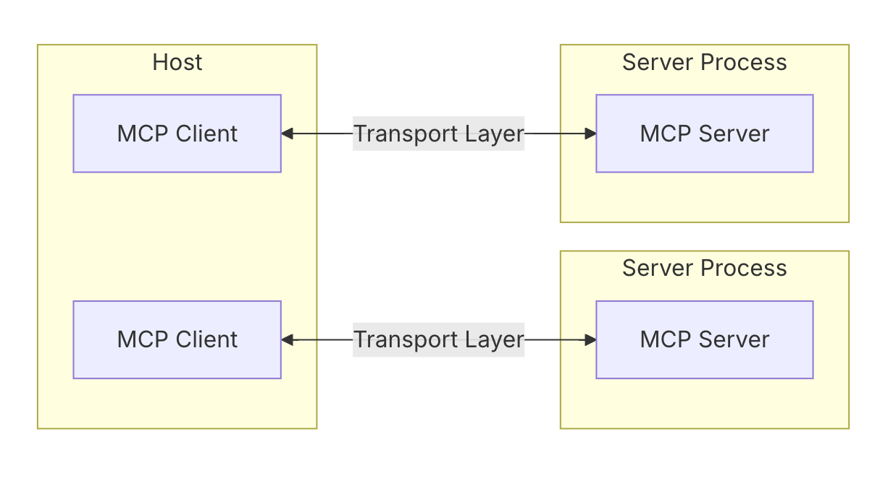

### What is MCP?

The [Model Context Protocol (MCP)](https://modelcontextprotocol.io/introduction) is an open standard developed by Anthropic to help AI models, especially Large Language Models (LLMs), connect with external data sources and tools. Think of it like a universal adapter that lets AI systems access real-time information from places like databases, APIs, or business tools, making their responses more relevant and accurate. This is particularly useful for AI-powered applications like chatbots or IDEs, where access to up-to-date data can enhance functionality.

### How Server-Client Interactions Work

MCP operates on a client-server model:

- The **client** (or host) is the AI application, like Claude Desktop or an IDE, that needs data.
- The **server** exposes tools, prompts, and resources that the client can use.

<Frame caption="Credit: https://modelcontextprotocol.io/docs/concepts/architecture">
  
</Frame>

Interactions happen through two kinds of [transport layers](https://modelcontextprotocol.io/docs/concepts/transports#built-in-transport-types):

- **Stdio transport:** Used when the server runs locally with the client, communicating through standard input and output. This is great for local development, as it’s simple and fast.
- **HTTP with SSE (Server-Sent Events) transport:** Used for remote servers, allowing real-time updates over HTTP. This is ideal for cloud-based setups, enabling the server to push updates to the client as they happen.

### How Servers Are Deployed

Servers can be set up in two main ways, depending on your needs:

- **Local Deployment:** If you have the server code locally or can pull it from a repository, you can start it using simple commands. For example, the [GitHub MCP server](https://github.com/modelcontextprotocol/servers/tree/main/src/github) maintained by the `modelcontextprotocol` repository can be started by running `npx -y  @modelcontextprotocol/server-github` with the GitHub personal access token specified in the environment. Most MCP clients let you specify the command to run, so they can start the server directly when needed, which is great for development.
- **Remote Deployment (SSE Servers):** For remote use, servers are deployed to a web endpoint somewhere, and all you need is the SSE URL to connect your client. There’s no need for local setup or running commands; the server is managed separately, making it hassle-free. Clients typically have an option to just take this URL and connect, which is convenient for cloud-based setups.

Composio manages SSE servers for users, handling setup and maintenance, which means you don’t need to worry about the technical details. Check out the full list of [servers here](https://mcp.composio.dev/).

<Note>
Currently we are not envisioning our fully managed MCP servers to function like a devtool and something you build on top of but rather for providers who have MCP as a way to quickly integrate with our tools. Read more about this here: [Building on top of Composio MCP](https://composio.notion.site/mcp-faq?pvs=4)
</Note>

### Benefits of Using Composio MCP Servers

Choosing Composio for hosting your MCP servers comes with several advantages:

- **No Management Needed:** Composio takes care of server setup, updates, and maintenance, freeing you to focus on development.
- **Automatic Authentication:** Authentication is handled through [Composio’s integrations](https://composio.dev/tools), so you don’t need to manage API keys or credentials, reducing setup friction.
- **One-Click Installation:** You can connect to hundreds of servers with simple instructions, often integrating with clients in a single line of code, which is unexpectedly convenient for rapid deployment.

### Exploring Further

You can check out Composio’s offerings and find a list of available servers with one-click installation instructions at [Composio MCP](https://composio.dev/mcp/). For detailed setup guides on clients like Cursor, Windsurf, and Claude, refer to their documentation pages ([Cursor](./cursor.mdx), [Windsurf](./windsurf.mdx) and [Claude](./claude.mdx)).

We also wrote an [extensive blogpost](https://composio.dev/blog/mcp-server-step-by-step-guide-to-building-from-scrtch/) that has a step-by-step guide to building MCP servers from scratch, what the different components of MCP are, how they work and more details on the Composio MCP integration.