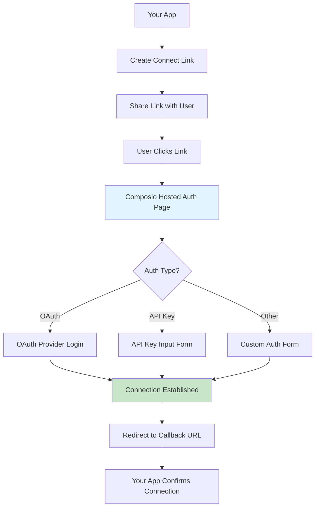

Composio Connect Link provides a hosted authentication flow that simplifies connecting user accounts across all authentication methods. Instead of handling OAuth redirects, API key collection, or other authentication complexities in your application, you can use a single unified flow.

## How it works

<Frame>

</Frame>

## Creating a Connect Link

### Basic usage

Create a Connect Link for any auth config:

<CodeGroup>
```python Python
from composio import Composio

composio = Composio(api_key="YOUR_COMPOSIO_API_KEY")

# Create a Connect Link
connection_request = composio.connected_accounts.link(
    user_id="user_123",
    auth_config_id="ac_UdqFwixfy3cV"
)

# Share this URL with your user
print(f"Connect your account: {connection_request.redirect_url}")

# Wait for the connection to be established
connected_account = connection_request.wait_for_connection()
print(f"Connection established: {connected_account.id}")
```

```typescript TypeScript
import { Composio } from '@composio/core';

const composio = new Composio({apiKey: "YOUR_COMPOSIO_API_KEY"});

// Create a Connect Link
const connectionRequest = await composio.connectedAccounts.link(
    'user_123',
    'ac_UdqFwixfy3cV'
);

// Share this URL with your user
console.log(`Connect your account: ${connectionRequest.redirectUrl}`);

// Wait for the connection to be established
const connectedAccount = await connectionRequest.waitForConnection();
console.log(`Connection established: ${connectedAccount.id}`);
```
</CodeGroup>

### With callback URL

Redirect users back to your application after authentication:

<CodeGroup>
```python Python
connection_request = composio.connected_accounts.link(
    user_id="user_123",
    auth_config_id="ac_UdqFwixfy3cV",
    callback_url="https://yourapp.com/auth/callback"
)

# The user will be redirected to your callback URL after authentication
print(f"Connect URL: {connection_request.redirect_url}")
```

```typescript TypeScript
const connectionRequest = await composio.connectedAccounts.link(
    'user_123',
    'ac_UdqFwixfy3cV',
    { callbackUrl: 'https://yourapp.com/auth/callback' }
);

// The user will be redirected to your callback URL after authentication
console.log(`Connect URL: ${connectionRequest.redirectUrl}`);
```
</CodeGroup>

## Handling different authentication methods

Composio Connect Link automatically adapts to the authentication method configured in your auth config:

### OAuth toolkits

For OAuth-based toolkits (Gmail, GitHub, Slack, etc.), the hosted page:
1. Redirects users to the provider's login page
2. Handles the OAuth callback
3. Exchanges authorization codes for tokens
4. Establishes the connection

### API Key toolkits

For API key-based toolkits (OpenAI, Stripe, etc.), the hosted page:
1. Displays a secure form for API key input
2. Validates the key format
3. Tests the connection
4. Stores the credentials securely

### Custom authentication

For toolkits with custom authentication requirements, the hosted page:
1. Collects all required parameters
2. Validates inputs based on the toolkit's requirements
3. Establishes the connection

## Integration patterns

### Email invitation flow

Send Connect Links via email to onboard users:

<CodeGroup>
```python Python
def invite_user_to_connect(user_email, user_id):
    # Create Connect Link
    connection_request = composio.connected_accounts.link(
        user_id=user_id,
        auth_config_id="ac_UdqFwixfy3cV",
        callback_url="https://yourapp.com/onboarding/complete"
    )
    
    # Send email with the link
    send_email(
        to=user_email,
        subject="Connect your GitHub account",
        body=f"""
        Click here to connect your GitHub account:
        {connection_request.redirect_url}
        
        This link will expire in 24 hours.
        """
    )
    
    return connection_request.id
```

```typescript TypeScript
async function inviteUserToConnect(userEmail: string, userId: string) {
    // Create Connect Link
    const connectionRequest = await composio.connectedAccounts.link(
        userId,
        'ac_UdqFwixfy3cV',
        { callbackUrl: 'https://yourapp.com/onboarding/complete' }
    );
    
    // Send email with the link
    await sendEmail({
        to: userEmail,
        subject: 'Connect your GitHub account',
        body: `
            Click here to connect your GitHub account:
            ${connectionRequest.redirectUrl}
            
            This link will expire in 24 hours.
        `
    });
    
    return connectionRequest.id;
}
```
</CodeGroup>

### In-app connection flow

Display Connect Links within your application:

<CodeGroup>
```python Python
# In your API endpoint
@app.post("/api/connect/{toolkit}")
def create_connection_link(toolkit: str, user_id: str):
    auth_config_id = get_auth_config_for_toolkit(toolkit)
    
    connection_request = composio.connected_accounts.link(
        user_id=user_id,
        auth_config_id=auth_config_id,
        callback_url=f"https://yourapp.com/integrations/{toolkit}/success"
    )
    
    return {
        "redirect_url": connection_request.redirect_url,
        "connection_id": connection_request.id
    }
```

```typescript TypeScript
// In your API endpoint
app.post('/api/connect/:toolkit', async (req, res) => {
    const { toolkit } = req.params;
    const { userId } = req.body;
    
    const authConfigId = getAuthConfigForToolkit(toolkit);
    
    const connectionRequest = await composio.connectedAccounts.link(
        userId,
        authConfigId,
        { callbackUrl: `https://yourapp.com/integrations/${toolkit}/success` }
    );
    
    res.json({
        redirectUrl: connectionRequest.redirectUrl,
        connectionId: connectionRequest.id
    });
});
```
</CodeGroup>

### Checking connection status

Monitor the connection status without blocking:

<CodeGroup>
```python Python
import asyncio

async def check_connection_status(connection_id: str):
    max_attempts = 60  # Check for up to 5 minutes
    attempt = 0
    
    while attempt < max_attempts:
        try:
            connected_account = composio.connected_accounts.get(connection_id)
            if connected_account.status == "active":
                return connected_account
        except:
            pass  # Connection not yet established
        
        await asyncio.sleep(5)  # Check every 5 seconds
        attempt += 1
    
    raise TimeoutError("Connection was not established within timeout")
```

```typescript TypeScript
async function checkConnectionStatus(connectionId: string) {
    const maxAttempts = 60;  // Check for up to 5 minutes
    let attempt = 0;
    
    while (attempt < maxAttempts) {
        try {
            const connectedAccount = await composio.connectedAccounts.get(connectionId);
            if (connectedAccount.status === 'active') {
                return connectedAccount;
            }
        } catch {
            // Connection not yet established
        }
        
        await new Promise(resolve => setTimeout(resolve, 5000));  // Check every 5 seconds
        attempt++;
    }
    
    throw new Error('Connection was not established within timeout');
}
```
</CodeGroup>

## Benefits

### Simplified implementation

- **Single API call** - One method works for all authentication types
- **No redirect handling** - Composio manages OAuth flows
- **No UI required** - Use Composio's hosted forms
- **Automatic validation** - Input validation handled automatically

### Enhanced security

- **No credential handling** - Credentials never touch your servers
- **Secure storage** - Encrypted credential storage
- **Token management** - Automatic token refresh for OAuth

### Better user experience

- **Consistent flow** - Same experience across all toolkits
- **Mobile friendly** - Responsive design for all devices
- **Error handling** - Clear error messages and recovery flows
- **Multi-language support** - Localized authentication pages

## Migration guide

If you're currently using the `initiate` method, migrating to Connect Link is straightforward:

<Tabs>
<Tab title="Before (initiate)">
```python
# OAuth flow
connection_request = composio.connected_accounts.initiate(
    user_id=user_id,
    auth_config_id=auth_config_id,
    config={"auth_scheme": "OAUTH2"}
)

# API key flow
connection_request = composio.connected_accounts.initiate(
    user_id=user_id,
    auth_config_id=auth_config_id,
    config={
        "auth_scheme": "API_KEY",
        "val": {"api_key": user_api_key}
    }
)
```
</Tab>
<Tab title="After (link)">
```python
# Both OAuth and API key flows
connection_request = composio.connected_accounts.link(
    user_id=user_id,
    auth_config_id=auth_config_id
)
# No need to handle different auth schemes differently!
```
</Tab>
</Tabs>

## Next steps

<Card title="Authentication methods" href="/docs/authenticating-tools" icon="fa-solid fa-key">
  Learn about different authentication methods and auth configs
</Card>

<Card title="Custom auth configs" href="/docs/custom-auth-configs" icon="fa-solid fa-cog">
  Configure custom OAuth apps and authentication parameters
</Card>

<Card title="Programmatic auth configs" href="/docs/programmatic-auth-configs" icon="fa-solid fa-code">
  Create and manage auth configs via API
</Card>