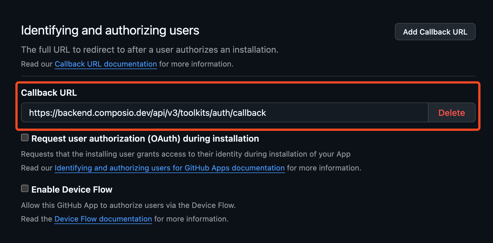
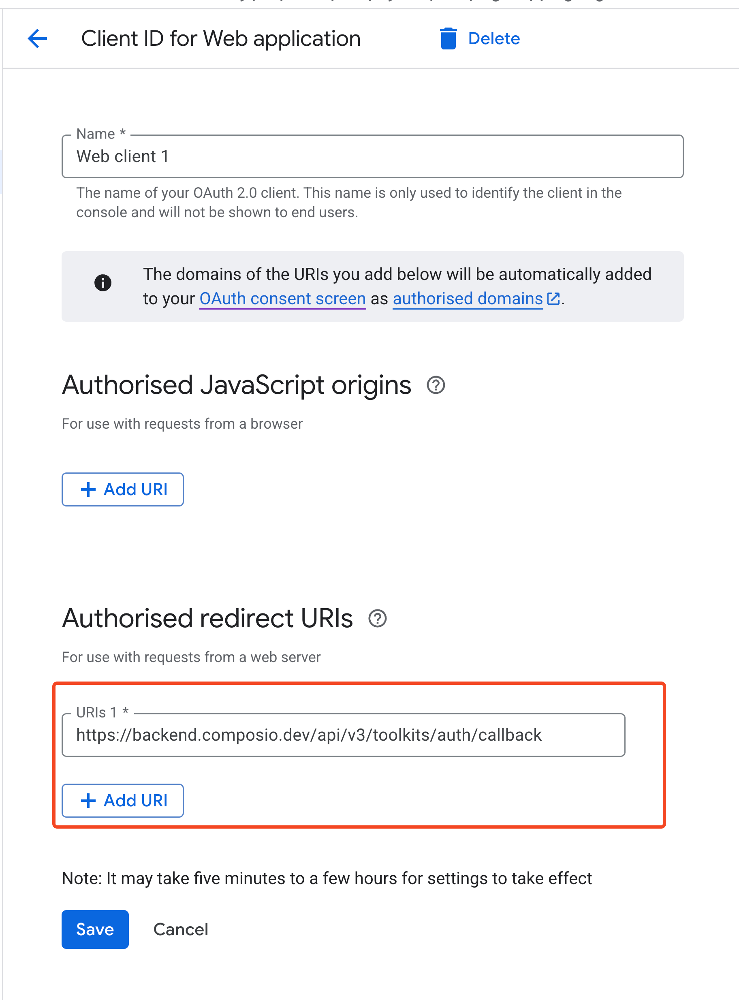

Auth configs are created once and reused many times. However, when managing multiple toolkits, you may want to create auth configs programmatically.

- When creating and destroying auth configs multiple times in your app's lifecycle.
- When creating auth configs for your users' users.

## OAuth2 based apps

### Using Composio Default Auth
Since OAuth2 is the most common authentication type for applications, Composio provides managed auth for most OAuth2 based applications.
This is to speed up development and prototyping.
This means you don't have to provide your own OAuth credentials.

<CodeGroup>
```python Python maxLines=60  wordWrap
from composio import Composio

composio = Composio()

# Use composio managed auth
auth_config = composio.auth_configs.create(
    toolkit="github",
    options={
        "type": "use_composio_managed_auth",
    },
)
print(auth_config)
```

```typescript TypeScript maxLines=60  wordWrap {7}
import { Composio } from "@composio/core";

const composio = new Composio();

const authConfig = await composio.authConfigs.create("GITHUB", {
  name: "GitHub",
  type: "use_composio_managed_auth",
});

console.log(authConfig);
```
</CodeGroup>

The returned `auth_config_id` should be stored securely in your database for future use to be created and destroyed multiple times.

You can also provide your own authentication details. The required `credentials` and `authScheme` depend on the auth type.

### Using your own OAuth2 credentials
Setting up and using your own OAuth2 credentials is the recommended way when going to production or expecting high usage.

In this example, we're using our own OAuth2 client ID and secret to create the auth config for Notion.

<CodeGroup>
```python Python maxLines=60 wordWrap {7}
# Use custom auth
auth_config = composio.auth_configs.create(
    toolkit="notion",
    options={
        "name": "Notion Auth",
        "type": "use_custom_auth",
        "auth_scheme": "OAUTH2",
        "credentials": {
            "client_id": "1234567890",
            "client_secret": "1234567890",
            "oauth_redirect_uri": "https://backend.composio.dev/api/v3/toolkits/auth/callback",
        },
    },
)
print(auth_config)
```
```typescript TypeScript maxLines=60  wordWrap {3}
const authConfig = await composio.authConfigs.create("NOTION", {
    name: "Notion",
    type: "use_custom_auth",
    credentials: {
        client_id: "1234567890",
        client_secret: "1234567890",
        oauth_redirect_uri: "https://backend.composio.dev/api/v3/toolkits/auth/callback",
    },
    authScheme: "OAUTH2",
});

console.log(authConfig);
```
</CodeGroup>

<Note>
You can specify a custom redirect URI by including the `oauth_redirect_uri` parameter in the credentials object. If not provided, Composio uses the default redirect URI.
</Note>

**Specifying the authorized redirect URI**
The process of setting up your own OAuth2 credentials usually involves generating a client ID and secret and specifying the **authorized redirect URI** in the OAuth configuration.

<Tip>
The **authorized redirect URI** is the URI that captures the OAuth code that is returned to the app.
</Tip>

While doing so, you must ensure to set the **authorized redirect URI** in the OAuth configuration to:

```
https://backend.composio.dev/api/v3/toolkits/auth/callback
```
<Tabs>
<Tab title="Redirect URI for GitHub">
<Frame>

</Frame>
</Tab>
<Tab title="Redirect URI for Google">
<Frame>

</Frame>
</Tab>
</Tabs>

### Specifying scopes
Composio requests a set of appropriate default OAuth2 scopes for each toolkit wherever possible. However, you can override or modify these scopes by passing a `scopes` field to the `credentials` object.

<CodeGroup>
<SnippetCode 
  src="fern/snippets/authentication/python/define-scopes.py" 
  title="Python"
  startLine={1} 
  endLine={17} 
  highlightStart={11}
  highlightEnd={13}
/>

<SnippetCode 
  src="fern/snippets/authentication/typescript/define-scopes.ts" 
  title="TypeScript"
  startLine={1} 
  endLine={17} 
  highlightStart={8}
  highlightEnd={10}
/>
</CodeGroup>


## Other auth types
Composio supports many applications that use different authentication types like API keys, Bearer tokens, JWT and even no authentication at all.

Generating the auth config for other auth types only has minor differences.
- `use_custom_auth` is used instead of `use_composio_managed_auth`
- The `credentials` field is used to pass the authentication details
- The `authScheme` field is used to specify the auth type

<CodeGroup>
<SnippetCode 
  src="fern/snippets/authentication/python/auth-config.py" 
  title="Python"
  startLine={5} 
  endLine={17} 
/>
<SnippetCode 
  src="fern/snippets/authentication/typescript/auth-config.ts" 
  title="TypeScript"
  startLine={5} 
  endLine={17} 
/>
</CodeGroup>

## Programmatically inspecting fields
In cases where you need to dynamically discover the exact field names and handle different auth schemes programmatically, you can inspect the auth config details first.

This works for all auth types.

<CodeGroup>
```python Python maxLines=60  wordWrap
required_fields = composio.toolkits.get_auth_config_creation_fields(
    toolkit="NOTION",
    auth_scheme="OAUTH2",
    required_only=True,
)
print(required_fields)
```
```typescript TypeScript maxLines=60
const toolkits = await composio.toolkits.get("NOTION");

// Extract field names from authConfigDetails
const authFields = await composio.toolkits.getAuthConfigCreationFields('NOTION', 'OAUTH2', {
  requiredOnly: true,
});

console.log("Required auth config fields:", authFields);
```
</CodeGroup>

and then inspect the required fields and specify them in the `credentials` object.