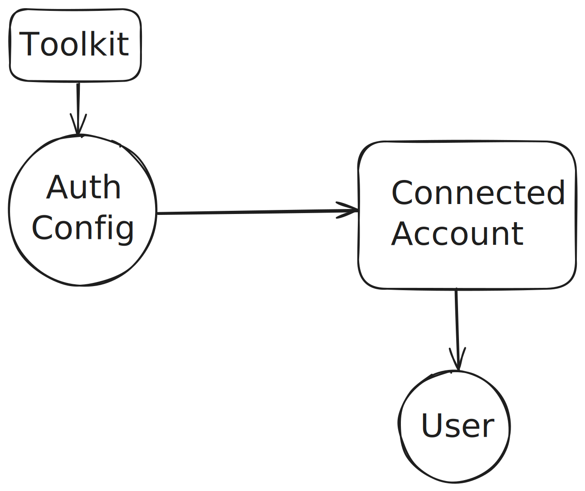

<Frame background="subtle" title="Auth Configs and Connected Accounts">
  
</Frame>


## Connected Accounts

For your agent to act on behalf of a user for a particular toolkit, you need to
authenticate your users with the said toolkit. To do this, you need to create a
connected account for the user, this connected account is nothing but a set of
credentials that are either provided by the user or generated by the application
corresponding to the toolkit.

<CodeGroup>
```python Python maxLines=60
# Create a new connection request
connection_request = composio.connected_accounts.initiate(
    user_id="<USER_ID>",
    auth_config_id="<AUTH_CONFIG_ID>",
)
print(connection_request.redirect_url)

# Wait for the connection to be established
connected_account = connection_request.wait_for_connection()
print(connected_account)
```
```typescript TypeScript maxLines=60
// Create a new connection request
const connectionRequest = await composio.connectedAccounts.initiate(
  "<USER_ID>",
  "<AUTH_CONFIG_ID>",
);
console.log(connectionRequest.redirectUrl);

// Wait for the connection to be established
const connection = await connectionRequest.waitForConnection();
console.log(connection);
```
</CodeGroup>

## Auth Configs

Creating a connected account requires a auth config for the toolkit. An auth
config is a set of credentials that are required to authenticate users with the toolkit,
and can differ based on the type of authentication flow (i.e. OAuth, API Key, etc).

Once you have auth config, you can initiate the connection request and depending on
the authentication scheme you can instruct the user to fill in the credentials or
redirect them to URL provided in the connection request.

### Managed Auth Configs

Composio provides a default set of auth configs for the most popular toolkits. You
can use them during development, but you should always create your own auth configs
for production.

To use a managed auth config, set `type` parameter to `use_composio_managed_auth`.

<CodeGroup>

```python Python maxLines=60
# Use managed auth
auth_config = composio.auth_configs.create(
    toolkit="gmail",
    options={
        "type": "use_composio_managed_auth",
    },
)
print(auth_config)
```
```typescript TypeScript maxLines=60
// Create a new auth config
const authConfig = await composio.authConfigs.create({
  toolkit: "gmail",
  options: {
    type: "use_composio_managed_auth",
  },
});
console.log(authConfig);
```
</CodeGroup> 

### Custom Auth Configs

To use a custom auth config, set `type` parameter to `use_custom_auth`.

<CodeGroup>
```python Python maxLines=60
# Use custom auth
auth_config = composio.auth_configs.create(
    toolkit="gmail",
    options={
        "name": "Gmail Auth",
        "type": "use_custom_auth",
        "auth_scheme": "API_KEY",
        "credentials": {
            "client_id": "<CLIENT_ID>",
            "client_secret": "<CLIENT_SECRET>",
        },
    },
)
print(auth_config)
```
```typescript TypeScript maxLines=60
// Create a new auth config
const authConfig = await composio.authConfigs.create({
  toolkit: "gmail",
  options: {
    name: "Gmail Auth",
    type: "use_custom_auth",
    authScheme: "API_KEY",
    credentials: {
      client_id: "<CLIENT_ID>",
      client_secret: "<CLIENT_SECRET>",
    },
  },
});
console.log(authConfig);
```
</CodeGroup>

{/* Add link to auth config dashboard */}
<Note>
Although you can create auth configs programmatically, we recommend you to create
and manage them in the Composio dashboard.
</Note>

## User IDs

User IDs are the **core foundation** of accessing and executing tools in Composio
at user level. The user IDs are mapped to connected accounts and every operation
related to a connected account requires a user ID. The same concept is later
delegated to the tool executions and trigger events.

Before you proceed with deploying your application, we highly recommend you to
read our [User IDs](/docs/guides/user-ids) guide to avoid critical security
issues.

To understand how to create auth configs and connected accounts, you can refer to
following guides:

<CardGroup cols={3}>
  <Card
    title="Managing Users With Composio"
    href="/examples/user-management"
  >
    Learn how to manage users with Composio's platform.
  </Card>
  <Card
    title="Composio With FastAPI"
    href="/examples/hono"
  >
    Learn how to integrate Composio with FastAPI services.
  </Card>
  <Card
    title="Composio With Hono"
    href="/examples/hono"
  >
    Learn how to integrate Composio with Hono services.
  </Card>
</CardGroup>

## Next Steps

<CardGroup cols={2}>
  <Card
    title="Tool Calling"
    icon="fa-solid fa-gear"
    href="/docs/tool-calling"
  >
    Learn how to call tools in your agent.
  </Card>
  <Card
    title="Custom Auth Params"
    icon="fa-solid fa-credit-card"
    href="/docs/custom-auth-params"
  >
    Learn how to use custom auth params to for tool calling.
  </Card>
  <Card
    title="Triggers"
    icon="fa-solid fa-webhook"
    href="/docs/triggers"
  >
    Learn how to use triggers to automate your workflows.
  </Card>
</CardGroup>