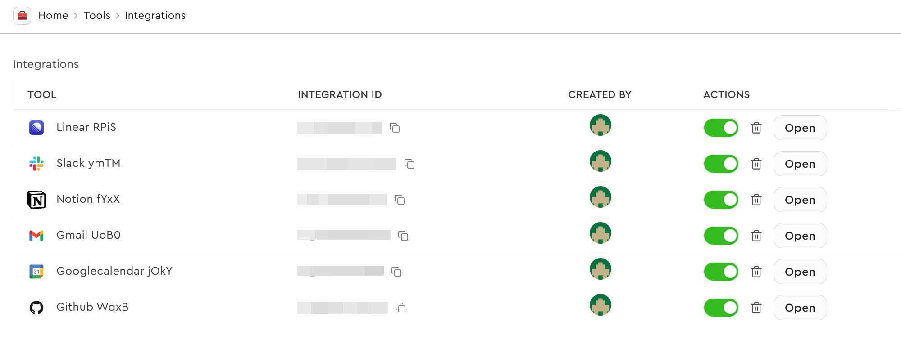
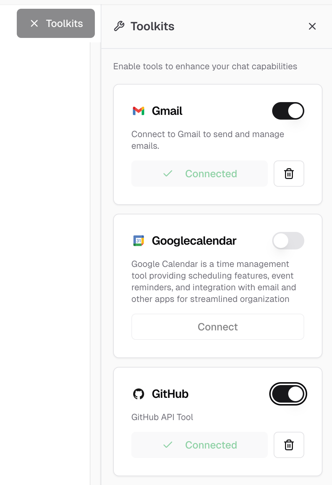
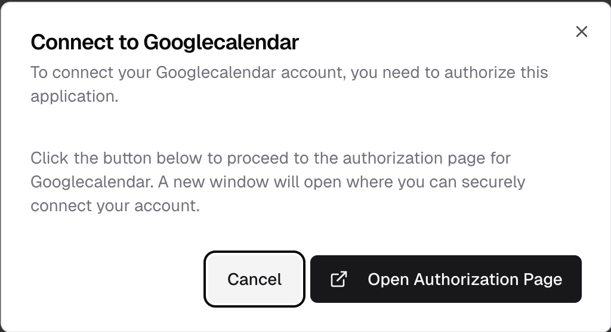
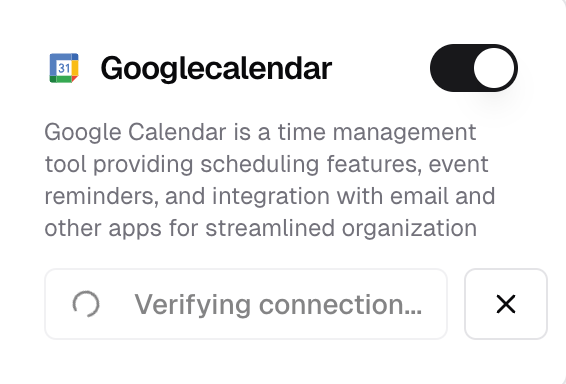
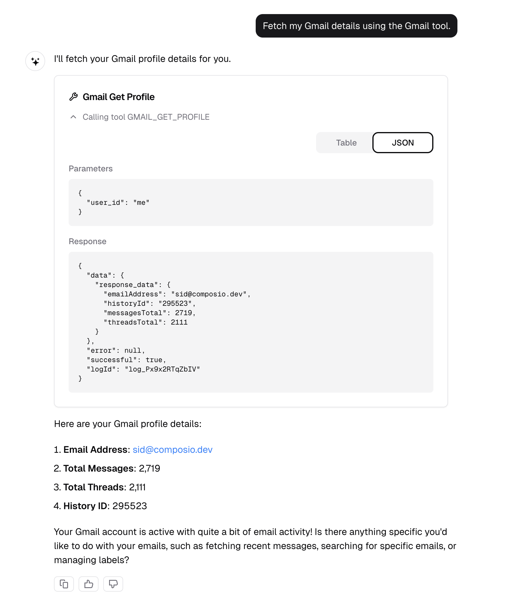

In this example, you will learn how to build a chatbot that:

- Lets users connect their various apps to the chatbot using the Composio SDK.
- Uses the Vercel provider in the Composio SDK to handle and execute tool calls from the LLM.

This page gives a high-level overview of the Composio SDK and how it is used in the
GitHub repository: [composiohq/chat](https://github.com/composiohq/chat). You can
find the demo live [here](https://chat.composio.dev/).

## Prerequisites

Ensure you've followed the README.md in the [composiohq/chat](https://github.com/composiohq/chat)
repository to set up the project locally.

## Creating auth configs

For all the apps you want to connect to the chatbot, you need to create their
respective auth configs. Learn how to create auth configs [here](/docs/authenticating-tools#creating-an-auth-config).
Once done, your auth configs will be available in the [Composio dashboard](https://app.composio.dev/integrations).

<Frame>
  
</Frame>

### Save auth config IDs to environment variables

For this project, the auth config IDs should be saved to the environment variables
with the `NEXT_PUBLIC_` prefix.

```bash .env.local
NEXT_PUBLIC_GMAIL_AUTH_CONFIG_ID=ac_1234567890
NEXT_PUBLIC_GITHUB_AUTH_CONFIG_ID=ac_1234567890
```

## Create a Composio client instance

We create a Composio client instance for server-side operations like API routes,
server components, etc.

```typescript lib/service/composio.ts
import { Composio } from '@composio/core';
import { VercelProvider } from '@composio/vercel';

const composio = new Composio({
  apiKey: process.env.COMPOSIO_API_KEY,
  provider: new VercelProvider(),
});

export default composio;
```

## Creating an API for fetching toolkits

The Composio SDK is meant to be used only in server-side code. For client-side
functionality, we create API endpoints in the `/app/api/` directory. In order to
list the toolkits and their connection status, we create a Next.js API route to
fetch the toolkits using Composio SDK.

<Frame>
  
</Frame>

### 1. Listing connected accounts

First, we fetch all connected accounts for a user and create a mapping of toolkit
slugs to their connection IDs:

```typescript app/api/composio/toolkits.ts
export async function GET() {
  // ... auth logic ...

  // List connected accounts to get connection IDs for each toolkit
  const connectedAccounts = await composio.connectedAccounts.list({
    userIds: [session.user.id],
  });

  const connectedToolkitMap = new Map();
  connectedAccounts.items.forEach(account => {
    connectedToolkitMap.set(account.toolkit.slug.toUpperCase(), account.id);
  });

  // ... continue with toolkit fetching ...
}
```

### 2. Fetching toolkit data and building response

Next, we fetch toolkit information for each supported toolkit and combine it with the connection status:

```typescript app/api/composio/toolkits.ts
export async function GET() {
  // ... auth logic ...
  // ... connected accounts mapping ...

  const SUPPORTED_TOOLKITS = ['GMAIL', 'GOOGLECALENDAR', 'GITHUB', 'NOTION'];

  // Fetch toolkit data from slugs
  const toolkitPromises = SUPPORTED_TOOLKITS.map(async slug => {
    const toolkit = await composio.toolkits.get(slug);
    const connectionId = connectedToolkitMap.get(slug.toUpperCase());

    return {
      name: toolkit.name,
      slug: toolkit.slug,
      description: toolkit.meta?.description,
      logo: toolkit.meta?.logo,
      categories: toolkit.meta?.categories,
      isConnected: !!connectionId,
      connectionId: connectionId || undefined,
    };
  });

  const toolkits = await Promise.all(toolkitPromises);
  return NextResponse.json({ toolkits });
}
```

## Managing connections

Users need to connect and disconnect their accounts from the chatbot to enable tool usage. When users click "Connect" on a toolkit, we initiate an OAuth flow, and when they click "Disconnect", we remove their connection.

### 1. Initiating a connection

When a user wants to connect their account, we create a connection request that redirects them to the OAuth provider:

<Frame>
  
</Frame>

```typescript app/api/connections/initiate/route.ts
export async function POST(request: Request) {
  // ... auth and validation ...

  const { authConfigId } = requestBody;

  // Initiate connection with Composio
  const connectionRequest = await composio.connectedAccounts.initiate(
    session.user.id,
    authConfigId
  );

  return NextResponse.json({
    redirectUrl: connectionRequest.redirectUrl,
    connectionId: connectionRequest.id,
  });
}
```

### 2. Checking connection status

After initiating a connection, we need to wait for the OAuth flow to complete. We check the connection status to know when it's ready to use:

<Frame>
  
</Frame>

```typescript app/api/connections/status/route.ts
export async function GET(request: Request) {
  // ... auth and validation ...

  const connectionId = searchParams.get('connectionId');

  // Wait for connection to complete
  const connection = await composio.connectedAccounts.waitForConnection(connectionId);

  return NextResponse.json({
    id: connection.id,
    status: connection.status,
    authConfig: connection.authConfig,
    data: connection.data,
  });
}
```

### 3. Deleting a connection

When a user wants to disconnect their account, we remove the connection using the connection ID:

```typescript app/api/connections/delete/route.ts
export async function DELETE(request: Request) {
  // ... auth and validation ...

  const connectionId = searchParams.get('connectionId');

  // Delete the connection
  await composio.connectedAccounts.delete(connectionId);

  return NextResponse.json({
    success: true,
    message: 'Connection deleted successfully',
  });
}
```

## Working with tools

Once users have connected their accounts, we need to track which toolkits are enabled and fetch the corresponding tools for the LLM.

### 1. Tracking enabled toolkits

We keep track of which toolkits the user has enabled in the chat interface:

```typescript components/chat.tsx
const { ... } = useChat({
    // ... other config ...
    experimental_prepareRequestBody: (body) => {
      // Get current toolbar state
      const currentToolbarState = toolbarStateRef.current;
      const enabledToolkits = Array.from(
        currentToolbarState.enabledToolkitsWithStatus.entries(),
      ).map(([slug, isConnected]) => ({ slug, isConnected }));

      return {
        // ... other fields ...
        enabledToolkits,
      };
    },
    // ... other handlers ...
  });
```

### 2. Fetching tools for enabled toolkits

We fetch Composio tools based on the enabled toolkit slugs:

```typescript lib/ai/tools/composio.ts
export async function getComposioTools(userId: string, toolkitSlugs: string[]) {
  // ... validation ...

  const tools = await composio.tools.get(userId, {
    toolkits: toolkitSlugs,
  });
  return tools || {};
}
```

```typescript app/api/chat.ts
export async function POST(request: Request) {
  // ... auth and parsing ...

  const toolkitSlugs = enabledToolkits?.map(t => t.slug) || [];

  const composioTools = await getComposioTools(session.user.id, toolkitSlugs);

  const result = streamText({
    // ... model config ...
    tools: {
      ...composioTools,
    },
  });
}
```

## Bonus: Creating custom component to show tool calls

By default, tool calls appear as raw JSON in the chat interface. To create a better user experience, we can build custom components that display tool calls with proper formatting and loading states.

<Frame>
  
</Frame>

You can find the `ToolCall` component at `components/tool-call.tsx`. Here's how to integrate it into your message rendering:

```typescript components/messages.tsx
if (type === 'tool-invocation') {
  const { toolInvocation } = part;
  const { toolName, toolCallId, state, args, result } = toolInvocation;

  if (state === 'call') {
    return (
      <ToolCall
        key={toolCallId}
        toolName={toolName}
        args={args}
        isLoading={true}
      />
    );
  }

  if (state === 'result') {
    return (
      <ToolCall
        key={toolCallId}
        toolName={toolName}
        args={args}
        result={result}
        isLoading={false}
      />
    );
  }
}
```
