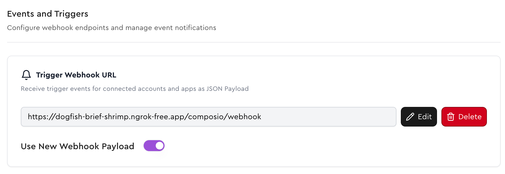
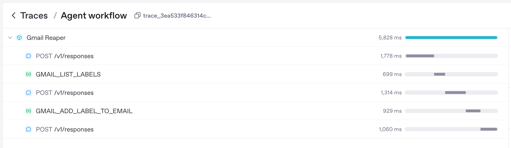
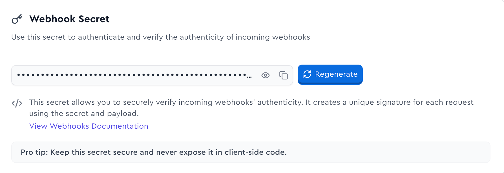

Imagine having an AI assistant that automatically organizes your Gmail inbox by intelligently labeling incoming emails. That's exactly what we'll build in this tutorial.

<Frame>
  
</Frame>

The complete app is available in our [`filter-gmails-example`](https://github.com/ComposioHQ/filter-gmails-example) repository. The app has a frontend built with Next.js along with Supabase for authentication.

<Card
  title="GitHub Repository"
  href="https://github.com/ComposioHQ/filter-gmails-example"
  icon="fa-brands fa-github"
>
  Explore the complete source code on GitHub
</Card>

In this guide, we'll focus on the Composio + OpenAI Agents part of the app.

## Prerequisites
- Clone the [`filter-gmails-example`](https://github.com/ComposioHQ/filter-gmails-example) repository and set the project up locally.
- Get a Composio API key. You can get one [here](https://app.composio.dev/developers).


## Creating Triggers for users
[Triggers](/docs/using-triggers) are a way to listen for events from apps. They act as a notification system for your AI applications, enabling your agents to respond dynamically to external events occurring within your apps.

In some cases, triggers require certain configurations to set the correct events. You can inspect and add these properties while enabling the triggers.

<SnippetCode
  githubUrl="https://github.com/ComposioHQ/filter-gmails-example/blob/master/apps/backend/email_processor.py#L135-L156"
  language="python"
  title="apps/backend/email_processor.py"
  highlightStart={18}
  highlightEnd={22}
/>

Then the trigger can be created with the following code:

<SnippetCode
  githubUrl="https://github.com/ComposioHQ/filter-gmails-example/blob/master/apps/backend/email_processor.py#L163-L169"
  language="python"
  title="apps/backend/email_processor.py"
/>


## Listening for a trigger event
<Callout type="info">
For local development, you can use [ngrok](https://ngrok.com/) to expose your local server to the internet.

```bash
ngrok http 8000
```

Then you can set the ngrok URL in the trigger configuration.
<Frame>
    
</Frame>
</Callout>

This is the main webhook endpoint for processing Gmail new message events.

Composio sends a POST request to the webhook endpoint `/composio/webhook` that contains the event data.

It is parsed and then the labeling method `process_gmail_message` is called through a FastAPI Background task.

```python apps/backend/main.py {1-5, 29-33} maxLines=33
@app.post("/composio/webhook")
async def listen_webhooks(
    request: Request, 
    background_tasks: BackgroundTasks
):
    """
    Main webhook endpoint for processing Gmail 
    new message events. This is the core webhook 
    labeling functionality.
    """
    # Verify webhook signature
    # Check if this is a Gmail new message event
    if (
        webhook_data.get("type") == "gmail_new_message"
        or "gmail" in webhook_data.get("type", "").lower()
    ):
        gmail_message = GmailMessage.from_composio_payload(
            webhook_data
        )
        # Get the user's custom prompt or use default
        default_prompt = (
            initial_prompt or "Default email processing prompt"
        )
        user_prompt = get_user_prompt(
            gmail_message.user_id, default_prompt
        )

        # Add email processing to background tasks
        background_tasks.add_task(
            process_gmail_message, 
            gmail_message, 
            user_prompt
        )

        logger.info(
            f"Queued email {gmail_message.id} for processing"
        )
    return {"status": "received", "webhook_id": webhook_id}
```

## Processing the mail using OpenAI Agents SDK
The `process_gmail_message` method is responsible for processing the email using the OpenAI Agents SDK.

<SnippetCode
  githubUrl="https://github.com/ComposioHQ/filter-gmails-example/blob/master/apps/backend/email_processor.py#L14-L24"
  language="python"
  title="apps/backend/email_processor.py"
/>

<SnippetCode
  githubUrl="https://github.com/ComposioHQ/filter-gmails-example/blob/master/apps/backend/email_processor.py#L42-L45"
  language="python"
  title="apps/backend/email_processor.py"
/>

We read the first 10k characters of the email body to pass it to the agent. This is done to avoid overwhelming or surpassing the token limits in case of really long emails.

<SnippetCode
  githubUrl="https://github.com/ComposioHQ/filter-gmails-example/blob/master/apps/backend/email_processor.py#L50-L60"
  language="python"
  title="apps/backend/email_processor.py"
/>

`user_filter` is the user's custom prompt from the database. We pass it to the agent along with the email body.

<SnippetCode
  githubUrl="https://github.com/ComposioHQ/filter-gmails-example/blob/master/apps/backend/email_processor.py#L68-L85"
  language="python"
  title="apps/backend/email_processor.py"
/>

You can view the agent trace in OpenAI's [Traces Dashboard](https://platform.openai.com/traces/).

<Frame>
  
</Frame>

## Securing the webhooks!
It is important to validate the webhook signature to ensure the request is coming from Composio.

Generate and store the webhook signature in the environment variables.

<Frame>
  
</Frame>

The webhook signature is validated in the `verify_webhook_signature` function.
<SnippetCode
  githubUrl="https://github.com/ComposioHQ/filter-gmails-example/blob/master/apps/backend/webhook.py#L10-L56"
  language="python"
  title="apps/backend/webhook.py"
/>

In the `/composio/webhook` endpoint, we verify the webhook signature and then parse the request body. If the signature is invalid, we return a 401 status code.

<SnippetCode
  githubUrl="https://github.com/ComposioHQ/filter-gmails-example/blob/master/apps/backend/main.py#L31-L38"
  language="python"
  title="apps/backend/main.py"
/>

## Inspiration
This example was inspired by an X/Twitter post by [@FarzaTV](https://x.com/FarzaTV/status/1905371012369350857).

We encourage you to check out the [full app](https://github.com/ComposioHQ/filter-gmails-example), fork it, build it, and make it your own! Reach out to [sid@composio.dev](mailto:sid@composio.dev) for free credits ;)
