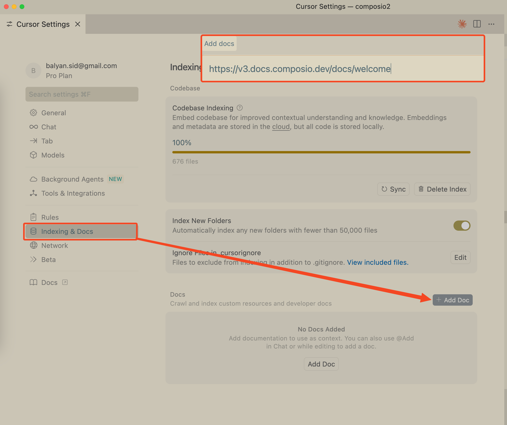
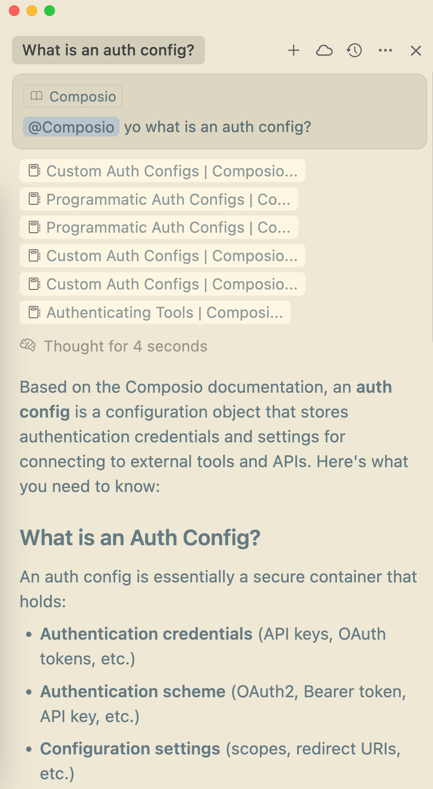
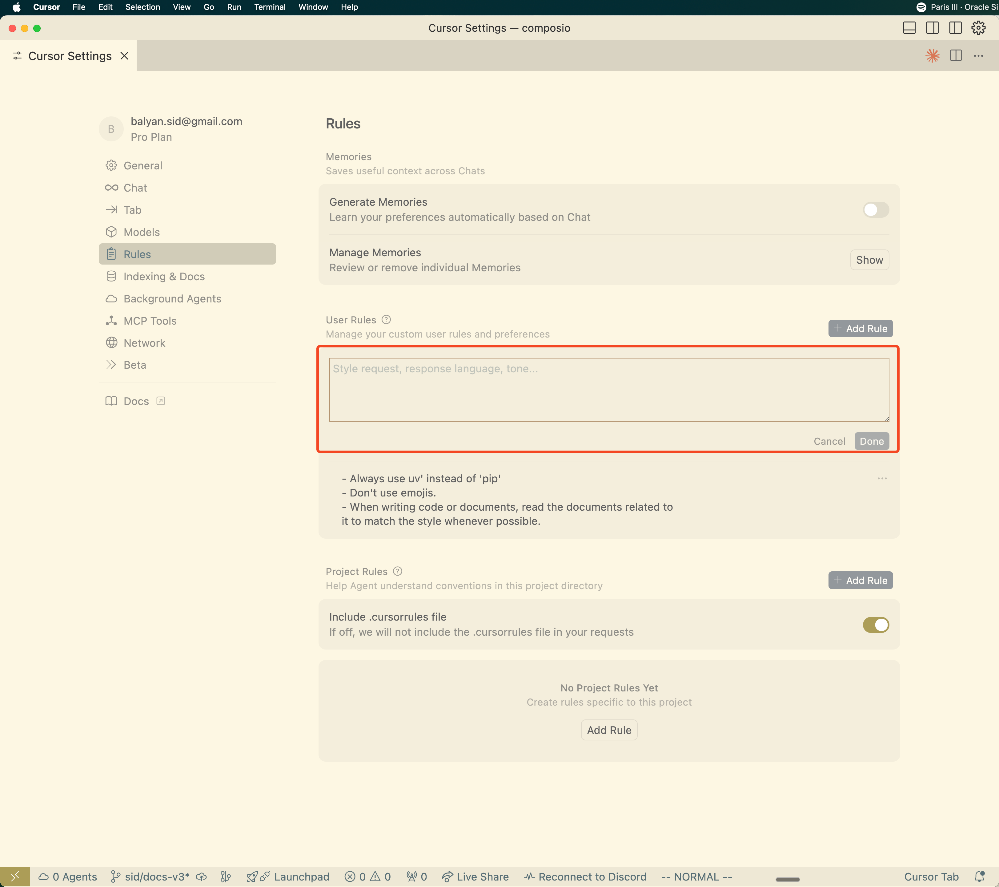

This comprehensive guide explains how to set up your IDE and coding agents to help you ship faster with Composio. We'll cover optimal configurations for popular editors and AI coding assistants.

<Tip>
For LLMs: Use [llms.txt](https://docs.composio.dev/llms.txt) to index our documentation
</Tip>

## Cursor
Cursor is an AI-powered code editor that can significantly accelerate your development with Composio. Here's how to set it up optimally.

### Index Documentation
Cursor can index documentation, making it easy to ask questions about Composio and get contextual answers while coding.

<Frame>
  
</Frame>

### To index Composio documentation:

1. Open Cursor Settings (Shift + Cmd/Ctrl + J)
2. Navigate to "Features" → "Codebase indexing"
3. Add the Composio documentation URLs:

- https://docs.composio.dev
- https://github.com/ComposioHQ/composio (for source code reference)

Once indexed, you can ask questions directly in the chat!
<Frame>
  
</Frame>


### Optimize Cursor with Custom Rules
To get the best experience building with Composio, add custom instructions to Cursor's AI system. This helps the AI understand Composio's patterns and best practices.

<Frame>
  
</Frame>

**To add custom rules:**

1. Open Cursor Settings (Shift + Cmd/Ctrl + J)
2. Go to "General" → "Rules for AI"
3. Add the appropriate prompt below based on your language

```md
Below is a list of Composio documentation. Use your web and fetch capabilities to read the documentation you need.
[Composio Documentation](https://docs.composio.dev)

For AI agents and LLMs, we also provide a structured documentation index at:
[LLMs Text Documentation](https://docs.composio.dev/llms.txt)

- [Quickstart](https://docs.composio.dev/docs/quickstart.mdx): Add authenticated tool-calling to any LLM agent in three steps.
- [Configuration](https://docs.composio.dev/docs/configuration.mdx)
- [Providers](https://docs.composio.dev/docs/providers.mdx)
- [Executing Tools](https://docs.composio.dev/docs/executing-tools.mdx): Learn how to execute Composio's tools with different providers and frameworks
- [Authenticating Tools](https://docs.composio.dev/docs/authenticating-tools.mdx): Learn how to authenticate tools
- [Fetching and Filtering Tools](https://docs.composio.dev/docs/fetching-tools.mdx): Learn how to fetch and filter Composio's tools and toolkits
- [Modifying tool schemas](https://docs.composio.dev/docs/modifying-tool-schemas): Learn how to use schema modifiers to transform tool schemas before they are seen by agents.
- [Modifying tool inputs](https://docs.composio.dev/docs/modifying-tool-inputs): Learn how to use before execution modifiers to modify tool arguments before execution.
- [Modifying tool outputs](https://docs.composio.dev/docs/modifying-tool-outputs): Learn how to use after execution modifiers to transform tool results after execution.
- [Creating custom tools](https://docs.composio.dev/docs/custom-tools.mdx): Learn how to extend Composio's toolkits with your own tools
- [Custom Auth Configs](https://docs.composio.dev/docs/custom-auth-configs.mdx): Guide to using customizing auth configs for a toolkit
- [Programmatic Auth Configs](https://docs.composio.dev/docs/programmatic-auth-configs.mdx): Guide to creating auth configs programmatically
- [Custom Auth Parameters](https://docs.composio.dev/docs/custom-auth-params.mdx): Guide to injecting custom credentials in headers or parameters for a toolkit
- [Using Triggers](https://docs.composio.dev/docs/using-triggers.mdx): Send payloads to your system based on external events
- [OpenAI Providers](https://docs.composio.dev/providers/openai.mdx)
- [Anthropic Provider](https://docs.composio.dev/providers/anthropic.mdx)
- [LangGraph Provider](https://docs.composio.dev/providers/langgraph.mdx)
- [CrewAI Provider](https://docs.composio.dev/providers/crewai.mdx)
- [Vercel AI SDK Provider](https://docs.composio.dev/providers/vercel.mdx)
- [Google ADK Provider](https://docs.composio.dev/providers/google-adk.mdx)
- [OpenAI Agents Provider](https://docs.composio.dev/providers/openai-agents.mdx)
- [Mastra Provider](https://docs.composio.dev/providers/mastra.mdx)
- [Custom Providers](https://docs.composio.dev/toolsets/custom.mdx)

```
