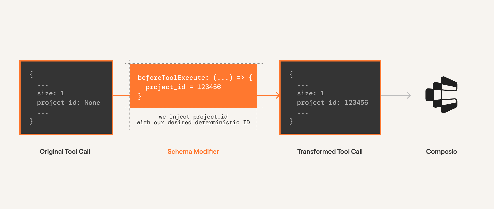

When working with tool calling, you might want to modify the tool execution. Maybe
you want to inject some custom parameters before the tool is executed. Or maybe you
want to modify the response from the tool. Modifiers are a way to do this.

## Before Execution

These modifier are called before the tool is executed. This allows you to modify
different tool execution parameters.

<Frame>
  
</Frame>


```python
from composio import ExecutionModifier
```