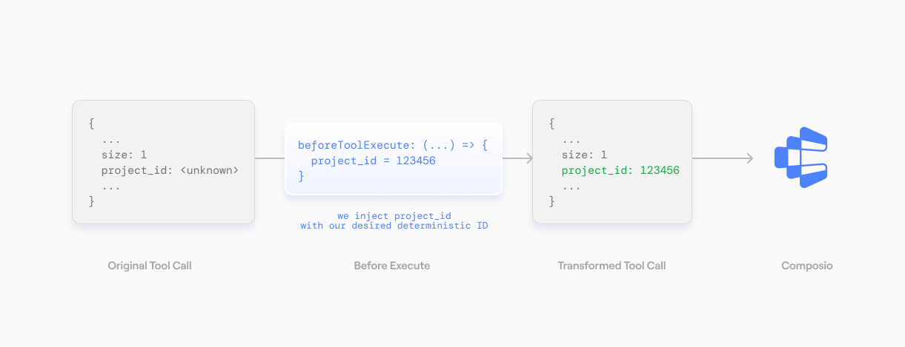

Before execution can be used to modify the different tool execution parameters
before the actual tool call happens. This is useful if you want to inject some
custom parameters before the tool call happens or override the arguments emitted
by the LLM.

<Frame>
  
</Frame>

<Note>
  Below we use the `beforeExecute` modifier to modify the number of posts returned by the
  `HACKERNEWS_GET_LATEST_POSTS` tool.
</Note>

<Tabs>
  <Tab title="With Chat Completions">
    Since completion providers don't have a function execution step -- Composio will 
    will execute the tool call directly. Hence, the modifier is configured on 
    the `tools.execute` method.

    <CodeGroup>
      ```python Python
      from openai import OpenAI
      from composio import Composio, before_execute
      from composio.types import ToolExecuteParams

      composio = Composio()
      openai_client = OpenAI()
      user_id = "user@email.com"

      @before_execute(tools=["HACKERNEWS_GET_LATEST_POSTS"])
      def before_execute_modifier(
          tool: str,
          toolkit: str,
          params: ToolExecuteParams,
      ) -> ToolExecuteParams:
          params["arguments"]["size"] = 1
          return params


      # Get tools
      tools = composio.tools.get(user_id=user_id, slug="HACKERNEWS_GET_LATEST_POSTS")

      # Get response from the LLM
      response = openai_client.chat.completions.create(
          model="gpt-4o-mini",
          tools=tools,
          messages=[{"role": "user", "content": "Fetch latest posts from hackernews"}],
      )
      print(response)

      # Execute the function calls.
      result = composio.provider.handle_tool_calls(
          response=response,
          user_id="default",
          modifiers=[
              before_execute_modifier,
          ],
      )
      print(result)
      ```
      ```typescript TypeScript
      const response = await openai.chat.completions.create({
        model: "gpt-4o-mini",
        messages,
        tools,
        tool_choice: "auto",
      });

      const { tool_calls } = response.choices[0].message;
      console.log(tool_calls);

      if (tool_calls) {
        const {
          function: { arguments: toolArgs },
        } = tool_calls[0];

        const result = await composio.tools.execute(
          "HACKERNEWS_GET_LATEST_POSTS",
          {
            userId,
            arguments: JSON.parse(toolArgs),
          },
          {
            beforeExecute: ({ toolSlug, toolkitSlug, params }) => {
              if (toolSlug === "HACKERNEWS_GET_LATEST_POSTS") {
                params.arguments.size = 1;
              }
              console.log(params);
              return params;
            },
          }
        );
        console.log(JSON.stringify(result, null, 2));
      }
      ```
    </CodeGroup>
  </Tab>
  <Tab title="With Agentic Frameworks">
    Agentic providers have a function execution step. The modifier is configured
    on the `tools.get` method which modifies the execution logic within the framework!

    <CodeGroup>
      ```python Python (CrewAI)
      from composio import Composio, before_execute
      from composio.types import ToolExecuteParams
      from composio_crewai import CrewAIProvider

      composio = Composio(provider=CrewAIProvider())

      @before_execute(tools=["LINEAR_CREATE_LINEAR_ISSUE"])
      def modify_linear_project_id(
          tool: str,
          toolkit: str,
          params: ToolExecuteParams,
      ) -> ToolExecuteParams:
          params["arguments"]["project_id"] = "1234567890"
          return params

      tools = composio.tools.get(
          user_id="default",
          tools=[
              "HACKERNEWS_GET_LATEST_POSTS",
              "HACKERNEWS_GET_USER",
              "LINEAR_CREATE_LINEAR_ISSUE",
          ],
          modifiers=[
              modify_linear_project_id,
          ]
      )
      ```
      ```typescript TypeScript (Mastra)
      import { Composio } from "@composio/core";
      import { MastraProvider } from "@composio/mastra";
      import { Agent } from "@mastra/core/agent";

      const composio = new Composio({
        apiKey: process.env.COMPOSIO_API_KEY,
        provider: new MastraProvider(),
      });

      const userId = "user@acme.com"; // The user's ID.

      const agenticTools = await composio.tools.get(
        userId,
        {
          tools: [
            "HACKERNEWS_GET_LATEST_POSTS",
            "HACKERNEWS_GET_USER",
            "LINEAR_CREATE_LINEAR_ISSUE",
          ],
        },
        {
          beforeExecute: ({toolSlug, toolkitSlug, params}) => {
            if (toolSlug === "LINEAR_CREATE_LINEAR_ISSUE") {
              params.arguments.project_id = "1234567890";
            }
            return params;
          },
        }
      );

      const { text } = await generateText({
        model: openai("gpt-4o-mini"),
        messages: [
          { role: "user", content: "Create an issue to `sid` to add RLS" },
        ],
        tools: agenticTools,
        maxSteps: 5,
      });
      ```
    </CodeGroup>
  </Tab>
</Tabs>


## Next steps

<CardGroup cols={2}>
  <Card
    title="After Execution Modifiers"
    icon="fa-solid fa-code"
    href="/docs/guides/tool-execution-hooks/after-execution"
  >
    Learn how to use after execution modifiers.
  </Card>
  <Card
    title="Schema Modifiers"
    icon="fa-solid fa-code"
    href="/docs/guides/tool-execution-hooks/schema-modifiers"
  >
    Learn how to use schema modifiers.
  </Card>
  <Card
    title="SDK Reference"
    icon="fa-solid fa-code"
    href="/docs/sdk-reference"
  >
    API reference for Composio SDKs.
  </Card>
</CardGroup>
