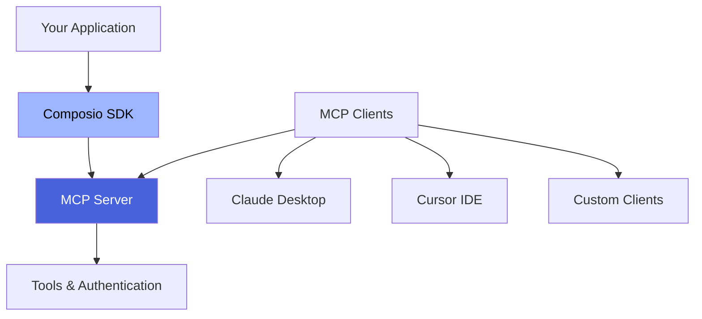

[Model Context Protocol](https://modelcontextprotocol.io/introduction) (MCP) is an open protocol that standardizes how LLM-powered applications provide _tools_ and relevant context to the underlying models.

The protocol follows a client-server model, where the MCP server provides the tools and context to the MCP client.

**Composio MCP Servers** make all [Composio tools](/tools) available through this standardized protocol, enabling seamless integration with any MCP-compatible client.

## ✨ Key Features

Our MCP SDK features an intuitive, powerful, and developer-friendly API:

- **⚡ Streamlined Authentication** - Simplified user auth flows with better error handling
- **📊 Real-time Connection Monitoring** - Check user authentication status before using servers
- **🛠 Enhanced Tool Management** - Fine-grained control over which tools are available
- **Tool Limiting** - Restrict which tools are available per user or context
- **TypeScript Support** - Full type safety and autocomplete, python support to come soon.


## 🚀 Getting Started

Choose your path based on your role:

### For End Users
If you are an individual looking to use composio mcp servers directly for yourself, this is all you have todo.

1. Visit [mcp.composio.dev](https://mcp.composio.dev) 
2. Click on any app that you want the MCP server for.
3. Use with Claude Desktop, Cursor, or any MCP client

### For Developers  
If you are looking to build on top of composio MCP servers, have granual control over MCP servers and manage it seperately for each of your users - you can simply follow the below guide.

<Steps>
  <Step title="Install the SDK">
    ```bash
    npm install @composio/core
    ```
  </Step>
  <Step title="Create your first server">
    ```typescript
    import { Composio } from '@composio/core';

    const composio = new Composio({
      apiKey: process.env.COMPOSIO_API_KEY,
    });

    const mcpServer = await composio.mcp.create({
      name: "personal-gmail-server",
      serverConfig: [
        {
          authConfigId: "your_auth_config_id",
          allowedTools: ["GMAIL_FETCH_EMAILS"]
        }
      ],
      options: {
        isChatAuth: true
      }
    });
    ```
  </Step>
  <Step title="Generate user-specific URLs">
    ```typescript
    // Check if user is authenticated
    const status = await composio.mcp.getUserConnectionStatus({
      id: mcpServer.id,
      userId: "user@example.com"
    });

    if (status.connected) {
      const urls = await mcpServer.getServer({
        userId: "user@example.com"
      });
      console.log("Ready to use:", urls);
    }
    ```
  </Step>
</Steps>

## 🏗 Architecture Overview



1. **Your Application** creates and manages MCP servers via the Composio SDK
2. **MCP Servers** expose your chosen tools with proper authentication
3. **MCP Clients** (Claude, Cursor, etc.) connect to servers and use tools
4. **Users** interact with tools through their preferred MCP client

## 📚 Documentation Structure

<Cards>
  <Card title="Developer Guide" href="/docs/mcp-developers" icon="code">
    Step-by-step guide to creating and managing MCP servers
  </Card>
  <Card title="Provider Examples" href="/docs/mcp-providers" icon="layers">
    Framework-specific implementations for Anthropic, OpenAI, Mastra, and more
  </Card>
  <Card title="Partner Program" href="/docs/mcp-partner-api" icon="handshake">
    Enterprise integration options and white-label solutions
  </Card>
</Cards>

## 🔗 Quick Links

- **[Complete API Guide](/docs/mcp/introduction)** - Learn all the methods and patterns
- **[Tool Catalog](/tools)** - Browse 1000+ available tools
- **[Dashboard](https://app.composio.dev)** - Manage servers and auth configs
- **[API Reference](/api-reference/mcp)** - Complete endpoint documentation

<Tip>
Need help getting started? Reach out on [Slack](https://composio.dev/slack) or [email](mailto:support@composio.dev) - our team is here to help!
</Tip>

