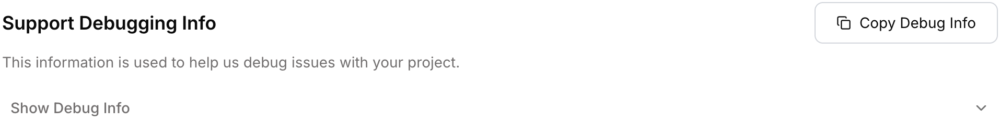

Your debugging info is tied to your project and it helps us trace what happened and debug the issue faster.

## Finding Your Debugging Info

Navigate to your project settings to find your debugging information:

<Frame>
  
</Frame>

<Frame>
  
</Frame>

## What to Share

When reaching out for support, share these identifiers:

```
@project_id: pr_xxxxxxxxxxxxx
@org_id: ok_xxxxxxxxxxxxx
@org_member_email: your-email@example.com
```

The identifiers with `pr_` (project) and `ok_` (organization) prefixes let us quickly check your logs inside our internal tracing tools, helping us resolve issues faster.

## Getting Help

<CardGroup cols={2}>
  <Card title="Join Discord" icon="fa-brands fa-discord" href="https://discord.gg/composio">
    Get basic support from the community and Composio team
  </Card>
  <Card title="GitHub Discussions" icon="fa-brands fa-github" href="https://github.com/ComposioHQ/composio/discussions">
    Request new tools and share feedback
  </Card>
  <Card title="File an Issue" icon="fa-light fa-bug" href="https://github.com/ComposioHQ/composio/issues">
    Report SDK issues and bugs
  </Card>
  <Card title="Contact Support" icon="fa-light fa-envelope" href="mailto:support@composio.dev">
    Reach out for dedicated support channels on Growth and Enterprise plans
  </Card>
</CardGroup>

