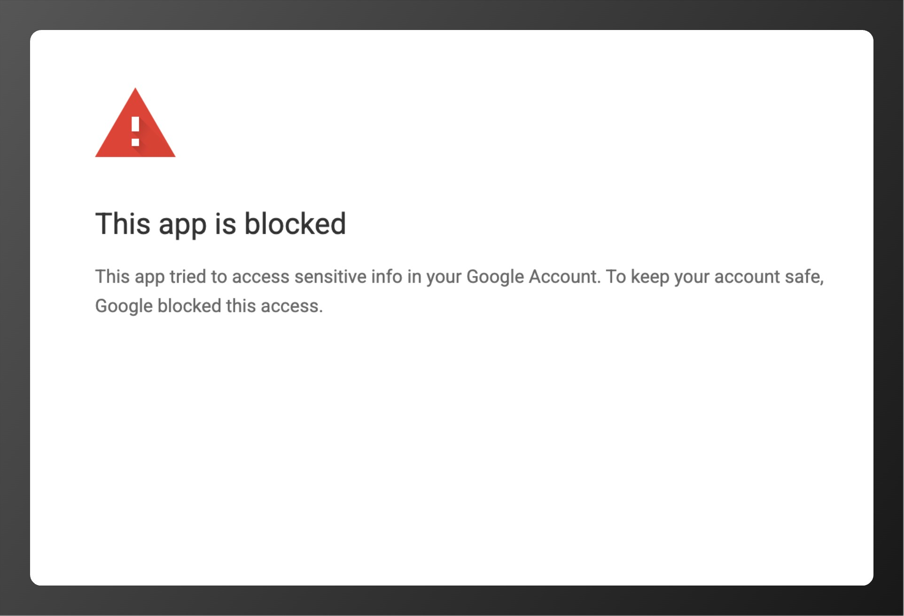
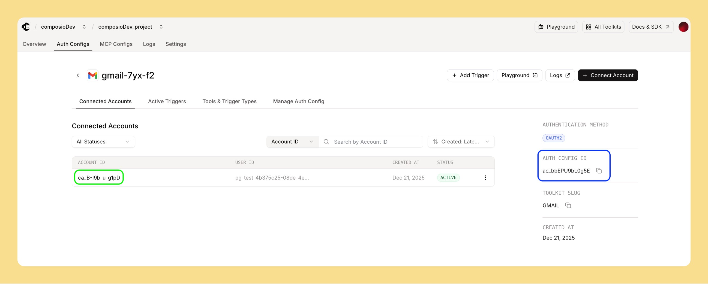

## Using Composio's default OAuth app

When using our default OAuth configuration:

- **Don't add additional scopes** - They may not be approved in our OAuth app
- Use only the pre-configured scopes provided

## Using custom OAuth apps

Ensure your OAuth app is configured correctly:

- **Redirect URL**: Must match exactly what's configured in your OAuth provider
- **Scopes**: Auth config scopes must match your OAuth app configuration
- **Credentials**: Verify client ID and secret are correct

For setup guides by toolkit: [OAuth Configuration Guides](https://composio.dev/oauth)

## Common authentication issues

- **Invalid redirect URI**: Check the callback URL matches exactly
- **Scope mismatch**: Ensure requested scopes are configured in both auth config and OAuth app
- **Expired tokens**: Try refreshing the connection
- **Rate limits**: Some providers limit authentication attempts
- **Credentials showing as `REDACTED`**: The "Mask Connected Account Secrets" setting is enabled on your account, which redacts all sensitive credential data. Navigate to **Settings → Project Settings → Project Configuration** and disable "Mask Connected Account Secrets" to view actual values

## Reporting authentication issues

When reporting to support, provide:

- **Error message**: Complete error details and screenshots. For example:

  

- **Auth config and account IDs**: Include the `authConfigId` used for the request and, if a connection already exists, the `connected_account_id`

  

- **OAuth provider**: Which service you're trying to connect

## Getting help

- **Email**: support@composio.dev
- **Discord**: [#support-form](https://discord.com/channels/1170785031560646836/1268871288156323901)