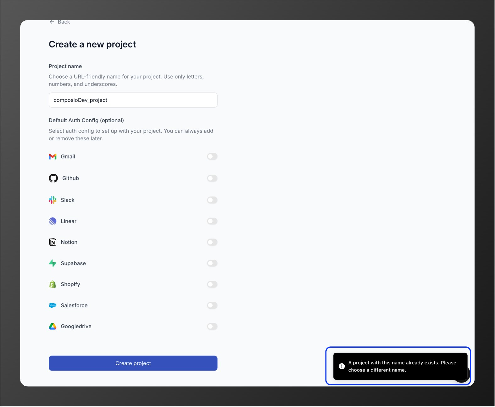
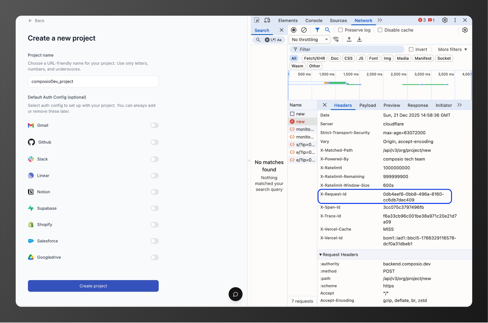

## Reporting dashboard issues

When reporting dashboard issues to support, provide:

- **Screenshot or recording**: Visual evidence of the issue
- **Error details**: Complete error message shown in the UI. For example:

  

- **Network logs**: Check browser DevTools for failing API calls and share:
  - Error message
  - Request ID (`x-request-id` header)

    

  - Failed endpoint URL (`https://backend.composio.dev/api/v3/org/project/new`)

    

## Getting help

- **Email**: support@composio.dev
- **Discord**: [#support-form](https://discord.com/channels/1170785031560646836/1268871288156323901)