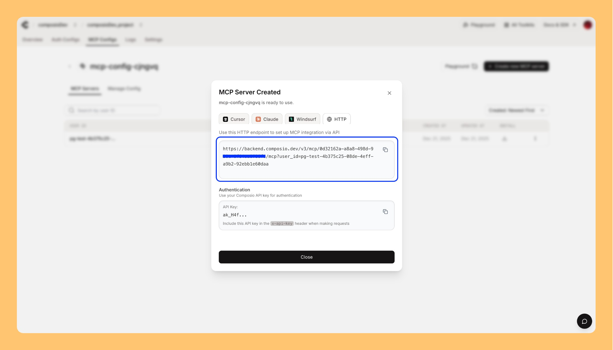
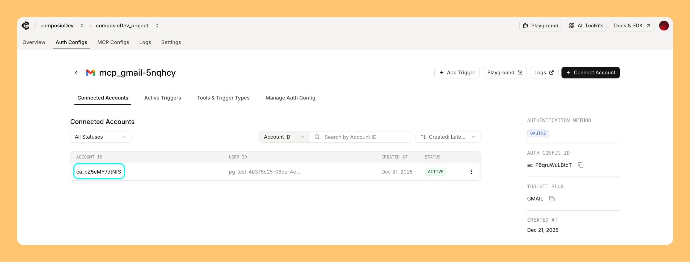

## Connected account not found error

This error occurs when MCP cannot find a valid connected account for authentication:

- **Specify an account**: Provide either `connected_account_id` or `user_id` in your MCP configuration
- **Default behavior**: Without specification, MCP uses `user_id=default`. If multiple connections exist with the same user_id, the most recent is used
- **Verification checklist**:
  - Account status is `ACTIVE` (not deleted)
  - Account belongs to the same auth config used to create the MCP server
  
Learn more: [MCP Developer Guide](/docs/mcp-developers#client-applications-connect-to-the-server)

## Getting 404 errors

Verify your URL format matches one of these patterns:

- `https://mcp.composio.dev/composio/server/<UUID>/mcp`
- `https://apollo-<randomID>-composio.vercel.app/v3/mcp/<UUID>`
- `https://apollo.composio.dev/v3/mcp/<UUID>`

## Testing and debugging

If experiencing issues, test your MCP server with:

- [Postman MCP Requests](https://learning.postman.com/docs/postman-ai-developer-tools/mcp-requests/create/)
- [MCP Inspector](https://modelcontextprotocol.io/docs/tools/inspector)

This helps identify whether the issue is with your MCP client or the server.

## Reporting MCP issues

When reporting to support, provide:

- **Error message**: Complete error details
- **MCP server URL**: The exact URL you're connecting to and the corresponding `mcp_server_id`

  
- **Testing results**: Whether issue reproduces in MCP Inspector/Postman or only in specific client
- **Connected account ID**: If facing connection issues

  
- **Reproduction steps**: Clear steps to reproduce the issue

## Getting help

- **Email**: support@composio.dev
- **Discord**: [#support-form](https://discord.com/channels/1170785031560646836/1268871288156323901)