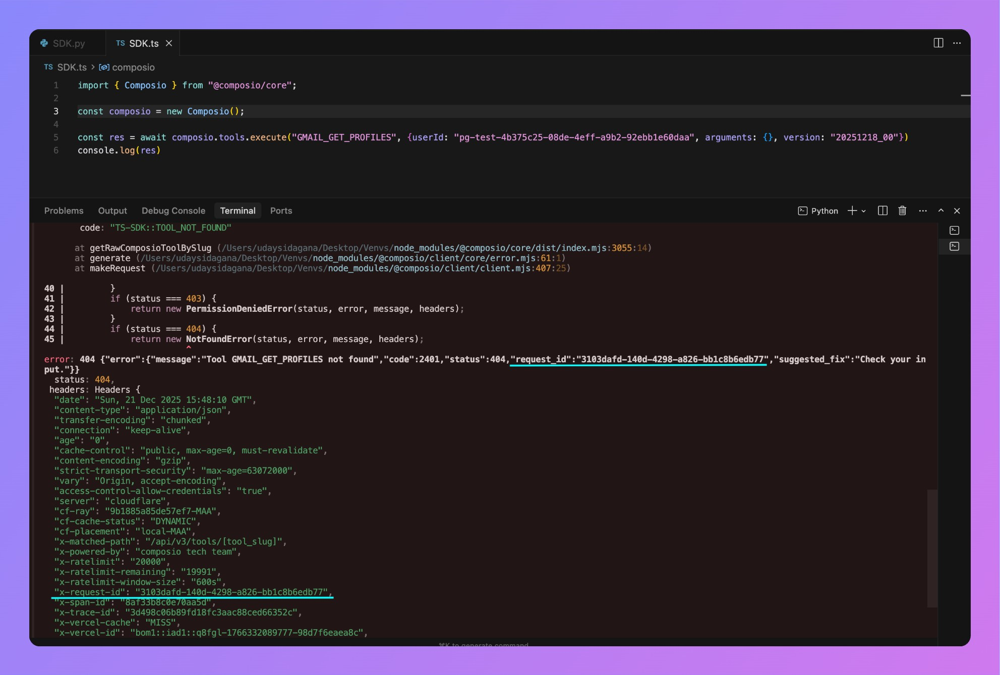

## Debug network issues

Enable debug logging to see API calls and identify if issues are SDK or API related. When contacting support, share the full debug logs **along with** the `x-request-id`.

<CodeGroup>
```python Python
# Set environment variable
COMPOSIO_LOGGING_LEVEL=debug
```
```typescript TypeScript
// Set environment variable
COMPOSIO_LOG_LEVEL=debug
```
</CodeGroup>

Once debug logging is enabled, you can find the `x-request-id` in your SDK logs:

- **Python SDK example**

  

- **TypeScript SDK example**

  

## Check SDK version

Ensure you're using the latest version:

<CodeGroup>
```bash Python
pip install --upgrade composio
```
```bash TypeScript
npm install @composio/core@latest
```
</CodeGroup>

Check current version:
- Python: [PyPI](https://pypi.org/project/composio/)
- TypeScript: [npm](https://www.npmjs.com/package/@composio/core)

## Common issues

- **Type errors or parameter confusion**: Search [DeepWiki](https://deepwiki.com/ComposioHQ/composio) or use the Ask AI assistant
- **Tool-specific issues**: Check the [specific tool's documentation](/toolkits/introduction)
- **Bug reporting**: Create a [GitHub issue](https://github.com/ComposioHQ/composio/issues/new?labels=bug) with debug logs and reproduction steps

## Getting help

- **Email**: support@composio.dev
- **Discord**: [#support-form](https://discord.com/channels/1170785031560646836/1268871288156323901)