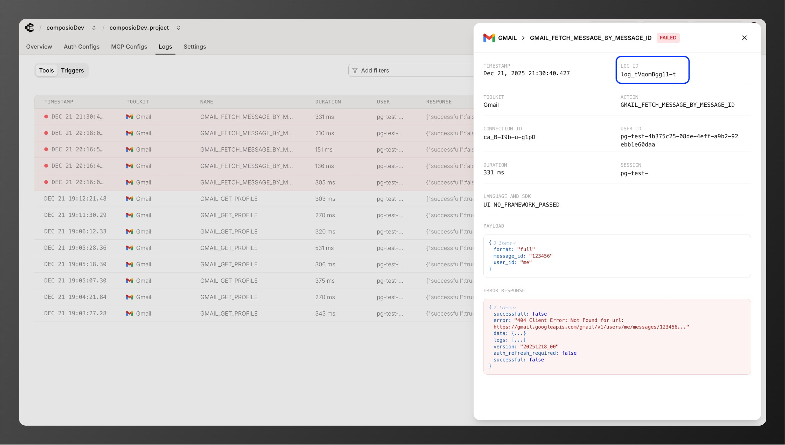

## Tool execution failures (401/403 errors)

Authentication and permission errors typically occur due to:

### Missing scopes

Check if your connection has the required scopes using this API:

```bash
curl --location 'https://backend.composio.dev/api/v3/tools/get_scopes_required' \
--header 'x-api-key: YOUR_COMPOSIO_API_KEY' \
--header 'Content-Type: application/json' \
--data '{
    "tools": [
        "SLACK_SENDS_A_MESSAGE_TO_A_SLACK_CHANNEL",
        "SLACK_CREATE_A_REMINDER"    
    ]
}'
```

### Insufficient permissions

Verify the connected account has necessary permissions:

- **Admin requirements**: Some tools require admin-level access
- **Paid accounts**: Certain toolkits need paid subscriptions
  - Example: MS Teams requires Microsoft 365 account + Azure AD tenant

## Tool not working

- Check [tool-specific documentation](/toolkits/introduction) for requirements
- Verify the connected account is active and properly authenticated
- Test with the latest SDK version

## Reporting tool issues

When reporting to support, provide:

- **Error message**: Complete error details. For example:

  ```json
  {
    "data": {
      "message": "{\n  \"error\": {\n    \"code\": 404,\n    \"message\": \"Requested entity was not found.\",\n    \"errors\": [\n      {\n        \"message\": \"Requested entity was not found.\",\n        \"domain\": \"global\",\n        \"reason\": \"notFound\"\n      }\n    ],\n    \"status\": \"NOT_FOUND\"\n  }\n}\n",
      "status_code": 404
    },
    "successful": false,
    "error": "404 Client Error: Not Found for url: https://gmail.googleapis.com/gmail/v1/users/me/messages/123456?format=full",
    "log_id": "log_tVqomBgg11-t"
  }
  ```

- **Log ID**: From the error response.

  

- **Tool name**: Exact tool slug being executed (for example, `GMAIL_FETCH_MESSAGE_BY_MESSAGE_ID`)
- **Connected account ID**: Account used for execution (for example, `ca_xxx`)

## Getting help

- **Email**: support@composio.dev
- **Discord**: [#support-form](https://discord.com/channels/1170785031560646836/1268871288156323901)