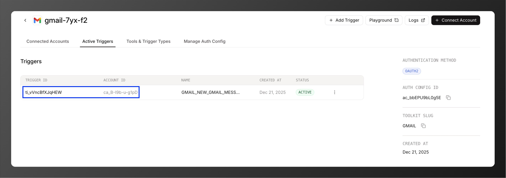

## Unable to create trigger

Check the error message - the account might not have sufficient permissions or required scopes.

## Type errors with trigger payloads

Having issues with trigger payload types? Search [DeepWiki](https://deepwiki.com/ComposioHQ/composio) or use the Ask AI assistant for type definitions and examples.

## Not receiving trigger payloads

Even if the action occurred (email received, Jira issue created, etc.), there may be delays:

- **Gmail triggers**: Uses polling with minimum 1-minute frequency - expect delays of up to a minute
- **Other services**: May have their own polling intervals or webhook delivery delays

## Reporting trigger issues

When reporting to support, provide:

- **Error message**: Complete error details
- **Connected account and trigger IDs**: The connected account ID used for creating the trigger and the specific trigger ID that's failing

  

- **Reproduction steps**: Clear, step-by-step instructions to reproduce the issue, including key trigger configuration details (for example, the `interval`)

## Getting help

- **Email**: support@composio.dev
- **Discord**: [#support-form](https://discord.com/channels/1170785031560646836/1268871288156323901)