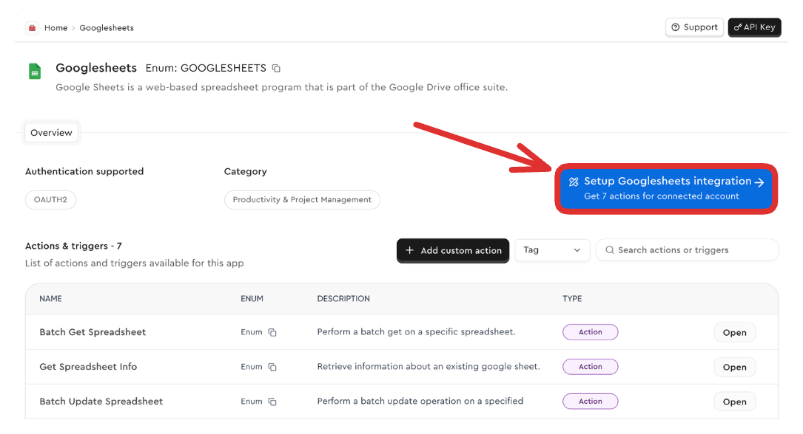

Different apps (like Slack, Notion, Shopify) have their own authentication flows that users must complete to grant access to their accounts. Agents need authenticated access to these tools to perform actions on behalf of users.

## Creating an auth config

Each toolkit comes with its own _auth config_.
This configuration is used to authenticate the users to the tools.

The first step is to create an auth config for any toolkit that you want to use.

<Note title="Auth configs are reusable">
The appropriate developer credentials and app level configurations like scopes, API endpoints, etc. are scoped to an auth config.

Once created, it's reusable across multiple users.

</Note>

The dashboard offers a guided process for all app types.
<Steps>
  <Step title="Select App">
    Navigate to the [Apps page](https://app.composio.dev/apps) and choose the app you want to integrate (for example, Google Sheets).
    <Frame background="subtle" title="Application Selection Screen">
      
    </Frame>
  </Step>
  <Step title="Initiate Setup">
    Click the **"Setup Integration"** button.
    <Frame background="subtle" title="Auth Config Setup Interface">
      
    </Frame>
  </Step>
  <Step title="Configure Auth Config Settings">
    Select among the supported auth schemes of OAuth2, API Key, Bearer Token, Basic Auth, depending on the toolkit.
    Switch between the auth schemes and configure the scopes, developer credentials, etc here.

    <Note title="Composio Managed Auth" icon="info">
    You may also choose to use Composio's managed auth for certain toolkits or use your own auth credentials.
    It is recommended to specify your own credentials for production workloads and ability to control scopes, etc.
    </Note>

    <Frame background="subtle" title="Auth Config Settings">
      
    </Frame>
  </Step>
  <Step title="Create and Get auth config ID">
    Click **"Create Integration"**. After creation, **copy the displayed ID starting with `ac_`**. This is your auth config ID. This is _not_ a sensitive ID -- you can save it in environment variables or a database.
    **This ID will be used to create connections to the toolkit for a given user.**
  </Step>
</Steps>

<Card title="Programmatic creation" href="/docs/programmatic-auth-configs" icon="fa-solid fa-code">
  In case of dealing with multiple toolkits across different projects, you can create auth configs
  programmatically.
</Card>

## Connecting to an OAuth toolkit

Here's how to authenticate a toolkit for a given user using the OAuth flow.

<CodeGroup>
<SnippetCode
  src="fern/snippets/tool-calling/python/auth-tools.py"
  startLine={1}
  endLine={21}
  title="Python"
/>
<SnippetCode
  src="fern/snippets/tool-calling/typescript/auth-tools.ts"
  startLine={1}
  endLine={21}
  title="TypeScript"
/>
</CodeGroup>

## Connecting to an API Key toolkit

For API key based toolkits, you can either request the user to provide the API key or provide your own!

### Creating the connection

If you know the required authentication fields for your toolkit (like `apiKey` for most API-based services), you can directly create the connection:

<CodeGroup>
<SnippetCode
  src="fern/snippets/tool-calling/python/auth-tools.py"
  startLine={23}
  endLine={34}
  title="Python"
/>
<SnippetCode
  src="fern/snippets/tool-calling/typescript/auth-tools.ts"
  startLine={24}
  endLine={37}
  title="TypeScript"
/>
</CodeGroup>

## Specifying auth schemes
Composio supports a wide range of auth schemes; OAuth2, API Key, HTTP Basic and many more.
Each app (and toolkit) has different connection options required for each auth scheme. For example;
- Shopify requires an *API key* from each user for the API Key auth scheme.
- Airtable requires the Bearer token from each user for the *Bearer* auth scheme.

The auth scheme information is typed and can be configured as follows:

<CodeGroup>
<SnippetCode
  src="fern/snippets/tool-calling/python/auth-tools.py"
  startLine={35}
  endLine={44}
  title="Python"
/>
<SnippetCode
  src="fern/snippets/tool-calling/typescript/auth-tools.ts"
  startLine={38}
  endLine={50}
  title="TypeScript"
/>
</CodeGroup>

It might be useful to read all the optional and required auth config fields for a toolkit and optionally prompt the user for the values.

## Redirecting users

To control where the users are redirected after they have authenticated, you can use the `redirectUrl` parameter in the `initiate` method.
In this case, the user will be redirected to `https://www.yourapp.com/callback` after they have authenticated.

<CodeGroup>
<SnippetCode
  src="fern/snippets/tool-calling/python/callback-url.py"
  startLine={10}
  endLine={20}
  title="Python"
/>
<SnippetCode
  src="fern/snippets/tool-calling/typescript/callback-url.ts"
  startLine={10}
  endLine={20}
  title="TypeScript"
/>
</CodeGroup>
