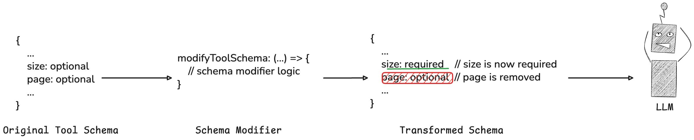

Schema modifiers are part of Composio SDK's powerful middleware capabilities that allow you to customize and extend the behavior of tools.

## Schema Modifiers

Schema modifiers transform a tool's schema before the tool is seen by an agent.

<Frame>
  
</Frame>
**Useful for:** 
- Modifying or rewriting the tool description to better fit your use case.
- Adding arguments to the tool. For example, adding a `thought` argument to the tool to prompt the agent to explain the reasoning.
- Hiding arguments from the tool. In cases where the argument is irrelevant to the tool.
- Adding extra arguments to the tool schema for custom use cases or execution.
- Adding default values to tool arguments.

<Note>
  Below we modify the schema of the `HACKERNEWS_GET_LATEST_POSTS` to make the `size` argument
  required and remove the `page` argument.
</Note>

<CodeGroup>
```python Python maxLines=60  wordWrap
from composio import Composio, schema_modifier
from composio.types import Tool

user_id = "your@email.com"

@schema_modifier(tools=["HACKERNEWS_GET_LATEST_POSTS"])
def modify_schema(
    tool: str,
    toolkit: str,
    schema: Tool,
) -> Tool:
    _ = schema.input_parameters["properties"].pop("page", None)
    schema.input_parameters["required"] = ["size"]
    return schema

tools = composio.tools.get(
    user_id=user_id,
    tools=["HACKERNEWS_GET_LATEST_POSTS", "HACKERNEWS_GET_USER"],
    modifiers=[
        modify_schema,
    ]
)
```
```typescript TypeScript maxLines=60 wordWrap
const userId = "your@email.com";

const tools = await composio.tools.get(
  userId,
  {
    tools: ["HACKERNEWS_GET_LATEST_POSTS", "HACKERNEWS_GET_USER"],
  },
  {
    modifySchema: ({ toolSlug, toolkitSlug, schema }) => {
      if (toolSlug === "HACKERNEWS_GET_LATEST_POSTS") {
        const { inputParameters } = schema;
        if (inputParameters?.properties) {
          delete inputParameters.properties["page"];
        }
        inputParameters.required = ["size"];
      }
      return schema;
    },
  }
);

console.log(JSON.stringify(tools, null, 2));

```

</CodeGroup>

In using the above modified tool schema, the `page` argument is removed and the `size` argument is required.

You can test this out by viewing the tool call response in the LLM too!

<Accordion title="Schema modified tool call">
<CodeGroup>

```python Python maxLines=60 wordWrap

from openai import OpenAI
from composio import Composio, schema_modifier
from composio.types import Tool
from composio_openai import OpenAIProvider


@schema_modifier(tools=["HACKERNEWS_GET_LATEST_POSTS"])
def modify_schema(
    tool: str,
    toolkit: str,
    schema: Tool,
) -> Tool:
    _ = schema.input_parameters["properties"].pop("page", None)
    schema.input_parameters["required"] = ["size"]
    return schema

# Initialize tools.
openai_client = OpenAI()
composio = Composio(provider=OpenAIProvider())

# Define task.
task = "Get the latest posts from Hacker News"

# Get GitHub tools that are pre-configured
tools = composio.tools.get(
  user_id="default",
  tools=['HACKERNEWS_GET_LATEST_POSTS', 'HACKERNEWS_GET_USER'],
  modifiers=[
      modify_schema,
  ],
)

# Get response from the LLM
response = openai_client.chat.completions.create(
    model="gpt-4o-mini",
    tools=tools,
    messages=[
        {"role": "system", "content": "You are a helpful assistant."},
        {"role": "user", "content": task},
    ],
)
print(response)

# Execute the function calls.
result = composio.provider.handle_tool_calls(response=response, user_id="default")
print(result)
```

```typescript TypeScript maxLines=60 wordWrap
import { Composio } from '@composio/core';
import { OpenAI } from 'openai';

const composio = new Composio({
  apiKey: process.env.COMPOSIO_API_KEY,
});
const openai = new OpenAI();

const userId = 'your@email.com';

const tools = await composio.tools.get(
  userId,
  {
    tools: ['HACKERNEWS_GET_LATEST_POSTS', 'HACKERNEWS_GET_USER'],
  },
  {
    modifySchema: ({ toolSlug, toolkitSlug, schema }) => {
      if (toolSlug === 'HACKERNEWS_GET_LATEST_POSTS') {
        const { inputParameters } = schema;
        if (inputParameters?.properties) {
          delete inputParameters.properties['page'];
        }
        inputParameters.required = ['size'];
      }
      return schema;
    },
  }
);

console.log(JSON.stringify(tools, null, 2));

const response = await openai.chat.completions.create({
  model: 'gpt-4o-mini',
  messages: [
    {
      role: 'system',
      content: 'You are a helpful assistant that can help with tasks.',
    },
    { role: 'user', content: 'Get the latest posts from Hacker News' },
  ],
  tools: tools,
  tool_choice: 'auto',
});

console.log(response.choices[0].message.tool_calls);
```

</CodeGroup>
</Accordion>


## Example: Modifying the tool description

Sometimes you need to provide additional context to help the agent understand how to use a tool correctly. This example demonstrates modifying the description of the `GITHUB_LIST_REPOSITORY_ISSUES` tool to specify a default repository when none is provided.

<Note>
This approach is particularly useful when you want to guide the agent's behavior without changing the tool's underlying functionality.
</Note>

In this example:
- We append additional instructions to the tool's description
- The modified description tells the agent to use `composiohq/composio` as the default repository
- This helps prevent errors when the agent forgets to specify a repository parameter

<CodeGroup>
<SnippetCode 
  src="fern/snippets/modifiers/python/description.py" 
  title="Python"
  startLine={1} 
  endLine={27} 
  highlightStart={13}
  highlightEnd={20}
/>
<SnippetCode 
  src="fern/snippets/modifiers/typescript/description.ts" 
  title="TypeScript"
  startLine={1} 
  endLine={31} 
  highlightStart={13}
  highlightEnd={18}
/>

</CodeGroup>
