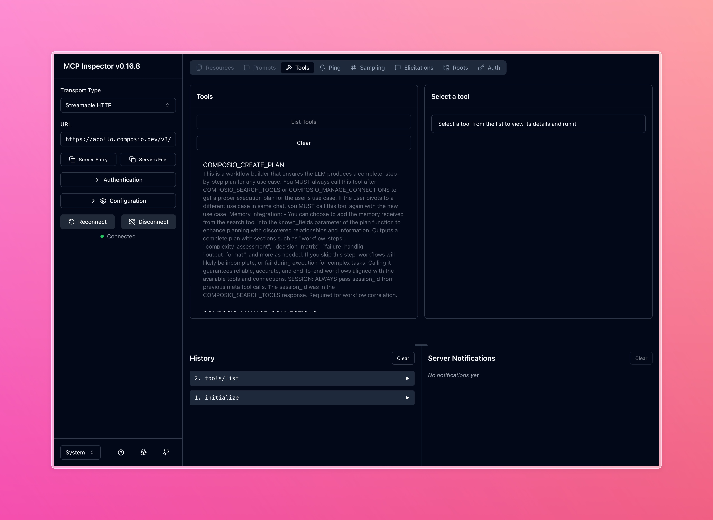

Tool Router automatically discovers, authenticates, and executes the right tools for any task. It's an experimental feature that handles the entire workflow—from finding relevant tools across 500+ integrations to managing authentication and parallel execution.

This is what powers complex agentic products like [Rube](https://rube.app).


### Quick Start

Create a presigned URL for each user session. This URL exposes Tool Router capabilities through the Model Context Protocol (MCP).

<CodeGroup>
<SnippetCode
  src="fern/snippets/tool-router/python/quick-start.py"
  startLine={1}
  endLine={17}
  title="Python"
/>

<SnippetCode
  src="fern/snippets/tool-router/typescript/quick-start.ts"
  startLine={1}
  endLine={25}
  title="TypeScript"
/>
</CodeGroup>

<Tip icon="info">
**What are sessions?**

A session encapsulates a single conversation between a user and the language model.

Sessions are designed for security. Each presigned URL contains user authentication credentials and should never be stored long-term or exposed to the client. Generate a new URL for each conversation.
</Tip>

The URL you get here is an MCP [StreamableHTTP URL](https://modelcontextprotocol.io/specification/2025-06-18/basic/transports#streamable-http). You can use this URL in any MCP client, you can see how it lists tools inside the inspector here.

<Frame>
  
</Frame>

### Building on top of this URL with providers

_The necessary scaffolding will be integrated into existing providers abstraction before `toolRouter` is generally available._

Use the presigned URL with any frameworks that support MCP directly, few examples below:

<CardGroup cols={2}>
  <Card
    title="OpenAI"
    icon={}
    href="https://platform.openai.com/docs/guides/tools-connectors-mcp"
  >
    Connect via OpenAI's MCP connector to use Tool Router with GPT models
  </Card>
  <Card
    title="Vercel AI SDK"
    icon={}
    href="https://ai-sdk.dev/cookbook/next/mcp-tools#mcp-tools"
  >
    Use experimental_createMCPClient with StreamableHTTPClientTransport to integrate with Next.js apps
  </Card>
  <Card
    title="Claude"
    icon={}
    href="https://docs.claude.com/en/docs/agents-and-tools/remote-mcp-servers"
  >
    Connect remote MCP servers through Anthropic's MCP connector API
  </Card>
  <Card
    title="LangChain"
    icon={}
    href="https://docs.langchain.com/oss/python/langchain/mcp"
  >
    Load Tool Router tools using langchain_mcp_adapters for Python workflows
  </Card>
</CardGroup>


## How Tool Router Works

The Tool Router executes a three-phase workflow:

**1. Discovery**  
Searches across all available tools to find ones matching your task. Returns relevant toolkits with their descriptions, schemas, and connection status.

**2. Authentication**  
Checks if the user has an active connection to the required toolkit. If not, creates an auth config and returns a connection URL using [Auth Link](/docs/authenticating-tools#hosted-authentication-connect-link). The user completes authentication through this link.

**3. Execution**  
Loads authenticated tools into context and executes them. Supports parallel execution across multiple tools for efficiency.

### Context Management

The Tool Router intelligently manages context to avoid overwhelming the LLM with unnecessary information. Tools are only loaded into context when needed—search discovers relevant tools, and multi execute loads them just-in-time for execution. When working with large outputs, the remote workbench stores them as files in persistent storage, allowing iteration without consuming context windows. The system also segments tools within each MCP server, exposing only the subset required for the current task.

<Info>
The tool router currently consumes about ~20k tokens of context on modern models like `gpt-5` and `claude-4.5-sonnet`. This number can vary based on the model's tokenizer, we will work towards reducing this number in the future.
</Info>

### Available Tools

The router exposes six meta tools through MCP. These tools orchestrate the complete workflow from discovery to execution:

<AccordionGroup>
  <Accordion title="COMPOSIO_SEARCH_TOOLS">
    Discovers tools across 500+ integrated apps based on task description.

    Call this first in any workflow. Returns toolkits and tools with slugs, descriptions, input schemas, connection status, and related tools. Includes memory of previous interactions to improve future searches.
  </Accordion>

  <Accordion title="COMPOSIO_CREATE_PLAN">
    Generates step-by-step execution plans for any workflow.

    Call after `COMPOSIO_SEARCH_TOOLS`. Outputs structured plans with workflow steps, complexity assessment, decision trees for conditional logic, failure handling strategies, and output format specifications.
  </Accordion>

  <Accordion title="COMPOSIO_MANAGE_CONNECTIONS">
    Creates and manages connections to external apps.

    Call when `COMPOSIO_SEARCH_TOOLS` finds no active connection. Supports OAuth (default and custom), API keys, bearer tokens, and basic auth. Returns OAuth redirect URLs when needed and handles connection refresh.
  </Accordion>

  <Accordion title="COMPOSIO_MULTI_EXECUTE_TOOL">
    Executes up to 20 tools in parallel across different apps.

    Primary execution tool for running discovered tools. Returns structured outputs with automatic error handling and retry logic.
  </Accordion>

  <Accordion title="COMPOSIO_REMOTE_WORKBENCH">
    Persistent Python sandbox for processing large responses and bulk operations.

    Use for processing remote file data or scripting bulk executions. Provides a Jupyter notebook environment with pre-loaded helpers (run_composio_tool, invoke_llm, web_search). State persists across executions with a 4-minute timeout.
  </Accordion>

  <Accordion title="COMPOSIO_REMOTE_BASH_TOOL">
    Executes bash commands in a remote sandbox.

    Use for processing large responses saved to remote storage and file system operations. Runs from /home/user with access to shell tools (jq, awk, sed, grep). Default timeout is 300 seconds.
  </Accordion>
</AccordionGroup>


## Customizing the Tool Router

### Restricting Toolkits

Control which toolkits are available by specifying them during session creation. This limits which apps your users can access.

<CodeGroup>
```python
session = composio.experimental.toolRouter.createSession("hey@example.com", {
  toolkits: ["github", "slack"],
})
```

```typescript
const session = await composio.experimental.toolRouter.createSession("hey@example.com", {
  toolkits: ["github", "slack"],
})

```
</CodeGroup>


### Manual Connection Management

You can manually manage connections, this is advanced and still a bit of work in progress.

To manually manage connections, you can set `manuallyManageConnections` to `true` and limit the toolkits you want to use.

Once you pass the auth config id, you can use our regular functions to connect accounts and check authentication status.

<CodeGroup>

```typescript
// Access the experimental ToolRouter
const session = await composio.experimental.toolRouter.createSession("hey@example.com", {
  toolkits: [{ toolkit: 'gmail', authConfigId: 'ac_nnn' }],
  manuallyManageConnections: true,
});
```

</CodeGroup>

## Feedback

This is still very experimental and work in progress, you can expect the contracts to change and improve as we iterate on this. That said we would love to hear your feedback on this

Give us feedback on this github discussion [here](https://github.com/ComposioHQ/composio/discussions/2011)