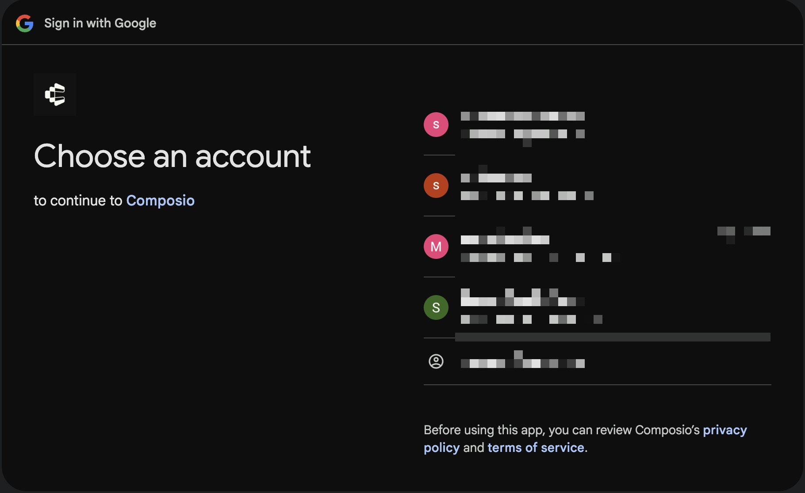

By default, users see Composio's branding on OAuth consent screens:

<Frame>
  
</Frame>

White-labeling lets you show your own app name and logo instead.

<Steps>
<Step title="Create an OAuth app">
Create a developer app in the toolkit's developer portal. You'll need the client ID, client secret, and set the callback URL to:

```
https://backend.composio.dev/api/v3/toolkits/auth/callback
```

<Tip>
For step-by-step guides on creating OAuth apps for some toolkits, see [composio.dev/auth](https://composio.dev/auth).
</Tip>
</Step>

<Step title="Create auth config">
Create an auth config in the [Composio dashboard](https://app.composio.dev):

1. Go to **Authentication management** → **Create Auth Config**
2. Select the toolkit (e.g., GitHub)
3. Choose **OAuth2** scheme
4. Enter your **Client ID** and **Client Secret**
5. Select the scopes you need
6. Click **Create**

Copy the auth config ID (e.g., `ac_1234abcd`).

<Tip>
For detailed instructions with screenshots, see [Custom auth configs](/docs/authentication/custom-auth-configs).
</Tip>
</Step>

<Step title="Use in Tool Router">
Pass your auth config ID in the session:

<CodeGroup>
```python
session = await composio.create(
    user="user_123",
    auth_configs={
        "github": "ac_your_github_config"
    },
)
```
```typescript
const session = await composio.create("user_123", {
  authConfigs: {
    github: "ac_your_github_config",
  },
});
```
</CodeGroup>

When users connect GitHub, they'll see your OAuth app's name and logo on the consent screen.
</Step>
</Steps>

## Mix white-labeled and Composio managed

You can white-label some toolkits while using Composio's default credentials for others:

<CodeGroup>
```python
session = await composio.create(
    user="user_123",
    auth_configs={
        "github": "ac_your_github_config",
        "slack": "ac_your_slack_config",
        # gmail, linear, etc. use Composio managed auth
    },
)
```
```typescript
const session = await composio.create("user_123", {
  authConfigs: {
    github: "ac_your_github_config",
    slack: "ac_your_slack_config",
    // gmail, linear, etc. use Composio managed auth
  },
});
```
</CodeGroup>

## Custom redirect domain

By default, users see `backend.composio.dev` in the OAuth flow. To show your own domain:

1. Set your OAuth app's redirect URI to your domain:
```
https://yourdomain.com/api/composio-redirect
```

2. Create an endpoint that forwards to Composio:

<CodeGroup>
```python
from fastapi import FastAPI, Request
from fastapi.responses import RedirectResponse

app = FastAPI()

@app.get("/api/composio-redirect")
def composio_redirect(request: Request):
    composio_url = "https://backend.composio.dev/api/v3/toolkits/auth/callback"
    query_string = str(request.query_params)
    return RedirectResponse(url=f"{composio_url}?{query_string}")
```
```typescript
// pages/api/composio-redirect.ts (Next.js)
import type { NextApiRequest, NextApiResponse } from "next";

export default function handler(req: NextApiRequest, res: NextApiResponse) {
  const composioUrl = "https://backend.composio.dev/api/v3/toolkits/auth/callback";
  const params = new URLSearchParams(req.query as Record<string, string>);
  res.redirect(302, `${composioUrl}?${params.toString()}`);
}
```
</CodeGroup>

3. Update your auth config in the dashboard to use your custom redirect URI.

