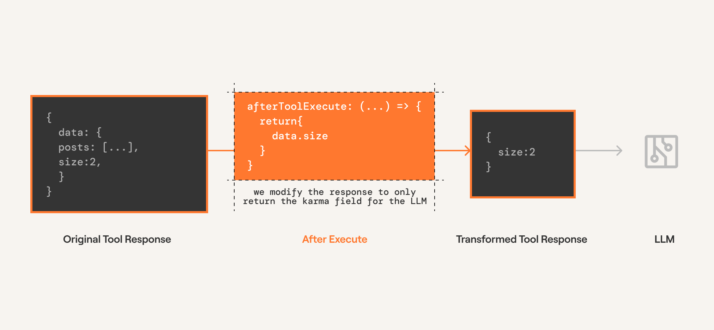

After execution modifiers are part of Composio SDK's powerful middleware capabilities that allow you to customize and extend the behavior of tools.

## After Execution Modifiers

These modifiers are called after the tool is executed by the LLM. This allows you to modify the _result_ of the tool before it is returned to the agent.

**Useful for:**

- Modifying or truncating the output of the tool.
- Converting the output to a different format before returning it to the agent.

<Frame>
  
</Frame>

<Note>
  Below we use the `afterExecute` modifier to truncate the output of the `HACKERNEWS_GET_USER`
  tool and only return the karma of the user.
</Note>

<Tabs>
<Tab title="With Chat Completions">
Since completion providers don't have a function execution step -- Composio will execute the tool call directly.

Hence, the modifier is configured on the `tools.execute` method.

<CodeGroup>
```python Python maxLines=60  wordWrap
from composio import Composio, after_execute
from composio.types import ToolExecutionResponse

@after_execute(tools=["HACKERNEWS_GET_USER"])
def after_execute_modifier(
    tool: str,
    toolkit: str,
    response: ToolExecutionResponse,
) -> ToolExecutionResponse:
    return {
        **response,
        "data": {
            "karma": response["data"]["karma"],
        },
    }

tools = composio.tools.get(user_id=user_id, slug="HACKERNEWS_GET_USER")
# Get response from the LLM
response = openai_client.chat.completions.create(
    model="gpt-4o-mini",
    tools=tools,
    messages=messages,
)
print(response)

# Execute the function calls.
result = composio.provider.handle_tool_calls(
  response=response,
  user_id="default",
  modifiers=[
     after_execute_modifier, 
  ]
)
print(result)
```
```typescript TypeScript maxLines=60  wordWrap
const response = await openai.chat.completions.create({
  model: "gpt-4o-mini",
  messages,
  tools,
  tool_choice: "auto",
});

const { tool_calls } = response.choices[0].message;
console.log(tool_calls);

if (tool_calls) {
  const {
    function: { arguments: toolArgs },
  } = tool_calls[0];

  const result = await composio.tools.execute(
    "HACKERNEWS_GET_USER",
    {
      userId,
      arguments: JSON.parse(toolArgs),
    },
    {
      afterExecute: ({ toolSlug, toolkitSlug, result }) => {
        if (toolSlug === "HACKERNEWS_GET_USER") {
          const { data } = result;
          const { karma } = data.response_data as { karma: number };
          return {
            ...result,
            data: { karma },
          };
        }
        return result;
      },
    }
  );
  console.log(JSON.stringify(result, null, 2));
}

```

</CodeGroup>
</Tab>

<Tab title="With Agentic Frameworks">
Agentic providers have a function execution step.
The modifier is configured on the `tools.get` method which modifies the execution logic within the framework!
<CodeGroup>
```python Python (CrewAI) maxLines=60  wordWrap
from composio import Composio, after_execute
from composio.types import ToolExecutionResponse
from composio_crewai import CrewAIProvider

composio = Composio(provider=CrewAIProvider())

@after_execute(tools=["HACKERNEWS_GET_USER"])
def after_execute_modifier(
    tool: str,
    toolkit: str,
    response: ToolExecutionResponse,
) -> ToolExecutionResponse:
    return {
        **response,
        "data": {
            "karma": response["data"]["karma"],
        },
    }


tools = composio.tools.get(
    user_id="default",
    slug="HACKERNEWS_GET_USER",
    modifiers=[
        after_execute_modifier,
    ]
)
```
```typescript TypeScript (Vercel) maxLines=60  wordWrap {24-27}
import { Composio } from "@composio/core";
import { VercelProvider } from "@composio/vercel";
import { generateText } from "ai";
import { openai } from "@ai-sdk/openai";
import { v4 as uuidv4 } from "uuid";

const composio = new Composio({
  apiKey: process.env.COMPOSIO_API_KEY,
  provider: new VercelProvider(),
});

const userId = uuidv4(); // The user's ID.

const agenticTools = await composio.tools.get(
  userId,
  {
    tools: ["HACKERNEWS_GET_USER"],
  },
  {
    afterExecute: ({ toolSlug, toolkitSlug, result }) => {
      if (toolSlug === "HACKERNEWS_GET_USER") {
        const {
          data: { response_data: { karma } = {} } = {},
        } = result;
        return {
          ...result,
          data: { karma },
        };
      }
      return result;
    },
  }
);

```

</CodeGroup>
</Tab>
</Tabs>
